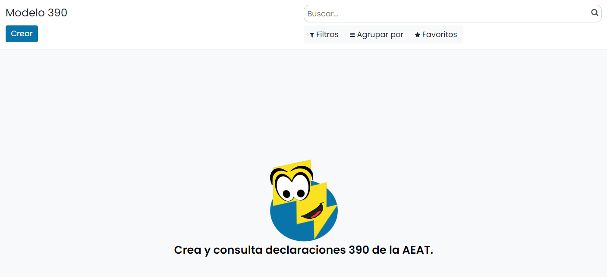
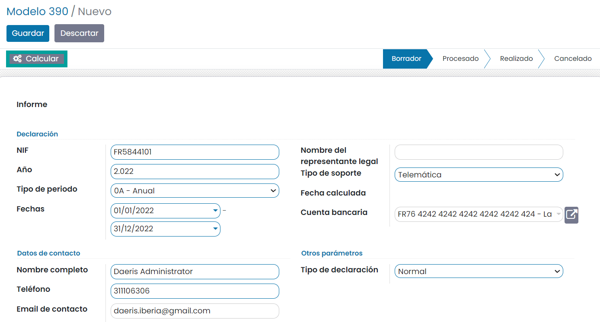
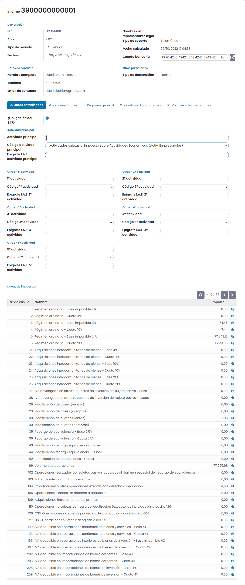
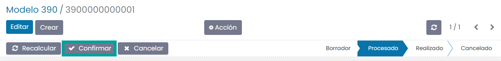
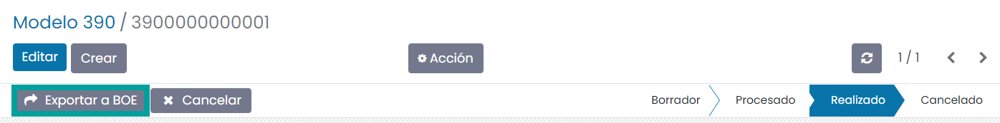
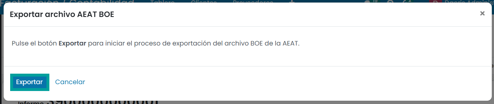
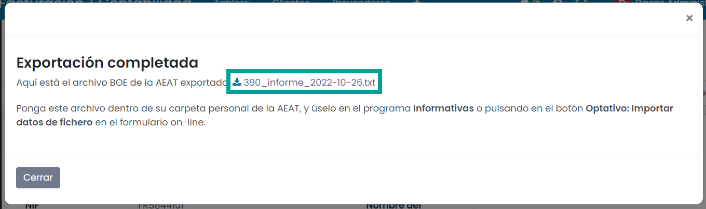

=============
Modelo 390
=============

Información del modelo 390
============================

El **modelo 390** es el resumen anual de las declaraciones trimestrales de IVA presentadas a lo largo
del año (modelos 303). Se trata de un modelo obligatorio, pero sólo es informativo, con el detalle y
resumen de todas las operaciones del año, por lo que no supone la realización de ningún cargo o pago.

El modelo 390 deben presentarlo todas aquellas personas físicas o empresas que hayan presentado
algún modelo 303 durante el año, es decir, todos los que han declarado IVA en algún momento del año.

Al ser un resumen anual, el plazo de presentación es del 1 al 30 de enero del siguiente año.

.. seealso::
   `Modelo 390 - Agencia Tributaria Española <https://sede.agenciatributaria.gob.es/Sede/ayuda/consultas-informaticas/presentacion-declaraciones-ayuda-tecnica/modelo-390.html>`_ .

Alta de la declaración del modelo 390
=======================================

Para crear el **modelo 390**, navega a la pantalla
:menuselection:`Contabilidad / Facturación --> Declaraciones AEAT --> Modelo 390`
, y pulsa el botón **Crear**:

Sobre la pantalla de detalle del modelo, selecciona el **ejercicio fiscal**, el **tipo de período**
(los periodos incluidos se calculan automáticamente), el **tipo de declaración** la cuenta bancaria y
el **teléfono**.

Una vez completada la información necesaria, pulsa el botón **Calcular**:

A continuación, se debe informar (en caso de ser necesario), aquellos campos que el sistema no
calcula de forma automática:

Una vez informados los campos necesarios, pulsa el botón **Confirmar**.

Una vez confirmado el modelo, es posible exportarlo en formato BOE (Boletín Oficial del Estado) para
presentarlo telemáticamente en el portal de la AEAT. Para ello, pulsa el botón **Exportar a BOE**.

A continuación, el sistema solicita confirmación para llevar a cabo la exportación.

Al pulsar el botón **Exportar**, el sistema genera el fichero, que puede ser descargado desde esta
misma pantalla, pulsando el **enlace** del nombre del fichero.

Consideraciones
================

   - La declaración sólo se puede realizar para personas jurídicas.
   - No se han implementado todas las casillas de opciones de la empresa, como por ejemplo si la empresa está en concurso de acreedores.
   - No se calculan operaciones intragrupo.
   - No se contempla el régimen de criterio de caja.
   - No se contempla el régimen especial de bienes usados, objetos de arte, antigüedades y objetos de colección.
   - No se contempla el régimen especial de agencias de viaje.
   - No se contempla el recargo de equivalencia de impuesto al tabaco (casillas 41 y 42).
   - No se contempla el régimen especial de la agricultura, ganadería y pesca.
   - No se contempla la prorrata general de IVA.
   - No se contempla el régimen simplificado.
   - No se contempla el régimen de deducción diferenciado.
   - No se contempla la inversión de sujeto pasivo nacional.
   - No se tienen en cuenta tributaciones territoriales.
   - Obtener las casillas 95, 97 y 98 de las declaraciones del 303.
   - Falta añadir la casilla 663 de cuota pendientes de compensación.
   - No se contempla el cálculo de la casilla 127