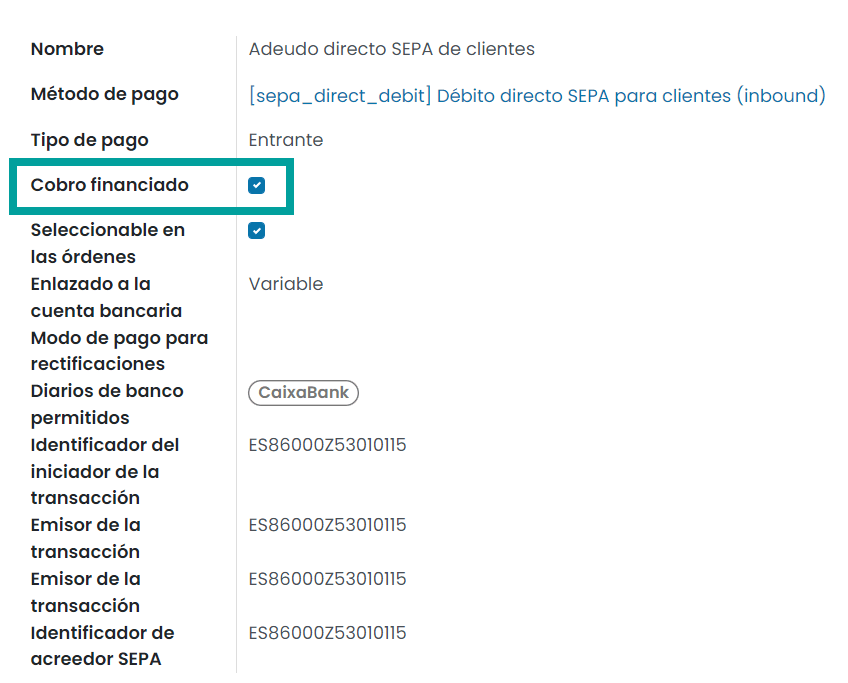

===================================
Sepa/FSDD Anticipos de crédito
===================================

Daeris permite establecer el prefijo **FSDD** en el identificador de un fichero sepa para el producto nicho de
anticipos de crédito, antiguamente exportado en el cuaderno 58.

Configuración
=============

Para configurar un **modo de pago** que permita los anticipos de crédito, crea un modo de pago desde la pantalla
:menuselection:`Contabilidad / Facturación --> Configuración --> Modos de pago`.

Configura el modo de pago con los parámetros de un modo de pago SEPA e informa el campo **Cobro financiado**.

.. seealso::
   * :doc:`../../../../contabilidad/cuentas_pagar/pagos_proveedores/sepa`

Al exportar la órden de cobro con ese modo de pago, se añade el texto **FSDD** al identificador del fichero **SEPA**.

