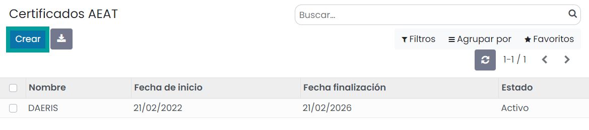
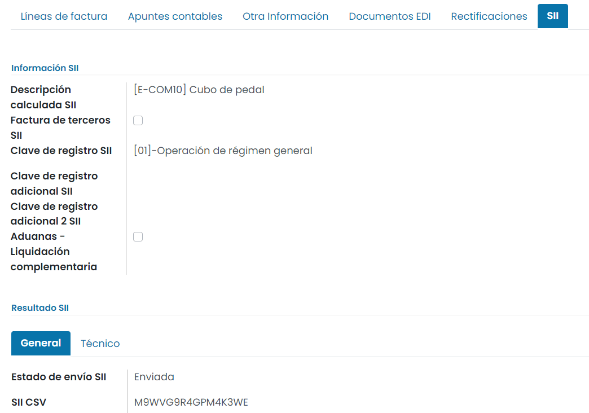

==================================
SII
==================================

Acerca de SII
==============

¿Qué es SII?
-------------------

SII (Suministro Inmediato de Información) es un sistema de gestión del IVA gestionado por la AEAT, a través del conocimiento
de los registros de facturación de las empresas, cuyo objetivo es el de agilizar los trámites entre la administración y el
contribuyente.

Para más información sobre la normativa accede al `portal del SII de la AEAT <https://sede.agenciatributaria.gob.es/Sede/iva/suministro-inmediato-informacion.html/>`_ .

Objetivos principales
-----------------------

El uso de SII elimina las obligaciones de presentación de los modelos **347, 340 y 390** y los **Libros de Registros del IVA**.

Mediante el uso de SII se envían a la AEAT, las facturas de forma inmediata, con impuestos desglosados y la clave de operación.

Desde el 1 de Enero de 2018, el plazo máximo de presentación de las facturas será de 4 días desde su emisión o recepción,
siendo este límite de 8 días durante el primer semestre de aplicación. *Se excluyen sábados, domingos y festivos nacionales.*

Las empresas cuyo domicilio fiscal sea el País Vasco y el volumen de sus operaciones exceda los 10 millones de euros
(el 75% se haya realizado en territorio común) deberán utilizar SII. En Navarra el límite, se reduce de los 10 millones a
7 millones.

¿A quién afecta?
---------------------------

Los colectivos obligados a usar SII son:
   - Inscritos en el **REDEME** (Registro de Devolución Mensual del IVA)
   - Grandes Empresas (facturación superior a 6 millones de €)
   - Grupos de IVA
   - Aquellos que voluntariamente, lo quieran presentar a través del modelo 036.

¿Cómo funciona?
--------------------------
Se envía una comunicación a través de un Servicio Web de intercambio de mensajes XML y se obtiene la respuesta
de las facturas aceptadas, aceptadas con errores y rechazadas, junto con el motivo de su verificación.

Configuración
================

Preparar entorno para SII
--------------------------
Antes de configurar SII, debes ponerte en contacto con el equipo de Daeris ya que deben realizar unas tareas sobre el servidor para su correcto funcionamiento.

.. important::
   El servicio de puesta en marcha de SII tiene un pequeño coste económico, ya que uno de nuestros técnicos debe efectuar las tareas de configuración inicial sobre tu servidor de Daeris.

   Puedes ponerte en contacto desde el `formulario de contacto <https://daeris.com/contactus/>`_ .

Instalar SII
------------------
Para instalar SII en Daeris , navega a la pantalla :menuselection:`Facturación / Contabilidad --> Configuración --> Ajustes`
y sobre el apartado **Funcionalidades de localización española** informa el campo **SII**.

En el caso de que realices importaciones con DUA informa el campo **SII DUA**, y si usas la ventanilla única (OSS)
informa el campo **SII OSS**.

Una vez informados los campos necesarios, pulsa el botón **Guardar**.

Configurar certificados
-----------------------

Para usar SII debes disponer de un certificado válido de tu empresa y/o persona.

Para configurar un certificado navega a la pantalla
:menuselection:`Facturación / Contabilidad --> Configuración --> Certificados AEAT` y haz clic sobre el botón **Crear**.

Sobre el formulario de detalle, informa los siguientes campos:

   - **Nombre**: Nombre del certificado.
   - **Archivo**: Selecciona tu certificado de una entidad certificadora válida.
   - **Nombre de la carpeta**: Especifica un nombre para la carpeta en donde se alojará el certificado en el sistema.

.. image:: sii/cert02.png
   :align: center
   :alt: Configurar certificados

Una vez dado de alta el certificado, pulsa el botón **Obtener claves**.

El sistema mostrará una ventana en donde introducir la contraseña del certificado. Si todo ha ido bien, se
generarán las claves, y se podrá activar el certificado mediante el botón **Para activar**.

.. important::
   El NIF del certificado debe ser el mismo que el NIF de la compañía / persona, ya que
   las facturas se envían con la compañía / persona como remitente.

Seleccionar la Agencia Tributaria
---------------------------------------

Para seleccionar la Agencia Tributaria a la que pertenece tu compañía, navega a la pantalla :menuselection:`Ajustes --> Usuarios y Compañías --> Compañías`,
y accede al detalle de la compañía. Sobre la pestaña **AEAT** informa el campo **Agencia tributaria**.

Una vez completados los datos, haz clic sobre el botón **Guardar**.

Habilitar SII a nivel de la compañía
---------------------------------------

Para habilitar SII a nivel de la compañía, navega a la pantalla :menuselection:`Ajustes --> Usuarios y Compañías --> Compañías`,
y accede al detalle de la compañía. Sobre la pestaña **información general** valida que el VAT de la
compañía se corresponde con el NIF del certificado configurado en la aplicación con el prefijo del país (ES).

.. important::
   Tanto el nombre de la compañía como el VAT (NIF más código de país) deben ser los mismos que los que aparecen en el certificado configurado previamente.

Desde la pestaña **SII**, informa el campo **Activar SII**. Posteriormente informa los campos:

   - **¿Es un entorno de pruebas?**: Los envíos realizados en la fase de pruebas no tendrán trascendencia tributaria.
   - **Método**: Si se selecciona la opción **Manual** aparece sobre el formulario de la factura un botón para enviar a SII.
      - **Automático**: La factura es enviada a SII cuando se confirma mediante el botón **Confirmar**. Esta es la opción predeterminada y recomendada.
      - **Manual**: Aparece sobre el formulario de la factura un botón para enviar a SII tras confirmar la factura.

      .. image:: sii/factura08.png
         :align: center
         :alt: Enviar una factura de cliente a SII

   - **Método de descripción SII**: Método para incorporar la descripción de las facturas a enviar a SII. Se puede seleccionar entre los siguientes métodos:
      - **Automático**: La descripción será la unión de las líneas de las facturas.
      - **Fijo**: La descripción será igual al texto que debes incorporar sobre el campo **Descripción SII** que aparece al seleccionar esta opción.
      - **Manual**: (por defecto), es necesario introducir manualmente la descripción en cada factura

   - **Cabecera para cliente SII**: Cabecera de la descripción, opcional para facturas de cliente.
   - **Cabecera para proveedor SII**: Cabecera de la descripción, opcional para facturas de proveedor.

   - **Usar conector**: Informar para usar el conector en lugar de enviar la factura directamente cuando se confirma. Permite que los envíos de las facturas se efectúen en segundo plano permitiendo al usuario continuar trabajando sin tener que mantenerse a la espera de respuesta de SII. Al informar aparece la opción **Modo de envío**.
   - **Modo de envío**: Permite seleccionar entre las siguientes opciones:

      - **Al validar**: Se emite la factura al confirmarla. El envío se realiza mediante el conector.
      - **A una hora fija**: Se emite la factura a la hora indicada bajo el campo que aparece al seleccionar esta opción.
      - **Con retardo**: Se emite la factura añadiendo un retardo bajo el campo que aparece al seleccionar esta opción.

Configurar posiciones fiscales
-------------------------------

Para configurar las posiciones fiscales relacionadas con SII, navega a :menuselection:`Facturación / Contabilidad --> Configuración --> Posiciones fiscales`
y haz clic sobre la posición fiscal a configurar.

Sobre el apartado SII del formulario de detalle, puedes informar:

   - **Activa para el SII**: Informar en el caso de que la posición fiscal deba estar activa para SII.
   - **Clave de registro SII por defecto para ventas**: Clave que identifica el tipo de régimen del IVA o una operación con trascendencia tributaria. Cuando se crea una factura de cliente con esta posición fiscal se le asigna esta clave. Es posible identificar la clave mediante los valores disponibles en el desplegable.
   - **Clave de registro SII por defecto para compras**: Clave que identifica el tipo de régimen del IVA o una operación con trascendencia tributaria. Cuando se crea una factura de proveedor con esta posición fiscal se le asigna esta clave. Es posible identificar la clave mediante los valores disponibles en el desplegable.
   - **Causa de no sujeción SII**: En el caso de que la posición fiscal no esté sujeta, identificar el motivo mediante los valores disponibles en el desplegable.
   - **Causa de exención SII**: En el caso de que la posición fiscal quede exenta, identificar el motivo mediante los valores disponibles en el desplegable.
   - **SII Tipo de identificación del cliente**: Es posible seleccionar entre:

      - Nacional
      - Intracomunitario
      - Exportación

Una vez completados los datos, haz clic sobre el botón **Guardar**.

Configurar clientes
-----------------------

En el caso de que necesites enviar al SII facturas de un cliente determinado, como **facturas simplificadas**
navega a la aplicación :menuselection:`Contactos --> Contactos` y sobre el formulario de contacto, informa el campo
**¿Facturas simplificadas en el SII?**.

En el caso de que necesites marcar un cliente de caja como anonimo, posicionate sobre la pestaña **AEAT** e informa el campo
**AEAT - Cliente anónimo**.

También es posible especificar un tipo de identificación de cliente a enviar al SII mediante el campo **Tipo de Identificación AEAT**.
Este campo se utiliza para especificar un tipo de identificación para enviar al SII. Normalmente para el envío de facturas nacionales y de exportación al SII
donde el país cliente no es España, calcularía un tipo de identificación de 04 si se rellena el campo IVA y 06 si no lo fuera. Este campo es para
especificar los tipos de 03 a 05, en caso de que el cliente no se identifique con un IVA extranjero y en su lugar con su pasaporte o
certificado de residencia.

Configurar productos exentos en SII
-------------------------------------

Daeris permite indicar sobre un producto la causa de la exención en SII. Par aello, navega a
:menuselection:`Facturación / Contabilidad --> Clientes --> Productos`, haz clic sobre el producto a configurar
y posicionate sobre la pestaña **Contabilidad**.

Informa el campo **causa de exención SII** con una de las posibles causas del seleccionable.

Una vez informado el campo, pulsa el botón **Guardar**.

Compatibilizar SII en facturas de comercio B2C a los países intracomunitarios OSS
----------------------------------------------------------------------------------

Para compatibilizar el envío al SII de las facturas de comercio B2C a los países intracomunitarios
según el marco de la normativa europea One-Stop Shop (OSS), navega a
:menuselection:`Facturación / Contabilidad --> Configuración --> Ajustes`
y sobre el apartado **Funcionalidades de localización española** informa el campo **SII OSS**.

Una vez informado el campo **SII OSS**, pulsa el botón **Guardar**.

Posteriormente, navega a :menuselection:`Facturación / Contabilidad --> Configuración --> Posiciones fiscales`.

Sobre cada posición fiscal relacionada con la normativa One-Stop Shop (OSS) es necesario informar sobre el campo
**Clave de registro SII por defecto para ventas** el valor **[17]-Operación acogida a alguno de los regímenes previstos en el Capítulo XI del Título IX (OSS)**.

Gestión de facturas con SII
==================================

Enviar una factura de cliente a SII
---------------------------------------
Para enviar una factura de cliente a SII
crea una factura desde la pantalla :menuselection:`Facturación/Contabilidad --> Clientes --> Facturas`.

La factura debe disponer de los campos típicos de una factura, correctamente informados (Cliente, líneas de pedido, impuestos...).

Sobre la pestaña **SII** es posible informar:

   - **Descripción calculada SII**: Descripción de las líneas a facturar.
   - **Factura de terceros SII**: A informar en el caso de que la factura se corresponda con una factura de terceros.
   - **Clave de registro SII**: Clave que identifica el tipo de régimen del IVA o una operación con trascendencia tributaria. Por defecto la recupera de la posición fiscal (si está configurada).
   - **Clave de registro adicional SII**: Clave adicional que identifica el tipo de régimen del IVA o una operación con trascendencia tributaria.
   - **Clave de registro adicional 2 SII**: Segunda clave adicional que identifica el tipo de régimen del IVA o una operación con trascendencia tributaria.
   - **Aduanas - Liquidación complementaria**: Informa esta casilla si esta factura representa una liquidación complementaria para la aduana. El número de factura debe comenzar con LC, QZC, QRC, A01 o A02.

.. attention::
   Pueden darse casos en los que en un mismo fichero SII se documente más de una "clave de Regímenes de IVA y Operaciones con Trascendencia Tributaria”, cuando en una misma factura se documenten distintas operaciones con regímenes de IVA diferentes, si bien no todas ellas son compatibles entre sí.
   Para registrarlos utiliza los campos **Clave de registro adicional SII** y **Clave de registro adicional 2 SII**.

.. image:: sii/factura01.png
   :align: center
   :alt: Enviar una factura de cliente a SII

La factura debe ser confirmada mediante el botón **Confirmar** para que se pueda producirse el envío a SII.

En el caso de haber configurado el envío a SII al validar la factura, se emitirá la comunicación a SII tras confirmarla.

Desde la pestaña **SII** de la factura y sobre el apartado  **Resultado SII**, aparecen las pestañas
**General** y **Técnico**.

Si se ha programado el envío para más adelante, aparecerá un registro de envío a SII sobre el apartado **Trabajo del conector**.

Una vez enviada la factura a SII, aparecerá sobre la pestaña **General** la siguiente información:

   - **Estado de envío SII**: pudiendo se dar los siguientes resultados:

      - **Enviada**
      - **No registrada**
      - **Aceptada con errores**
      - **Registro correcto en SII con modificaciones pendientes de comunicar**
      - **Cancelada**
      - **Anulada en SII con modificaciones pendientes de comunicar.**

   - **SII CSV**: El código seguro de verificación (CSV) es una clave única que identifica el correcto registro de la factura.

Una vez enviada una factura a SII, es posible visualizar los detalles de la comunicación. Para ello,
accede a la pestaña **Técnico**, donde es posible visualizar tres aparatados distintos:

En el caso de producirse un error a la hora de realizar el envío, es posible consultar los detalles sobre la pestaña general.

Los detalles del error se encuentran sobre la pestaña **Técnico** bajo el apartado **Retorno SII**.

Los registros erróneos pueden volver a enviarse a SII mediante el botón **Enviar a SII** disponible sobre la botonera principal de la factura, siempre que el registro no se haya podido enviar correctamente.

Enviar una factura rectificativa de cliente a SII
-----------------------------------------------------------

Sobre una factura confirmada, pulsa el botón **Añadir factura rectificativa**.

El sistema muestra un formulario con las siguientes opciones:

   - **Método de crédito**: Selecciona cómo quieres acreditar esta factura.
   - **Tipo rectificativa SII**: Selecciona la opción **Por diferencias**.
   - **Motivo**: Incorpora el motivo de la factura rectificativa.
   - **Fecha de reversión**: Modificar en el caso que sea distinta a la fecha actual.

Una vez informados los campos necesarios, pulsa el botón **Revertir**.

El sistema navega al detalle de la factura rectificativa recién creada.

Sobre la pestaña **SII** aparece la información relativa a la comunicación enviada a SII o pendiente de enviar en el caso de que las comunicaciones estén programadas.

Enviar una factura de proveedor a SII
--------------------------------------

Para enviar una factura de proveedor a SII
crea una factura desde la pantalla :menuselection:`Facturación/Contabilidad --> Clientes --> Facturas`.

La factura debe disponer de los campos típicos de una factura, correctamente informados (Proveedor, referencia de factura, líneas de pedido, impuestos...).

Sobre la pestaña **SII** es posible informar:

   - **Descripción calculada SII**: Descripción de las líneas a facturar.
   - **Factura de terceros SII**: A informar en el caso de que la factura se corresponda con una factura de terceros.
   - **Clave de registro SII**: Clave que identifica el tipo de régimen del IVA o una operación con trascendencia tributaria. Por defecto la recupera de la posición fiscal (si está configurada).
   - **Clave de registro adicional SII**: Clave adicional que identifica el tipo de régimen del IVA o una operación con trascendencia tributaria.
   - **Clave de registro adicional 2 SII**: Segunda clave adicional que identifica el tipo de régimen del IVA o una operación con trascendencia tributaria.
   - **Aduanas - Liquidación complementaria**: Informa esta casilla si esta factura representa una liquidación complementaria para la aduana. El número de factura debe comenzar con LC, QZC, QRC, A01 o A02.

.. attention::
   Pueden darse casos en los que en un mismo fichero SII se documente más de una "clave de Regímenes de IVA y Operaciones con Trascendencia Tributaria”, cuando en una misma factura se documenten distintas operaciones con regímenes de IVA diferentes, si bien no todas ellas son compatibles entre sí.
   Para registrarlos utiliza los campos **Clave de registro adicional SII** y **Clave de registro adicional 2 SII**.

La factura debe ser confirmada mediante el botón **Confirmar** para que se pueda producirse el envío a SII.

En el caso de haber configurado el envío a SII al validar la factura, se emitirá la comunicación a SII tras confirmarla.

Desde la pestaña **SII** de la factura y sobre el apartado  **Resultado SII**, aparecen las pestañas
**General** y **Técnico**.

Si se ha programado el envío para más adelante, aparecerá un registro de envío a SII sobre el apartado **Trabajo del conector**.

Una vez enviada la factura a SII, aparecerá sobre la pestaña **General** la siguiente información:

   - **Estado de envío SII**: pudiendo se dar los siguientes resultados:

      - **Enviada**
      - **No registrada**
      - **Aceptada con errores**
      - **Registro correcto en SII con modificaciones pendientes de comunicar**
      - **Cancelada**
      - **Anulada en SII con modificaciones pendientes de comunicar**

   - **SII CSV**: El código seguro de verificación (CSV) es una clave única que identifica el correcto registro de la factura.

Sobre el apartado **Trabajo del conector**, aparecerá un registro de envío a SII si se ha programado el envío.

Una vez enviada una factura a SII, es posible visualizar los detalles de la comunicación. Para ello,
accede a la pestaña **Técnico**, donde es posible visualizar tres aparatados distintos:

De igual modo que en las facturas de cliente, en el caso de producirse un error a la hora de realizar el envío, es posible consultar los detalles sobre la pestaña general.

Los detalles del error se encuentran sobre la pestaña **Técnico** bajo el apartado **Retorno SII**.

Los registros erróneos pueden volver a enviarse a SII mediante el botón **Enviar a SII** disponible sobre la botonera principal de la factura, siempre que el registro no se haya podido enviar correctamente.

Gestión de Facturas emitidas a SII
----------------------------------

Para consultar el listado de facturas de clientes emitidas a SII, navega a :menuselection:`Facturación/Contabilidad --> Clientes --> Facturas`.
En el caso de querer consultar facturas rectificativas emitidas a SII, navega a :menuselection:`Facturación/Contabilidad --> Clientes --> Facturas rectificativas`.

Sobre el listado de facturas y mediante el botón filtros, puedes seleccionar una de las siguientes opciones:

   - **No enviadas SII**: En el caso de querer consultar todas las facturas no enviadas a SII.
   - **Modificaciones no enviadas a SII**: En el caso de querer consultar todas las facturas enviadas a SII que requieren modificaciones.
   - **Enviadas SII**: En el caso de querer consultar todas las facturas enviadas a SII con éxito.
   - **SII Fallo**: En el caso de querer consultar todas las facturas enviadas a SII sin éxito.

Al hacer clic sobre un registro se accede al formulario de detalle, desde donde es posible consultar los
detalles del envío a SII, sobre la pestaña **SII**.

Gestionar registros erróneos
--------------------------------
En el caso de que SII no pueda registrar una factura emitida desde Daeris, el registro de SII quedará en estado **Error**.

En este caso, es posible volver a enviar el registro. Para ello navega al formulario de detalle de la factura y haz clic
sobre el botón **Enviar a SII**.

.. attention::
   Se considera un registro erróneo, aquel que no ha llegado a enviarse a SII, y dispone de estado **Error**. Si el fichero llega a enviarse y en su respuesta se recibe un aviso de errores por no haber superado determinadas validaciones, el fichero SII podrá corregirse, realizando las acciones que se consideren oportunas y volviéndolo a enviar mediante el botón **Enviar a SII**.

