==================================
TicketBAI
==================================

Acerca de TicketBAI
====================

¿Qué es TicketBAI?
-------------------

TicketBAI es un proyecto compartido entre las tres Diputaciones Forales y el Gobierno Vasco que tiene como objetivo
establecer una serie de obligaciones legales y técnicas, de modo que, a partir de su entrada en vigor, todas las
personas físicas y jurídicas que realicen una actividad económica deberán utilizar un software de facturación que
cumpla los requisitos técnicos que se publiquen.

El nuevo sistema permitirá a las haciendas forales controlar los ingresos de las actividades económicas de las
personas contribuyentes y, en particular, de aquellas actividades enmarcadas en sectores que realizan entregas de
bienes o prestaciones de servicios a las y los consumidores finales, cobrados en gran medida en efectivo.

Asimismo, dicha información se utilizará para facilitar a los contribuyentes el cumplimiento de sus obligaciones
tributarias.

Objetivos principales
-----------------------

El sistema TicketBAI, alineado con las recomendaciones de los principales organismos internacionales como la
Organización para la Cooperación y el Desarrollo Económicos (OCDE) y la Comisión Europea y apoyado en la experiencia
de otros países de nuestro entorno que han emprendido proyectos de índole similar, persigue dos objetivos
principales: la asistencia a las y los obligados tributarios en el cumplimiento de sus obligaciones fiscales y una
función preventiva del fraude fiscal, con la finalidad de garantizar que todas las personas contribuyan al
sostenimiento de las cargas públicas conforme a su capacidad económica.

¿A quién afecta?
---------------------------
TicketBAI afecta a todas las personas físicas y jurídicas y entidades sin personalidad jurídica que desarrollen
actividades económicas y que están sujetas a la competencia normativa de las Haciendas Forales Vascas en el IRPF o
en el IS, de acuerdo con lo previsto en el Concierto Económico con la Comunidad Autónoma del País Vasco, aprobado
por la Ley 12/2002, de 23 de mayo.

¿Cómo funciona?
--------------------------
Básicamente lo que TicketBAI hace es un encadenamiento de las facturas, que asimismo se firman electrónicamente,
lo que impide su manipulación o borrado. Ello va a asegurar la autenticidad, integridad, trazabilidad e
inviolabilidad de los registros informáticos, en definitiva, que no se puedan manipular o borrar las facturas una vez
emitidas a través de los diferentes dispositivos tales como terminales punto de venta (TPV), ordenadores personales,
máquinas de vending avanzadas, balanzas avanzadas, tabletas o teléfonos móviles. Los registros deberán ser remitidos
a las Haciendas forales correspondientes cumpliendo la forma y plazos establecidos por cada una de ellas.

Además, el programa generará la factura con todos los datos necesarios e incluirá dos nuevos campos, que simplemente
serán la representación de los datos de la factura en otro formato, a saber: un código identificativo TBAI y un
código QR.

Configuración
==============

Instalar TicketBAI
------------------
Para instalar TicketBAI en Daeris , navega a la pantalla :menuselection:`Facturación / Contabilidad --> Configuración --> Ajustes`
y sobre el apartado **Funcionalidades de localización española** informa el campo **TicketBAI**.

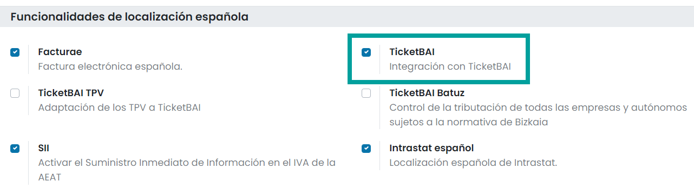

Una vez informado el campo **TicketBAI**, pulsa el botón **Guardar**.

Configurar certificados
-----------------------
Para configurar un certificado navega a la pantalla
:menuselection:`Facturación / Contabilidad --> Configuración --> Certificados AEAT` y haz clic sobre el botón **Crear**.

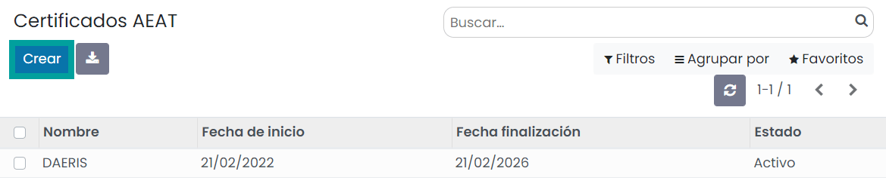

Sobre el formulario de detalle, informa los siguientes campos:

   - **Nombre**: Nombre del certificado.
   - **Archivo**: Selecciona tu certificado de una entidad certificadora válida.
   - **Nombre de la carpeta**: Especifica un nombre para la carpeta en donde se alojará el certificado en el sistema.

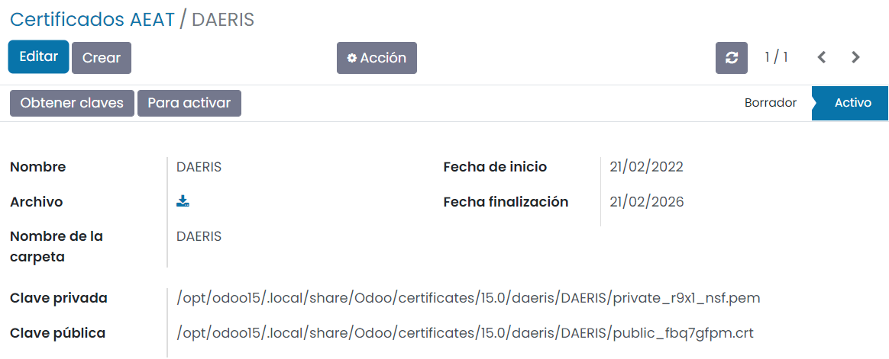

Una vez dado de alta el certificado, pulsa el botón **Obtener claves**.

El sistema mostrará una ventana en donde introducir la contraseña del certificado. Si todo ha ido bien, se
generarán las claves, y se podrá activar el certificado mediante el botón **Para activar**.

.. important::
   El NIF del certificado debe ser el mismo que el NIF de la compañía utilizada para realizar las pruebas, ya que
   las facturas se envían con la compañía como remitente. Si no se hace esto, al enviar la factura a TicketBAI, se
   nos devolverá el error **007 Certificado remitente no válido para emisor factura**.

Habilitar TicketBAI a nivel de la compañía
-------------------------------------------

Para habilitar TicketBAI a nivel de la compañía, navega a la pantalla :menuselection:`Ajustes --> Usuarios y Compañías --> Compañías`
, y accede al detalle de la compañía. En la pestaña de información general deberemos validar que el NIF de la
compañía se corresponde con el NIF del certificado configurado en la aplicación.

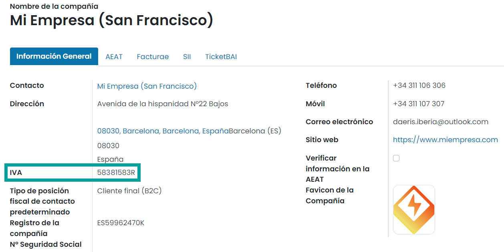

Desde la pestaña TicketBAI, marcaremos el campo Habilitar TicketBAI, e informaremos los campos requeridos:
   - **Habilitar entorno de pruebas**: Los envíos realizados en la fase de pruebas no tendrán trascendencia tributaria.
   - **Instalación TicketBAI**: Seleccionaremos la instalación creada anteriormente del listado.
   - **Hacienda TBAI**: Seleccionaremos la Hacienda en la que hayamos solicitado el alta, en nuestro caso la Hacienda Foral de Gipuzkoa.
   - **Régimen simplificado**: En caso de que la compañía tribute en régimen simplificado.
   - **Certificados AEAT**: Seleccionaremos el certificado creado anteriormente del listado.
   - **Datos protegidos**: Si se marca incluye un campo de descripción alternativo que se incluirá en las llamadas a TicketBAI como descripción de la línea de la factura.
   - **Método descripción TBAI**:
      - **Automático**: La descripción será la unión de las descripciones de las líneas de factura.
      - **Predefinido**: La descripción escrita en el campo “Descripción TBAI”.
      - **Manual**: Es necesario insertar la descripción de la factura manualmente en cada factura.

Una vez hecho esto, guarda los datos de la compañía mediante el botón **Guardar**.

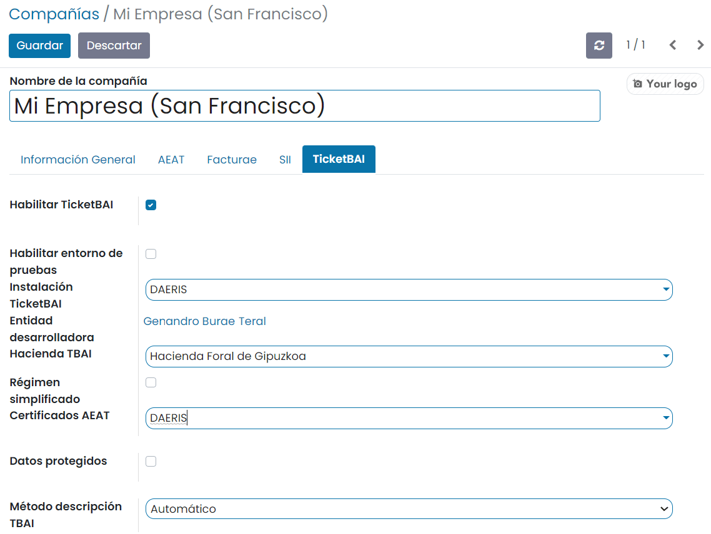

Habilitar TicketBAI sobre el diario de facturación
----------------------------------------------------
Para habilitar TicketBAI sobre el diario de Facturación de clientes, navega a la pantalla :menuselection:`Facturación/Contabilidad --> Ajustes --> Diarios contables`
, y accede al diario **Facturas de clientes**. Informa el campo **Enviar facturas a hacienda TicketBAI** y haz clic sobre el botón **Guardar**.

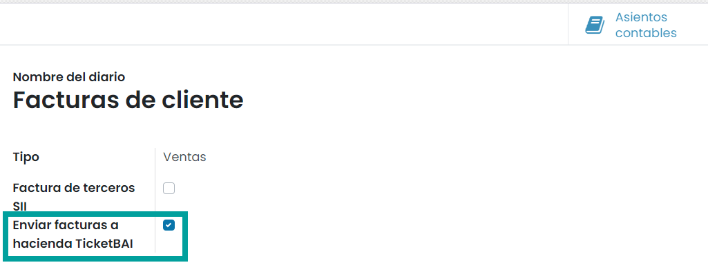

Gestión de facturas con TicketBAI
==================================

Enviar una factura de cliente a TicketBAI
--------------------------------------------
Para enviar una factura de cliente a TicketBAI
crea una factura desde la pantalla :menuselection:`Facturación/Contabilidad --> Clientes --> Facturas`.

La factura debe cumplir los siguientes requisitos:

   - **Cliente con NIF informado**
   - **El diario debe tener activado el envío a TicketBAI**

La factura debe ser confirmada mediante el botón **Confirmar** para que se produzca el envío a TicketBAI.

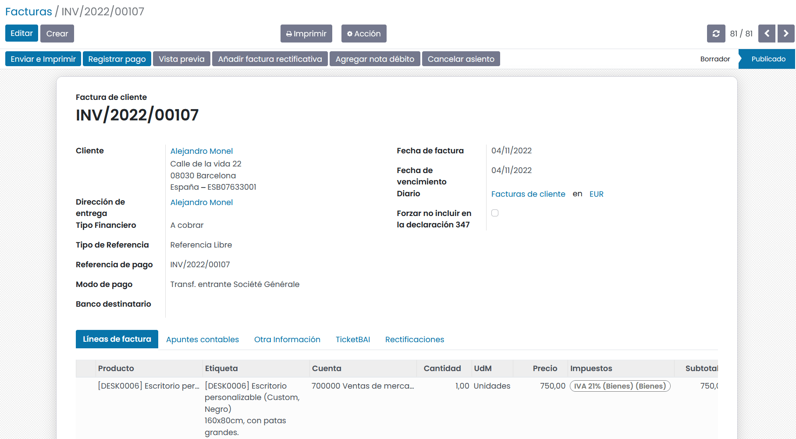

Desde la pestaña **TicketBAI** de la factura y sobre el apartado de **facturas de cliente**, aparecerán los datos
de la factura en estado **Pendiente**.

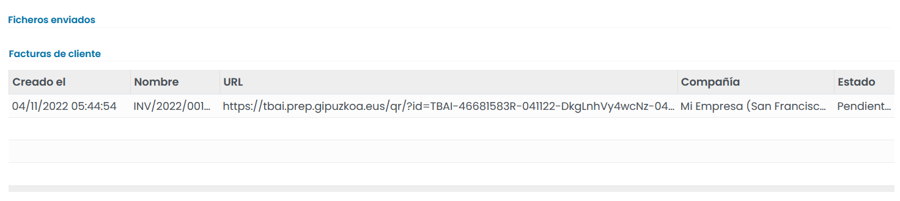

Una vez la factura haya sido enviada a TicketBAI
(*el sistema envía las facturas a TicketBAI de forma automática mediante una tarea programada*), el estado de la
factura cambiará a **Enviada**.

Desde el apartado de **respuestas**, es posible consultar la respuesta recibida de TicketBAI.

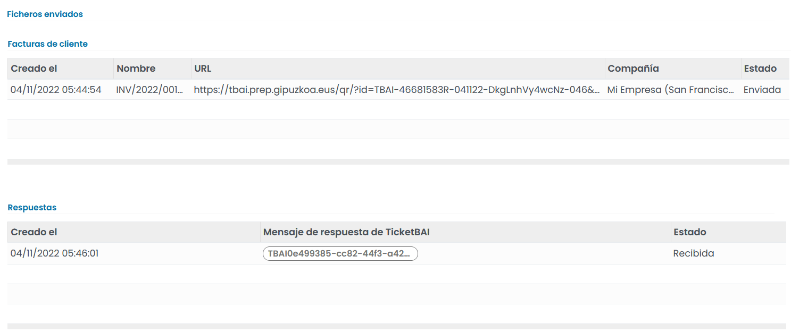

.. error::
   En el caso de producirse un error a la hora de realizar el envío, la factura queda con estado **Error**, y sobre **respuestas** es posible consultar el tipo de error recibido.

Al acceder al enlace del campo **URL** disponible sobre el apartado **facturas de cliente**, es posible consultar
el detalle de la factura en el sistema TicketBAI.

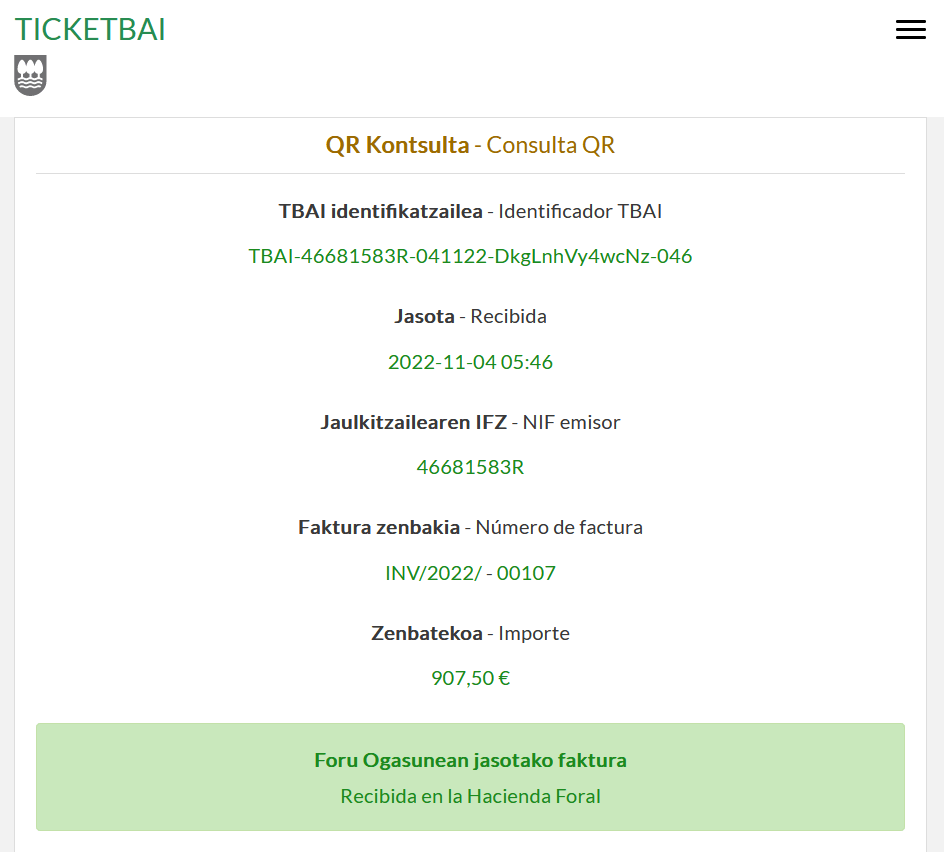

La factura dispone del código QR que, al ser escaneado, permite su consulta en el portal de TicketBai.

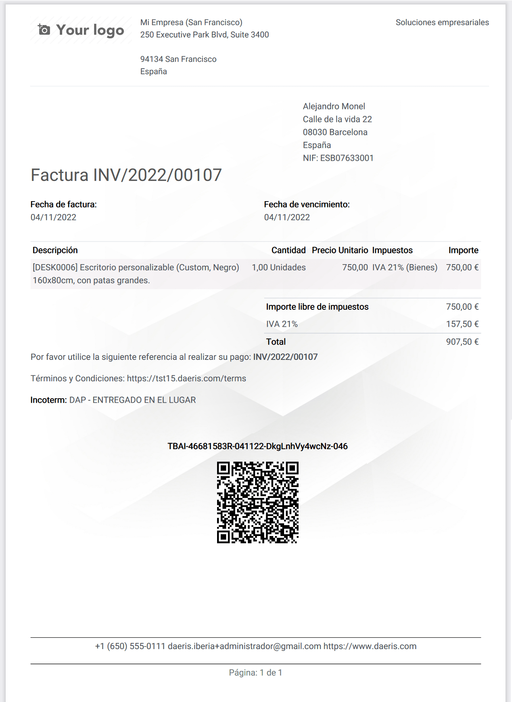

El cliente, puede consultar la factura desde el portal del cliente de Daeris. La factura dispone del código QR que, al ser escaneado, permite su consulta en el portal de TicketBai.

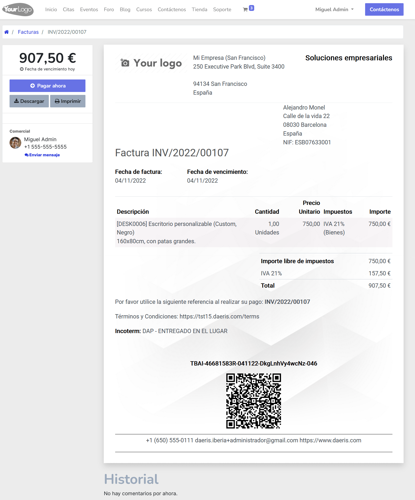

Enviar una factura rectificativa de cliente a TicketBAI
-----------------------------------------------------------

Sobre una factura que no haya sido pagada, pulsa el botón **Añadir factura rectificativa**.

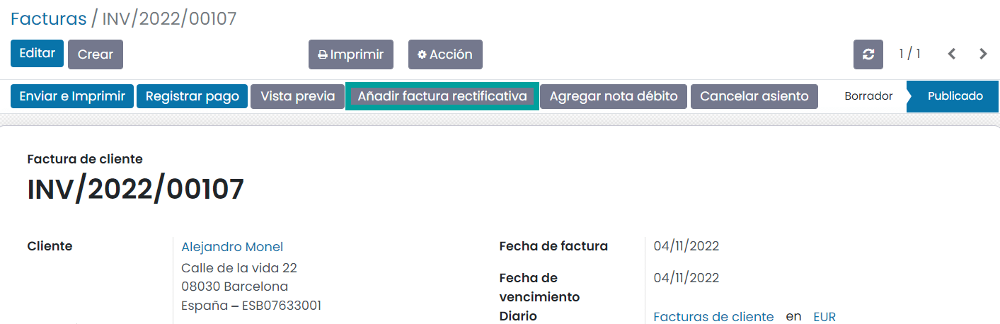

El sistema muestra un formulario con las siguientes opciones:

   - **Método de crédito**: Selecciona cómo quieres acreditar esta factura.
   - **Motivo**: Incorpora el motivo de la factura rectificativa.
   - **Fecha de reversión**: Modificar en el caso que sea distinta a la fecha actual.

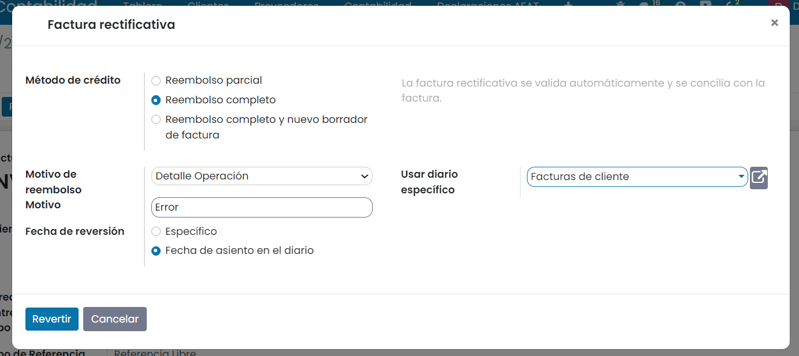

Una vez informados los campos necesarios, pulsa el botón **Revertir**.

El sistema navega al detalle de la factura rectificativa recién creada.

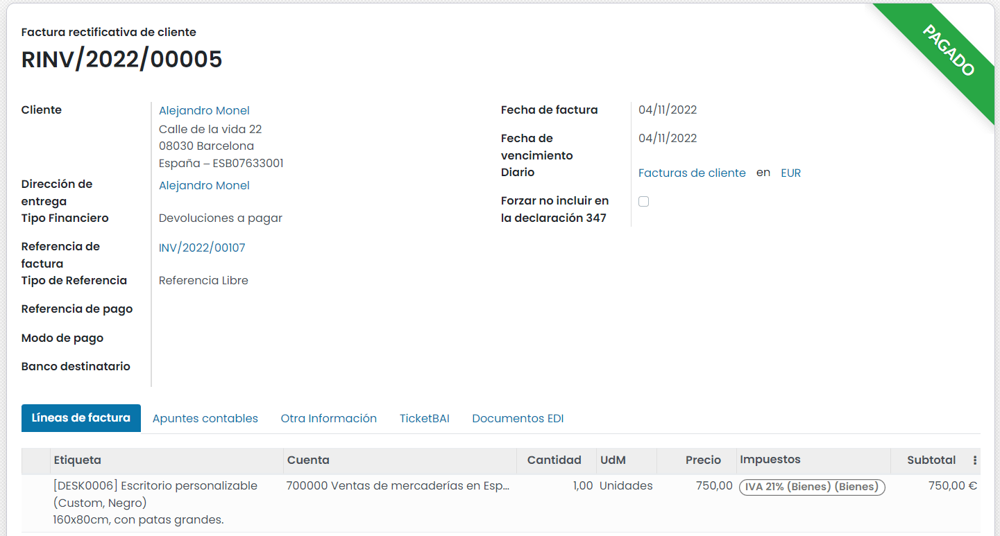

En la pestaña de **TicketBAI** se genera un nuevo registro en facturas de cliente en estado **Pendiente**.

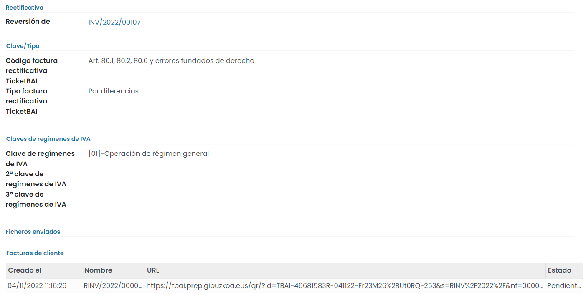

Si todo ha ido bien, pasados unos minutos, la factura de cliente se habrá enviado a TicketBAI.

El estado de la factura cambia a **Enviada** y se genera un registro de respuesta sobre el apartado **Respuestas**

.. tip::
   Recuerda que puedes actualizar la información del registro mediante el botón **Refrescar** ubicado en la barra superior derecha de la pantalla.

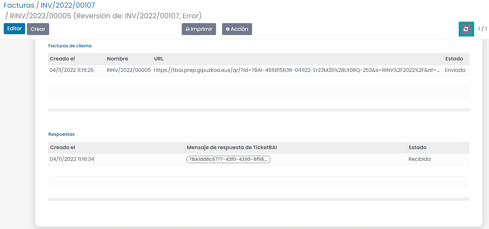

Al acceder al enlace del campo **URL** disponible sobre el apartado **facturas de cliente**, es posible consultar
el detalle de la factura en el sistema TicketBAI.

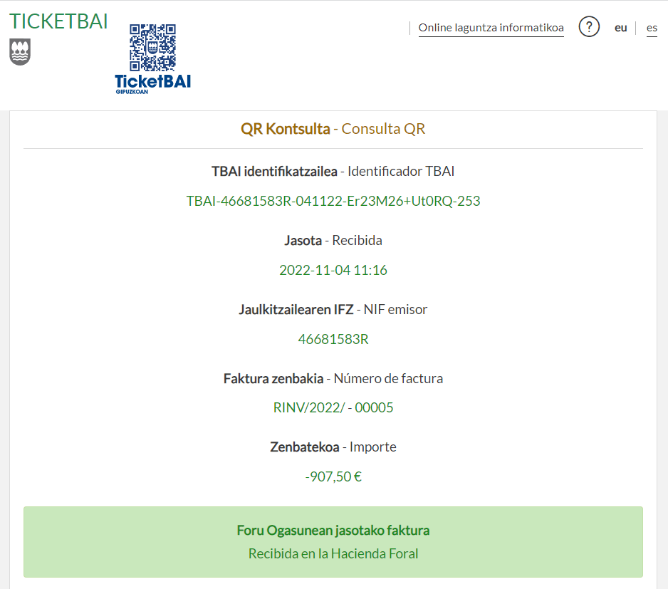

La factura dispone del código QR que, al ser escaneado, permite su consulta en el portal de TicketBai.

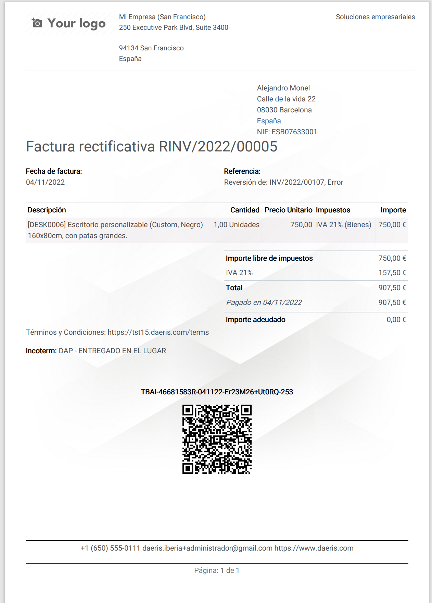

El cliente, puede consultar la factura desde el portal del cliente de Daeris. La factura dispone del código QR que, al ser escaneado, permite su consulta en el portal de TicketBai.

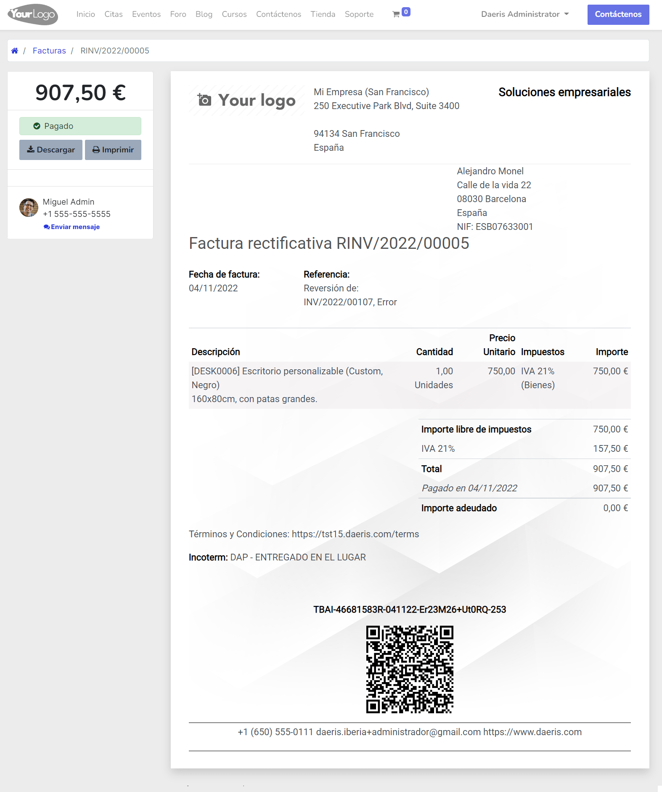

Enviar una anulación de factura a TicketBAI
-----------------------------------------------

Sobre una factura confirmada, pulsa el botón **Cancelar asiento**.

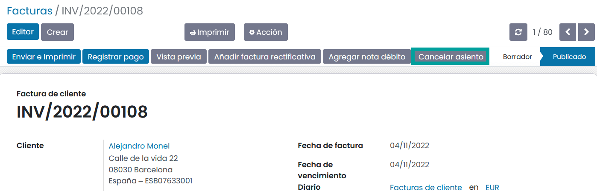

En la pestaña de TicketBAI se ha generado una línea en el apartado de **Anulaciones de factura**.

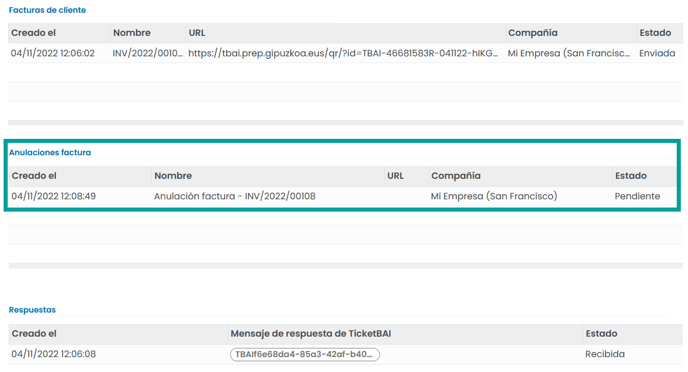

Pasados unos minutos, si todo ha ido bien, el estado de la anulación de factura cambia a **Enviado**
y se genera una respuesta sobre el apartado de **respuestas**.

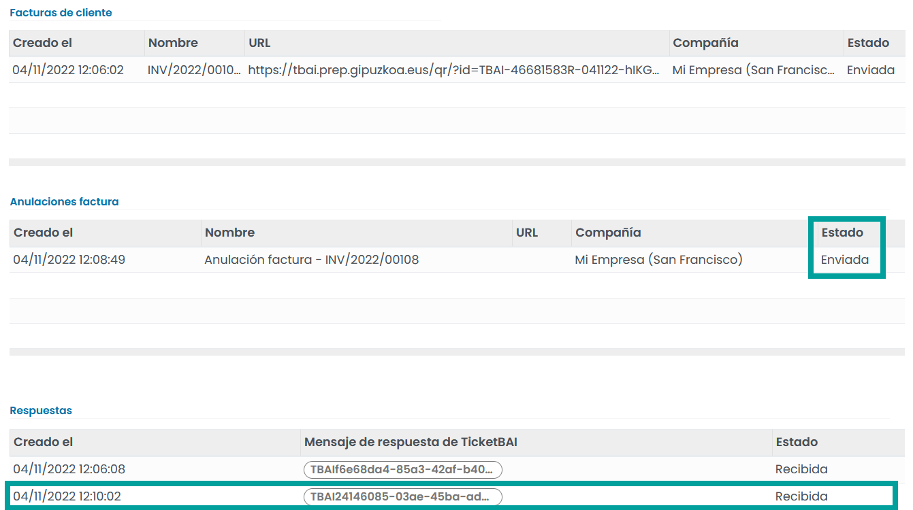

Acerca de BATUZ
=================

¿Qué es BATUZ?
-------------------

BATUZ, es una estrategia de control de la tributación de todas las empresas y autónomos sujetos a la
normativa de **Bizkaia**, con independencia de su naturaleza y tamaño.

BATUZ lo forman tres componentes:

   - El software garante de facturación **TicketBAI**.

   Sistema informático de facturación para asegurar la declaración de todas las operaciones de venta realizadas.

   - El **Libro registro de operaciones económicas (LROE)**: Modelos 140 y 240

   En los que se declara los ingresos, gastos y facturas de las personas que realizan actividades económicas: modelo 140 para personas físicas y modelo 240 para personas jurídicas.

   - Elaboración de **borradores de IVA, sociedades y renta**

   Con la información remitida en los modelos 140 y 240, la hacienda foral de Bizkaia elaborará a las personas jurídicas y a las personas físicas con actividad económica, borradores de declaración de IVA y de Sociedades o Renta.

.. seealso::
   `Proyecto BATUZ <www.batuz.eus>`_ .

¿A quién afecta LROE?
-----------------------
Estarán obligados los siguientes contribuyentes, siempre que les sea de aplicación la normativa de Bizkaia del IRPF o del IS:

   - Contribuyentes del IRPF que realicen actividades económicas.
   - Contribuyentes del IS y contribuyentes del IRNR con EP.

* Las personas físicas arrendadoras de inmuebles que no desarrollen una actividad económica deberán llevar el LROE cuando estén inscritas en el registro de devolución mensual del IVA.

¿Como se cumplimenta LROE?
---------------------------
El LROE deberá llevarse a través de la sede electrónica de la Diputación Foral de Bizkaia, mediante el suministro
electrónico de los registros que lo componen.

Dicho suministro se podrá hacer mediante:

   - **Servicios web** (comunicaciones automáticas máquina a máquina). Los envíos se pueden realizar por distintas fuentes: dispositivo de facturación, software de contabilidad, terceros que actúan en nombre del contribuyente, etc.
   - **Cumplimentación manual** a través de los formularios.

¿Cuántos modelos dispone LROE?
--------------------------------

El Libro registro de operaciones económicas (LROE) dispone de dos modelos:

   - **Modelo 140** : LROE de las personas **físicas**
   - **Modelo 240** : LROE de las personas **jurídicas**

.. list-table:: Estructura de modelos LROE
   :widths: 50 50
   :header-rows: 1

   * - **LROE personas físicas (modelo 140)**
     - **LROE personas jurídicas (modelo 240)**
   * - 1. Capítulo de Ingresos y facturas emitidas

       1.1 – Subcapítulo de Ingresos con factura con Software garante

       1.2 – Subcapítulo de Ingresos con factura sin Software garante

       1.3 – Subcapítulo de Ingresos sin factura

     - 1. Capítulo de Facturas emitidas

       1.1 – Subcapítulo de Facturas emitidas con Software garante

       1.2 – Subcapítulo de Facturas emitidas sin Software garante

   * - 2. Capítulo de Gastos y facturas recibidas

       2.1 – Subcapítulo de Gastos con factura

       2.2 – Subcapítulo de Gastos sin factura

     - 2. Capítulo de Facturas recibidas
   * - 3. Capítulo de Bienes de inversión
     - 3. Capítulo de Bienes de inversión
   * - 4. Capítulo de Determinadas operaciones intracomunitarias
     - 4. Capítulo de Determinadas operaciones intracomunitarias
   * - 5. Capítulo de Provisiones de fondos y suplidos
     - 5. Capítulo de Otra información con trascendencia tributaria
   * - 6. Capítulo de Otra información con trascendencia tributaria
     - 6. Capítulo de Movimientos contables

Alcance de operaciones LROE en Daeris
------------------------------------------

La aplicación de Daeris alcanza las siguientes operaciones y anotaciones:

   - Operaciones:
      - ALTA (A00) de facturas
      - ANULACIÓN (AN0) de facturas
   - Modelos soportados:
      - PF 140 (Libro Registro de Operaciones Económicas (personas físicas)
         - Anotaciones de subcapitulo 1.1 - Ingresos con factura con Software garante (LROE PF 140)
         - Anotaciones de subcapitulo 2.1 - Gastos con factura (LROE PF 140)
      - PJ 240 Libro Registro de Operaciones Económicas (personas jurídicas)
         - Anotaciones de subcapitulo 1.1 - Facturas emitidas con Software garante (LROE PJ 240)
         - Anotaciones de capitulo 2 - Facturas recibidas (LROE PJ 240)

*El resto de operaciones y anotaciones del LROE quedan fuera de Daeris*

Configuración LROE
====================

Habilitar LROE a nivel de la compañía
---------------------------------------

LROE es un sistema  exclusivo de la normativa de **Bizkaia**. Para habilitarlo
, navega a la pantalla :menuselection:`Ajustes --> Usuarios y Compañías --> Compañías`
, y accede al detalle de la compañía. En la pestaña **TicketBAI**, informa los siguientes campos:

   - **Hacienda TBAI**: Hacienda Foral de Bizcaia
   - **Modelo LROE**: A seleccionar entre

      - **LROE PJ 240** (personas jurídicas)
      - **LROE PF 140** (personas físicas)

   - **Epígrafe I.A.E. actividad principal**: Se debe informar el código que identifica la actividad empresarial y profesional que desarrolla tu negocio. Solo disponible al seleccionar el modelo LROE PF 140.
      - Subcapítulo de ingresos con facturas emitidas con el software garante.Se registrarán los ficheros TicketBAI, añadiendo el ingreso a efectos del IRPF y el epígrafe de la actividad a la que corresponda a la operación.

   - **Usar conector**: Informar para usar el conector en lugar de enviar la anotación directamente cuando se valida la factura. Al informar aparece la opción **Modo de envío**.
   - **Modo de envío**: Permite seleccionar entre las siguientes opciones:

      - **Al validar**: Se emite la anotación al validar la factura.
      - **A una hora fija**: Se emite la anotación a la hora indicada bajo el campo que aparece al seleccionar esta opción.
      - **Con retardo**: Se emite la anotación añadiendo un retardo bajo el campo que aparece al seleccionar esta opción.
      - **A final del trimestre**: Se emite la anotación al finalizar el trimestre actual.

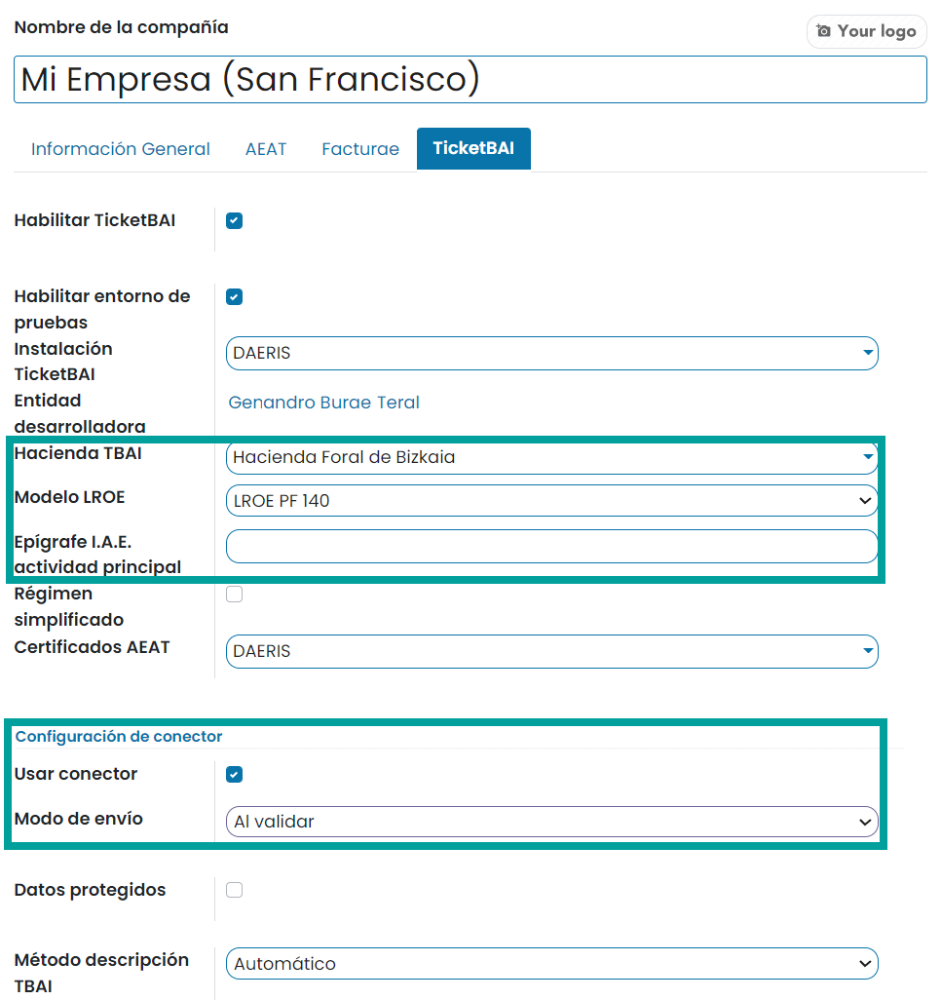

