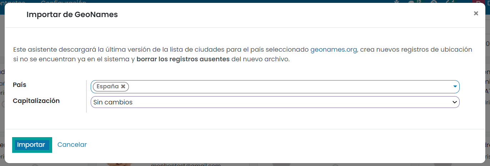
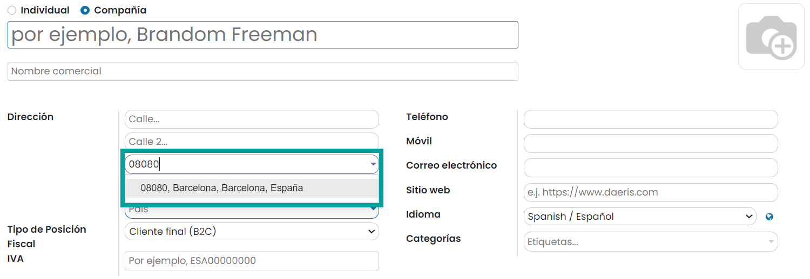
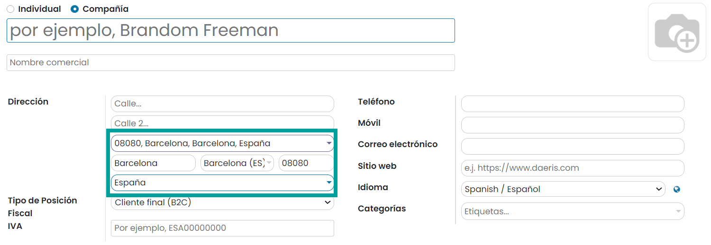

==================================
Topónimos españoles
==================================

Daeris permite incorporar las provincias, municipios y códigos postales de España y de muchos otros paises
a partir de los datos obtenidos de `Geonames <https://www.geonames.org>`_ .

Asistente de Alta de municipios y provincias
=============================================

Para incorporar los municipios y provincias españolas, accede al asistente de importación. Para ello, navega a
:menuselection:`Contactos --> Configuración --> Importar de geonames`.

Este asistente descarga la última versión de la lista de ciudades para el país seleccionado, crea nuevos registros
de ubicación si no se encuentran ya en el sistema y borra los registros ausentes del nuevo archivo.

Sobre el asistente, informa el campo **País**, seleccionando los países que desees importar.

Sobre el campo **Capitalización** puedes seleccionar las siguientes opciones:
   - **Sin Cambios**: Incorpora los datos como los recupera de geonames.
   - **Nombre propio**: Incorpora la nomenclatura con la primera letra en mayúsculas y el resto en minúsculas.
   - **Capitalización**: Incorpora la nomenclatura en mayúsculas.

Una vez completados los datos, haz clic sobre el botón **Importar**.

.. attention::
   La importación de los datos puede tardar varios minutos.
   En el caso de error, es posible que el servicio de **geonames** esté temporalmente deshabilitado, con lo que se recomienda volver a probar pasadas unas horas.

Autocompletar datos
====================

Desde el campo **Completado de ubicación** disponible sobre el formulario de contactos, es posible escribir
el código postal o el nombre de la ciudad. Al realizar esta acción, el campo irá filtrando por los resultados que
vaya obteniendo.

Al seleccionar un resultado se incorporan automáticamente los campos ciudad, provincia, país y código postal.

.. tip::
   Si antes de informar el campo **Autocompletar ubicación**, se informa el país o la provincia, se usarán estos valores para restringir los posibles resultados.