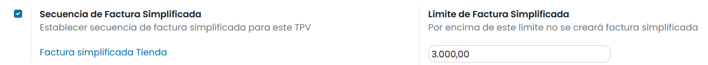
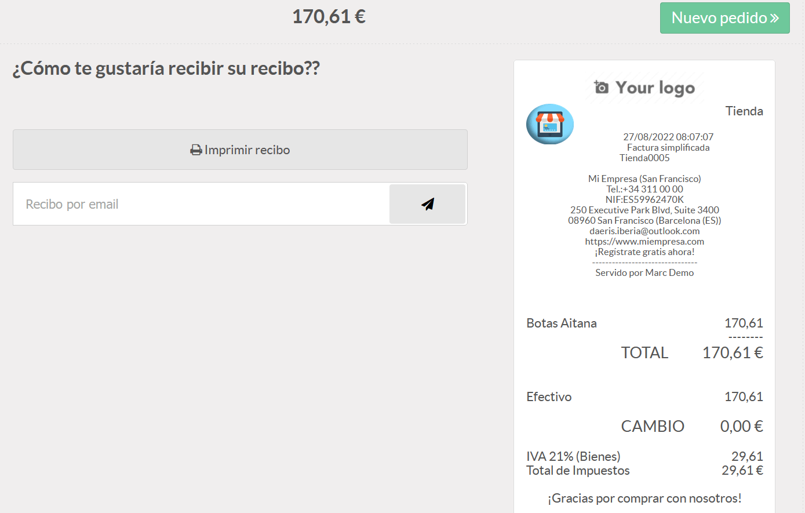
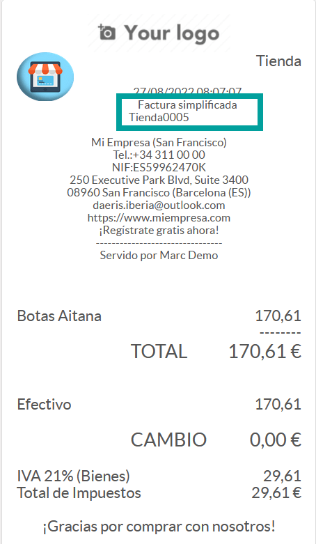

==============================================================
TPV
==============================================================

La localización española incorpora las siguientes funcionalidades relacionadas con el TPV.

   - Adapta el terminal punto de venta a la legislación Española (no se permite la emisión de tiquets, todo deben ser facturas o facturas simplificadas con numeración)
   - Adapta el ticket de venta a la factura simplificada, añadiendo una secuencia correlativa y el NIF del emisor.
   - Incluye los datos del cliente (nombre, NIF y dirección) si hay uno asignado.
   - Valida que no se realice una factura simplificada con valor superior a 3.000 euros (la cantidad es configurable por TPV).

Facturas simplificadas
========================

Una factura simplificada es un documento que acredita la compra de productos o servicios y se usa como comprobante de la
transacción comercial entre el vendedor y comprador.

En Daeris, una factura simplificada dispone de:

    - la **fecha** en la que se realiza la transacción.
    - Los **artículos** que componen la venta.
    - El detalle de los **impuestos** aplicados
    - Toda la información disponible que identifica al **vendedor**.
    - El detalle del **pago** realizado.
    - El código correlativo y único** por cada **venta** realizada (TPVXXXX).

Para configurar tu TPV para que genere facturas simplificadas en lugar de recibos,
navega a la pantalla :menuselection:`Punto de Venta --> Configuración --> Punto de Venta`, accede al detalle
del TPV y sobre el apartado **Facturas y recibos**, informa la opción **Secuencia de Factura Simplificada**.

Además, en función del tipo de ventas que realiza tu negocio, debes establecer el importe límite sobre el cual
no se puede emitir una factura simplificada. Para ello, activa la opción **Límite de Factura Simplificada** e
incorpora el importe que consideres oportuno (3000 es la cantidad predeterminada).

Activar esta opción supone:

    - No emitir recibos desde el TPV si no facturas o facturas simplificadas.
    - Adaptar el recibo a la factura simplificada (Incorpora secuencia formada por el nombre del TPV + código).
    - Añade el texto **Factura simplificada** para conocimiento del cliente.
    - Validar que no se realiza factura simplificada por un importe mayor al configurado.

.. note::
   En el siguiente `enlace <https://sede.agenciatributaria.gob.es/Sede/iva/facturacion-registro/facturacion-iva/tipos-factura.html>`_ se puede leer todo lo referente a la normativa española que obliga al uso de facturas simplificadas en lugar de recibos.

Una vez configurada esta opción, cada vez que se realiza una venta desde el TPV de Daeris, se emite una factura simplificada
para su impresión tras validar el pago del pedido. También es posible enviarlo al cliente por correo electrónico.

Ejemplo de factura simplificada

Consideraciones
================

   - No se comprueba el límite en operaciones separadas para un mismo cliente, algo que Hacienda proscribe.
   - El modo de gestión de inventario en tiempo real, si se pierde la conexión a internet, las ventas se quedan pendientes de enviar a la base de datos hasta que la conexión vuelve. En ese estado no se asigna número de factura simplificada, aunque cuando la conexión ha regresado, la numeración de la factura simplicada es correcta.
