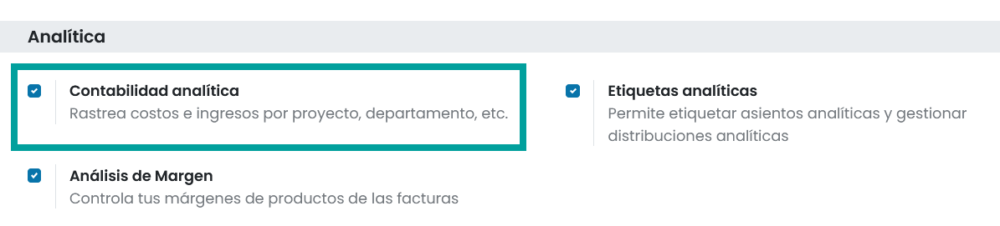
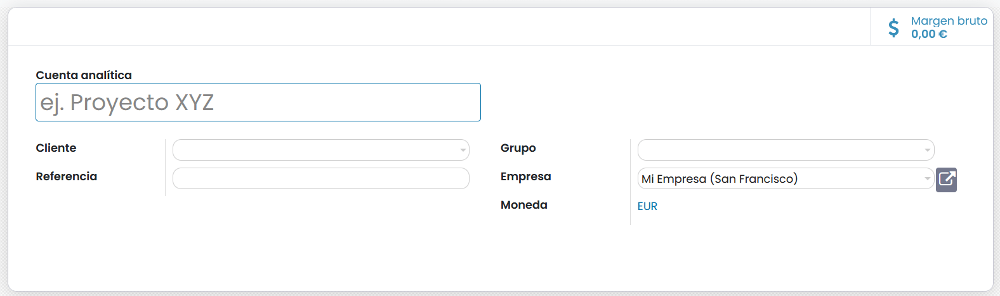
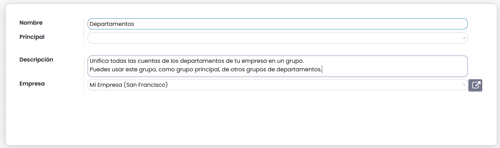
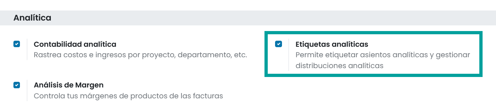
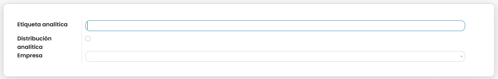
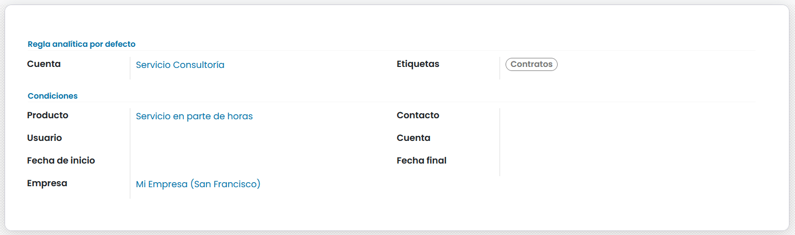

============================
Configuración
============================

La contabilidad analítica es un conjunto de técnicas cuya finalidad es la de **identificar de forma clara y precisa, la
distribución de los gastos e ingresos** de una empresa, pudiéndose agrupar y distribuir en base a las necesidades como:

   - Clientes
   - Proveedores
   - Productos
   - Departamentos
   - Proyectos
   - Centros de producción
   - Áreas de negocio
   - …

La contabilidad analítica es un área de la contabilidad de uso exclusivamente **interno** y no es obligatoria su gestión,
si bien permite **entender con datos precisos los resultados de la empresa**. La forma de obtener los datos se adecua a
las características de cada negocio.

Analizar los datos de la contabilidad analítica permite tomar decisiones acertadas en el ámbito financiero de tu negocio
como, por ejemplo:

   - Aumentar o reducir el precio de venta de un producto /servicio.
   - Incorporar nuevos productos a tu catálogo de ventas.
   - Incrementar los gastos publicitarios de tu negocio.
   - Ampliar o disminuir el personal de un determinado departamento.
   - …

Para poder gestionar la contabilidad analítica, hay que activarla. Para ello, navega a ,
:menuselection:`Facturación / Contabilidad --> Configuración --> Ajustes`
y sobre el apartado **Analítica** informa el campo **Contabilidad analítica**. A continuación, haz clic
sobre el botón **Guardar**.

Crear una cuenta analítica
===================================

.. note::
   Si vendes servicios y los gestionas como proyectos, cada proyecto dispondrá de su cuenta analítica asociada por defecto, pudiendo evaluar sus ingresos y  gastos.

Para crear una nueva cuenta analítica navega a :menuselection:`Facturación / Contabilidad --> Configuración --> Cuentas analíticas` y haz clic sobre el botón **Crear**.
Sobre el formulario, puedes informar los siguientes campos:

   - **Cuenta analítica**: Nombre descriptivo de la cuenta.
   - **Cliente**: Es posible vincular una cuenta analítica con un cliente determinado o no informar ninguno.
   - **Referencia**: Codigo corto que sirve de referencia en diversas ubicaciones.
   - **Grupo**: Agrupación de cuentas analiticas.
   - **Empresa**: Empresa de una de tus empresas, asociada a esta cuenta.
   - **Moneda**: Moneda con la que trabaja la cuenta analítica. Se corresponde con la moneda principal que una la empresa.

Una vez registrados los campos haz clic sobre el botón **Guardar**.

Crear grupos de cuentas analíticas
===================================

Los grupos de cuentas analíticas permiten agrupar diferentes cuentas analíticas. Cada grupo puede disponer de un grupo
superior, permitiéndote formar relaciones jerárquicas.

Para crear un grupo de cuentas analíticas, navega a navega a
:menuselection:`Facturación / Contabilidad --> Configuración --> Grupos de cuentas analíticas` y haz clic sobre el
botón **Crear**. Sobre el formulario, puedes informar los siguientes campos:

   - **Nombre**: Nombre descriptivo de la cuenta.
   - **Principal**: Grupo jararquicamente superior.
   - **Descripción**: Texto descriptivo de la finalidad del grupo
   - **Empresa**: Empresa de una de tus empresas, asociada a esta cuenta.

Una vez registrados los campos haz clic sobre el botón **Guardar**.

Crear etiquetas analiticas
===================================

Para poder gestionar la contabilidad analítica con etiquetas analíticas, hay que activarla. Para ello, navega a ,
:menuselection:`Facturación / Contabilidad --> Configuración --> Ajustes`
y sobre el apartado **Analítica** informa el campo **Etiquetas analíticas**. A continuación, haz clic
sobre el botón **Guardar**.

Para crear etiquetas analíticas, navega a navega a
:menuselection:`Facturación / Contabilidad --> Configuración --> Etiquetas analíticas` y haz clic sobre el
botón **Crear**. Sobre el formulario, puedes informar los siguientes campos:

   - **Etiqueta analítica**: Nombre descriptivo de la etiqueta
   - **Distribución analítica**: Al activar esta opción, se permite bajo un listado, asociar varias cuentas analíticas, añadiéndoles un porcentaje.
   - **Empresa**: Empresa de una de tus empresas, asociada a esta cuenta.

Una vez registrados los campos haz clic sobre el botón **Guardar**.

Reglas analíticas predeterminadas
===================================

Las **Reglas analíticas predeterminadas** permiten incorporar cuentas o etiquetas analíticas de forma predeterminada
sobre pedidos de venta, facturas de clientes, pedidos de compra y factura de proveedor, basándose en criterios
definidos previamente sobre productos, contactos, usuarios y cuentas contables. Es posible establecer una fecha de
inicio y fin para establecer el intervalo de tiempo de uso de la regla.

Para crear reglas analíticas, navega a navega a
:menuselection:`Facturación / Contabilidad --> Configuración --> Reglas analíticas predeterminadas` y haz clic sobre el
botón **Crear**. Sobre el formulario, puedes informar los siguientes campos:

   - **Cuenta**: Cuenta analítica en la que se centra la regla.
   - **Etiqueta**: Etiqueta analítica que se usará si se cumple la regla.
   - **Producto**: Selecciona un producto que utilizará la cuenta analítica especificada en el análisis predeterminado (por ejemplo, creando una nueva factura de cliente o un pedido de venta, si seleccionamos este producto, automáticamente lo tomará como una cuenta analítica).
   - **Usuario**: Selecciona un usuario que usará la cuenta analítica especificada en el análisis predeterminado.
   - **Fecha de inicio**: Fecha de inicio predeterminada para esta cuenta analítica.
   - **Fecha final**: Fecha final predeterminada para esta cuenta analítica.
   - **Empresa**: Seleccione una compañía (de tus compañías) que utilizará la cuenta analítica predeterminada (por ejemplo, creando una nueva factura de cliente o un pedido de ventas, si seleccionamos esta empresa, automáticamente la tomará como una cuenta analítica).
   - **Contacto**: Selecciona la empresa que utilizará la cuenta analítica predeterminada (por ejemplo, creando una nueva factura de cliente o un pedido de venta, si seleccionamos esta empresa, automáticamente utilizará esta cuenta analítica).
   - **Cuenta**: Selecciona una cuenta contable que utilizará la cuenta analítica especificada en el análisis predeterminado (por ejemplo, creando una nueva factura de cliente o una orden de venta si seleccionamos esta cuenta, se tomará automáticamente como una cuenta analítica).

Una vez registrados los campos haz clic sobre el botón **Guardar**.

.. example::
   En la imagen anterior, hemos crear una regla analítica para que incorpore la etiqueta analítica **Contratos**
   cuando se realicen una compra o venta sobre el producto **Servicio en parte de horas**.
   Al generar un presupuesto, e incorporar el producto, se incorpora automáticamente la etiqueta analítica **Contratos**.

   .. image:: configuracion/regla02.png
      :align: center
      :alt: Reglas analíticas predeterminadas
