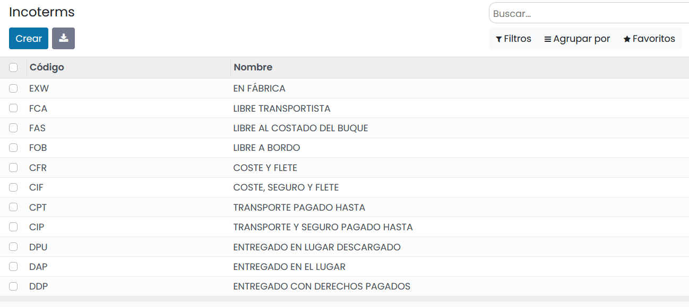
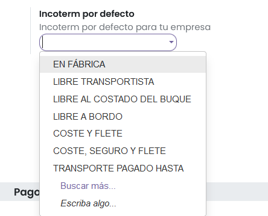
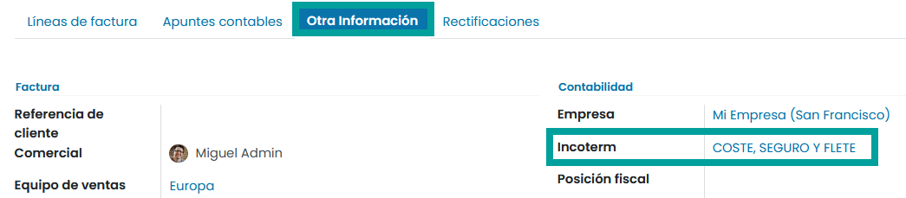

==============================
Incoterms
==============================

Los incoterms son un **grupo de términos comerciales**, de tres letras cada uno, que se utilizan en las **transacciones
internacionales** para aclarar los costes y determinar las cláusulas comerciales incluidas en un **contrato de compraventa**.

El objetivo principal de los incoterms es establecer los criterios acerca de la **distribución de los costes**,
así como de la **transmisión de los riesgos** entre el comprador y el vendedor en el contrato de una transacción comercial
internacional.

Configurar incoterms
======================================

Para configurar los incoterms, navega a :menuselection:`Facturación / Contabilidad --> Configuración --> Incoterms`.

Inicialmente, vienen preconfigurados los incoterms usados en la comunidad internacional.

.. important::
   Es posible crear y editar incoterms si bien no es una práctica habitual, debido a que los valores son establecidos por la comunidad internacional.

Incorporar un valor predeterminado
======================================

Es posible incorporar un valor de incoterm predeterminado sobre las facturas siempre que no se haya realizado el envío.
Para ello, navega a :menuselection:`Facturación / Contabilidad --> Configuración --> Incoterms` y sobre el apartado
**Facturas de cliente***, informa el valor del campo **Incoterm por defecto** y haz clic sobre el botón **Guardar**.

Al realizar la factura, el valor del incoterm predeterminado se informa sobre el campo **Incoterm** bajo
la pestaña **Otra información**.

.. important::
   Solo se incorpora el incoterm predeterminado sobre la factura si no se ha realizado el envío del pedido.

Para **mostrar los incoterms en pedidos y facturas**, navega a la pantalla :menuselection:`Ventas --> Configuración --> Ajustes` y marca la opción Incoterms.

.. seealso::
   * :ref:`inventario_y_fabricacion/inventario/envio/configuracion/mostrar_incoterms`