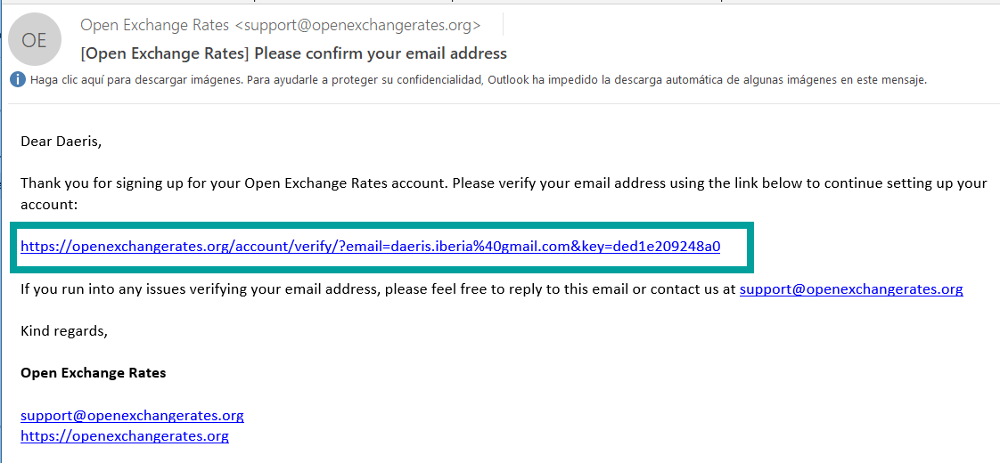

======================================
Multidivisa
======================================

Daeris permite emitir y recibir facturas y registrar transacciones en monedas distintas a la moneda principal
de tu empresa. También es posible configurar cuentas bancarias en otras monedas y ejecutar informes sobre tus
actividades en moneda extranjera.

Configuración
======================================

.. _finanzas/contabilidad/otros/multidivisa/moneda_principal:

Moneda principal
-----------------
Para seleccionar la moneda principal de tu empresa, navega a :menuselection:`Facturación / Contabilidad --> Configuración --> Ajustes`
y sobre el apartado **Monedas** selecciona la moneda principal de tu empresa.

Por último, haz clic sobre el botón **Guardar**.

.. image:: multidivisa/monedas03.png
   :align: center
   :alt: Seleccionar la moneda principal de la empresa

.. _finanzas/contabilidad/otros/multidivisa/habilitar_monedas:

Habilitar monedas extranjeras
----------------------------------

Daeris admite trabajar con múltiples monedas. Estas se crean de forma predeterminada, pero no necesariamente activas.

Para activar las monedas, navega a :menuselection:`Facturación / Contabilidad --> Configuración --> Monedas`.

Sobre el listado de monedas, activa aquellas monedas sobre las que vaya a trabajar tu empresa, haciendo clic sobre el
campo **Activo** de cada registro de moneda a activar.

.. caution::
   Es recomendable **activar únicamente**, aquellas monedas con las que vaya a trabajar el sistema.

.. image:: multidivisa/monedas01.png
   :align: center
   :alt: Configurar monedas

Al hacer clic sobre el registro de una moneda, accedes al detalle de información de la moneda, desde donde es
posible visualizar el registro histórico de los tipos de cambio que se han producido frente a tu moneda principal.

.. image:: multidivisa/monedas02.png
   :align: center
   :alt: Configurar monedas

Al activar la moneda, puedes optar por automatizar la actualización del tipo de cambio respecto a tu moneda principal
o realizar esta acción manualmente.

.. _finanzas/contabilidad/otros/multidivisa/tipo_cambio:

Tipo de cambio
-----------------

Actualización manual
~~~~~~~~~~~~~~~~~~~~~~~

Para incorporar **manualmente** un tipo de cambio, navega a :menuselection:`Facturación / Contabilidad --> Configuración --> Monedas`
y haz clic sobre el registro de la moneda a configurar. Mediante esta acción, accedes al detalle de información de la moneda, desde donde es
posible visualizar el registro histórico de los tipos de cambio que se han producido frente a tu moneda principal.

Desde la pestaña **Tasas**, haz clic sobre **Agregar una línea** para registrar una nueva tasa.
Esta acción crea un nuevo registro con fecha actual. La compañía, unidad por moneda y moneda por unidad, se informan
con el valor del registro anterior, siendo posible actualizar los datos con los valores deseados.

Actualización automática a través del servicio del Banco Central Europeo
~~~~~~~~~~~~~~~~~~~~~~~~~~~~~~~~~~~~~~~~~~~~~~~~~~~~~~~~~~~~~~~~~~~~~~~~~~~~~~~

El servicio del banco central europeo, permite recuperar de forma automática, el tipo de cambio de múltiples monedas,
siendo el **Euro** su valor de referencia.

Actualmente, proporciona el tipo de cambio de las siguientes monedas:

.. list-table:: Tipo de Cambio ofrecido por el banco centra Europeo
   :widths: 25 25 25 25
   :header-rows: 0

   * - **AUD** - Dólar australiano
     - **BGN** - Lev búlgaro
     - **BRL** - Real brasileño
     - **CAD** - Dólar canadiense
   * - **CHF** - Franco suizo
     - **CNY** - Yuan chino renminbi
     - **CZK** - Corona checa
     - **DKK** - Corona danesa
   * - **EUR** - Euro Europa
     - **GBP** - Libra esterlina
     - **HKD** - Dólar de Hong Kong
     - **HRK** - Kuna croata
   * - **HUF** - Florín húngaro
     - **IDR** - Rupia inglesa
     - **ILS** - Shekel israelí
     - **INR** - Rupia india
   * - **ISK** - Corona islandesa
     - **JPY** - Yen japonés
     - **KRW** - Won surcoreano
     - **MXN** - Peso mexicano
   * - **MYR** - Ringgit malayo
     - **NOK** - Corona noruega
     - **NZD** - Dólar neozelandés
     - **PHP** - Peso filipino
   * - **PLN** - Zloty polaco
     - **RON** - Leu rumano
     - **SEK** - Corona sueca
     - **SGD** - Dólar de Singapur
   * - **THB** - Baht tailandés
     - **TRY** - Lira turca
     - **USD** - Dólar de EE.UU
     - **ZAR** - Rand sudafricano

.. seealso::
   `Servicio de tipo de cambio con referencia el euro, del Banco Central Europeo <https://www.ecb.europa.eu/stats/policy_and_exchange_rates/euro_reference_exchange_rates/html/index.en.html>`_ .

Si alguna de las monedas de tu compañía, está incluida dentro de las monedas que facilita el banco central europeo, puedes actualizar su valor a diario y de forma automática.

.. attention::
   El servicio de tipo de cambio del Banco central europeo usa como moneda base el EURO. En el caso de usar una moneda principal distinta al EURO, el **tipo de cambio de las monedas se recalcula y puede variar del tipo de cambio real**.

.. caution::
   Daeris no se responsabiliza en ningún caso de los tipos datos ofrecidos por el banco central europeo, ni de los cálculos derivados de su información. Se recomienda revisar el valor de las tasas de las monedas a diario y contrastarlas con su proveedor de servicios financieros de confianza.

Para activar la actualización de monedas activas de forma automática, navega a
:menuselection:`Facturación / Contabilidad --> Configuración --> Ajustes` y sobre la pestaña **Monedas** informa
el campo **Tasas de cambio automáticas** y haz clic sobre el botón **Guardar**.

Para usar el servicio del **Banco Central Europeo**, navega a :menuselection:`Facturación / Contabilidad --> Configuración --> Proveedores de tipo de cambio`.

Si aún no dispones de un registro de **servicio fuente** con el banco central europeo, haz clic sobre el botón **crear**.

Sobre el formulario, informa los siguientes campos:

   - **Servicio Fuente** : Banco Central Europeo:
   - **Intervalo de actualización programado** : Puedes seleccionar el numero de días semanas o meses como intervalo de tiempo entre actualización y actualización. Si seleccionas 1 día, se actualizarán los tipos de cambio a diario.
   - **Próxima actualización programada** : Se informa automáticamente con el próximo día que se ejecutará la actualización.
   - **Compañía** : Selecciona la empresa sobre la que se ejecutara la actualización.
   - **Última actualización con éxito** : Se informa automáticamente con la fecha en la que se ejecutó por última vez la actualización.
   - **Monedas** : En este campo debes seleccionar las monedas sobre las que deseas que se actualice el tipo de cambio. Es importante seleccionar solo, aquellas con las que trabaje tu empresa.

.. image:: multidivisa/monedas06.png
   :align: center
   :alt: Actualización automática a través del servicio del Banco Central Europeo

En el caso de que desees **incorporar varios registros** de tasa de cambio correspondientes a un intervalo de fechas
determinado, haz clic sobre el botón :menuselection:`Acción --> Asistente de actualización de tipo de cambio`.

Sobre el formulario, incorpora la **fecha de inicio** y la **fecha de fin** correspondientes al intervalo de días que
deseas obtener y haz clic sobre el botón **Actualizar**.

Una vez finalizada la acción, puedes visualizar sobre el detalle de las monedas, la actualización del tipo de cambio
para el periodo de fechas indicado.

.. attention::
   Solo se incorporarán registros de tasas de cambio para las monedas y fechas soportadas por el servicio del Banco Central Europeo.

Actualización automática a través de un openexchangerates.org
~~~~~~~~~~~~~~~~~~~~~~~~~~~~~~~~~~~~~~~~~~~~~~~~~~~~~~~~~~~~~~~~~~~~~

**OpenExchangeRates.org** es una empresa dedicada a ofrecer a sus clientes, información sobre el tipo de cambio de más
de 150 monedas distintas.

Para usar sus servicios, debes de crear una cuenta de registro. Existen varias modalidades de registro, entre ellas,
una `cuenta gratuita <https://openexchangerates.org/signup/free>`_ que permite realizar hasta 1000 consultas al mes
sobre la lista de tipos de cambio usando como moneda base el USD (dólar americano).

.. attention::
   Esta información ha sido extraída el **01/10/2022**, pudiendo **variar** con el paso del tiempo, en **servicios y tarifas**. Daeris no tiene ningún tipo de vinculación con OpenExchangeRates.org, la cual puede cambiar su servicio de cuenta gratuita y/o número de consultas gratuitas si así lo decide.

Actualmente, **OpenExchangeRates.org** proporciona el tipo de cambio de las siguientes monedas:

.. list-table:: Tipo de Cambio ofrecido por **OpenExchangeRates.org**
   :widths: 25 25 25 25
   :header-rows: 0

   * - **AED** - Dirham de los Emiratos Árabes Unidos
     - **AFN** - afgano afgano
     - **ALL** - Lek albanés
     - **AMD** - Dram armenio
   * - **ANG** - Florín de las Antillas Neerlandesas
     - **AOA** - Kwanza angoleño
     - **ARS** - Peso Argentino
     - **AUD** - Dólar australiano
   * - **AWG** - Aruban Florin
     - **AZN** - Manat azerbaiyano
     - **BAM** - Marca convertible de Bosnia-Herzegovina
     - **BBD** - Dólar de Barbados
   * - **BDT** - Taka de Bangladesh
     - **BGN** - Lev búlgaro
     - **BHD** - Dinar bahreiní
     - **BIF** - Franco burundés
   * - **BMD** - Dólar de las Bermudas
     - **BND** - Dólar de Brunei
     - **BOB** - Boliviano Boliviano
     - **BRL** - Real Brasileño
   * - **BSD** - Dólar de las Bahamas
     - **BTC** - Bitcoin
     - **BTN** - Ngultrum butanés
     - **BWP** - Pula de Botsuana
   * - **BYN** - Rublo bielorruso
     - **BZD** - Dólar de Belice
     - **CAD** - Dólar canadiense
     - **CDF** - Franco congoleño
   * - **CHF** - Franco suizo
     - **CLF** - Unidad de Cuenta chilena (UF)
     - **CLP** - Peso chileno
     - **CNH** - Yuan chino (offshore)
   * - **CNY** - Yuan chino
     - **COP** - Peso colombiano
     - **CRC** - Colón Costarricense
     - **CUC** - Peso Cubano Convertible
   * - **CUP** - Peso cubano
     - **CVE** - Escudo caboverdiano
     - **CZK** - Corona de la República Checa
     - **DJF** - Franco de Djibouti
   * - **DKK** - Corona danesa
     - **DOP** - Peso dominicano
     - **DZD** - Dinar argelino
     - **EGP** - Libra egipcia
   * - **ERN** - Nakfa eritrea
     - **ETB** - Birr etíope
     - **EUR** - Euro
     - **FJD** - Dólar de Fiji
   * - **FKP** - Libra de las Islas Malvinas
     - **GBP** - Libra esterlina británica
     - **GEL** - Lari georgiano
     - **GGP** - Libra de Guernsey
   * - **GHS** - Cedi ghanés
     - **GIP** - Libra de Gibraltar
     - **GMD** - Gambian Dalasi
     - **GNF** - Franco guineano
   * - **GTQ** - Quetzal guatemalteco
     - **GYD** - Dólar de Guyana
     - **HKD** - Dólar de Hong Kong
     - **HNL** - Lempira hondureño
   * - **HRK** - Kuna croata
     - **HTG** - Gourde haitiano
     - **HUF** - Florín húngaro
     - **IDR** - Rupia indonesia
   * - **ILS** - Nuevo Sheqel israelí
     - **IMP** - Libra de Manx
     - **INR** - Rupia india
     - **IQD** - Dinar iraquí
   * - **IRR** - Rial iraní
     - **ISK** - Corona islandesa
     - **JEP** - Libra jersey
     - **JMD** - Dólar jamaiquino
   * - **JOD** - Dinar jordano
     - **JPY** - Yen japonés
     - **KES** - Chelín keniano
     - **KGS** - Kyrgystani Som
   * - **KHR** - Riel camboyano
     - **KMF** - Franco comorense
     - **KPW** - Won norcoreano
     - **KRW** - Won de Corea del Sur
   * - **KWD** - Dinar kuwaití
     - **KYD** - Dólar de las Islas Caimán
     - **KZT** - Tenge kazajo
     - **LAK** - Laotian Kip
   * - **LBP** - Libra libanesa
     - **LKR** - Rupia de Sri Lanka
     - **LRD** - Dólar liberiano
     - **LSL** - Lesotho Loti
   * - **LYD** - Dinar libio
     - **MAD** - Dirham marroquí
     - **MDL** - Leu moldavo
     - **MGA** - Ariary malgache
   * - **MKD** - Denar macedonio
     - **MMK** - Myanma Kyat
     - **MNT** - Tugrik mongol
     - **MOP** - Pataca de Macao
   * - **MRU** - Ouguiya mauritana
     - **MUR** - Rupia de Mauricio
     - **MVR** - Rufiyaa maldiva
     - **MWK** - Kwacha de Malawi
   * - **MXN** - Peso mexicano
     - **MYR** - Ringgit malayo
     - **MZN** - Mozambique Metical
     - **NAD** - Dólar de Namibia
   * - **NGN** - Naira nigeriana
     - **NIO** - Nicaraguan Córdoba
     - **NOK** - Corona noruega
     - **NPR** - Rupia nepalí
   * - **NZD** - Dólar neozelandés
     - **OMR** - Rial omaní
     - **PAB** - Balboa panameño
     - **PEN** - Peruvian Nuevo Sol
   * - **PGK** - Papua Nueva Guinea Kina
     - **PHP** - Peso filipino
     - **PKR** - Rupia pakistaní
     - **PLN** - Zloty polaco
   * - **PYG** - Guaraní paraguayo
     - **QAR** - Rial qatarí
     - **RON** - Leu rumano
     - **RSD** - Dinar serbio
   * - **RUB** - Rublo ruso
     - **RWF** - Franco ruandés
     - **SAR** - Riyal saudita
     - **SBD** - Dólar de las Islas Salomón
   * - **SCR** - Rupia de Seychelles
     - **SDG** - Libra sudanesa
     - **SEK** - Corona sueca
     - **SGD** - Dólar de Singapur
   * - **SHP** - Libra de Santa Elena
     - **SLL** - Sierra Leona
     - **SOS** - Chelín somalí
     - **SRD** - Dólar de Surinam
   * - **SSP** - Libra de Sudán del Sur
     - **STD** - Santo Tomé y Príncipe Dobra (antes de 2018)
     - **STN** - Santo Tomé y Príncipe Dobra
     - **SVC** - Colón salvadoreño
   * - **SYP** - Libra siria
     - **SZL** - Swazi Lilangeni
     - **THB** - Baht tailandés
     - **TJS** - Somoni tayiko
   * - **TMT** - Turkmenistani Manat
     - **TND** - Dinar tunecino
     - **TOP** - Tongan Pa'anga
     - **TRY** - Lira turca
   * - **TTD** - Dólar de Trinidad y Tobago
     - **TWD** - Nuevo dólar taiwanés
     - **TZS** - Chelín tanzano
     - **UAH** - Hryvnia ucraniana
   * - **UGX** - Chelín ugandés
     - **USD** - Dólar de los Estados Unidos
     - **UYU** - Peso uruguayo
     - **UZS** - Uzbekistán como
   * - **VEF** - Venezuelan Bolívar Fuerte (Old)
     - **VES** - Venezuelan Bolívar Soberano
     - **VND** - Dong vietnamita
     - **VUV** - Vanuatu Vatu
   * - **WST** - Tala samoano
     - **XAF** - Franco CFA BEAC
     - **XAG** - Onza de plata
     - **XAU** - Onza de oro
   * - **XCD** - Dólar del Caribe Oriental
     - **XDR** - Derechos especiales de giro
     - **XOF** - Franco CFA BCEAO
     - **XPD** - Onza de paladio
   * - **XPF** - Franco CFP
     - **XPT** - Onza de platino
     - **YER** - Rial yemení
     - **ZAR** - Rand sudafricano
   * - **ZMW** - Zambia Kwacha
     - **ZWL** - Dólar zimbabuense
     -
     -

.. seealso::
   `Servicio de tipo de cambio de OpenExchangeRates.org <https://openexchangerates.org/showcase>`_ .

Si alguna de las monedas de tu compañía, está incluida dentro de las monedas que facilita openexchangerates.org, puedes actualizar su valor a diario y de forma automática.

.. attention::
   El servicio de tipo de cambio de OpenExchangeRates.org usa como moneda base el Dolar de EEUU. En el caso de usar una moneda principal distinta al Dolar de EEUU, el **tipo de cambio de las monedas se recalcula y puede variar del tipo de cambio real**.

.. caution::
   Daeris no se responsabiliza en ningún caso de los tipos datos ofrecidos por OpenExchangeRates.org, ni de los cálculos derivados de su información. Se recomienda revisar el valor de las tasas de las monedas a diario y contrastarlas con su proveedor de servicios financieros de confianza.

Para crear una cuenta gratuita en openexchangerates.org, haz clic `Aquí <https://openexchangerates.org/signup/free>`_
o accede a https://openexchangerates.org y haz clic sobre su formulario de registro.

A continuación, completa su formulario de registro.

Haz clic sobre el **enlace de validación** de la cuenta que debe de haberte llegado a la cuenta de correo sobre la que realizaste el registro.

Guarda el **código de API** que puedes encontrar sobre un correo electrónico que OpenExchangeRates debe de haberte enviado a tu cuenta de correo o genera uno desde su portal.

Para activar la actualización de monedas activas de forma automática, navega a
:menuselection:`Facturación / Contabilidad --> Configuración --> Ajustes` y sobre la pestaña **Monedas** informa
el campo **Tasas de cambio automáticas**. Sobre el apartado **Proveedor de tipos de cambio OpenExchangeRates**
informa el campo APP ID con tu clave API  haz clic sobre el botón **Guardar**.

Para usar el servicio de **openexchangerates.org**, navega a :menuselection:`Facturación / Contabilidad --> Configuración --> Proveedores de tipo de cambio`.

Si aún no dispones de un registro de **servicio fuente** con openexchangerates.org, haz clic sobre el botón **crear**.

Sobre el formulario, informa los siguientes campos:

   - **Servicio Fuente** : openexchangerates.org
   - **Intervalo de actualización programado** : Puedes seleccionar el numero de días semanas o meses como intervalo de tiempo entre actualización y actualización. Si seleccionas 1 día, se actualizarán los tipos de cambio a diario.
   - **Próxima actualización programada** : Se informa automáticamente con el próximo día que se ejecutará la actualización.
   - **Compañía** : Selecciona la empresa sobre la que se ejecutara la actualización.
   - **Última actualización con éxito** : Se informa automáticamente con la fecha en la que se ejecutó por última vez la actualización.
   - **Monedas** : En este campo debes seleccionar las monedas sobre las que deseas que se actualice el tipo de cambio. Es importante seleccionar solo, aquellas con las que trabaje tu empresa.

En el caso de que desees **incorporar varios registros** de tasa de cambio correspondientes a un intervalo de fechas
determinado, haz clic sobre el botón :menuselection:`Acción --> Asistente de actualización de tipo de cambio`.

Sobre el formulario, incorpora la **fecha de inicio** y la **fecha de fin** correspondientes al intervalo de días que
deseas obtener y haz clic sobre el botón **Actualizar**.

Una vez finalizada la acción, puedes visualizar sobre el detalle de las monedas, la actualización del tipo de cambio
para el periodo de fechas indicado.

.. attention::
   Solo se incorporarán registros de tasas de cambio para las monedas y fechas soportadas por el servicio de openexchangerates.org.

Entradas de diferencia de intercambio entre monedas
--------------------------------------------------------

Daeris registra automáticamente las entradas de las diferencias de intercambio entre monedas en cuentas dedicadas
sobre un diario.

Es posible seleccionar el diario y las cuentas a usar para contabilizar las entradas de diferencias de intercambio.
Para ello, navega a :menuselection:`Facturación / Contabilidad --> Configuración --> Ajustes`
y sobre el apartado **Cuentas predeterminadas**, subapartado **Entradas de diferencias de cambio en**, informa
el **Diario**, la **Cuenta de ganancia** y la **Cuenta de perdida**.

.. example::
   Si recibes un pago por una factura de un cliente un mes después de su emisión, es muy probable que el tipo de cambio haya cambiado desde entonces. Esta variación implica una ganancia o perdida debido a la diferencia de cambia, que se re registra de forma automática en el diario predeterminado de diferencias de cambio.

Plan de cuentas
---------------------

Cada cuenta contable puede tener configurada una moneda. Si se configura, todos los movimientos relevantes para la
cuenta se ven obligados a disponer de la moneda configurada.

Para configurar una moneda sobre una cuenta contable, navega  a :menuselection:`Facturación / Contabilidad --> Configuración --> Plan de cuentas`, e
informa una moneda en el campo **Moneda de la cuenta**.

Si no se informa, se pueden usar todas las monedas activas en lugar de una única moneda.

Diarios
--------

Cada diario contable puede tener configurada una moneda. Si se configura, todas las transacciones se realizan en esa moneda.

Para configurar un diario, navega a :menuselection:`Facturación / Contabilidad --> Configuración --> Diarios contables`,
e informa una moneda en el campo **Moneda**.

Si no se informa, se pueden usar todas las monedas activas en lugar de una única moneda.

Contabilidad multidivisa
===========================

Facturas, recibos y otros documentos
-----------------------------------------

Daeris permite seleccionar la **moneda** y el **diario** a utilizar para realizar la transacción.

Registro de pago
-----------------

Para registrar un pago en una moneda distinta a la moneda principal de tu empresa, navega al detalle de la factura y haz
clic sobre el botón **Registrar pago**.

Sobre formulario de pago, seleccione la **moneda** sobre el campo  **Importe**.

Extractos bancarios
------------------------

Al crear o importar extractos bancarios, el importe está en la moneda principal de la empresa. Para ver campos
adicionales relacionados con monedas extranjeras, haz clic en el botón desplegable de columnas **⋮** y
selecciona **Cantidad Moneda** y **Moneda extranjera**.

Al realizar la conciliación, se muestra tanto el importe en moneda extranjera como el importe equivalente en la
moneda principal de tu empresa.

Entradas en el diario de tipo de cambio
---------------------------------------------

Para ver las entradas del diario de diferencias de cambio, navega a :menuselection:`Facturación / Contabilidad --> Tablero` y
Elimina el filtro **Favoritos**. Posteriormente ,haz clic sobre el menú de la tarjeta del diario **Diferencia de cambio** y
selecciona la opción **Ver / Asientos contables**.

Sobre el listado es posible visualizar las entradas del diario de diferencias de cambio.

