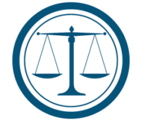

============================
Características principales
============================

Contabilidad de doble entrada
=======================================
El sistema de **doble entrada** es el método o sistema de registro de las operaciones contables más usado en
la contabilidad. La anotación que involucra las dos partidas (debe y haber) se denomina asiento contable.

Este sistema se asemeja a una balanza en equilibrio, ya que, dentro de un asiento contable, la suma de
los conceptos del debe y del haber siempre tienen que ser iguales.

En Daeris, cada vez que se realiza una transacción contable como facturas a clientes y proveedores, gastos,
movimientos de inventario, ventas en el TPV, ect… se generan automáticamente los respectivos asientos contables.

Daeris utiliza el sistema de doble entrada permitiendo balancear los asientos del diario de forma automática
(Suma del debe = Suma del haber).

Gestión de devengos y base de efectivo
=======================================

El **devengo** es el principio por el cual todo ingreso o gasto nace en la etapa de compromiso, considerándose en este
momento ya como incremento o decremento patrimonial a efectos contables y económicos.
Es un derecho ganado que todavía no ha sido cobrado o una obligación contraída que todavía no ha sido pagada.

La **base de efectivo** se obtiene sobre los devengos cobrados o pagados.

Desde Daeris puedes realizar informes de los devengos y de la base de efectivo, permitiéndote estar informado de los
ingresos y gastos cuando se registran las transacciones (base de devengo) y cuando se realizan los cobros o pagos
(base de efectivo).

Multiempresa
================

Daeris te permite **administrar varias empresas**, incorporando cada una de ellas su propio plan contable. Puedes obtener
informes financieros de cada una de las empresas, siguiendo las reglas de consolidación propias.

Un usuario puede acceder a varias empresas, si así se ha configurado, pero no es posible trabajar en varias empresas en el mismo momento.

Multidivisa
=================

En Daeris, cada transacción se realiza con la **divisa (moneda) predeterminada de la empresa**. Cuando se realizan
transacciones en otra divisa, se realizan los cambios necesarios entre la moneda recibida y la moneda predeterminada.
Estos cambios pueden generar ganancias y perdidas de divisa después de realizar la conciliación de los apuntes del
diario contable.

Cumplimiento de estándares internacionales
==============================================
La contabilidad de Daeris implementa **estándares de contabilidad comunes en múltiples países**.

Al instalar Daeris por primera vez y seleccionar tu país, se instalan módulos específicos para las características
contables de tu país, como el plan de cuentas, los impuestos o las interfaces bancarias.

.. image:: caracteristicas/international.png
   :align: center
   :alt: Multidivisa

Cuentas pendientes de cobro y cuentas pendientes de pago
==========================================================

De forma predeterminada, Daeris utiliza una sola cuenta para todos los asientos de las cuentas por cobrar y una sola
cuenta para todos los asientos de las cuentas por pagar.

Es posible crear cuentas separadas por clientes y por proveedores, pero no requerido.

Las transacciones se asocian a clientes y proveedores pudiendo realizar informes de análisis por cliente y/o proveedor
como, por ejemplo:

   - Ingresos por clientes
   - Cuentas pendientes de pago
   - Cuentas pendientes de cobro
   - …

Informes financieros
=========================

Daeris permite crear informes financieros en tiempo real. Se incluyen informes de contabilidad básica hasta
informes de gestión avanzada como, por ejemplo:

   - Informes de rendimiento (pérdidas o ganancias, varianza de presupuesto)
   - Informes de posición (balance general, cuentas por pagar y cuentas pasadas por cobrar)
   - Informes de efectivo (resumen bancario)
   - Informes de detalle (balance de comprobación y el libro mayor)
   - Informes de gestión (presupuestos y resumen ejecutivo)

Importar los extractos bancarios
======================================================
La conciliación bancaria es un proceso que empareja las líneas de los extractos proporcionados por el banco con tus
operaciones contables en el libro mayor.

Daeris facilita la conciliación bancaria al permitirte importar manualmente las líneas de los extractos de tu banco.

También es posible sincronizar los datos de tu banco, mediante Ponto (proveedor externo que requiere costes adicionales).
Esto significa que puedes tener una vista diaria de tu flujo de efectivo sin tener que acceder a tu banca en línea ni tener que realizar importaciones manuales.

Daeris acelera la conciliación bancaria al emparejar la mayoría de tus líneas de los extractos bancarios importados
con tus transacciones contables. Daeris también recuerda cómo se han tratado otras líneas de extractos y proporciona
sugerencia de transacciones del libro mayor.

Valoración de inventario
===========================

Daeris permite realizar **valoraciones de inventario** periódicas (manuales) como perpetuas (automatizadas). Los
métodos disponibles son:

   - precio estándar
   - precio medio
   - FIFO

.. seealso::
   * :doc:`../../../inventario_y_fabricacion/inventario/gestion/valoracion`