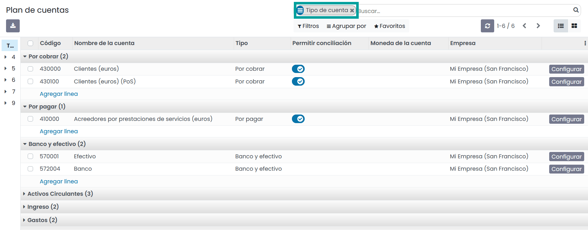
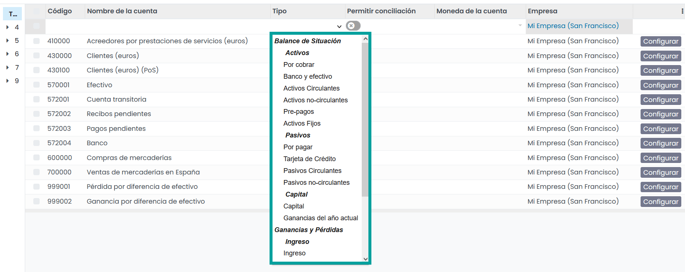
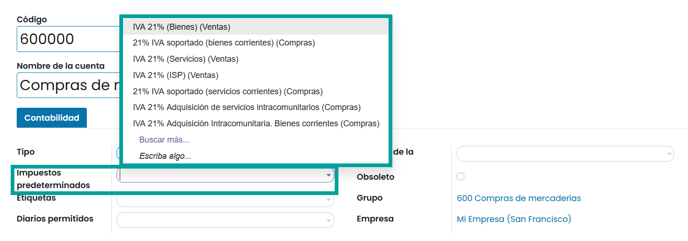
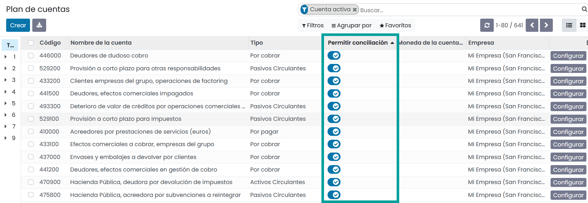

=================
Plan de cuentas
=================

El **Plan de Cuentas** es la lista de todas las cuentas utilizadas para registrar las transacciones financieras en el
libro mayor de una organización.

Las cuentas generalmente se enumeran en el orden de aparición de los informes financieros. La mayoría de las veces,
se enumeran de la siguiente manera:

   - Cuentas de balance

      - Activos
      - Pasivos
      - Patrimonio

   - Ganancias y pérdidas

      - Ingresos
      - Gastos

Al acceder a tu Plan de cuentas, puedes filtrar las cuentas por número, en la columna de la izquierda, y también
agruparlas por **Tipo de cuenta**.

Configuración de una cuenta
=============================

Daeris dispone de un **plan fiscal** estándar ya configurado de acuerdo con la regulación de tu país.
Puedes usarlo directamente o configurarlo de acuerdo con las necesidades de su empresa.

.. warning::
   No es posible modificar la **Localización Fiscal** de una empresa una vez que se ha publicado una Entrada de Diario.

Para crear una nueva cuenta, navega a :menuselection:`Contabilidad / Facturación --> Configuración --> Plan de cuentas`
, haz clic sobre el botón **Crear** y completa el formulario.

Código y nombre
----------------------

Cada cuenta se identifica por su **código** y **nombre**, que también indica el propósito de la cuenta.

Tipo
------

Configurar correctamente el **tipo de cuenta** es fundamental, ya que sirve para múltiples propósitos:

   - Información sobre el propósito y el comportamiento de la cuenta
   - Generar informes legales y financieros específicos de cada país
   - Establecer las reglas para cerrar un año fiscal
   - Generar entradas de apertura

Para configurar un tipo de cuenta, abre el selector desplegable del campo Tipo y selecciona el tipo correcto entre
la siguiente lista:

.. list-table:: Tipos de cuenta
   :widths: 30 30 40
   :header-rows: 1

   * - Informe
     - Categoría
     - Tipo de cuenta
   * - Balance
     - Activo
     - Por cobrar
   * -
     -
     - Banco y efectivo
   * -
     -
     - Activos circulantes
   * -
     -
     - Activos no-circulantes
   * -
     -
     - Prepagos
   * -
     -
     - Activos fijos
   * -
     - Pasivo
     - Por pagar
   * -
     -
     - Tarjeta de crédito
   * -
     -
     - Pasivos circulantes
   * -
     -
     - Pasivos no-circulantes
   * -
     - Capital
     - Capital
   * -
     -
     - Ganancias del año en curso
   * - Ganancias y pérdidas
     - Ingresos
     - Ingresos
   * -
     -
     - Otros ingresos
   * -
     - Gastos
     - Gastos
   * -
     -
     - Depreciación
   * -
     -
     - Coste de los ingresos
   * - Otro
     - Otro
     - Hoja fuera de balance

Impuestos predeterminados
------------------------------

Selecciona un impuesto predeterminado que se aplicará cuando elijas esta cuenta para la venta o compra de un producto.

Etiquetas
------------

Algunos informes contables necesitan establecer etiquetas en las cuentas más importante. De forma predeterminada,
puedes elegir entre las etiquetas que utilizan la aplicación **Cuentas**.

Grupos de diarios
------------------

Los **grupos de diarios** son útiles para agrupar varios diarios como subdiarios de un diario más grande y, por lo tanto,
consolidar informes agrupados.

Para crear un nuevo grupo, navega a :menuselection:`Contabilidad / Facturación --> Configuración --> Grupos de diarios`
, haz clic sobre el botón **Crear** e informa el nombre y los diarios **Excluidos del grupo**.

Permitir la conciliación
-------------------------------

Algunas cuentas, como las cuentas destinadas a registrar las transacciones de un método de pago, se pueden utilizar para
la conciliación de las entradas del diario.

Por ejemplo, una factura pagada con una tarjeta de crédito se puede *marcar como pagada* si se concilia con el pago.
Por lo tanto, la cuenta utilizada para registrar los pagos con tarjeta de crédito debe configurarse para
**permitir la conciliación**.

Para ello, sobre el listado de cuentas , informa el campo **Permitir conciliación**.

Cuentas Obsoletas
------------------

Una vez se ha registrado una transacción sobre una cuenta, ya no es posible eliminar la cuenta,
pero puedes hacerla inutilizable informando el campo **Obsoleto**.