.. _finanzas/contabilidad/primeros_pasos/configuracion/inicial/asistente:

==========================================================
Asistente de contabilidad y facturación
==========================================================

Al acceder por primera vez a la aplicación de Contabilidad / Facturación, la página principal muestra un asistente
de configuración el cual te ayuda a configurar las características principales.

Este asistente se muestra hasta que decides cerrarlo con el botón **X** (salir).

Esta configuración es posible realizarla después de cerrar el asistente. Para ello, navega a :menuselection:`Facturación / Contabilidad --> Configuración --> Ajustes`.

La aplicación de Contabilidad / Facturación dispone de un conjunto de características de localización fiscal adecuado para tu empresa, que se incorpora al seleccionar el país donde vas a trabajar, cuando contratas Daeris. De este modo, las cuentas, informes e impuestos están listos para funcionar.

Asistente de configuración contable
====================================

El asistente de configuración de la aplicación de contabilidad dispone de cuatro pasos:

   - Períodos contables
   - Plan de cuentas
   - Impuestos
   - Cuentas bancarias

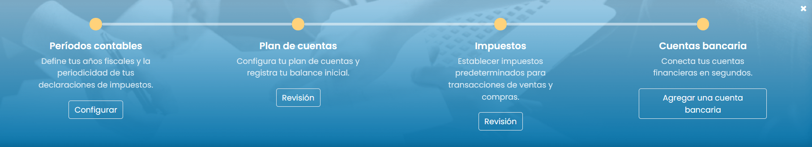

Períodos contables
----------------------

Define mediante el asistente de periodos contables, las fechas de apertura y cierre de tus **años  fiscales**,
que se utilizan para generar informes automáticamente, y  la periodicidad de tu declaración de impuestos.

De forma predeterminada, la fecha  de  apertura se establece  el 1 de enero y la fecha  de  cierre el 31 de diciembre,
ya que este es el uso  más común.

.. image:: inicial/asistente02.png
   :align: center
   :alt: Períodos contables

Plan de cuentas
-----------------

Desde esta pantalla, es posible añadir cuentas a tu **Plan de cuentas** e indicar los saldos iniciales de apertura.

También es posible acceder a esta pantalla desde el menú :menuselection:`Facturación / Contabilidad --> Configuración --> Plan de cuentas`.

La configuración básica se muestra sobre esta página para ayudarte a revisar tu Plan de cuentas.

Para acceder a la configuración completa de una cuenta, haz clic sobre el botón **Configurar** disponible al final
de cada la línea.

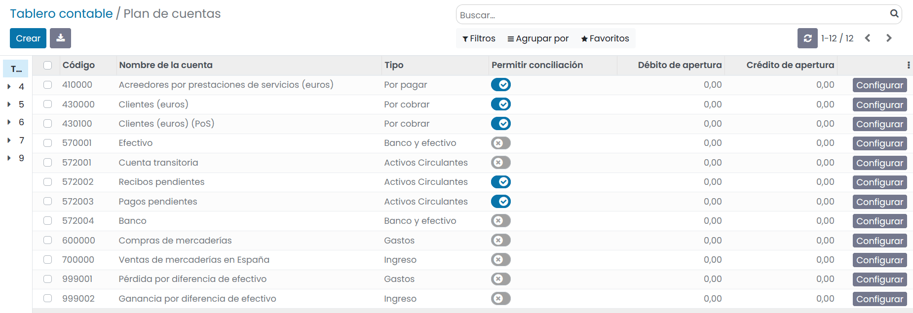

Impuestos
---------------

Desde esta pantalla puedes  habilitar o deshabilitar el uso de los impuestos.

También es posible acceder a esta pantalla desde el menú :menuselection:`Facturación / Contabilidad --> Configuración --> Impuestos`.

Existen varios tipos de impuestos y en función de la localización de tu empresa es requerido el uso de unos u otros.
Daeris permite diferentes formas de usar y calcular los impuestos para adecuarse a las necesidades de cada empresa.

Inicialmente, dispones de varios impuestos preconfigurados, pero es posible que no todos esten activos de forma predeterminada.
En función de tu modelo de negocio, debes activar los impuestos que vayas a utilizar.

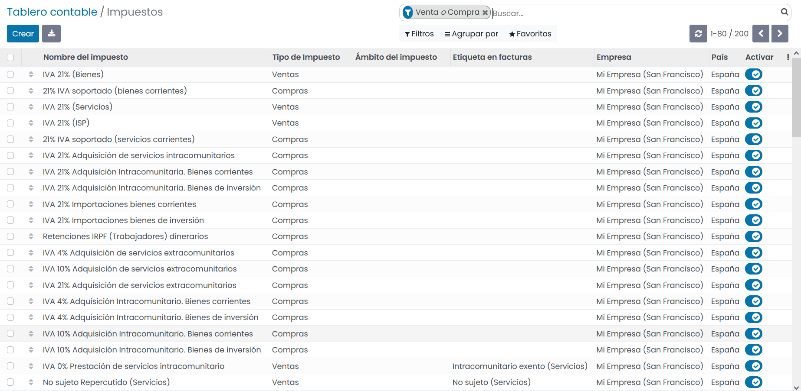

Cuentas bancarias
-------------------

Crea tu cuenta bancaria completando el asistente. Posteriormente, sobre el tablero, puedes encontrar la tarjeta asociada
a tu cuenta y configurarla, haciendo clic sobre el menú **configuración**.

Es posible crear tantas cuentas bancarias como necesites. Para ello, haz clic sobre :menuselection:`Facturación / Contabilidad --> Configuración --> Agregar una cuenta bancaria`.

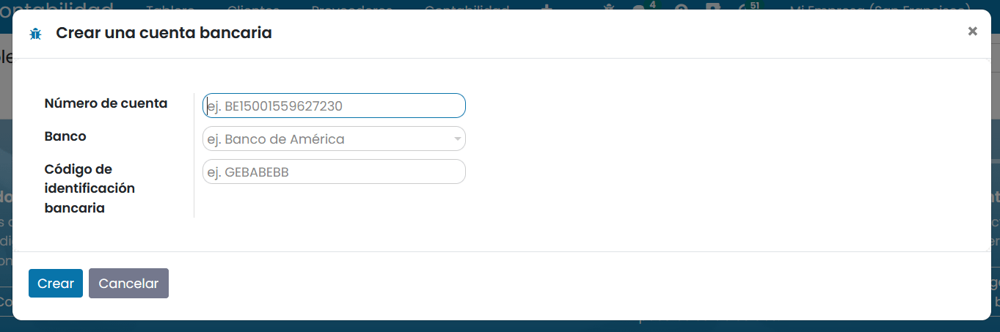

.. _finanzas/contabilidad/primeros_pasos/configuracion/inicial/asistente_facturas:

Asistente de configuración de facturas
==========================================

Daeris dispone de un asistente sobre :menuselection:`Facturación / Contabilidad --> Clientes --> Facturas`
el cual te ayuda a configurar las características principales de las facturas.

Este asistente se muestra hasta que decides cerrarlo con el botón X (salir).

El asistente de configuración de facturas dispone de tres pasos:

   - Información de la compañía
   - Diseño de factura
   - Crear factura

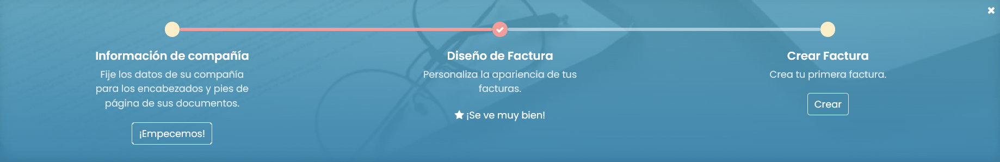

Información de la compañía
----------------------------

Mediante el formulario, es posible añadir los detalles de tu empresa como:

   - Nombre
   - Logo
   - Dirección
   - Teléfono
   - Móvil
   - Correo electrónico
   - Sitio web
   - Compañía matriz
   - IVA
   - Registro
   - Nº de seguridad social
   - Código CNAE
   - Descripción CNAE
   - Moneda

Esta información se muestra en tus documentos y facturas.

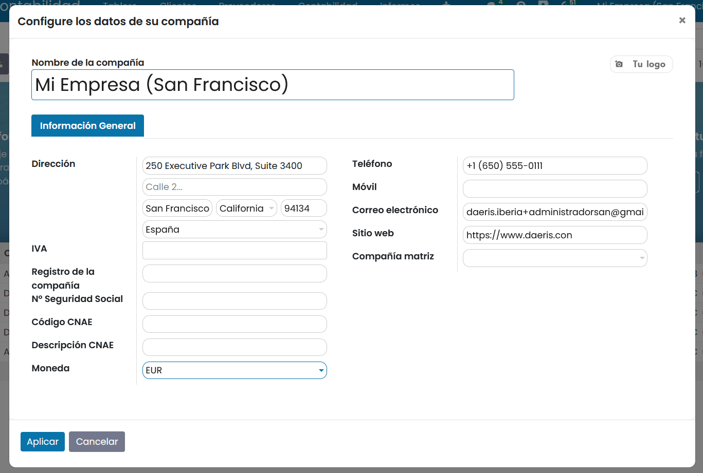

Diseño de la factura
----------------------

Mediante el asistente de diseño de tus facturas puedes configurar su apariencia.

Ten presente que Daeris añade de forma automática, el número de teléfono, correo electrónico, en enlace a tu sitio web
y el número de identificación fiscal (o número de IVA / NIF) de tu empresa sobre el pie de página, de acuerdo con los
valores que hayas introducido configurando los datos de tu empresa (punto anterior).

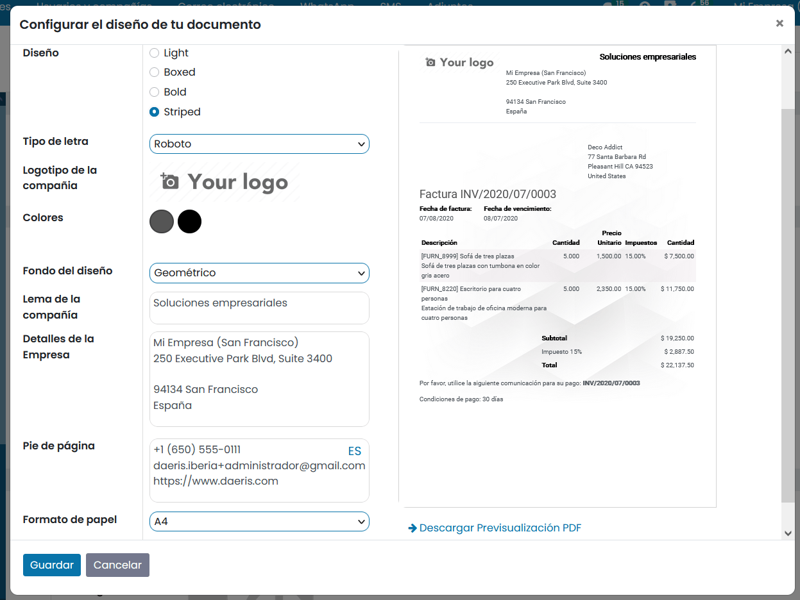

Dispones de las siguientes opciones:

- **Diseño**: Puedes seleccionar uno de los siguientes diseños:

**Light**

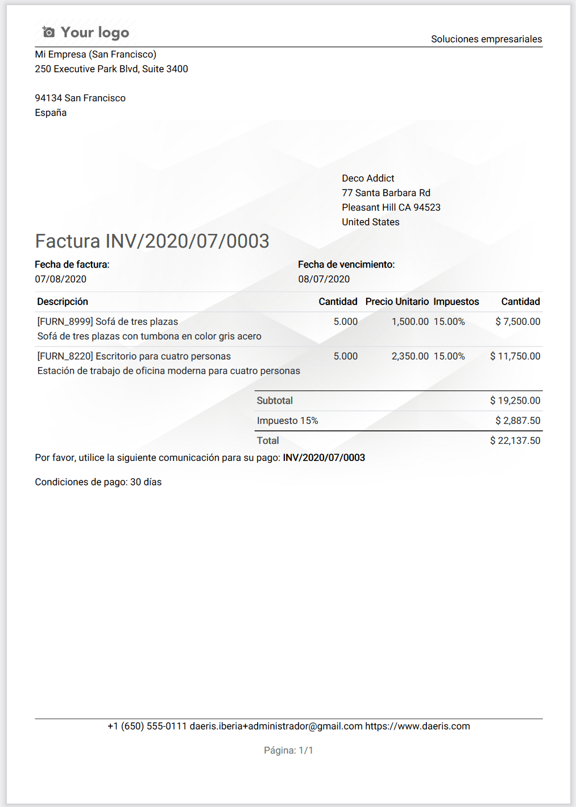

**Boxed**

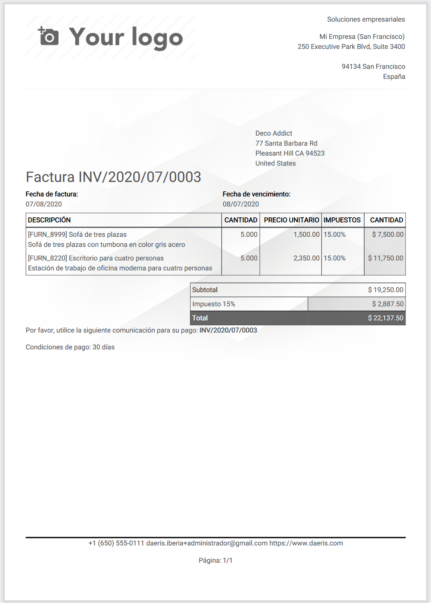

**Bold**

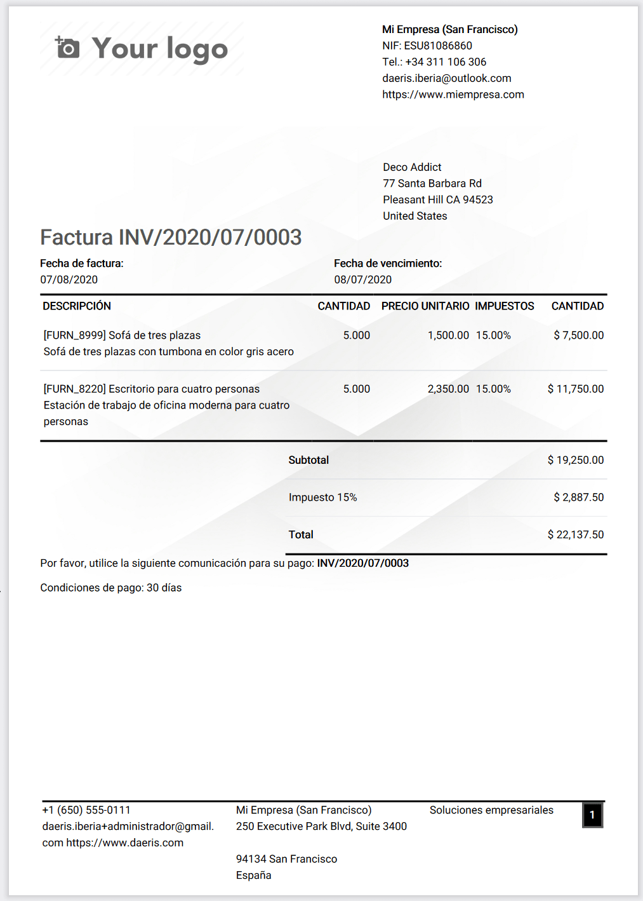

**Striped**

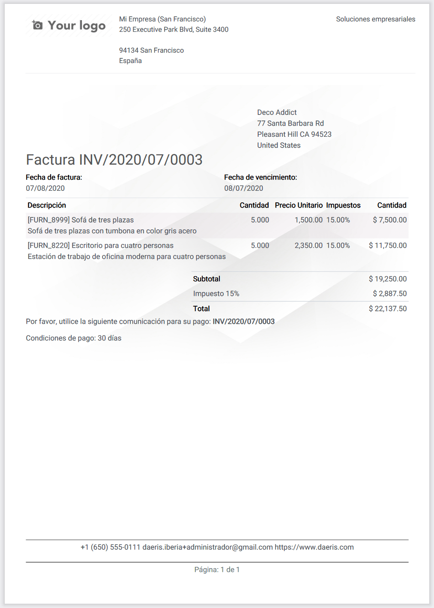

- **Tipo de letra**: Dispones de las siguientes fuentes:

   - Lato
   - Roboto
   - Open Sans
   - Montserrat
   - Oswald
   - Raleway

- **Logotipo de la compañía**: Debes incorporar la imagen del logotipo de tu compañía en formato jpg o png.
- **Colores** : mediante los dos selectores de colores, puedes actualizar el color de la letra de varios apartados de la factura.
- **Fondo del diseño**: Permite incorporar un fondo sobre la factura. Dispones de las siguientes opciones:

   - En blanco: No se incorpora fondo.
   - Geométrico: Incorpora un fondo predeterminado cos estructuras geométricas.
   - Personalizado: Te permite subir una imagen con tu propio fondo. Se recomienda una imagen en formato png con un alto nivel de transparencia para que los datos de la factura puedan visualizarse con claridad.

- **Lema de la compañía**: Aparece por defecto en la esquina superior derecha de los documentos impresos.
- **Detalles de la empresa**: El texto del encabezado se muestra en la parte superior de todas las facturas.
- **Pie de página**: El texto mostrado en el pie de página de todas las facturas.
- **Formato de papel**: Permite realizar la factura en formato A-4, carta de EE. UU. y depósito por lotes de EE. UU.

Mediante el enlace **Descargar previsualización PDF** es posible descargar un ejemplo de factura en formato **PDF** con
los cambios que hayas realizado.

.. tip::
   Añade el **número de cuenta bancaria** y un enlace hacia los **términos y condiciones generales** en el pie de página. De este modo, tus contactos pueden encontrar el contenido completo de tus datos en línea sin tener que imprimirlos en las facturas que emites.

Esta configuración es posible realizarla después de cerrar el asistente. Para ello, navega a :menuselection:`Ajustes --> Opciones generales --> Diseño del documento`.

Crear factura
----------------

Crea un borrador de factura, guárdala y realiza una **vista previa** para asegurarte de que todo esté configurado
correctamente. Al realizar la vista previa, puedes **descargar** e **imprimir** la factura.

Si vas a realizar una factura de prueba, **NO la confirmes**, ya que una factura confirmada genera un código
de factura REAL y **NO se puede eliminar**.

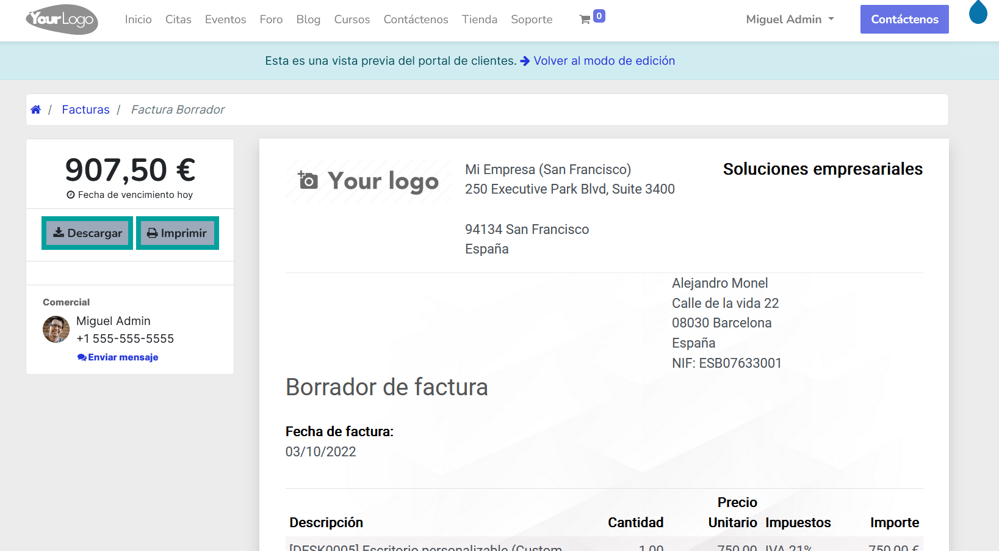