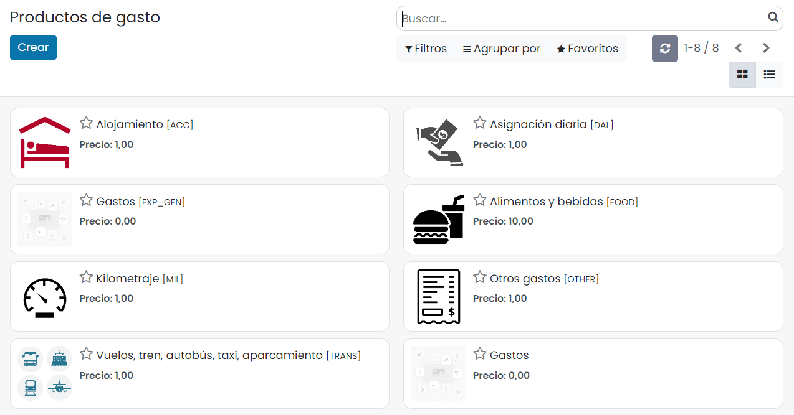
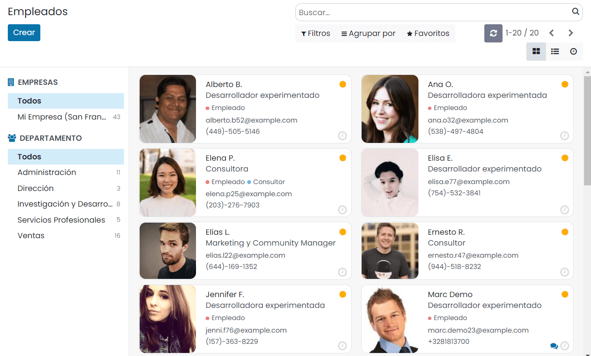
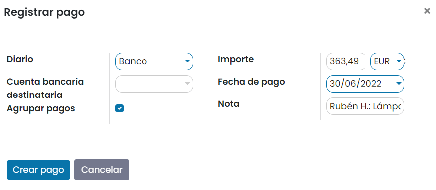
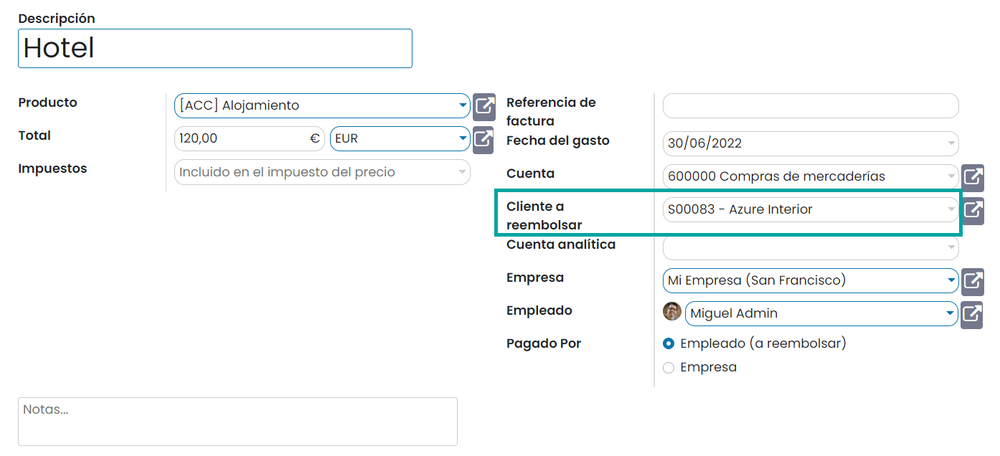

:show-content:

======
Gastos
======

La gran mayoría de las empresas generan una serie de gastos relacionados con sus actividades. Gastos como el uso de taxis,
reserva de hoteles, dietas, billetes (aviones, trenes), desplazamientos (Kilómetros), aparcamientos y un largo etcétera,
son frecuentes en el día a día de las empresas.

Todos los gastos relacionados con las actividades de la empresa tienen que ser gestionados por cada uno de los empleados
implicados, siendo esta, una de sus responsabilidades. Gestionar con exactitud todos los gastos te permite conocer la
rentabilidad de tu negocio.

El pago de los gastos relacionados con algunas de las actividades puede ser abonado inicialmente por el empleado, en cuyo
caso, la empresa deberá devolver los importes. También puede ser abonado directamente por la empresa si el empleado dispone
de un método de pago asociado a una cuenta de la empresa. Ya sea por una via o por otra, se debe gestionar cada uno de los
pagos para llevar su registro y control.

Además, es posible que algunos de los gastos deban ser facturados a cliente o puedan ser deducidos en futuras declaraciones,
mayor motivo por el cual realizar las tareas administrativas correctamente.

La gestión de los gastos producidos por los empleados de la empresa se realiza siguiendo los pasos del circuito mostrado a
continuación:

#. El empleado registra uno o varios gastos durante un plazo de tiempo. Por ejemplo, puede ir registrando los gastos
   durante el mes actual, acumulando importes que le serán abonados (si los está financiando él) cuando realice el paso 5.

#. El empleado agrupa todos los gastos en un informe, asociándole un responsable y enviándolo a validar para que el
   responsable certifique que los datos emitidos son válidos.

#. El responsable aprueba, devuelve al empleado o rechaza el informe. En caso de aprobarlo, el flujo continúa en el
   siguiente punto.

#. Si el informe dispone de pedidos de venta o cuentas analíticas informadas podrá publicar las entradas en el diario.
   En el caso de publicar entradas en el pedido de venta, podrá facturar al cliente creando nuevas facturas desde el
   propio pedido de venta.

#. Si el empleado ha pagado la factura inicialmente de su bolsillo, se podrá proceder a registrar el reembolso al empleado.

.. youtube:: lUpbMD4y2yA
    :align: right
    :width: 700
    :height: 394

Cómo configurar los tipos de gasto
==================================

El primer paso para realizar un seguimiento de los gastos es configurar los tipos de gastos (gestionados como productos
en Daeris) que tu empresa permite, desde la pantalla :menuselection:`Gastos --> Configuración --> Productos de gasto`.
Cuando se reembolsa un gasto específico a un precio fijo, deberás establecer un coste para el producto. De lo contrario,
mantén el coste en 0 y los empleados informarán el costo real por gasto.

Aquí hay algunos ejemplos de productos de gasto:

-  Restaurante

   -  Coste: 0 (el coste del ticket se registrará en cada gasto)

-  Viajar con coche personal

   -  Coste: 0,30 (el precio por kilometro reembolsado por la empresa es fijo)

-  Hotel

   -  Coste: 0 (el coste del hotel se registrará en cada gasto)

-  Otros

   -  Coste: 0

Es posible editar los productos existentes, así como crear nuevos si se considera oportuno. Sobre un producto de gasto
dispones de los siguientes campos:

-  **Nombre del producto**: Nombre descriptivo del producto de gasto.

-  **Imagen**: Imagen asociada al producto de gasto.

-  **Coste**: Precio de coste del producto. Se deja a 0 si no se dispone de un coste estándar establecido.

-  **Unidad de medida**: Unidad de medida relacionada con el producto de gasto.

-  **Referencia interna**: Código interno del producto de gasto. Este texto se usará como identificador a la hora de
   pedir a los empleados que identifiquen el gasto en la operativa de introducir gastos por correo electrónico.

-  **Compañía**: Compañía asociada al producto de gasto.

-  **Cuenta de gasto**: En función del gasto deberá ir a una cuenta de gastos determinada por las normas de contabilidad.

-  **Impuestos de proveedor**: Este campo indica los impuestos que repercuten sobre el producto considerado como gasto.

   .. important::
      Se debe tener en cuenta que, si informas este campo, los empleados deberán informar el coste del gasto sin aplicar
      los impuestos que serán calculados a partir del impuesto aquí indicado. De este modo si un empleado se ha gastado
      12,10 euros en un billete de tren y ha pagado 10 euros de base + 2,1 euros de IVA, deberá indicar que el importe
      ha sido de 10 euros. El sistema aplicará el IVA correspondiente, quedando un total de 12,1 euros.

-  **Impuestos de cliente**: Este campo indica los impuestos que repercuten sobre el producto considerado como gasto
   cuando lo re-facturas a un cliente.

   .. important::
      Se debe tener en cuenta que, si informas este campo, los empleados deberán informar el coste del gasto sin aplicar
      los impuestos, ya que cuando factures a cliente los impuestos, serán calculados a partir del impuesto aquí indicado.
      De este modo si un empleado se ha gastado 12,10 euros en un billete de tren y ha pagado 10 euros de base + 2,1
      euros de IVA, deberá indicar que el importe ha sido de 10 euros. De este modo al re-facturar al cliente el sistema
      aplicará el IVA correspondiente, quedándole un total de 12,1 euros.

-  **Política de facturación**: Cuando asocias un gasto a un pedido de venta se genera una nueva línea que dispone de la
   cantidad entregada (real) y la pedida (demandada) que inicialmente es 0.

   -  **Cantidades entregadas**: Si la política de facturación es igual a cantidades entregadas, deberás editar la línea
      del pedido de venta para incorporar la cantidad entregada al cliente, ya que cuando generes la factura mediante el
      botón facturar, se basará en la cantidad entregada. En caso de no hacerlo, no se introducirán las líneas sobre la factura.

   -  **Cantidades pedidas**: Si la política de facturación es igual a cantidades pedidas, no deberás editar la línea del
      pedido de venta para incorporar la cantidad entregada, ya que cuando generes la factura mediante el botón facturar,
      se basará en la cantidad pedida.

-  **Gastos de Re-factura**

   -  **No**: No facturar el gasto a un cliente.

   -  **A costo**: Se factura el precio de coste del producto.

   -  **Precio de venta**: Se factura el precio marcado como precio de venta en el producto. Esta opción se configura
      bajo la pestaña ventas de los productos.

Una vez informados los campos necesarios, pulsa el botón *Guardar* del formulario del producto de gasto.

Cómo registrar gastos
=====================

Manualmente
-----------

Los empleados pueden registrar sus gastos desde la pantalla :menuselection:`Gastos --> Mis gastos --> Mis gastos a reportar`:

Al crear un nuevo gasto, se deben seguir los siguientes pasos:

#. Selecciona el producto relacionado e ingresa el monto total que se pagó o la cantidad de horas o días si la cantidad
   es contable (por ejemplo, número de noches de hotel).

#. Introduce la fecha del gasto.

#. Selecciona si pagaste la factura por tu cuenta (y esperas que se te reembolse) o si la empresa pagó directamente (por
   ejemplo, si utilizaste la tarjeta de crédito de la empresa).

#. Establece la referencia de la factura, agrega algunas notas si se solicita y adjunta una foto / escaneo del recibo
   mediante el botón *Adjuntar recibo*. Eso ayudará al gerente y al contador a validarlo.

Una vez completados los campos necesarios, pulsa el botón *Guardar*.

Por correo electrónico
----------------------

.. seealso::
   * :doc:`../varios/correo_electronico/recibir_correos`

Para permitir a los empleados que puedan enviar sus gastos mediante correo electrónico se deberá configurar inicialmente
el alias que se usará para recibirlos. Este alias se configura bajo la pantalla de :menuselection:`Gastos --> Configuración --> Ajustes`:

Cada empleado podrá enviar sus gastos usando única y exclusivamente su cuenta de correo electrónico asociada a su usuario
de Daeris. Se pueden consultar las cuentas de correo asociadas a los empleados desde la pantalla :menuselection:`Empleados --> Empleados`:

.. warning::
   En el caso de que un empleado envíe un correo desde una cuenta no autorizada, no se realizará ninguna acción, salvo
   devolver el correo al remitente, indicándole el problema.

Para poder registrar un gasto a través de correo electrónico, debes enviar un correo al alias de correo configurado para
gestionar los gastos.

Como **asunto** se debe informar la siguiente estructura:

`CODIGO DEL GASTO` + `TEXTO DESCRIPTIVO DEL GASTO` + `IMPORTE NUMERICO DEL GASTO`

.. note::
   * Se debe usar un punto como separador de decimales en los gastos enviados por correo.
   * El importe numérico del gasto deberá incluir los impuestos o no en función de como se haya configurado el producto de gasto.

Por ejemplo:

-  TRANS Billete de Avión a Valencia para visitar a cliente 128.65

-  FOOD Comida con cliente 75.6

-  OTHER Ratón inalámbrico 85

Como **cuerpo** del correo se puede incorporar una descripción más completa si se desea. Además, es muy recomendable anexar
al correo una imagen o fichero del recibo correspondiente.

.. note::
   En caso de tener que pasar una inspección de hacienda es posible que el inspector solicite comprobantes o detalles de
   los gastos. Por lo tanto, la recomendación es que sobre cada gasto introducido se incorpore como mínimo en el cuerpo
   del correo, el motivo del gasto y/o el cliente relacionado, así como el recibo correspondiente.

Al enviar el correo con el asunto definido se creará un nuevo gasto, se asociará al producto indicado en el asunto, se
añadirá sobre la descripción el texto y se incorporará como precio unitario el importe numérico indicado en el asunto.
Los empleados podrán consultar sus gastos desde la pantalla :menuselection:`Gastos --> Mis gastos --> Mis gastos a reportar`:

Cómo enviar gastos a los responsables
=====================================

Los informes de gastos agrupan una serie de gastos de un único empleado y se envían a un responsable para que los valide.

Es posible crear un informe de gastos desde:

-  El formulario de detalle de un gasto en estado *Por enviar*. Esta acción creará un nuevo informe y asociará el gasto
   al mismo.

-  El botón *Crear* del listado de informes disponible en la pantalla :menuselection:`Gastos --> Mis gastos --> Mis informes`.

-  Seleccionando varios gastos desde el listado de la pantalla :menuselection:`Gastos --> Mis gastos --> Mis gastos a reportar`
   y pulsando el botón *Crear informe*.

Al crear un informe de gastos es necesario completar los siguientes campos:

-  **Resumen del informe de gastos**: Nombre descriptivo de la agrupación de gastos.

-  **Empleado**: Empleado que reporta los gastos.

-  **Diario de gastos**: Diario de gastos asociado. Por defecto, *Facturas de proveedores*.

-  **Empresa**: Empresa asociada al informe de gastos.

-  **Gerente**: Empleado que debe aprobar el gasto.

-  **Gasto**: Listado para asociar los gastos del empleado. Solo se pueden seleccionar gastos pagados por la compañía o
   gastos pagados por el empleado. Un informe de gastos no puede disponer de ambos tipos.

Una vez completado el formulario, puedes enviarlo al responsable para que lo valide mediante el botón *Enviar al gerente*:

Todos los informes de gastos enviados se pueden encontrar en :menuselection:`Gastos --> Mis gastos --> Mis informes`:

.. image:: gastos/mis-informes-gastos.png
   :align: center
   :alt: Mis informes de gastos

Cómo aprobar gastos
===================

Los gerentes de recursos humanos y de equipo obtienen una descripción general de todos los informes de gastos para
validar desde la pantalla :menuselection:`Gastos --> Informes de gastos --> Informes por aprobar`:

Los gerentes pueden revisar informes de gastos, aprobarlos o rechazarlos, así como dar retroalimentación gracias a la
herramienta de comunicación integrada:

Si el responsable rechaza el informe de gastos mediante el botón *Rechazar*, se rechazarán todos los gastos asociados
al informe, con lo que esta opción solo debería realizarla si realmente no quiere que ninguno de los gastos incluidos
sea abonado.

Si el responsable necesita que el empleado modifique algún gasto deberá pulsar el botón *Restablecer a borrador* e
indicar mediante el apartado de conversaciones, los motivos de la devolución:

Si el responsable quiere aprobar el gasto, deberá pulsar el botón *Aprobar*:

Cómo contabilizar gastos en contabilidad
========================================

Una vez que los gerentes aprueban los informes de gastos, el departamento de contabilidad navega a la pantalla
:menuselection:`Gastos --> Informes de gastos --> Informes por contabilizar` para consultar cuentas, productos e impuestos.
Pueden hacer clic en *Validar asientos de diario* para publicar entradas de diario relacionadas en sus libros:

.. note::
   Para poder contabilizar un gasto, el empleado debe tener registrada una dirección privada.

Cómo reembolsar a los empleados
===============================

Puedes ver todos los informes de gastos para reembolsar en la pantalla :menuselection:`Gastos --> Informes de gastos --> Informes por pagar`.
Para registrar el pago, haz clic en *Registrar pago*:

Al pulsar el botón *Registrar pago*, se mostrará un desplegable con la cantidad a pagar, y se podrá seleccionar el
método de pago:

Una vez completados los campos necesarios, se deberá pulsar el botón *Crear pago*. A partir de ese momento, el informe
de gastos quedará en estado pagado o en proceso de pago:

.. _finanzas/gastos/facturar_gastos:

Cómo volver a facturar gastos a tus clientes
============================================

Si realizas un seguimiento de los gastos de los proyectos de los clientes, puedes cargarlos automáticamente a tus clientes.

Configurar
----------

Navega a la pantalla :menuselection:`Gastos --> Configuración --> Productos de gasto` y configura el método de facturación
en todos los tipos de gastos:

-  **Política de facturación**: Cuando asocias un gasto a un pedido de venta se genera una nueva línea que dispone de la
   cantidad entregada (real) y la pedida (demandada) que inicialmente es 0.

   -  **Cantidades entregadas**: Si la política de facturación es igual a cantidades entregadas, deberás editar la línea
      del pedido de venta para incorporar la cantidad entregada al cliente, ya que cuando generes la factura mediante el
      botón facturar, se basará en la cantidad entregada. En caso de no hacerlo, no se introducirán las líneas sobre la factura.

   -  **Cantidades pedidas**: Si la política de facturación es igual a cantidades pedidas, no deberás editar la línea del
      pedido de venta para incorporar la cantidad entregada, ya que cuando generes la factura mediante el botón facturar,
      se basará en la cantidad pedida.

-  **Gastos de Re-factura**

   -  **No**: No facturar el gasto a un cliente.

   -  **A costo**: Se factura el precio de coste del producto.

   -  **Precio de venta**: Se factura el precio marcado como precio de venta en el producto. Esta opción se configura
      bajo la pestaña ventas de los productos.

Crear un pedido
---------------

Como vendedor, crea y confirma un pedido de venta para los servicios prestados a tu cliente. Si no incluyes ningún gasto
en el pedido, se agregará automáticamente una vez que el contador lo publique.

Vincula el gasto al pedido de venta:

Presentar, validar y contabilizar gastos
----------------------------------------

Como gerente, asegúrate de que el pedido de venta esté configurado en cada línea de gastos al aprobar los informes de
gastos. Haz clic en la línea para agregar uno si falta:

Como contador, publica las entradas de diario.

Facturar gastos
---------------

Ahora puedes facturar el pedido. Aparece en la pantalla :menuselection:`Ventas --> A facturar --> Pedidos a facturar`.
Los gastos se han agregado automáticamente en las líneas de pedido. Dichos artículos se muestran en azul (es decir, para
facturar):

