===============
Bajas laborales
===============

Introducción
=============

Introducción a las bajas laborales
-----------------------------------

Cuando un empleado enferma, acude a un médico que le evalúa y le concede la incapacidad temporal mediante un parte
de baja. El empleado está obligado a enviar el parte de baja a la empresa en un máximo de tres días.
La empresa está obligada a enviar el parte a la mutua en un plazo de 5 días.

En función del tipo de contingencia, el empleado recibirá un importe y pagador final distinto. El pagador inicial
siempre será la empresa que actúa como pagador por delegado. Será la empresa, la que posteriormente compense
y reciba los importes de la Mutua de accidentes o INSS.

Existen dos tipos de contingencias:
    - **Contingencias comunes**: Enfermedad común o accidente no laboral.
    - **Contingencias profesionales**: Accidentes laborales o enfermedades derivadas del trabajo.

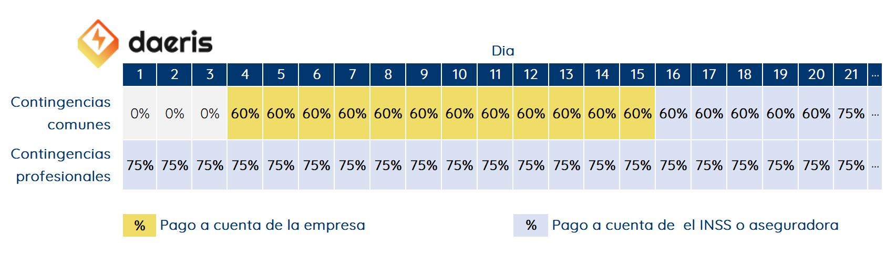

En el caso de que la baja sea por **contingencias comunes**:
    - (01-03) Del primer al tercer día no se abona la nómina al empleado.
    - (04-15) Del cuarto al día 15 la empresa le abona el 60% de la Base de contingencias comunes (BCCC) de la nómina del mes pasado.
    - (16-20) Del día 16 al día 20 el INSS o la mutua le abona el 60% de la Base de contingencias comunes (BCCC) de la nómina del mes pasado.
    - (21-…) Del día 21 en adelante el INSS o la mutua le abona el 75% de la Base de contingencias comunes (BCCC) de la nómina del mes pasado.

En el caso de que la baja sea por **contingencias profesionales** el pago será del 100% el día que se emite la baja
y correrá por parte de la **empresa**. Los días posteriores, será del 75% y correrá a cargo del **INSS** o la **mutua**.

.. note::
   Puedes encontrar más información `aquí <http://www.seg-social.es/wps/portal/wss/internet/InformacionUtil/44539/44667>`_. Cabe recordar que, a partir del convenio colectivo o acuerdos entre trabajador y empresa, esta puede compensar parte del sueldo a descontar de la nómina, por lo que hay que fijarse tanto en el convenio como en el contrato para certificar la regla que aplica en cada caso.

Configuración
==============

Configurar las reglas de gestión de bajas
-----------------------------------------------
Para configurar las reglas referentes a las bajas, existen dos **categorías** distintas, una para las bajas por
**contingencias comunes** y otra para las bajas por **contingencias profesionales**.

En función del tipo del tipo de baja, dispondrás de reglas para los tramos de contingencias comunes, y reglas
para los tramos de contingencias profesionales para poder cumplimentar el cuadro de baja correspondiente que
determinarán el importe y pagador.

Para las **contingencias comunes** dispones de las siguientes **reglas** en la pantalla :menuselection:`Nómina --> Configuración --> Reglas salariales`.

**Baja contingencias comunes – Tramo1 (1-3)**
    - **Porcentaje**: 0%
    - **Porcentaje basado en** : ``(inputs.importebaja.amount / contract.dias_contrato) * inputs.bajacomunt1.amount``
    - **Parámetros**:
        - **inputs.importebaja**: A incorporar manualmente sobre la nómina la BCCC de la nómina del mes anterior.
        - **contract.dias_contrato**: Número de días de trabajo disponible sobre el contrato.
        - **inputs.bajacomunt1**: A incorporar manualmente sobre la nómina el número de días de baja por contingencias comunes para el tramo 1, de todas las bajas cursadas en el mes al que hace referencia la nómina.

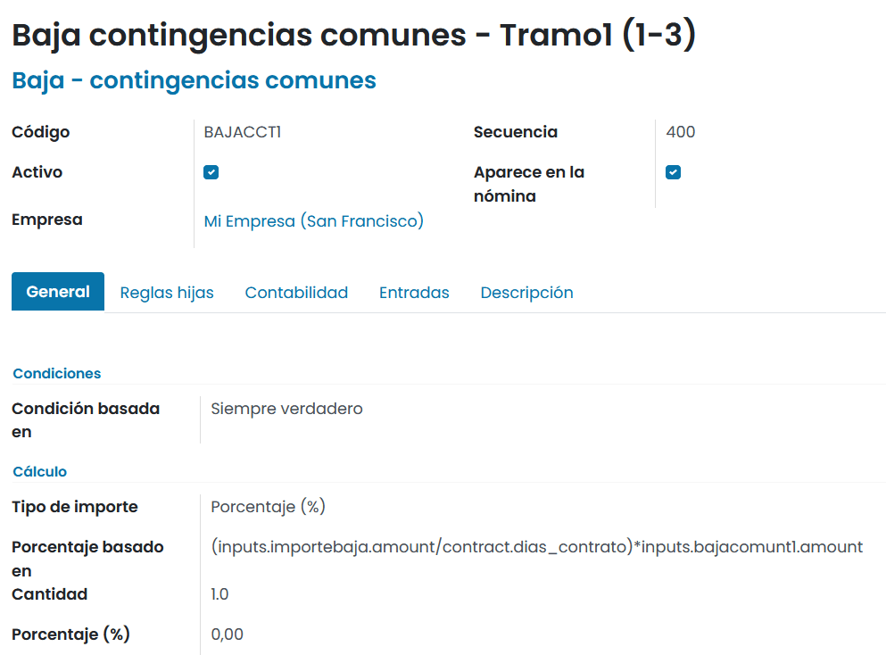

**Baja contingencias comunes – Tramo2 (4-15)**
    - **Porcentaje**: 60%
    - **Porcentaje basado en** : ``(inputs.importebaja.amount / contract.dias_contrato) * inputs.bajacomunt2.amount``
    - **Parámetros**:
        - **inputs.importebaja**: A incorporar manualmente sobre la nómina la BCCC de la nómina del mes anterior.
        - **contract.dias_contrato**: Número de días de trabajo disponible sobre el contrato.
        - **inputs.bajacomunt3**: A incorporar manualmente sobre la nómina el número de días de baja por contingencias comunes para el tramo 2, de todas las bajas cursadas en el mes al que hace referencia la nómina.

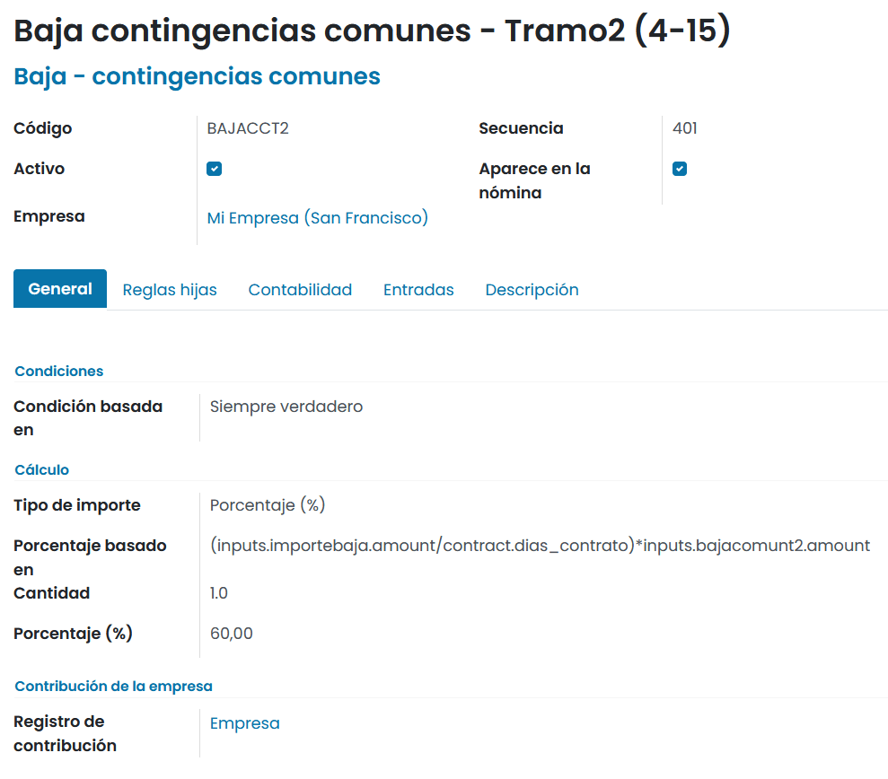

**Baja contingencias comunes – Tramo3 (16-20)**
    - **Porcentaje**: 60%
    - **Porcentaje basado en** : ``(inputs.importebaja.amount / contract.dias_contrato) * inputs.bajacomunt3.amount``
    - **Parámetros**:
        - **inputs.importebaja**: A incorporar manualmente sobre la nómina la BCCC de la nómina del mes anterior.
        - **contract.dias_contrato**: Número de días de trabajo disponible sobre el contrato.
        - **inputs.bajacomunt3**: A incorporar manualmente sobre la nómina el número de días de baja por contingencias comunes para el tramo 3, de todas las bajas cursadas en el mes al que hace referencia la nómina.

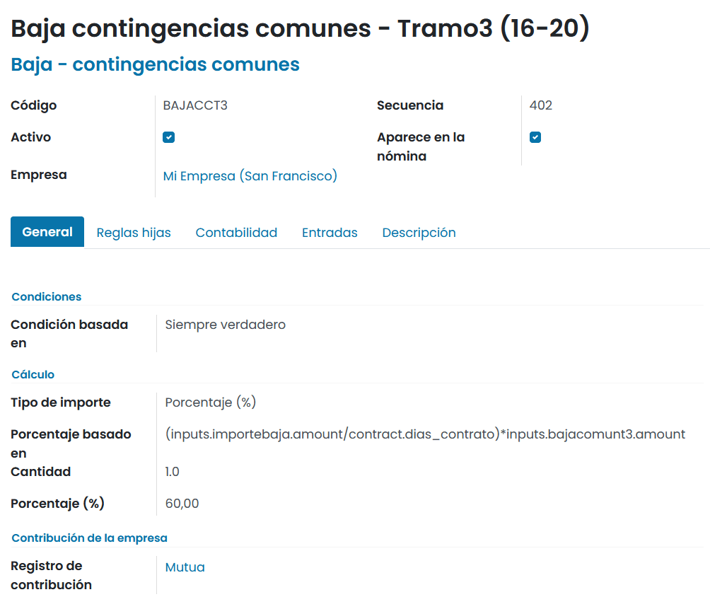

**Baja contingencias comunes – Tramo4 (21-…)**
    - **Porcentaje**: 75%
    - **Porcentaje basado en** : ``(inputs.importebaja.amount / contract.dias_contrato) * inputs.bajacomunt4.amount``
    - **Parámetros**:
        - **inputs.importebaja**: A incorporar manualmente sobre la nómina la BCCC de la nómina del mes anterior.
        - **contract.dias_contrato**: Número de días de trabajo disponible sobre el contrato.
        - **inputs.bajacomunt4**: A incorporar manualmente sobre la nómina el número de días de baja por contingencias comunes para el tramo 4, de todas las bajas cursadas en el mes al que hace referencia la nómina.

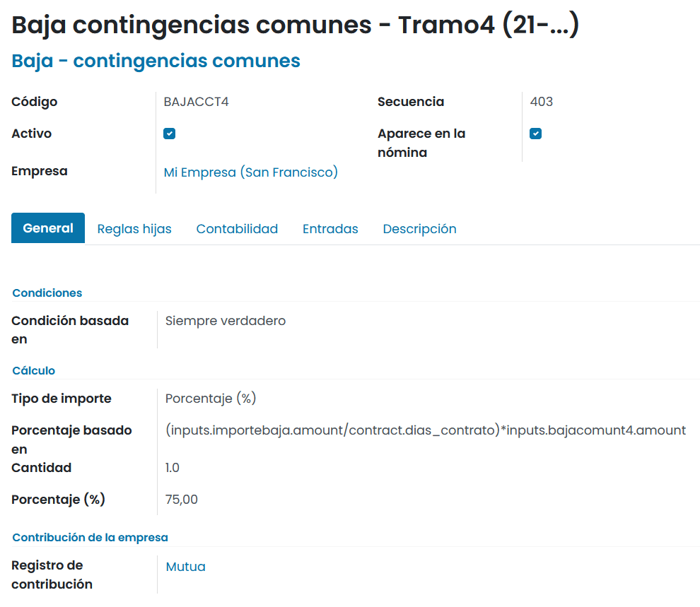

Para las **contingencias profesionales** dispones de las siguientes **reglas** en la pantalla :menuselection:`Nómina --> Configuración --> Reglas salariales`.

**Baja contingencias profesionales – Tramo1 (1-1)**
    - **Porcentaje**: 100%
    - **Porcentaje basado en** : ``(inputs.importebaja.amount / contract.dias_contrato) * inputs.bajaprofesionalt1.amount``
    - **Parámetros**:
        - **inputs.importebaja**: A incorporar manualmente sobre la nómina la BCCC de la nómina del mes anterior.
        - **contract.dias_contrato**: Número de días de trabajo disponible sobre el contrato.
        - **inputs.bajaprofesionalt1**: A incorporar manualmente sobre la nómina el número de días de baja por contingencias profesionales para el tramo 1, de todas las bajas cursadas en el mes al que hace referencia la nómina.

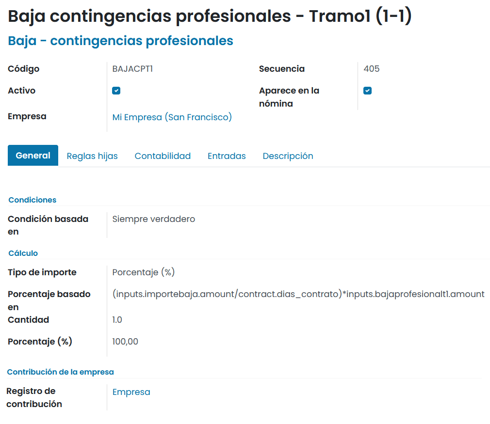

**Baja contingencias profesionales – Tramo2 (2-…)**
    - **Porcentaje**: 100%
    - **Porcentaje basado en** : ``(inputs.importebaja.amount / contract.dias_contrato) * inputs.bajaprofesionalt2.amount``
    - **Parámetros**:
        - **inputs.importebaja**: A incorporar manualmente sobre la nómina la BCCC de la nómina del mes anterior.
        - **contract.dias_contrato**: Número de días de trabajo disponible sobre el contrato.
        - **inputs.bajaprofesionalt2**: A incorporar manualmente sobre la nómina el número de días de baja por contingencias profesionales para el tramo 2, de todas las bajas cursadas en el mes al que hace referencia la nómina.

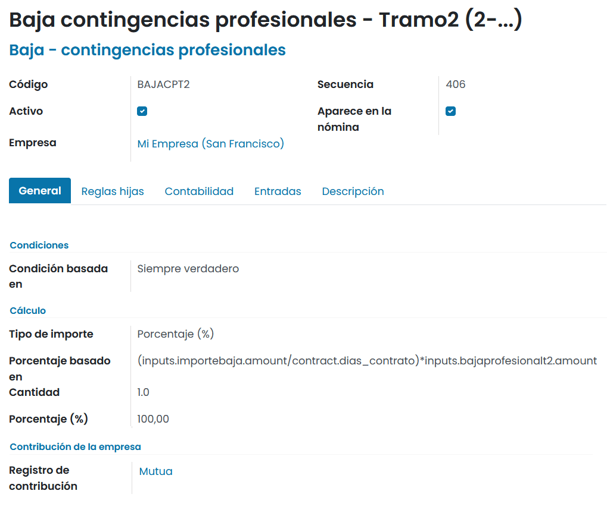

Para disponer del importe resultante de las bajas de **contingencias comunes** y de las **contingencias profesionales**,
dispones de dos **reglas** en la pantalla :menuselection:`Nómina --> Configuración --> Reglas salariales` que realizarán
el sumatorio de cada una de las categorías.

Para las **bajas por contingencias comunes** dispones de la siguiente regla:

**Baja contingencias comunes**
    - **Porcentaje**: 100%
    - **Porcentaje basado en** : ``categories.BAJACC``
    - **Parámetros**:
        - **categories.BAJACC**: Sumatorio de los importes de todas las líneas de la categoría Baja contingencias comunes.

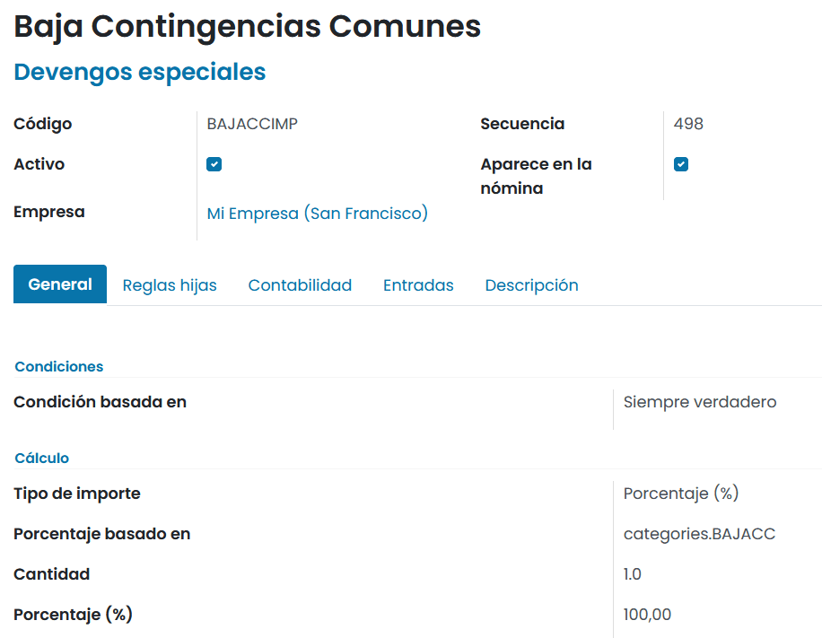

Al generar una **nómina**, se deben introducir las entradas requeridas para la baja por contingencias comunes.

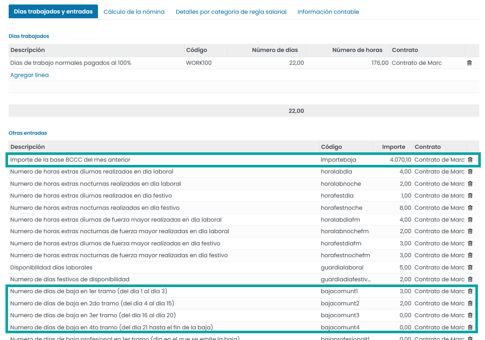

Al generar una **nómina**, las bajas por contingencias comunes aparecerán sobre el apartado **DEVENGOS – ESPECIALES**, sobre una línea independiente:

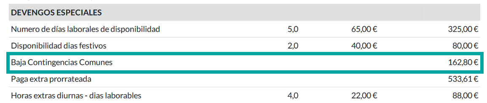

Para las **bajas por contingencias profesionales** dispones de la siguiente regla:

**Baja Contingencias Profesionales**
    - **Porcentaje**: 100%
    - **Porcentaje basado en** : ``categories.BAJACP``
    - **Parámetros**:
        - **categories.BAJACP**: Sumatorio de los importes de todas las líneas de la categoría contingencias profesionales.

Al generar una **nómina**, se deben introducir las entradas requeridas para la baja por contingencias profesionales.

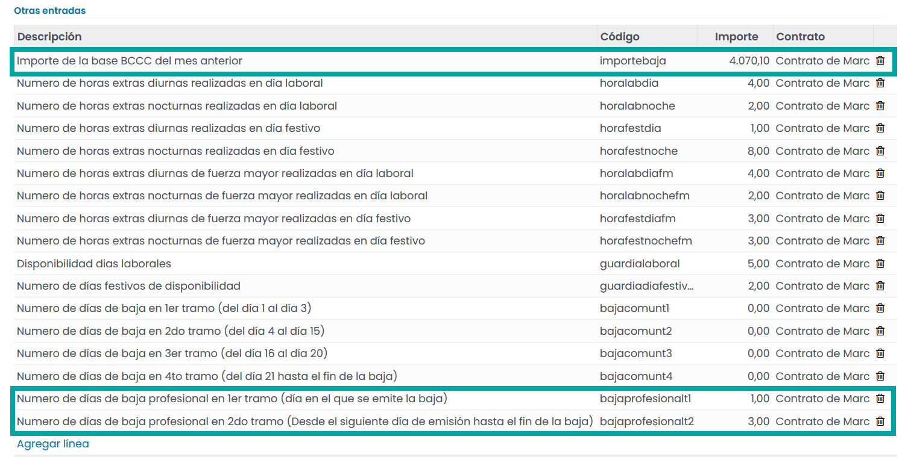

Al generar una **nómina**, las bajas por contingencias profesionales aparecerán sobre el apartado **DEVENGOS – ESPECIALES**,
sobre una línea independiente:

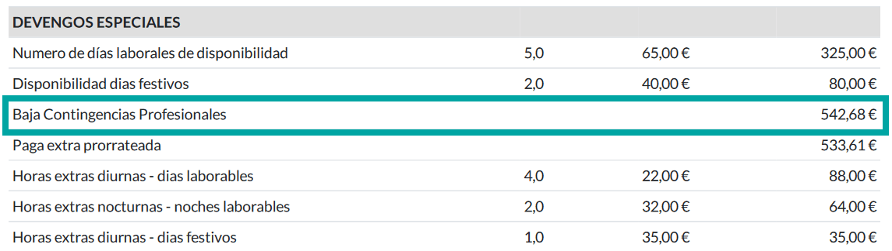

Incorporar las bajas de un empleado sobre la nómina
---------------------------------------------------------

Cuando un empleado cursa una baja por enfermedad, será necesario registrarla sobre el módulo de ausencias,
incorporando el tipo de ausencia, el periodo y el empleado.

.. note::
   Para que un registro de baja se compatibilice con el módulo de nóminas, la baja deberá estar aprobada.

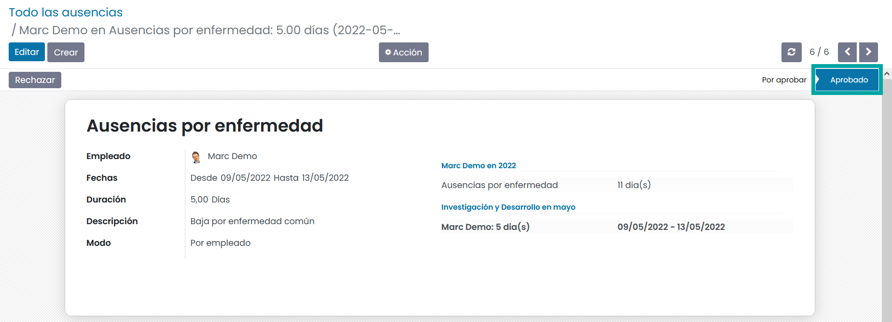

.. seealso::
   * :doc:`../../recursos_humanos/ausencias`

Posteriormente, al generar la nómina para el empleado y periodo que corresponda a la baja, aparecerá
sobre su registro de nómina, en el apartado de **días trabajados**, un registro con código **Ausencias por enfermedad**, indicando
los días totales que ha estado de baja.

El registro que hace referencia a los días pagados al 100% dispondrá del total de los días del mes, menos los días
que el empleado ha estado de baja.

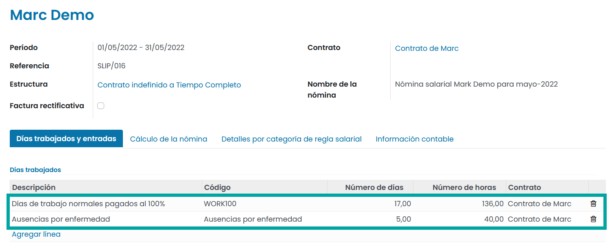

Posteriormente, y para poder realizar correctamente los cálculos de la baja, será necesario informar sobre el
apartado **Otras entradas** lo siguiente:

    - **Importe de la baja**: Se deberá informar con el valor de la base de la BCCC de la nómina del mes anterior.
    - **Número de días por tramo**: Número de días de cada tramo que el empleado ha estado de baja en función de si es una baja común o una baja profesional:
    - **Baja común**:
        - **Baja común tramo 1**: Número de días entre el primer y el tercer día de baja.
        - **Baja común tramo 2**: Número de días entre el cuarto y el quinceavo día de baja.
        - **Baja común tramo 3**: Número de días entre el dieciseisavo y el veinteavo día de baja.
        - **Baja común tramo 4**: Número de días desde el veintiunavo día de baja.
    - **Baja Profesional**:
        - **Baja profesional tramo 1**: Se corresponde únicamente al día que se emite la baja.
        - **Baja profesional tramo 2**: Se corresponde a los días posteriores al día que se emite la baja.

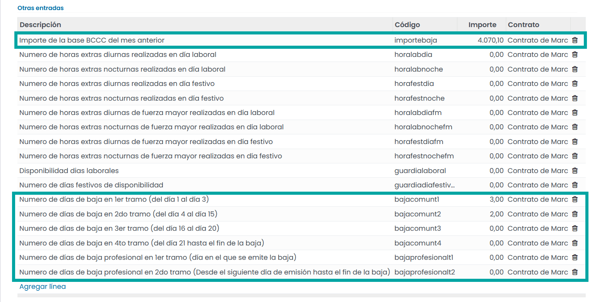

.. note::
   Se debe prestar especial atención sobre aquellas bajas cursadas entre meses debido a que el cambio de mes no reinicia el contador. Los contadores sirven para evaluar los distintos pagadores de la baja.

Al calcular la hoja de la baja, se puede consultar el importe de cada una de las líneas de baja generadas.

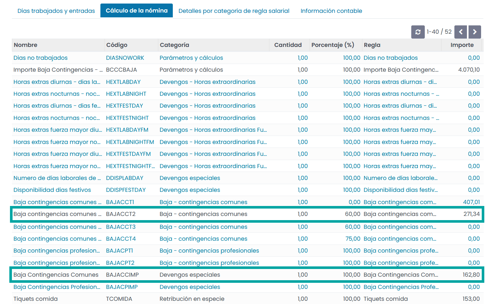

Al realizar la **impresión de la nómina**, aparecerá reducido en los **devengos**, la parte proporcional a los días que el empleado ha cursado una baja, y sobre **devengos especiales**, el importe de la baja a abonar.

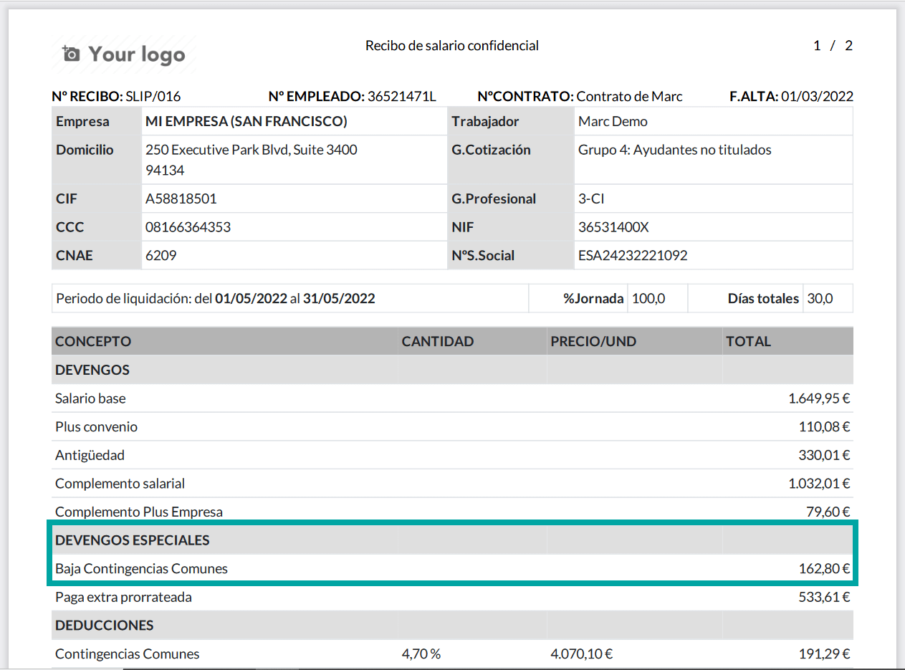

