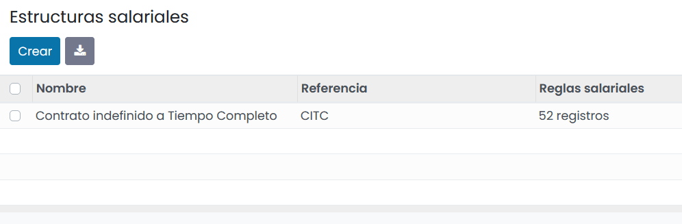
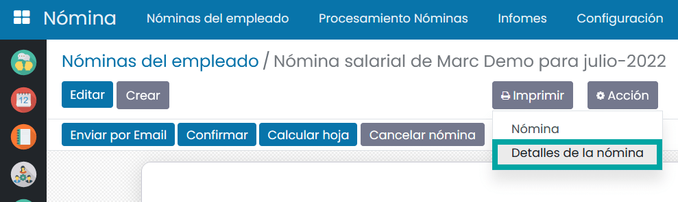

==============
Gestión Básica
==============

Introducción
=============

Daeris permite generar nóminas aplicando reglas basadas en parámetros incorporados sobre el contrato del empleado y la propia nómina.

Es **responsabilidad de cada usuario** , el configurar y/o adaptar dichas reglas en base a la legislación vigente de su país, en cada momento.

A modo de ejemplo, el **conjunto de reglas preconfiguradas de Daeris se centra en la legislación española** sobre contratos indefinidos,
pudiendose adaptar a la legislación de cada país, alterando la configuración inicialmente expuesta.

Sistema parametrizable de generación de nóminas
---------------------------------------------------

La nómina es un recibo individual justificativo del pago de salarios, y sirve, por un lado, para que la empresa
justifique el pago del mismo y por otra, para dar a conocer al trabajador las diversas partidas que integran,
tanto su retribución como sus deducciones.

Cada nómina, debe disponer de una serie de conceptos claramente detallados y correctamente calculados para
considerarse un documento correcto y legal.

Para poder calcular la nómina de un trabajador se deben tener en cuenta varios factores que influyen en el resultado
de la misma, como por ejemplo:

- **Categoría profesional y grupo de cotización**: Estos datos influyen en las bases de cotización a la seguridad social.
- **Situación personal**: Si un empleado tiene hijos o personas a su cargo es relevante a la hora de realizar el cálculo del IRPF.
- **Convenio**: En función del convenio al que este acogido el empleado, afectará de forma directa a los complementos salariales, percepciones no salariales, dietas, etc.
- **Bajas**: Si un empleado ha generado baja durante el periodo en el que se genera la nómina.
- **Duración de contrato**: En función de si el empleado tiene un contrato temporal o indefinido cotizará un porcentaje determinado a la seguridad social.
- **Duración de jornada**: Las horas que trabaja el empleado (jornada parcial/jornada completa).
- **Salario**: Será necesario el salario indicado en el contrato del trabajador para calcular el porcentaje de IRPF.
- **Número de pagas extraordinarias**: Número de pagas extraordinarias que tiene el empleado (varían según el convenio y/o contrato).
- **Abono de pagas extraordinarias**: En función de si el empleado cobra las pagas extraordinarias prorrateadas o no, se deberá calcular el IRPF de un modo u otro.

.. note::
   España es uno de los países donde más complicado es realizar una nómina ya que dispone de muchos conceptos que varían en función del tipo de contrato, sector, convenio, etc. Para calcular una nómina es necesario disponer de conocimientos básicos sobre el estado de las leyes laborales, ya que influyen muchos factores que van cambiando continuamente, con lo que si no se disponen de estos conocimientos, se recomienda que se contraten los servicios de un especialista o se consulte al Instituto Nacional de la Seguridad Social.

Desde daeris se pueden generar nóminas aplicando reglas basadas en los parámetros incorporados previamente sobre el
contrato del empleado y la propia nómina.

Todas estas reglas se pueden modificar alterando los parámetros que se necesiten en cada caso.

El sistema de generación de nóminas se basa en:

- **Reglas**: Cada regla es un cálculo basado en un campo previamente definido, un campo que debe rellenar el empleado que genera la regla, otra regla, el sumatorio de todas las reglas asociadas a una determinada categoría, porcentajes de valores, etc. Las reglas se configuran desde la pantalla :menuselection:`Nómina --> Configuración --> Reglas salariales`.

- **Estructuras salariales**: Son un conjunto de reglas asociadas a un contrato. Cada contrato solo puede disponer de una asociación.  A partir de las reglas de la asociación se calculará la nómina del empleado asociado al contrato. Las estructuras salariales se configuran desde la pantalla :menuselection:`Nómina --> Configuración --> Estructuras salariales`.

- **Categorías de reglas salariales**: Conjunto de reglas agrupadas bajo algún criterio. Cada regla solo puede estar asociada a una única agrupación. Las categorías de reglas salariales se configuran desde la pantalla  :menuselection:`Nómina --> Configuración --> Categorías de reglas salariales`.

- **Contrato**: Documento entre empresa y empleado que dispone de las condiciones pactadas para el pago de la nómina, así como la estructura salarial para calcular la nómina. Los contratos se configuran desde la pantalla :menuselection:`Empleados --> Contratos`.

.. image:: configuracion/contratos.png
   :align: center
   :alt: Gestión de contratos

- **Nómina**: Documento que desglosa en líneas el sueldo y las distintas aportaciones que ha generado el empleado. Las nóminas se pueden consultar desde la pantalla :menuselection:`Nómina --> Nóminas del empleado`.

Configuración
=============

Configurar las reglas salariales
---------------------------------

Para configurar las reglas salariales de las nóminas, navega a la pantalla :menuselection:`Nómina --> Configuración --> Reglas salariales`.

Al crear o actualizar un registro, el sistema navega al formulario de edición, donde aparecen los siguientes campos:

- **Nombre**: Nombre único de la regla.
- **Categoría**: Campo que permite seleccionar entre las distintas categorías.
- **Código**: Código único que permitirá identificar la regla desde otras reglas.
- **Secuencia**: Orden en el que se va a efectuar el cálculo de la regla. Es muy importante situar el orden correcto, sobre todo en reglas que calculan valores que van a ser llamados posteriormente por otras reglas.

.. image:: deducciones/cct.png
   :align: center
   :alt: Configurar las reglas salariales

El cálculo de las reglas se puede hacer en base a los siguientes tipos de importe:

- **Porcentaje**: Se calculará un porcentaje en base a un campo o regla determinado en el campo Porcentaje.

- **Importe fijo**: Equivaldrá al valor identificado en el campo Importe fijo.

- **Código Python**: Equivaldrá al valor del cálculo de la ecuación realizada en el campo Código Python.

Por otro lado, sobre la pestaña **Entradas**, podrás encontrar un listado donde poder incorporar nuevos registros
para ser usados como variables a informar por el empleado que genera la nómina.

Estas variables pueden ser usadas en el campo de Código Python de la pestaña **General**.

Al generar una nómina, las variables a informar se visualizarán sobre la pestaña de **Otras entradas**.

Configurar las categorías de reglas salariales
-----------------------------------------------

Para configurar las categorías de reglas salariales de las nóminas, navega a la pantalla  :menuselection:`Nómina --> Configuración --> Categorías de reglas salariales`.

Al crear o editar un registro, el sistema navegará al formulario, donde poder informar el nombre, código y
categoría padre. Una vez modificado el registro, pulsa el botón *Guardar*.

Configurar las estructuras salariales
-------------------------------------

Para configurar las estructuras salariales de las nóminas, navega a la pantalla  :menuselection:`Nómina --> Configuración --> Estructuras salariales`.

Al crear o editar un registro, el sistema navegará al formulario, donde será posible informar el nombre, código y estructura padre. Desde la pestaña de Reglas salariales, podrás asociar todas las reglas que deba incorporar la estructura salarial.

Configurar los registros de contribución
----------------------------------------

Un **registro de contribución** es un tercero involucrado en el pago del salario de los empleados.
Puede ser la seguridad social, el estado, la mutua o cualquier entidad que recoja o inyecte dinero en las nóminas.

Para configurar los registros de contribución, navega a la pantalla :menuselection:`Nómina --> Configuración --> Registros de contribución`.

Al crear o editar un registro, el sistema se posicionará sobre el formulario, donde será posible informar
el nombre y la empresa asociada.

Al pulsar sobre el menú :menuselection:`Imprimir --> Línea de nómina`, será posible visualizar el listado de todas las líneas de nómina asociadas al registro de contribución.

Cada registro de nómina, se corresponde con una línea de una nómina asociada al registro de contribución.

.. image:: configuracion/lineas_pdf.png
   :align: center
   :alt: Gestión de los registros de contribución

Una vez configurados los registros de contribución, puedes incorporar sobre las reglas de cálculo de nómina, su
registro de contribución correspondiente, en caso de considerarlo oportuno. Las reglas salariales se configuran
desde la pantalla :menuselection:`Nómina --> Configuración --> Reglas salariales`.

Por ejemplo, es posible informar los registros de contribución de cada tramo de baja, ya que los pagadores son distintos.

Sobre cualquier nómina, es posible visualizar los importes que pertenecen a cada registro de contribución mediante
la opción :menuselection:`Imprimir --> Detalles de la nómina`.

El sistema permitirá descargar un informe que incluye las líneas por registro de contribución.

Formato
========

Informar los datos del encabezado
---------------------------------

La nómina es un documento que debe disponer de una información determinada para poder considerarse un documento legal.

A nivel del encabezado debe disponer de la siguiente información:

    - **Información del emisor (empresa)**
    - **Nombre legal de la empresa**
        - **Domicilio fiscal**
        - **CIF**
        - **CCC** (Código de cuenta de cotización o Nº de Seguridad Social) .Puedes encontrar más información acerca del CCC `Aquí <http://www.seg-social.es/wps/portal/wss/internet/Empresarios/Inscripcion/1227/1229>`_.
        - **CNAE**
    - **Información del receptor (empleado)**
        - **Nombre y apellidos**
        - **NIF/NIE**
        - **Número Seguridad Social**
        - **Fecha de alta a la empresa**
        - **Número de contrato**
        - **Grupo profesional**
        - **Grupo de cotización**
        - **Número de empleado**
    - **Información del periodo a liquidar**
        - **Fecha de inicio del periodo a liquidar**
        - **Fecha de fin del periodo a liquidar**
        - **Número de días a liquidar**

Para que se muestren estos datos sobre las nóminas, deberán haberse incorporado previamente sobre la aplicación.

A nivel de empresa, es posible configurar los datos correspondientes sobre la pantalla
:menuselection:`Ajustes --> Usuarios y compañías --> Compañías`, accediendo al detalle de la compañía.

Por otro lado, a nivel de empleado, es posible configurar el nombre y apellidos, número de empleado y número de
seguridad social sobre la pestaña Información Privada de la pantalla :menuselection:`Empleados --> Empleados`,
accediendo al detalle del empleado.

Para informar el NIF/NIE, será necesario navegar a la pantalla :menuselection:`Contactos --> Contactos`, accediendo al detalle
del contacto asociado con el empleado.

A nivel de contrato del empleado, es posible configurar los datos correspondientes sobre la pantalla
:menuselection:`Empleados --> Contratos`, accediendo al detalle del contrato.

Desde la pestaña **Información del salario**, será posible configurar toda la información relacionada con el salario
del empleado.

Una vez informados estos datos, cuando se realice la impresión de una nómina, se recuperarán los campos de
la cabecera a partir de la información comentada previamente.

Informar los datos del pie de página
-------------------------------------

El pie de una nómina gestionada con daeris dispone de una línea de cuatro bloques con las siguientes bases:

    - **Base CCC**
    - **Base CCP**
    - **Base Teórica**
    - **Base IRPF**

Además, incluye una línea de cuatro bloques con los siguientes conceptos:

    - **Total Devengado**: Salario mensual por el que el trabajador cotiza. Si el empleado tiene las pagas extras prorrateadas esta cantidad será igual a la BCCC, si no será la BCCC sin el prorrateo.
    - **Total Deducido**: Importe a deducir del total de devengados (suma de la categoría de deducciones).
    - **Prorrata Paga Extra**: En caso de que el empleado acumule las cantidades para ser abonadas en un único mes.
    - **Líquido a Percibir**: Sueldo neto que recibirá el empleado.

Por último, aparecerá una línea de tres bloques informando los siguientes conceptos:

    - **Número de Cuenta Bancaria**: Cuenta donde se abonará la nómina.
    - **Fecha**: Fecha de emisión de la nómina.
    - **Importe**: Importe a abonar.

A nivel de empleado, es posible configurar el número de cuenta bancaria sobre la pestaña Información Privada de
la pantalla :menuselection:`Empleados --> Empleados`, accediendo al detalle del empleado.

Una vez informados estos datos, cuando se realice la impresión de una nómina, se recuperarán los campos del pie
a partir de la información comentada previamente.

Configurar el formato de las nóminas
-------------------------------------

Según el artículo 29 del estatuto de trabajadores, referente al formato de la nómina:

.. note::
   El recibo de salarios se ajustará al modelo que apruebe el Ministerio de Empleo y Seguridad Social, salvo que por convenio colectivo o, en su defecto, por acuerdo entre la empresa y los representantes de los trabajadores, se establezca otro modelo que contenga con la debida claridad y separación las diferentes percepciones del trabajador, así como las deducciones que legalmente procedan.

Según el BOE, en referencia a la hoja de salarios, facilita el siguiente modelo de nómina:

.. note::
   Puedes encontrar la publicación completa del `BOE aquí <https://www.boe.es/buscar/doc.php?id=BOE-A-2014-11637>`_.

En daeris, el formato de las nóminas se ajusta al modelo oficial del ministerio de empleo y seguridad social,
incorporando todos los conceptos incluidos en este modelo, permitiendo añadir modificaciones formales y elementos
adicionales para el trabajador.

