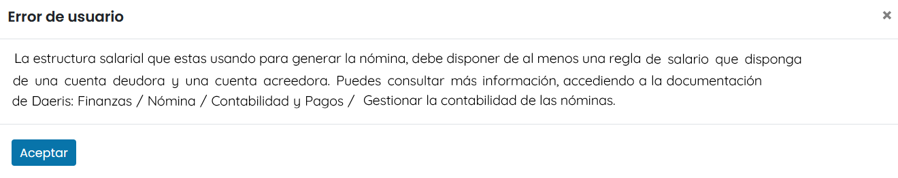
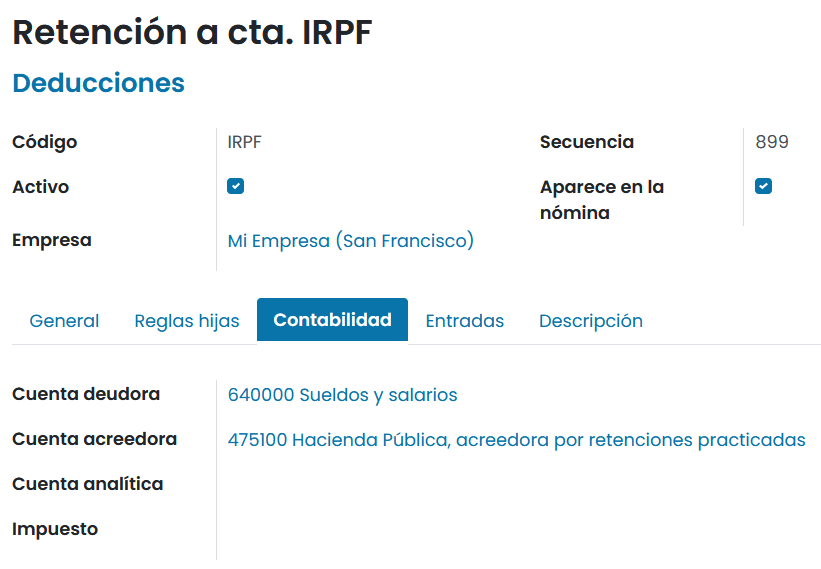
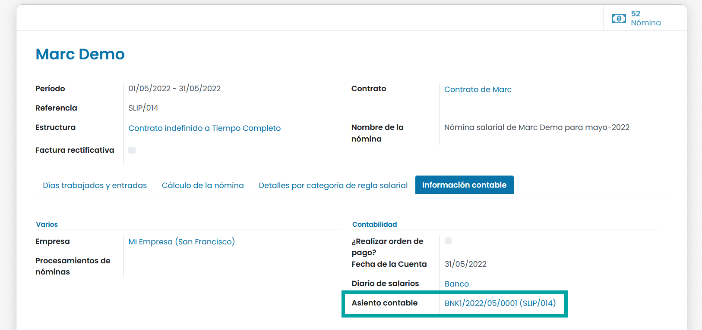
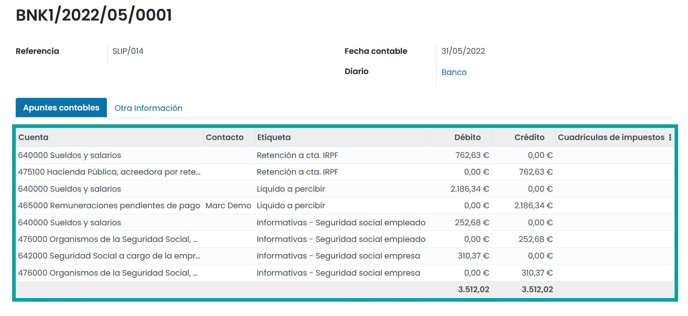

=====================
Contabilidad y Pagos
=====================

Contabilidad
=============

Gestionar la contabilidad de las nóminas
-------------------------------------------

Sobre las reglas salariales de las nóminas, se puede indicar tanto la **cuenta contable deudora** como la
**cuenta contable acreedora**.

.. warning::
   En el caso de intentar generar una nómina sin haber indicado almenos, una cuenta deudora y una cuenta acreedora, un alerta será mostrada por pantalla, impidiendo generarla.

Para ello, navega al detalle de una regla salarial desde la pantalla :menuselection:`Nómina --> Configuración --> Reglas salariales`
y accede  la pestaña **Contabilidad**:

A continuación se detallan una serie de cuentas contables (Plan contable español), asociadas a algunas de las reglas salariales:
    - **Retención a cta. IRPF**
        - **Cuenta deudora**: 640000 Sueldos y salarios.
        - **Cuenta acreedora**: 475100 Hacienda pública, acreedora por retenciones practicadas.

    - **Líquido a percibir**
        - **Cuenta deudora**: 640000 Sueldos y salarios.
        - **Cuenta acreedora**: 465000 Remuneraciones pendientes de pago.

    - **Seguridad Social Empleado**
        - **Cuenta deudora**: 640000 Sueldos y salarios.
        - **Cuenta acreedora**: 476000 Organismos de la Seguridad Social, acreedores.

    - **Seguridad Social Empresa**
        - **Cuenta deudora**: 642000 Seguridad Social a cargo de la empresa.
        - **Cuenta acreedora**: 476000 Organismos de la Seguridad Social, acreedores.

Al **confirmar una nómina**, se generará el correspondiente **asiento contable**, que se podrá consultar desde el
detalle de la nómina, en la pestaña **Información contable**:

Al hacer clic sobre el asiento contable es posible visualizar todos los apuntes contables generados.

Pagos
======

Realizar la orden de pago de las nóminas
-------------------------------------------

Para realizar el **pago de las nóminas**, navega a la pantalla :menuselection:`Contabilidad --> Órdenes --> Órdenes de pago` , y pulsa el botón **Crear**.

Al crear la nueva orden, se deberá informar el modo de pago, así como el diario y fecha de vencimiento.
Posteriormente se deberán incorporar las transacciones asociando los apuntes contables que se deseen abonar.

Una vez incorporados los apuntes, **confirma los pagos** mediante el botón correspondiente. El estado de la orden cambiará a **Confirmado**

Por último, pulsa el botón **Generar archivo de pago**, que generará el archivo correspondiente.

