===========================
Cotizaciones empresariales
===========================

Introducción
=============

Introducción a las cotizaciones empresariales
-----------------------------------------------

Las **cotizaciones empresariales** de una nómina son todos los conceptos que la empresa debe pagar y que aparecen a
título informativo. En función del salario del empleado y otros conceptos como, por ejemplo, horas extras, se
calculan las cotizaciones que corresponden a la empresa.

    - **Contingencias comunes**: El 23,6% de la base de cotización.
    - **Contingencias profesionales**
        - **IT (Incorporación Temporal)**: % IT-CNAE de la base de cotización.
        - **IMS (Incapacidad, Muerte, Supervivencia)**: % IMS-CNAE de la base de cotización.
    - **Horas extraordinarias**
        - **Horas extras normales**: El 23,6% de la base de cotización.
        - **Horas extras de fuerza mayor**: El 12% de la base de cotización.
    - **Desempleo**
        - **Contrato fijo**: El 5,5%
        - **Contrato temporal**: El 6,7%
    - **Fondo de garantía salarial**: El 0,2% de la base de cotización.
    - **Formación profesional**: El 0,6% de la base de cotización.

Al realizar la **nómina** del empleado, puedes encontrar estos conceptos sobre la agrupación **INFORMATIVAS-EMPRESA**.

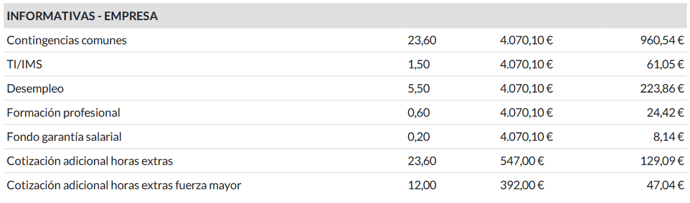

Cálculos
==========

Calcular la aportación sobre contingencias comunes por parte de la empresa
-----------------------------------------------------------------------------
La **aportación sobre contingencias comunes por parte de la empresa** se calcula aplicando el porcentaje del 23,6%
(se establece anualmente en la Ley de Presupuestos Generales del Estado) a la base de cotización por contingencias
comunes (BCCC).

La regla que viene por defecto en el sistema y que hace referencia a las contingencias comunes por parte de la
empresa, dispone de un cálculo que realiza el porcentaje del 23,6 sobre la BCCC.

Esta regla se encuentra en la pantalla :menuselection:`Nómina --> Configuración --> Reglas salariales`.

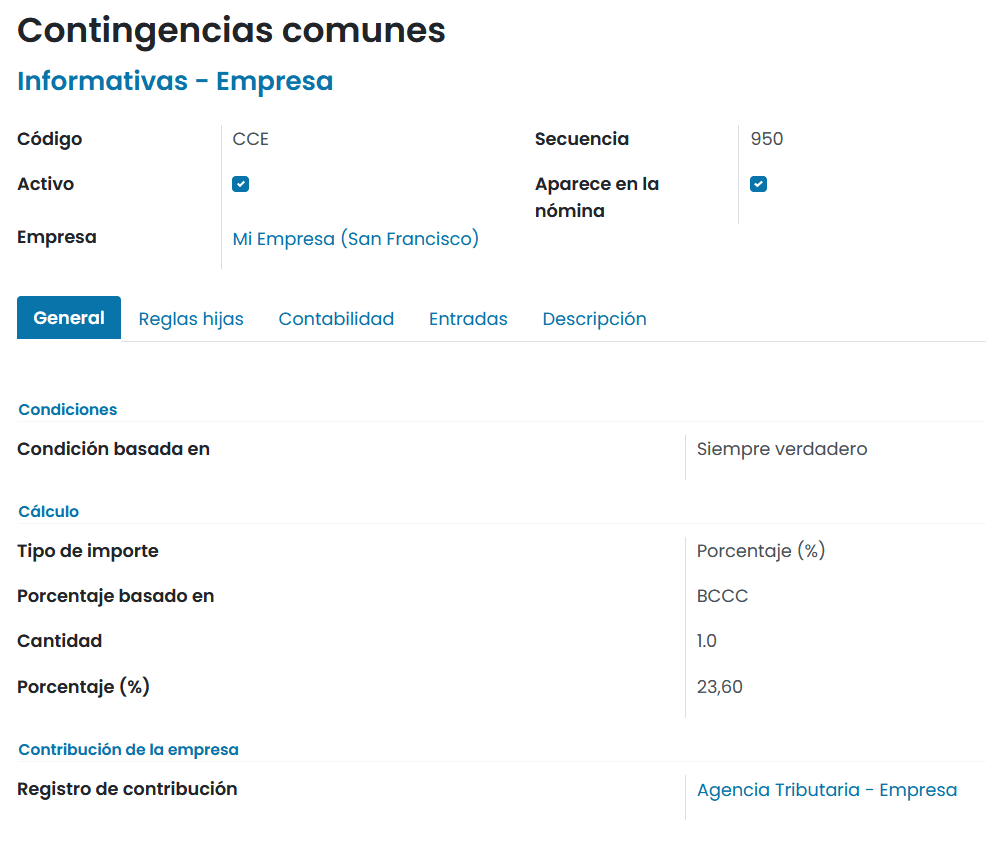

.. note::
   En el caso de que el estado actualice la ley de presupuestos, incorporando un porcentaje distinto, se deberá actualizar el índice aquí comentado.

En caso de crear una nueva **estructura salarial** para generar nóminas, será necesario incorporar sobre la
nueva estructura, la línea que haga referencia a las contingencias comunes de la empresa, ya que esta es una línea
requerida al presentar una nómina.

Al generar una nómina, las contingencias comunes de la empresa aparecerán sobre el apartado **INFORMATIVAS-EMPRESA**,
sobre una línea independiente.

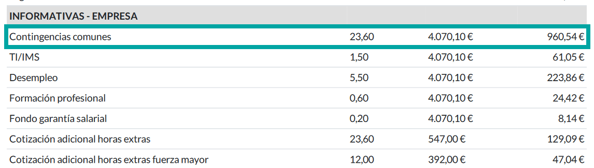

Calcular la aportación sobre contingencias comunes por parte de la empresa en base a las horas extras realizadas
-------------------------------------------------------------------------------------------------------------------
La **aportación sobre contingencias comunes por parte de la empresa en base a las horas extras realizadas**, variará
en función de si son horas extras de fuerza mayor (aplica el 12%) u horas extras normales (aplica el 23,6%).

.. note::
   Las horas extras se consideran de fuerza mayor cuando deban realizarse tareas de prevención o reparación de siniestros y pérdida de materias primas. Son obligatorias para el empleado y no computan a efectos del máximo anual de ochenta horas y es obligatorio comunicarlas a la autoridad laboral.

Existen dos categorías de horas extras sobre el sistema: las horas extras normales y las horas extras de fuerza
mayor. El sistema también dispone de dos reglas distintas para calcular la aportación a la seguridad social por
parte de la empresa, una para las extras habituales y otra para las extras de fuerza mayor.

La regla que hace referencia a las contingencias de las horas extras de fuerza mayor por parte de la empresa,
dispone de un cálculo que realiza el 12% sobre la suma de todas las líneas asociadas a la categoría de horas extras
de fuerza mayor.

Esta regla se encuentra en la pantalla :menuselection:`Nómina --> Configuración --> Reglas salariales`.

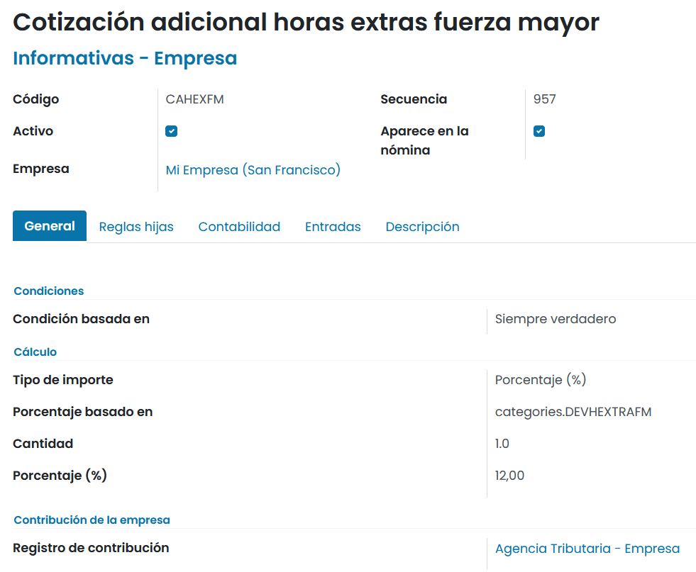

.. note::
   En el caso de que el estado actualice la ley de presupuestos, incorporando un porcentaje distinto, se deberá actualizar el índice aquí comentado.

La regla que hace referencia a las contingencias de las horas extras normales por parte de la empresa dispone de
un cálculo que realiza el 23,6% sobre la suma de todas las líneas asociadas a la categoría de horas extras normales.

Esta regla salarial se encuentra en la pantalla :menuselection:`Nómina --> Configuración --> Reglas salariales`.

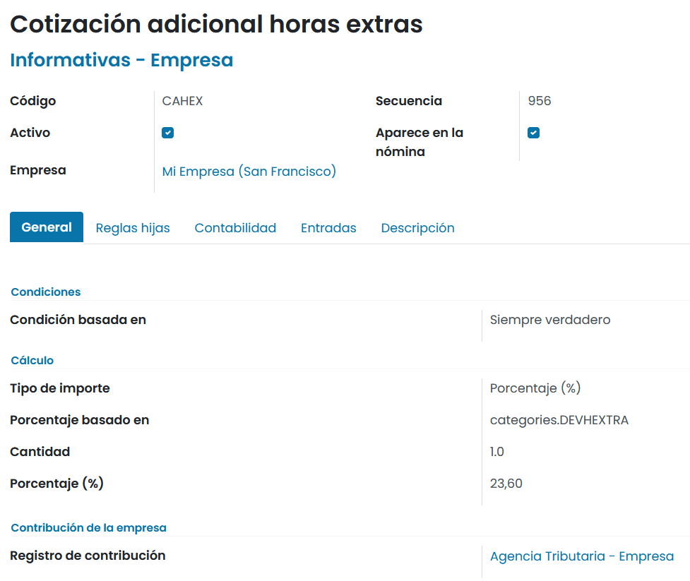

.. note::
   En el caso de que el estado actualice la ley de presupuestos, incorporando un porcentaje distinto, se deberá actualizar el índice aquí comentado.

En caso de crear una nueva **estructura salarial** para generar nóminas, será necesario incorporar sobre la nueva
estructura, la línea que haga referencia a las contingencias comunes de las horas extras de la empresa de forma
obligatoria, ya que esta es una línea requerida al presentar una nómina.

De igual modo, será necesario incorporar sobre la nueva estructura, la línea que haga referencia a las
contingencias comunes de las horas extras de fuerza mayor de la empresa.

Al generar una nómina, las contingencias comunes por parte de las horas extras de la empresa aparecerán sobre
el apartado **INFORMATIVAS-EMPRESA**, sobre una línea independiente.

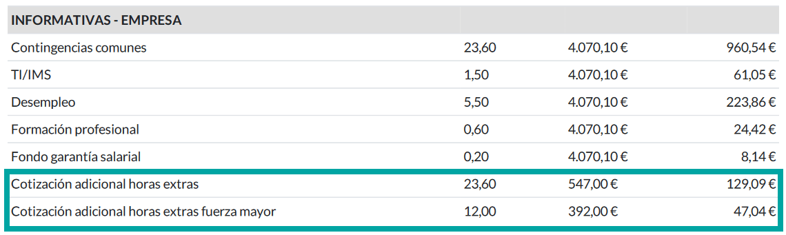

Calcular la aportación sobre contingencias profesionales por parte de la empresa
------------------------------------------------------------------------------------
Para poder calcular el valor de la aportación sobre la IT y la IMS, será necesario averiguar los índices
correspondientes a la actividad de tu empresa (CNAE) y que marca el estado en la ley de presupuestos del estado.

.. note::
   Puedes consultar la tarifa de primas desde la seguridad social haciendo clic `aquí <http://www.seg-social.es/wps/portal/wss/internet/Trabajadores/CotizacionRecaudacionTrabajadores/48410>`_.. Sobre el cuadro de tipos de cotización, deberás identificar la línea que haga referencia a tu código CNAE y recuperar el total (IT+IMS).

La regla que hace referencia a las contingencias profesionales por parte de la empresa dispone de un cálculo que realiza el porcentaje total
(IT+IMS) sobre la base de cotización BCCP.

Esta regla se encuentra en la pantalla :menuselection:`Nómina --> Configuración --> Reglas salariales`.

.. note::
   Es necesario adaptar el índice al tipo de cotización asociado al empleado.

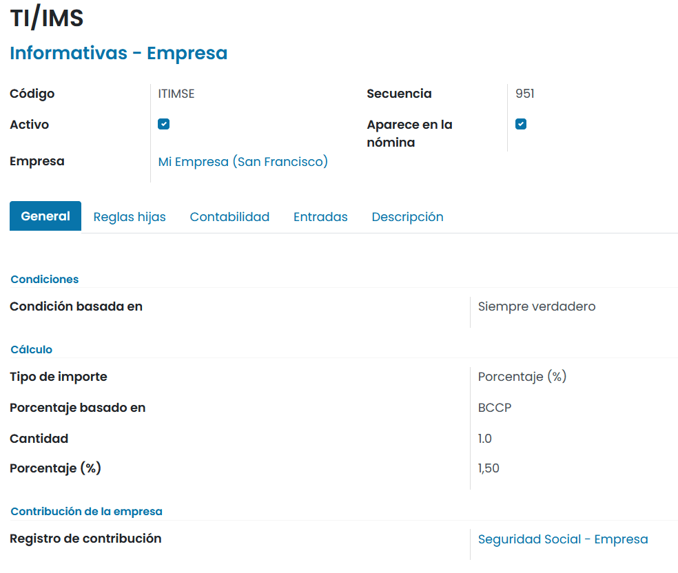

.. note::
   En el caso de que el estado actualice la ley de presupuestos, incorporando un porcentaje distinto, se deberá actualizar el índice aquí comentado.

En caso de crear una nueva estructura salarial para generar nóminas, será necesario incorporar sobre la nueva
estructura, la línea que haga referencia a las contingencias profesionales por parte de la empresa.

Al generar una nómina, las contingencias profesionales de la empresa aparecerán sobre el apartado
**INFORMATIVAS-EMPRESA**, sobre una línea independiente.

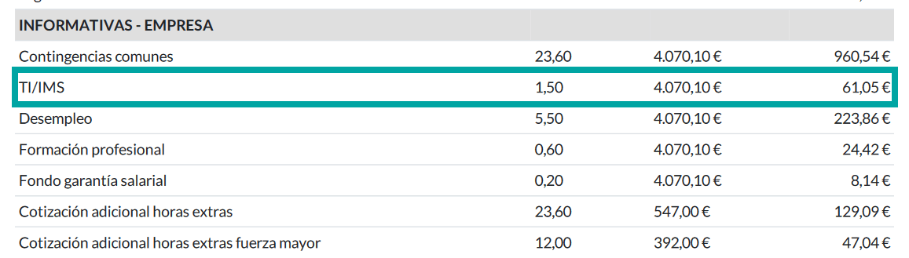

Calcular la aportación al desempleo por parte de la empresa
--------------------------------------------------------------

La **aportación al desempleo por parte de la empresa**, se calcula aplicando el porcentaje del 5,5 a la base de
cotización por contingencias profesionales (BCCP) si el contrato del empleado es indefinido y sube al 6,70 si el
contrato es temporal.

En daeris existen dos reglas que hacen referencia al desempleo por parte de la empresa. Una de ellas aplica a
contratos indefinidos y otra a contratos temporales. De este modo, cuando se crean estructuras salariales,
es necesario incorporar la regla de desempleo empresa por contrato indefinido, si la regla aplica a contratos
indefinidos, y la regla de desempleo empresa por contrato temporal si esta aplica a contratos temporales.

.. note::
   Es muy importante no establecer las dos reglas sobre la misma estructura salarial o al generar la nómina aparecerán dos líneas de desempleo asociadas a empresa distintas.

La regla que hace referencia al desempleo por parte de la empresa para contratos indefinidos, dispone de un cálculo que realiza el porcentaje del 5,5 sobre la BCCP.

Esta regla se encuentra en la pantalla :menuselection:`Nómina --> Configuración --> Reglas salariales`.

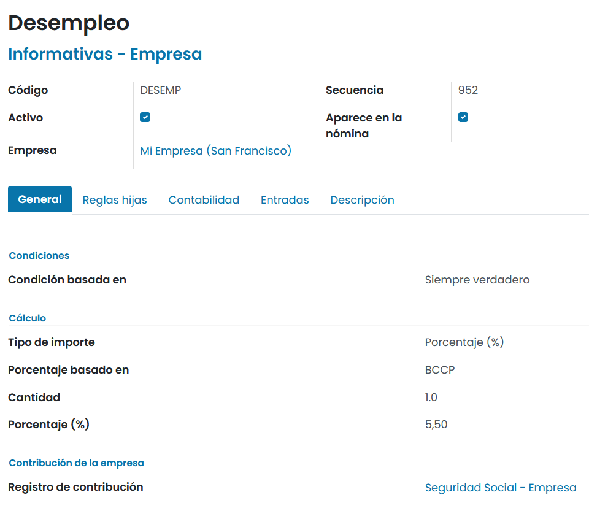

.. note::
   En el caso de que el estado actualice la ley de presupuestos, incorporando un porcentaje distinto, se deberá actualizar el índice aquí comentado.

Por otro lado, la regla que hace referencia al desempleo por parte de la empresa para contratos temporales, dispone de un cálculo que realiza el porcentaje del 6,70 sobre la BCCP.

Esta regla se encuentra en la pantalla :menuselection:`Nómina --> Configuración --> Reglas salariales`.

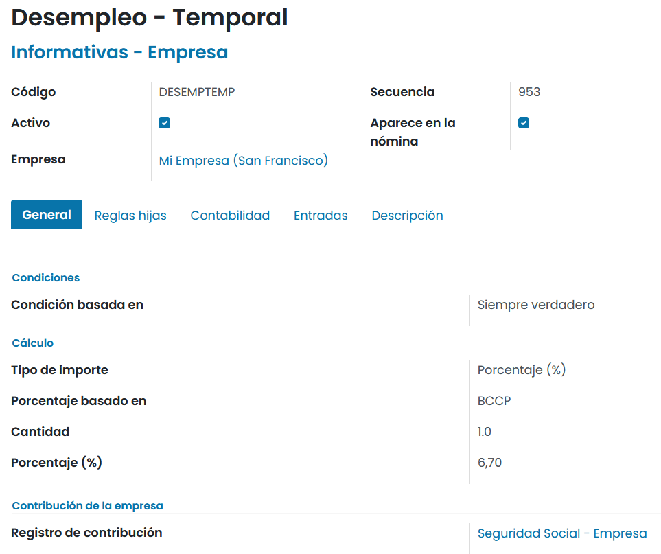

.. note::
   En el caso de que el estado actualice la ley de presupuestos, incorporando un porcentaje distinto, se deberá actualizar el índice aquí comentado.

En caso de crear una nueva **estructura salarial** para generar nóminas, será necesario incorporar sobre la nueva
estructura, la línea que haga referencia al desempleo de la empresa (temporal o indefinido) de forma obligatoria
ya que esta es una línea requerida al presentar una nómina.

Al generar una nómina, el desempleo de la empresa aparecerá sobre el apartado **INFORMATIVAS-EMPRESA**,
sobre una línea independiente.

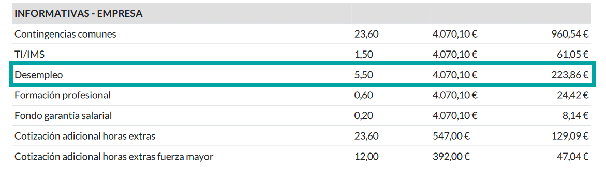

Calcular la aportación sobre formación profesional por parte de la empresa
-----------------------------------------------------------------------------

La **aportación sobre formación profesional por parte de la empresa**, se calcula aplicando el porcentaje del 0,6
a la base de cotización por contingencias profesionales (BCCP).

La regla que viene por defecto en el sistema y que hace referencia a la formación profesional por parte de
la empresa dispone de un cálculo que realiza el porcentaje del 0,6 sobre la BCCP.

Esta regla se encuentra en la pantalla :menuselection:`Nómina --> Configuración --> Reglas salariales`.

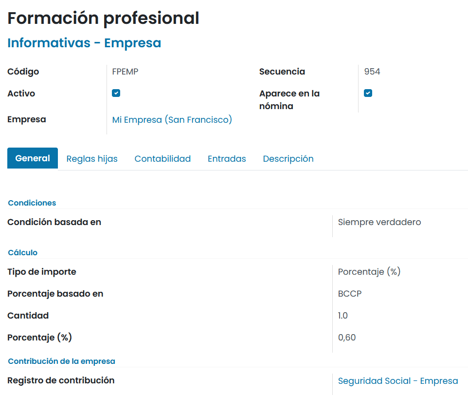

.. note::
   En el caso de que el estado actualice la ley de presupuestos, incorporando un porcentaje distinto, se deberá actualizar el índice aquí comentado.

En caso de crear una nueva **estructura salarial** para generar nóminas, será necesario incorporar sobre
la nueva estructura, la línea que haga referencia a la formación profesional de la empresa, ya que esta es
una línea requerida al presentar una nómina.

Al generar una **nómina**, la formación profesional aportada por la empresa aparecerá sobre el apartado
**INFORMATIVAS-EMPRESA**, sobre una línea independiente.

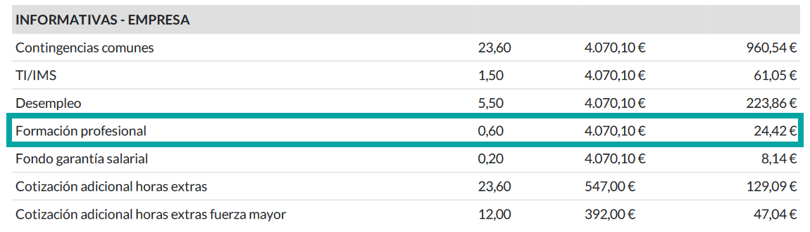

Calcular la aportación al fondo de garantía salarial por parte de la empresa
--------------------------------------------------------------------------------

La **aportación al fondo de garantía salarial por parte de la empresa** se calcula aplicando el porcentaje
del 0,2 a la base de cotización por contingencias profesionales (BCCP).

La regla que viene por defecto en el sistema y que hace referencia al fondo de garantía salarial por parte de
la empresa dispone de un cálculo que realiza el porcentaje del 0,2 sobre la BCCP.

Esta regla se encuentra en la pantalla :menuselection:`Nómina --> Configuración --> Reglas salariales`.

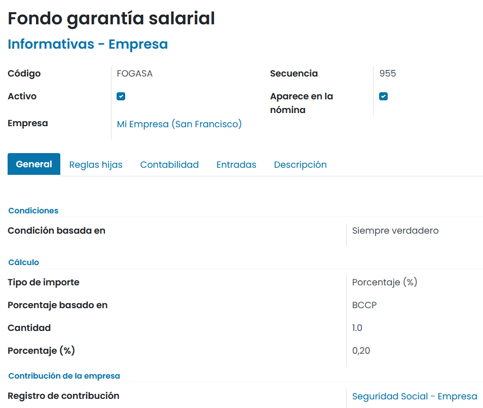

.. note::
   En el caso de que el estado actualice la ley de presupuestos, incorporando un porcentaje distinto, se deberá actualizar el índice aquí comentado.

En caso de crear una nueva **estructura salarial** para generar nóminas, será necesario incorporar sobre la
nueva estructura, la línea que haga referencia a FOGASA ya que esta es una línea requerida al presentar una nómina.

Al generar una **nómina**, la aportación al fondo de garantía salarial aparecerá sobre el apartado
**INFORMATIVAS-EMPRESA**, sobre una línea independiente.

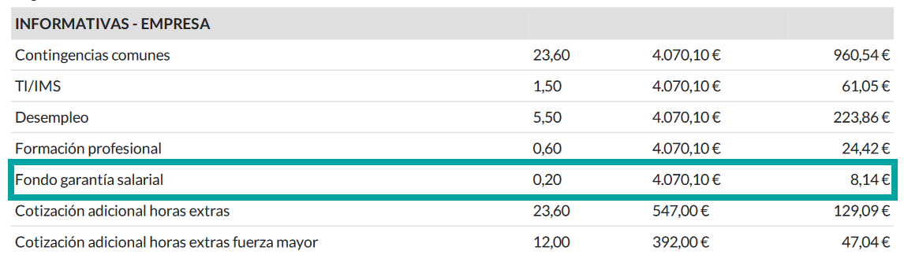