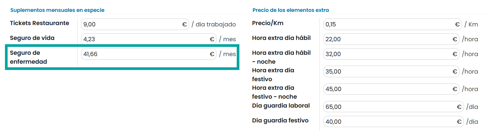

==============
Deducciones
==============

Introducción
==============

Introducción a las deducciones
---------------------------------
Las **deducciones** de una nómina son todos los conceptos que van a descontarse de los devengos. Al descontar todos los devengos
del salario bruto, se obtiene el salario neto.
Existen distintos tipos de deducciones, como, por ejemplo:

- **Aportaciones a la seguridad social**: De cada concepto se debe restar el porcentaje indicado de la base de cotización.
- **Contingencias comunes**: 4,7%
- **Desempleo**
    - **Contrato indefinido**: 1,55%
    - **Contrato temporal**: 1,60%
- **Formación profesional**: 0,1%
- **Horas extras**: 4,7%
- **IRPF**: Se determinará el porcentaje en base al salario y situación personal.
- **Anticipos**: Parte del salario adelantado por la empresa.
- **Productos recibidos en especie**: La misma línea que aparece sobre la parte de devengos y que incorporada sobre deducciones efectúa la resta compensatoria.
- **Otras deducciones**: Pueden existir otras deducciones, como, por ejemplo, cuotas a sindicatos, préstamos, etc.

Cálculos
=============

Calcular la base de cotización por contingencias comunes (BCCC)
------------------------------------------------------------------

La **base de cotización por contingencias comunes (BCCC)** se calcula sumando el salario base más complementos
salariales sujetos a cotización más el prorrateo de las pagas extras (independientemente de que el trabajador cobre
las pagas extras mes a mes o en meses determinados).

A este cálculo hay que aplicarle la regla de que existe un mínimo y un máximo legal en función del **grupo de cotización**
al que se haga referencia.
Este valor puede cambiar si lo indica la seguridad social, con lo que es muy recomendable estar al día de la normativa vigente.

.. note::
   Puedes consultar la normativa vigente `Aquí <http://www.seg-social.es/wps/portal/wss/internet/Trabajadores/CotizacionRecaudacionTrabajadores/10721/10957/9932/4327>`_ .

De este modo, cada contrato puede estar acogido a un grupo de cotización determinado y en base a este grupo de cotización,
será necesario incorporar la **cotización máxima y mínima** que le corresponda.

Para ello, navega a la pantalla :menuselection:`Empleados --> Contratos`, y accede al detalle de un contrato.

Desde la pestaña **Información del salario** se puede informar el grupo de cotización, la cotización base máxima
y mínima mediante los campos correspondientes.

La regla que viene por defecto en el sistema y que hace referencia a la **BCCC**, dispone de un cálculo que realiza la
suma de los devengos, devengos especiales y prorrateo de pagas extras, y la compara con la base máxima y mínima de
cotización, dando como resultado la suma integra o la base cotización mínima (en caso de que la suma sea menor),
o la base de cotización máxima (en caso de que la suma sea mayor).

- **Expresión**:

``if PPEXT +  categories.DEV + categories.DEVESP + categories.BAJACC + categories.BAJACP < contract.base_min_cotizacion: result = contract.base_min_cotizacion elif PPEXT +  categories.DEV + categories.DEVESP + categories.BAJACC + categories.BAJACP > contract.base_max_cotizacion :    result = contract.base_max_cotizacion else:    result = PPEXT +  categories.DEV + categories.DEVESP + categories.BAJACC + categories.BAJACP``

- **Parámetros**:

    - **PPEXT**: Valor de la prorrata de la paga extra.
    - **categories.DEV**: Suma de todas las líneas de la nómina cuya agrupación es igual a devengos nominales.
    - **categories.DEVESP**: Suma de todas las líneas de la nómina cuya agrupación es igual a devengos especiales.
    - **categories.BAJACC**: Suma de todas las líneas de la nómina cuya agrupación es igual a baja contingencias comunes.
    - **categories.BAJACP**: Suma de todas las líneas de la nómina cuya agrupación es igual a baja contingencias profesionales.
    - **categories.RETESP**: Suma de todas las líneas de la nómina cuya agrupación es igual a retenciones especiales.
    - **contract.base_min_cotizacion**: Importe mínimo de cotización disponible sobre el contrato.
    - **contract.base_max_cotizacion**: Importe máximo de cotización disponible sobre el contrato.

La **regla salarial** correspondiente a la **BCCC** se encuentra en la pantalla :menuselection:`Nómina --> Configuración --> Reglas salariales`.

En caso de crear una nueva estructura salarial para generar nóminas, será necesario incorporar sobre la nueva estructura la línea que haga
referencia a la **BCCC** de forma obligatoria, ya que esta es una línea que debe existir para realizar cálculos posteriores.

Al generar una nómina, la **BCCC** aparecerá sobre el pie en un apartado independiente.

Calcular la base de cotización por contingencias profesionales (BCCP)
------------------------------------------------------------------------

La **base de cotización por contingencias profesionales (BCCP)** se usa para calcular el porcentaje de la base de
accidentes de trabajo, desempleo, formación profesional y Fondo de Garantía Salarial. Se calcula sumando el salario
base más los complementos salariales sujetos a cotización más el prorrateo de las pagas extras (independientemente
de que el trabajador cobre las pagas extras mes a mes o en meses determinados) más el valor de las horas extras
realizadas.

A este cálculo hay que aplicarle la regla de que existe un mínimo y un máximo legal en función del grupo de cotización
al que se haga referencia. Este valor puede cambiar si lo indica la seguridad social con lo que es muy recomendable
estar al día de la normativa vigente.

.. note::
   Puedes consultar la normativa vigente `aquí  <http://www.seg-social.es/wps/portal/wss/internet/Trabajadores/CotizacionRecaudacionTrabajadores/10721/10957/9932/4327>`_ .

De este modo, cada contrato puede estar acogido a un grupo de cotización determinado, y en base a este grupo de
cotización será necesario incorporar la cotización máxima y mínima que le corresponda.

Para ello, navega a la pantalla :menuselection:`Empleados --> Contratos`, y accede al detalle de un contrato.

Desde la pestaña **Información del salario** se puede informar el grupo de cotización, la cotización base máxima
y mínima mediante los campos correspondientes:

La regla que viene por defecto en el sistema y que hace referencia a la **BCCP**, dispone de un cálculo que realiza
la suma de los devengos, devengos especiales, horas extras y prorrateo de pagas extras y la compara con la base
máxima y mínima de cotización, dando como resultado la suma integra o la base cotización mínima (en caso de que la
suma sea menor), o la base de cotización máxima (en caso de que la suma sea mayor).

- **Expresión**:

``if PPEXT +  categories.DEV + categories.DEVESP + categories.DEVHEXTRA + categories.DEVHEXTRAFM + categories.BAJACC + categories.BAJACP + categories.RETESP < contract.base_min_cotizacion: result = contract.base_min_cotizacion elif PPEXT +  categories.DEV + categories.DEVESP + categories.DEVHEXTRA + categories.DEVHEXTRAFM + categories.BAJACC + categories.BAJACP + categories.RETESP > contract.base_max_cotizacion :    result = contract.base_max_cotizacion else:    result = PPEXT +  categories.DEV + categories.DEVESP + categories.DEVHEXTRA + categories.DEVHEXTRAFM + categories.BAJACC + categories.BAJACP + categories.RETESP``

- **Parámetros**:

    - **PPEXT**: Valor de la prorrata de la paga extra.
    - **categories.DEV**: Suma de todas las líneas de la nómina cuya agrupación es igual a devengos nominales.
    - **categories.DEVESP**: Suma de todas las líneas de la nómina cuya agrupación es igual a devengos especiales.
    - **categories.DEVHEXTRA**: Suma de todas las líneas de la nómina cuya agrupación es igual a horas extraordinarias.
    - **categories.DEVHEXTRAFM**: Suma de todas las líneas de la nómina cuya agrupación es igual a horas extraordinarias de fuerza mayor.
    - **categories.BAJACC**: Suma de todas las líneas de la nómina cuya agrupación es igual a baja contingencias comunes.
    - **categories.BAJACP**: Suma de todas las líneas de la nómina cuya agrupación es igual a baja contingencias profesionales.
    - **contract.base_min_cotizacion**: Importe mínimo de cotización disponible sobre el contrato.
    - **contract.base_max_cotizacion**: Importe máximo de cotización disponible sobre el contrato.

La **regla salarial** correspondiente a la **BCCP** se encuentra en la pantalla :menuselection:`Nómina --> Configuración --> Reglas salariales`.

En caso de crea una nueva estructura salarial para generar nóminas, será necesario incorporar sobre la nueva estructura la línea que
haga referencia a la **BCCP** de forma obligatoria, ya que esta es una línea que debe existir para realizar cálculos posteriores.

Al generar una nómina, la **BCCP** aparecerá sobre el pie, en un apartado independiente.

Calcular la base sujeta al IRPF (Base IRPF)
----------------------------------------------

La **base sujeta al IRPF** se calcula restando al total devengado las cantidades exentas de IRPF (dietas, indemnizaciones o planes de
retribución flexible hasta llegar al máximo legal).

.. note::
   Para estar al día sobre las cantidades exentas de IRPF y sus máximos legales consulta el `artículo 7 de la ley del IRPF aquí <https://sede.agenciatributaria.gob.es/Sede/ayuda/manuales-videos-folletos/manuales-practicos/irpf-2021/capitulo-2-impuesto-renta-personas-generales/sujecion-irpf-aspectos-materiales/delimitacion-negativa-hecho-imponible-rentas-sujetas/rentas-exentas-articulo-7-ley-irpf.html>`_ .

La regla que viene por defecto en el sistema y que hace referencia a la Base IRPF dispone de un cálculo que realiza la suma de todos los
devengos. En el caso de disponer de algún concepto exento de IRPF debiera realizarse aquí la resta correspondiente.

- **Expresión**:

``result = categories.DEV + categories.DEVESP + categories.DEVHEXTRAFM + categories.DEVHEXTRA + categories.BAJACC + categories.BAJACP``

- **Parámetros**:

    - **categories.DEV**: Suma de todas las líneas de la nómina cuya agrupación es igual a devengos nominales.
    - **categories.DEVESP**: Suma de todas las líneas de la nómina cuya agrupación es igual a devengos especiales.
    - **categories.DEVHEXTRA**: Suma de todas las líneas de la nómina cuya agrupación es igual a horas extraordinarias.
    - **categories.DEVHEXTRAFM**: Suma de todas las líneas de la nómina cuya agrupación es igual a horas extraordinarias de fuerza mayor.
    - **categories.BAJACC**: Suma de todas las líneas de la nómina cuya agrupación es igual a baja contingencias comunes.
    - **categories.BAJACP**: Suma de todas las líneas de la nómina cuya agrupación es igual a baja contingencias profesionales.

La **regla salarial** correspondiente a la **Base IRPF** se encuentra en la pantalla :menuselection:`Nómina --> Configuración --> Reglas salariales`.

En caso de crear una nueva **estructura salarial** para generar nóminas, será necesario incorporar sobre la nueva
estructura la línea que haga referencia a la **Base IRPF** de forma obligatoria, ya que esta es una línea que debe
existir para realizar cálculos posteriores.

Al generar una **nómina**, la **Base IRPF** aparecerá sobre el pie, en un apartado independiente.

Calcular la base teórica
---------------------------

La **base teórica** se calcula sumando al total devengado las cantidades exentas de IRPF (retribuciones en especie).

.. note::
   Para estar al día sobre las cantidades exentas de IRPF y sus máximos legales consulta el artículo 7 de la ley del IRPF `aqui <https://sede.agenciatributaria.gob.es/Sede/ayuda/manuales-videos-folletos/manuales-practicos/irpf-2021/capitulo-2-impuesto-renta-personas-generales/sujecion-irpf-aspectos-materiales/delimitacion-negativa-hecho-imponible-rentas-sujetas/rentas-exentas-articulo-7-ley-irpf.html>`_ .

La regla que viene por defecto en el sistema y que hace referencia a la base teórica, dispone de un cálculo que realiza la suma de todos los devengos a las líneas de retribución en especie.

- **Expresión**:

``result = TOTDEVENG + categories.RETESP``

- **Parámetros**:

    - **TOTDEVENG**: Valor de la línea TOTDEVENG.
    - **categories.RETESP**: Suma de todas las líneas de la nómina cuya agrupación es igual a retribución en especie.

La **regla salarial** correspondiente a la **Base teórica** se encuentra en la pantalla :menuselection:`Nómina --> Configuración --> Reglas salariales`.

Al generar una **nómina**, la **base teórica** aparecerá sobre el pie, en un apartado independiente.

Calcular la aportación a la seguridad social sobre contingencias comunes por parte del trabajador
-----------------------------------------------------------------------------------------------------

La **aportación a la seguridad social sobre contingencias comunes** por parte del trabajador se calcula aplicando
el porcentaje del 4,7% (se establece anualmente en la Ley de Presupuestos Generales del Estado) a la base de
cotización por contingencias comunes (BCCC).

La regla que viene por defecto en el sistema y que hace referencia a las contingencias comunes del empleado
dispone de un cálculo que realiza el porcentaje del 4,7 sobre la BCCC. Esta regla salarial se encuentra en la
pantalla :menuselection:`Nómina --> Configuración --> Reglas salariales`.

.. image:: deducciones/cct.png
   :align: center
   :alt: Regla aportación a la seguridad social sobre contingencias comunes

.. note::
   En el caso de que el estado actualice la ley de presupuestos, incorporando un porcentaje distinto, se deberá actualizar el índice aquí comentado.

En caso de crear una nueva **estructura salarial** para generar nóminas, será necesario incorporar sobre la nueva
estructura la línea que haga referencia a las contingencias comunes del trabajador de forma obligatoria, ya que
esta es una línea requerida al presentar una nómina.

Al generar una **nómina**, las **contingencias comunes** aparecerán sobre el apartado **Deducciones**, en una línea
independiente.

Calcular la aportación a la seguridad social sobre contingencias comunes por parte del trabajador en base a las horas extras realizadas
------------------------------------------------------------------------------------------------------------------------------------------

La aportación a la seguridad social sobre **contingencias comunes** por parte del trabajador en base a las horas extras
realizadas, variará en función de si son horas extras de fuerza mayor (aplica el 2%) o horas extras normales
(aplica el 4,7%).

.. note::
   Las horas extras se consideran de fuerza mayor cuando deban realizarse tareas de prevención o reparación de siniestros y pérdida de materias primas. Son obligatorias para el empleado y no computan a efectos del máximo anual de ochenta horas y es obligatorio comunicarlas a la autoridad laboral.

Sobre el sistema, las horas extras se dividen en dos categorías: las horas extras normales y las horas extras
de fuerza mayor. Por otro lado, hay dos reglas distintas para calcular la aportación a la seguridad social,
una para las horas extras habituales y otra para las horas extras de fuerza mayor.

La regla que hace referencia a las contingencias de las horas extras de fuerza mayor dispone de un cálculo que
realiza el 2% sobre la suma de todas las líneas asociadas a la categoría de horas extras de fuerza mayor.

Esta regla salarial se encuentra en la pantalla :menuselection:`Nómina --> Configuración --> Reglas salariales`.

.. image:: deducciones/ccthextfm.png
   :align: center
   :alt: Regla contingencias de las horas extras de fuerza mayor

.. note::
   En el caso de que el estado actualice la ley de presupuestos, incorporando un porcentaje distinto, se deberá actualizar el índice aquí comentado.

La regla que hace referencia a las contingencias de las horas extras normales dispone de un cálculo que realiza el
4,7% sobre la suma de todas las líneas asociadas a la categoría de horas extras normales. Esta regla salarial se
encuentra en la pantalla :menuselection:`Nómina --> Configuración --> Reglas salariales`.

.. note::
   En el caso de que el estado actualice la ley de presupuestos, incorporando un porcentaje distinto, se deberá actualizar el índice aquí comentado.

En caso de crear una nueva estructura salarial para generar nóminas, será necesario incorporar sobre la nueva
estructura la línea que haga referencia a las contingencias comunes de las horas extras del trabajador de forma
obligatoria, ya que esta es una línea requerida al presentar una nómina.

De igual modo, será necesario incorporar sobre la nueva estructura, la línea que haga referencia a las contingencias
comunes de las horas extras de fuerza mayor.

Al generar una nómina, las contingencias comunes relacionadas con las horas extras y las horas extras de fuerza mayor
aparecerán sobre el apartado **Deducciones**, en líneas independientes, solo cuando existan horas extras que facturar.

.. image:: deducciones/piededuccionescctext.png
   :align: center
   :alt: Deducciones sobre el pie de la nómina

Calcular la aportación al desempleo por parte del trabajador
----------------------------------------------------------------
La **aportación al desempleo por parte del trabajador**, se calcula aplicando el porcentaje del 1,55 a la base de
cotización por contingencias profesionales (BCCP) si el contrato es indefinido, y sube al 1,60 si el contrato
es temporal.

En Daeris, dispones de dos reglas que hacen referencia al desempleo por parte del trabajador. Una de ellas aplica a
contratos indefinidos y otra a contratos temporales. De este modo, en caso de crear estructuras salariales, deberás
incorporar la regla de desempleo por contrato indefinido, si la regla aplica a contratos indefinidos, y la regla de
desempleo por contrato temporal, si esta aplica a contratos temporales.

.. note::
   Es muy importante no establecer las dos reglas sobre la misma estructura salarial o al generar la nómina aparecerán dos líneas de deducciones distintas.

La regla que viene por defecto en el sistema y que hace referencia al desempleo por parte del empleado para
**contratos indefinidos**, dispone de un cálculo que realiza el porcentaje del 1,55 sobre la BCCP.

Esta **regla salarial** se encuentra en la pantalla :menuselection:`Nómina --> Configuración --> Reglas salariales`.

.. note::
   En el caso de que el estado actualice la ley de presupuestos, incorporando un porcentaje distinto, se deberá actualizar el índice aquí comentado.

La regla que viene por defecto en el sistema y que hace referencia al desempleo por parte del empleado para
**contratos temporales**, dispone de un cálculo que realiza el porcentaje del 1,60 sobre la BCCP.

Esta **regla salarial** se encuentra en la pantalla :menuselection:`Nómina --> Configuración --> Reglas salariales`.

.. note::
   En el caso de que el estado actualice la ley de presupuestos, incorporando un porcentaje distinto, se deberá actualizar el índice aquí comentado.

En caso de crear una nueva **estructura salarial** para generar nóminas, será necesario incorporar sobre la nueva
estructura la línea que haga referencia al desempleo del trabajador (temporal o indefinido) de forma obligatoria,
ya que esta es una línea requerida al presentar una nómina.

Al generar una **nómina**, el desempleo del trabajador aparecerá sobre el apartado **Deducciones** en una línea independiente.

Calcular la aportación a la seguridad social sobre formación profesional por parte del trabajador
----------------------------------------------------------------------------------------------------

La **aportación a la seguridad social sobre formación profesional por parte del trabajador** se calcula aplicando
el porcentaje del 0,1 a la base de cotización por contingencias profesionales (BCCP).

La regla que viene por defecto en el sistema y que hace referencia a la formación profesional del empleado dispone
de un cálculo que realiza el porcentaje del 0,1 sobre la base de cotización por contingencias profesionales (BCCP).
Esta regla salarial se encuentra en la pantalla :menuselection:`Nómina --> Configuración --> Reglas salariales`.

.. note::
   En el caso de que el estado actualice la ley de presupuestos, incorporando un porcentaje distinto, se deberá actualizar el índice aquí comentado.

En caso de crear una nueva **estructura salarial** para generar nóminas, será necesario incorporar sobre la nueva
estructura la línea que haga referencia a la formación profesional del trabajador de forma obligatoria,
ya que esta es una línea requerida al presentar una nómina.

Al generar una **nómina**, la formación profesional del empleado aparecerá sobre el apartado **Deducciones**
en una línea independiente.

Calcular el IRPF que aplica a un trabajador
---------------------------------------------
Para calcular el **porcentaje de IRPF** que se aplica a un trabajador, se deben tener en cuenta varios factores tanto
laborales como personales.

Como estos cálculos son complejos y varían constantemente, la recomendación es que se use la calculadora que hacienda
pone a disposición de los usuarios en este `enlace <https://www2.agenciatributaria.gob.es/wlpl/PRET-R190/index.zul>`_ .

.. note::
   Es importante indicar que un cambio en la situación personal del empleado (paternidad, maternidad, separación matrimonial, cuidado de mayores, etc.) o profesional (subida de sueldo, salario en especie, etc.) puede derivar en un cambio sobre el IRPF, con lo que es recomendable realizar nuevamente los cálculos cuando se den estas situaciones.

Una vez dispongas del porcentaje de IRPF correspondiente, será necesario incorporarlo sobre el contrato del empleado.

Para ello, navega a la pantalla :menuselection:`Empleados --> Contratos`, y accede al detalle de un contrato.

Desde la pestaña **Información del salario** se puede informar el **IRPF** mediante el campo correspondiente.

La regla que viene por defecto en el sistema y que hace referencia a obtener la deducción del IRPF dispone de un
cálculo que usa el porcentaje informado sobre el contrato sobre el total devengado.

- **Expresión**:

``result = (contract.irpf/100) * BIRPF``

- **Parámetros**:

    - **contract.irpf**: Porcentaje de IRPF disponible sobre el contrato.
    - **BIRPF**: Cálculo Base de IRPF.

La **regla salarial** correspondiente a la retención a cuenta del **IRPF** se encuentra en la pantalla :menuselection:`Nómina --> Configuración --> Reglas salariales`.

En caso de crear una nueva estructura salarial para generar nóminas, será necesario incorporar sobre la nueva
estructura la línea que haga referencia a la retención a cuenta del IRPF del trabajador de forma obligatoria,
ya que esta es una línea requerida al presentar una nómina.

Al generar una nómina, la retención a cuenta del IRPF del empleado aparecerá sobre el apartado **Deducciones**
en una línea independiente.

Incorporar retribuciones en especie
--------------------------------------

Para adaptarte a la regulación, debes incluir en la nómina de los empleados los importes que les proporcionas como
beneficio social (ayudas de comida, de transporte o guardería, por ejemplo). Dichos importes tienen que cotizar a la
Seguridad Social, y quedan así exentos de IRPF (varios de ellos hasta un máximo legal).

En Daeris dispones de la categoría **Retribución en especie**.  Todas las reglas asociadas a esta categoría **tributan
a la seguridad social, pero quedan exentas del cálculo del IRPF**.

Es posible generar tantas reglas como retribuciones exentas de IRPF dispongas, e incluso en el caso de exceder en
parte del máximo legal, dividir la retribución en dos reglas, una parte para el importe que no excede, bajo la
categoría **Retribución en especie** y otra sobre **Devengos especiales** con el importe excedente.

Por defecto, sobre el sistema, dispones de 3 retribuciones en especie configuradas:

- **Seguro médico**
- **Seguro de vida**
- **Tickets de comida**

En el caso de ofrecer **seguro médico** al empleado, deberás informar el valor del importe mensual sobre el contrato
del empleado. Para ello, navega a la pantalla :menuselection:`Empleados --> Contratos`, y accede al detalle de un contrato.

Desde la pestaña **Información del salario** se puede informar el importe del seguro médico mediante el campo
correspondiente.

La regla que hace referencia al seguro médico es igual al valor del importe del seguro médico que aparece en el
contrato del empleado.

- **Expresión**:

``result=contract.seguro_medico``

- **Parámetros**:

    - **contract.seguro_medico**: Valor del seguro médico disponible sobre el contrato.

La regla salarial correspondiente al seguro médico se encuentra en la pantalla :menuselection:`Nómina --> Configuración --> Reglas salariales`.

En el caso de ofrecer seguro de vida al empleado, deberás informar el valor del importe mensual sobre el contrato
del empleado.

Para ello, navega a la pantalla Empleados > Contratos, y accede al detalle de un contrato. Desde la pestaña
**Información del salario** se puede informar el importe del seguro de vida mediante el campo correspondiente.

La regla que hace referencia al seguro de vida es igual al valor del importe del seguro de vida que aparece en
el contrato del empleado.

- **Expresión**:

``result=contract.seguro_vida``

- **Parámetros**:

    - **contract.seguro_vida**: Valor del seguro de vida disponible sobre el contrato.

La regla salarial correspondiente al seguro de vida se encuentra en la pantalla
:menuselection:`Nómina --> Configuración --> Reglas salariales`.

En el caso de ofrecer **tickets de comida** al empleado, deberás informar el valor que ofreces diariamente sobre
el contrato del empleado.

Para ello, navega a la pantalla Empleados > Contratos, y accede al detalle de un contrato. Desde la pestaña
**Información del salario** se puede informar el importe de los tickets de comida mediante el campo correspondiente.

La regla que hace referencia a los tickets de comida, es igual al valor que aparece en el contrato del empleado,
multiplicado por los días reales que ha trabajado el empleado (estos días se calculan en la propia nómina,
descontando a los días laborables del mes, los días de ausencias no justificadas y bajas).

- **Expresión**:

``result=contract.tickets_comida * worked_days.WORK100.number_of_days``

- **Parámetros**:

    - **contract.tickets_comida**: Valor de los tickets de comida diarios disponible sobre el contrato.
    - **worked_days.WORK100.number_of_days**: Número de días laborables del mes descontando los días de ausencias no justificadas y bajas.

La regla salarial correspondiente a los tickets de comida se encuentra en la pantalla
:menuselection:`Nómina --> Configuración --> Reglas salariales`.

Al generar una nómina, las retribuciones en especie del empleado aparecerán sobre el apartado **Retribución en especie**,
en líneas independientes.

