==============
Devengos
==============

Introducción
==============

Introducción a los devengos de las nóminas
---------------------------------------------

Los **devengos de una nómina** son todos los conceptos salariales que ha generado el empleado en el periodo indicado
por la nómina sin aplicarles ninguna deducción específica y que **sumados forman el salario bruto**.

En función de si cotizan a la seguridad social o no, se dividen en dos grupos: **percepciones salariales** y **percepciones
no salariales**.

Las **percepciones salariales** son todas aquellas percepciones que haya recibido el trabajador en dinero o especies
y que cotizan a la seguridad social. Se suelen dividir en los siguientes grupos:

    - **Salario base**: Salario que se paga al trabajador por su tiempo de trabajo. Esta cantidad está pactada en el contrato, pero nunca puede ser inferior al mínimo establecido en el convenio del empleado.
    - **Complemento salarial**: Se corresponde con todas las cantidades extra, como, por ejemplo:

        - Antigüedad
        - Plus convenio
        - Puntualidad
        - Nocturnidad
        - Peligrosidad
        - Extras (salario en base a cumplimiento de objetivos)
        - Etc.
    - **Pagas extraordinarias**: En función del número de pagas extraordinarias y si son prorrateadas o no.
    - **Horas extraordinarias**: Se corresponden con el total de horas de más realizadas en el periodo.
    - **Mejoras voluntarias**: Retribución flexible / sueldo en especie.

Por otro lado, las **percepciones no salariales** son todas aquellas percepciones que haya recibido el trabajador en
dinero o especies y que no cotizan a la seguridad social, como, por ejemplo:

    - **Compensación de gastos en el trabajo**
        - Dietas
        - Kilometraje
        - Aparcamientos
    - **Prestaciones a la seguridad social**
    - **Despidos**
    - **Indemnizaciones**

Los devengos de una nómina en daeris se separan en varias categorías de reglas salariales:

    - **Devengos**: Importes que aparecen en la nómina y forman la base de la paga extra.
    - **Devengos especiales**: Otros devengos que pueden aparecer en la nómina, como disponibilidades o prorratas de pagas extraordinarias.
    - **Devengos – horas extraordinarias**: Se corresponden con las horas extraordinarias realizadas por el empleado.
    - **Devengos – horas extraordinarias de fuerza mayor**: Se corresponden con las horas extraordinarias de fuerza mayor realizadas por el empleado.
    - **Retribución en especie**: Se corresponden con retribuciones a tener en cuenta por la seguridad social sin aplicar el IRPF.

Al crear las **reglas salariales**, es necesario indicar a qué categoría de devengos pertenecen. Estas categorías se
pueden definir desde la pantalla :menuselection:`Nómina --> Configuración --> Categorías de reglas salariales`.

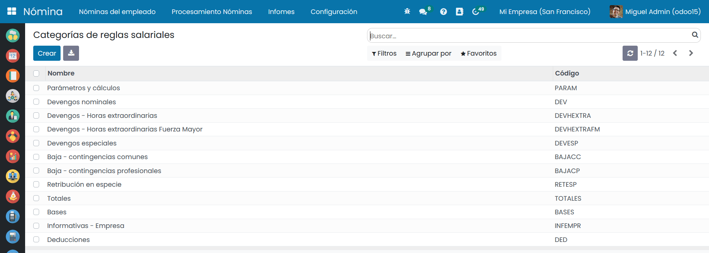

Las categorías permitirán disponer de una separación de conceptos en la **nómina**, una vez generada, tal y como se
muestra a continuación.

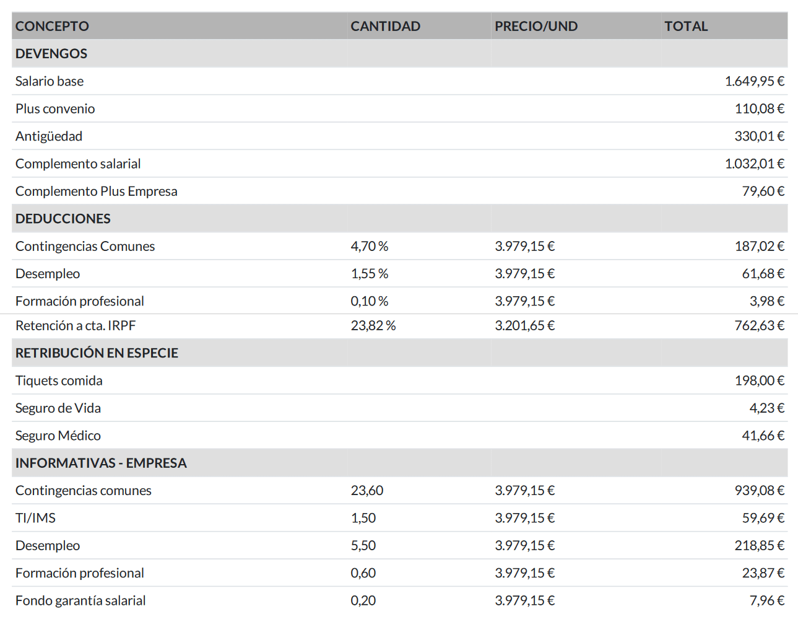

Cálculos
=============

Calcular el salario base
--------------------------

El **salario base** es el salario pactado entre trabajador y empresa sin contar los complementos salariales y debe
aparecer en el contrato de trabajo.

.. note::
   La suma del salario base y complementos salariales nunca puede ser menor que el salario mínimo interprofesional (SMI).

Para informar el **salario base** de un empleado, es necesario informar sobre el campo *salario* de su contrato el valor
del salario base. Este será el valor de referencia cuando se realicen las nóminas.

Para ello, navega a la pantalla :menuselection:`Empleados --> Contratos`, y accede al detalle de un contrato.

Desde la pestaña **Información del salario** se puede informar el **salario base** mediante el campo *Salario*.

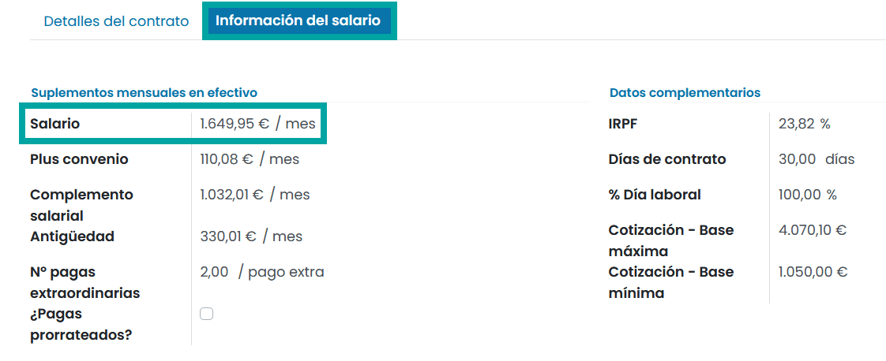

En caso de crear una nueva **estructura salarial** para generar nóminas, será necesario incorporar sobre la nueva
estructura, la línea que haga referencia al salario base.

La **regla predefinida** sobre el sistema para contratos indefinidos a tiempo completo que hace referencia al salario base dispone del siguiente cálculo.

- **Expresión**:

``result = (contract.wage/contract.dias_contrato) * (contract.dias_contrato - DIASNOWORK)``

- **Parámetros**:

    - **contract.wage**: Salario base del contrato.
    - **contract.dias_contrato**: Días de contrato. En contratos indefinidos se incorporan los 30 días.
    - **DIASNOWORK**: Número de días de ausencia. Se calcula en base a las ausencias.

La **regla salarial** correspondiente al **salario base** se encuentra en la pantalla :menuselection:`Nómina --> Configuración --> Reglas salariales`.

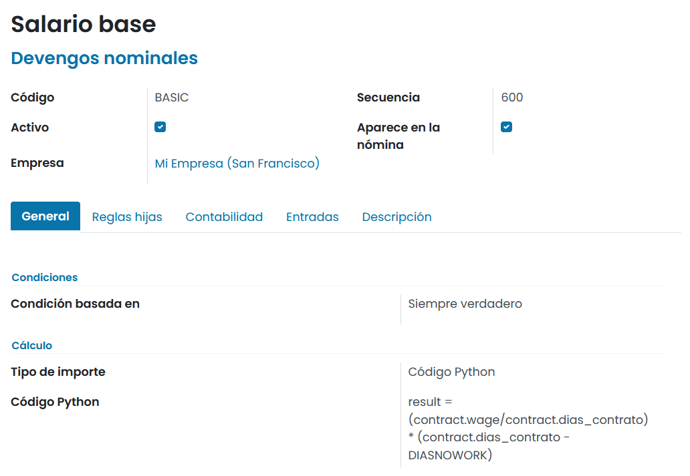

Al generar una **nómina**, el **salario base** aparecerá sobre los **devengos** en una línea independiente.

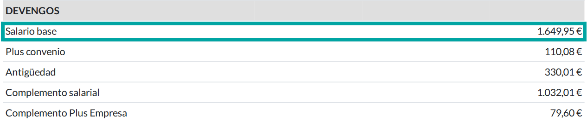

Calcular el salario plus convenio
-----------------------------------

El **plus convenio** es un complemento del salario que consiste en una cantidad fija por hora o día realmente
trabajado. Por tanto, no se abona por domingos o festivos, ni por los días que se falte al trabajo, a excepción
de las vacaciones.

Para informar el valor del plus convenio de un empleado, será necesario informar sobre el campo **Plus convenio** de
su contrato el valor del importe mensual. Este será el valor de referencia cuando se realicen las nóminas.

Para ello, navega a la pantalla :menuselection:`Empleados --> Contratos`, y accede al detalle de un contrato.

Desde la pestaña **Información del salario** se puede informar el **salario plus convenio** mediante el campo *Plus convenio*.

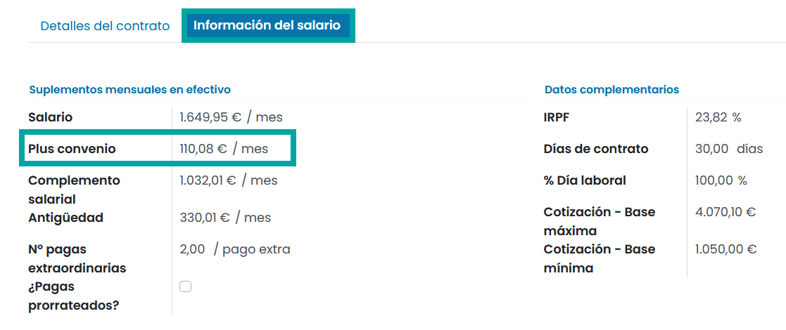

En caso de crear una nueva **estructura salarial** para generar nóminas, será necesario incorporar sobre la nueva
estructura, la línea que haga referencia al **plus convenio**, en el caso de que los trabajadores de la empresa
dispongan de este complemento.

La **regla predefinida** sobre el sistema para contratos indefinidos a tiempo completo que hace referencia al plus
convenio dispone del siguiente cálculo.

- **Expresión**:

``result = (contract.plus_conv/contract.dias_contrato) * (contract.dias_contrato - DIASNOWORK)``

- **Parámetros**:

    - **contract.plus_conv**: Salario plus convenio del contrato.
    - **contract.dias_contrato**: Días de contrato. En contratos indefinidos se incorporan los 30 días.
    - **DIASNOWORK**: Número de días de ausencia. Se calcula en base a las ausencias.

La **regla salarial** correspondiente al salario plus convenio se encuentra en la pantalla
:menuselection:`Nómina --> Configuración --> Reglas salariales`.

Al generar una **nómina**, el **plus convenio** aparecerá sobre los devengos en una línea independiente.

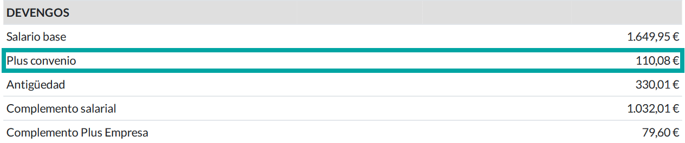

Calcular el complemento salarial
----------------------------------

El **complemento salarial** es un tipo de complemento que se aplica en la nómina atendiendo a condiciones subjetivas
del mismo. Este complemento se suele establecer en el convenio colectivo o, en el contrato individual y se aplican
cuando las circunstancias, condiciones del trabajador o cualidades del mismo no han sido tenidas en cuenta a la
hora de fijar el salario base, dando lugar a complementos diferentes entre empleados de la misma categoría profesional.

Para informar el valor del complemento salarial de un empleado, será necesario informar sobre el campo
*Complemento salarial* de su contrato el valor del importe mensual.
Este será el valor de referencia cuando se realicen las nóminas.

Para ello, navega a la pantalla :menuselection:`Empleados --> Contratos`, y accede al detalle de un contrato.

Desde la pestaña **Información del salario** se puede informar el **complemento salarial** mediante el campo *Complemento salarial*.

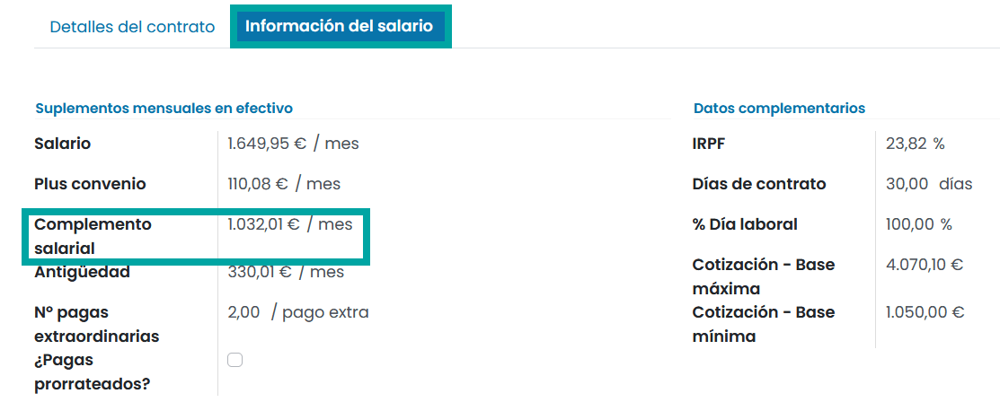

En caso de crear una nueva **estructura salarial** para generar nóminas, será necesario incorporar sobre la nueva
estructura, la línea que haga referencia al **complemento salarial**, en el caso de que los trabajadores de la empresa dispongan de este complemento.

La **regla predefinida** sobre el sistema para contratos indefinidos a tiempo completo que hace referencia al complemento
salarial dispone del siguiente cálculo.

- **Expresión**:

``result = (contract.complemento_salarial / contract.dias_contrato) * (contract.dias_contrato - DIASNOWORK)``

- **Parámetros**:

    - **contract.complemento_salarial**: Complemento salarial del contrato.
    - **contract.dias_contrato**: Días de contrato. En contratos indefinidos se incorporan los 30 días.
    - **DIASNOWORK**: Número de días de ausencia. Se calcula en base a las ausencias.

La **regla salarial** correspondiente al complemento salarial se encuentra en la pantalla :menuselection:`Nómina --> Configuración --> Reglas salariales`.

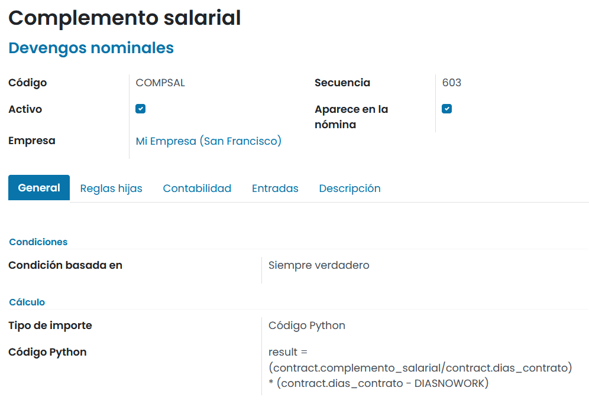

Al generar una **nómina**, el complemento salarial aparecerá sobre los devengos en una línea independiente.

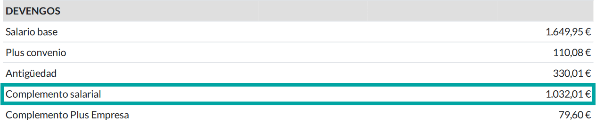

Calcular la antigüedad
-------------------------
La **antigüedad** es un plus que sólo se cobra en caso de que el convenio colectivo lo indique, ya que el
Estatuto de los Trabajadores no lo recoge como un derecho.

Para informar el valor de la antigüedad de un empleado, será necesario informar sobre el campo *Antigüedad* de su
contrato el valor del importe mensual. Este será el valor de referencia cuando se realicen las nóminas.

Para ello, navega a la pantalla :menuselection:`Empleados --> Contratos`, y accede al detalle de un contrato.
Desde la pestaña **Información del salario** se puede informar la **antigüedad** mediante el campo *Antigüedad*.

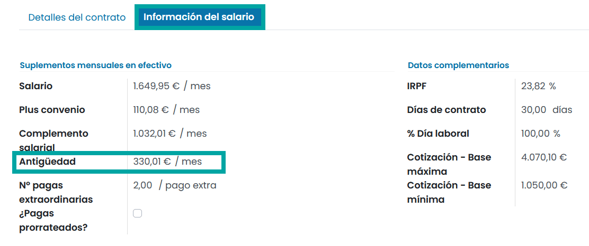

En caso de crear una nueva **estructura salarial** para generar nóminas, será necesario incorporar sobre la nueva
estructura, la línea que haga referencia a la antigüedad, en el caso de que los trabajadores de la empresa
dispongan de este complemento.

La **regla predefinida** que hace referencia a la antigüedad dispone del siguiente cálculo.

- **Expresión**:

``result = (contract.antiguedad / contract.dias_contrato) * (contract.dias_contrato - DIASNOWORK)``

- **Parámetros**:

    - **contract.antiguedad**: Antigüedad del contrato.
    - **contract.dias_contrato**: Días de contrato. En contratos indefinidos se incorporan los 30 días.
    - **DIASNOWORK**: Número de días de ausencia. Se calcula en base a las ausencias.

La **regla salarial** correspondiente a la antigüedad se encuentra en la pantalla :menuselection:`Nómina --> Configuración --> Reglas salariales`.

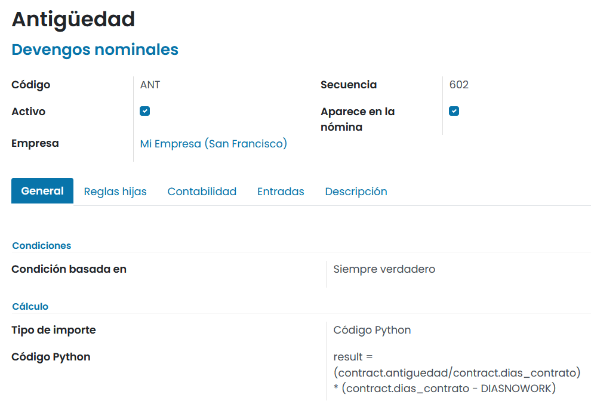

Al generar una **nómina**, la antigüedad aparecerá sobre los devengos en una línea independiente.

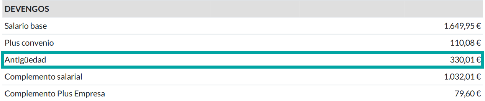

Calcular las pagas extra
---------------------------

Según el artículo 31 del Estatuto de los trabajadores, el trabajador tiene derecho a dos pagas extraordinarias al año,
una en Navidad y la otra a fijar por convenio colectivo o trabajadores (suele ser en junio).
De este modo y salvo que el convenio colectivo establezca más pagas, todos los trabajadores tienen derecho mínimo a
dos pagas extraordinarias anuales.

La parte proporcional de la paga extra generada mensualmente, cotiza a la seguridad social
(contingencias comunes, desempleo y formación profesional) mientras que el IRPF se le aplica en el momento de su
liquidación.

Para informar el número de pagas de un empleado, será necesario informar sobre el campo **Nº de pagas extraordinarias**
de su contrato el número de pagas. Este será el valor de referencia cuando se realicen las nóminas.

Mediante el campo **¿Pagas prorrateadas?** se permite abonar mensualmente al empleado la parte proporcional de la
paga extra, solo en el caso de que el trabajador así lo indique.

Para ello, navega a la pantalla :menuselection:`Empleados --> Contratos`, y accede al detalle de un contrato.

Desde la pestaña **Información del salario** se puede incorporar la información acerca de las pagas extra.

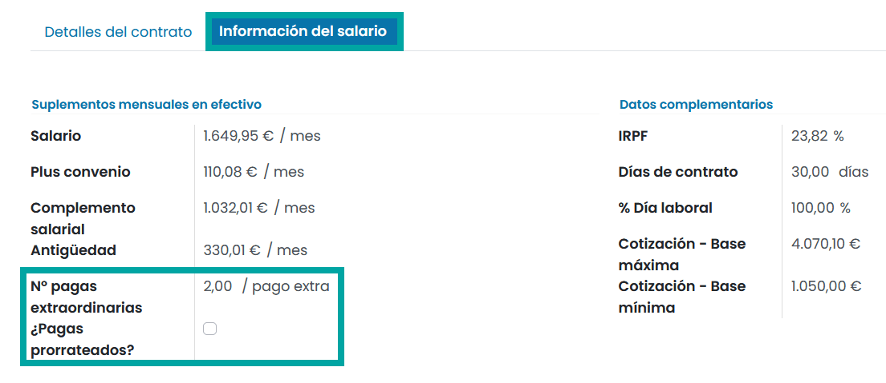

Para calcular el valor de la **paga extra** generada en el mes en que se calcula la nómina, en el caso que no se disponga
de **pagas prorrateadas**, se realiza el siguiente cálculo.

- **Expresión**:

``if contract.num_pagas_extras > 0 and not contract.proratear_pagas: result = categories.DEV / (12 / contract.num_pagas_extras) else: result = 0``

- **Parámetros**:

    - **contract.num_pagas_extras**: Número de pagas extras del contrato.
    - **contract.proratear_pagas**: Indicador de pagas prorrateadas del contrato.
    - **categories.DEV**: Suma de todas las líneas de la nómina cuya agrupación es igual a Devengos nominales.

La **regla salarial** correspondiente a la prorrata de la paga extra se encuentra en la pantalla :menuselection:`Nómina --> Configuración --> Reglas salariales`.

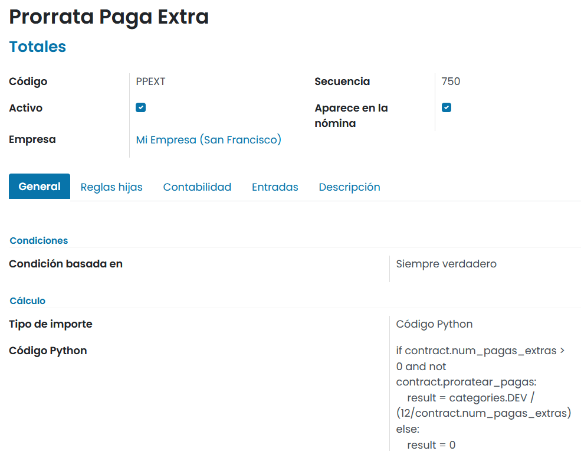

Al generar una **nómina sin pagas prorrateadas**, la cantidad de paga acumulada aparecerá como texto informativo sobre
el pie de la nómina, en un apartado exclusivo. En este caso, el valor de la prorrata se usará para el calculo de
la seguridad social. El IRPF de la paga extraordinaria se calculará el mes que se realice el abono correspondiente.

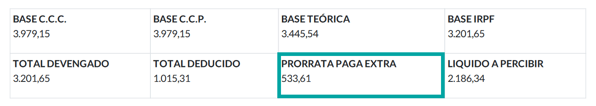

Para calcular el valor de la **paga extra** generada en el mes en que se calcula la nómina, en el caso que
**sí se disponga de pagas prorrateadas**, se realiza el siguiente calculo:

- **Expresión**:

``if contract.num_pagas_extras > 0 and contract.proratear_pagas: result = categories.DEV / (12 / contract.num_pagas_extras) else: result = 0``

- **Parámetros**:

    - **contract.num_pagas_extras**: Número de pagas extras del contrato.
    - **contract.proratear_pagas**: Indicador de pagas prorrateadas del contrato.
    - **categories.DEV**: Suma de todas las líneas de la nómina cuya agrupación es igual a Devengos nominales.

La **regla salarial** correspondiente a la paga extra prorrateada se encuentra en la pantalla :menuselection:`Nómina --> Configuración --> Reglas salariales`.

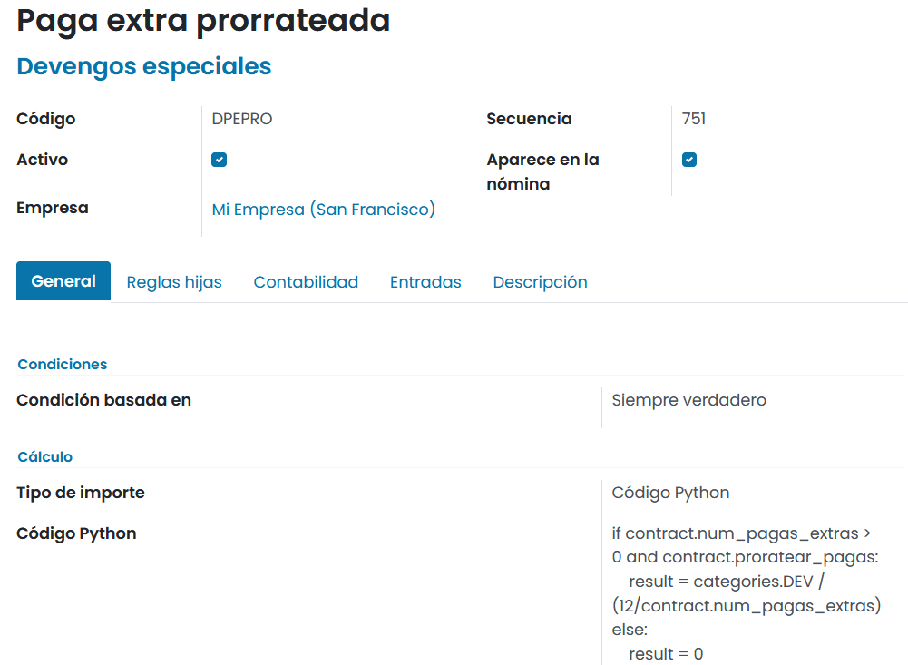

Al generar una **nómina con paga extra prorrateada**, esta aparecerá sobre los devengos en una línea independiente.

En este caso, y al tratarse de una línea de devengos especiales a abonar durante el mes, se usará el importe para
el calculo de la seguridad social y el IRPF.

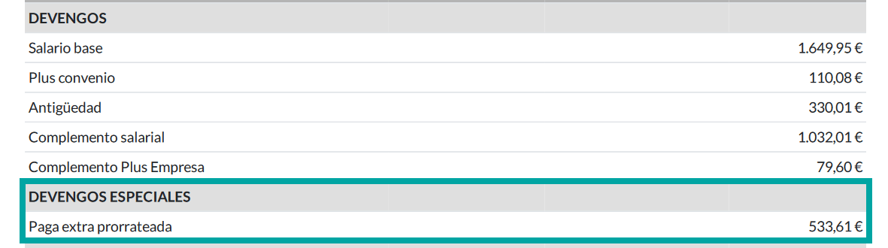

Calcular otros devengos fijos
--------------------------------

En función de múltiples factores, como el convenio colectivo o el acuerdo establecido en el contrato con el
trabajador, puede darse el caso que tengas que incorporar **otros devengos con un importe fijo**.

Para ello, puedes crear nuevas reglas salariales desde la pantalla :menuselection:`Nómina --> Configuración --> Reglas salariales`.

Al crear la **regla salarial** debes informar los siguientes campos:

    - **Nombre del complemento**
    - **Categoría**: Devengos
    - **Código**
    - **Secuencia**
    - **Activo**
    - **Aparece en la nómina**

Sobre el cálculo, será necesario indicar que equivale a un importe fijo e informar el valor del importe fijo.
En el caso de que se deba descontar los días de baja, incorpora el cálculo correspondiente.
Por ejemplo, para el complemento plus empresa, se realiza el siguiente cálculo:

- **Expresión**:

``result = (79.60 / contract.dias_contrato) * (contract.dias_contrato - DIASNOWORK)``

- **Parámetros**:

    - **valor**: Precio exacto mensual del complemento. Los decimales se separan con puntos.
    - **contract.dias_contrato**: Días de contrato. En contratos indefinidos se incorporan los 30 días.
    - **DIASNOWORK**: Número de días de ausencia. Se calcula en base a las ausencias.

La **regla salarial** correspondiente al complemento plus empresa se encuentra en la pantalla :menuselection:`Nómina --> Configuración --> Reglas salariales`.

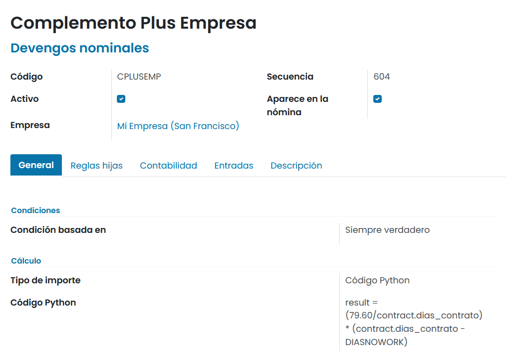

Posteriormente, será necesario incorporar la nueva regla sobre las **estructuras salariales** correspondientes.

Al generar una **nómina**, el nuevo devengo aparecerá sobre los devengos en una línea independiente:

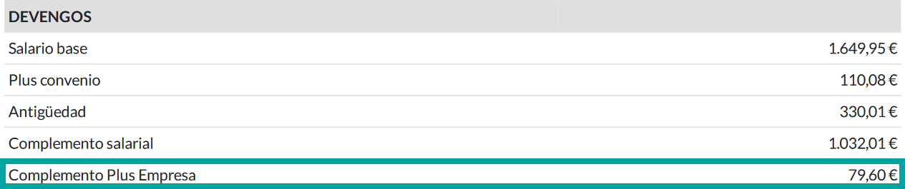