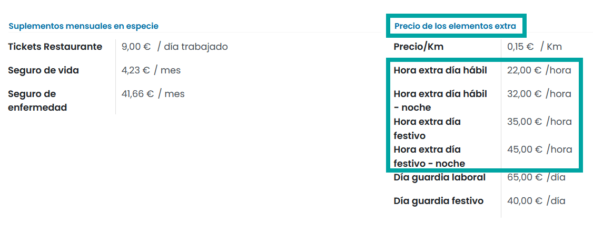

====================
Devengos especiales
====================

Cálculos
=============

Calcular la disponibilidad diaria
------------------------------------

El **plus de disponibilidad diaria** se da cuando, por las características del puesto, el empleado tiene que estar
disponible fuera de la jornada ordinaria. Existen muchas profesiones que requieren de este concepto, como, por ejemplo,
servicios técnicos, informáticos, agentes de seguridad, personal sanitario, etc.

El plus de disponibilidad diaria es una retribución que se da al empleado por el hecho de estar disponible para
trabajar durante cualquier hora del día si la situación lo requiere. En función de si el día se considera laboral o
festivo se pagará un importe u otro. En función del convenio o contrato del empleado se pagan unas cantidades
determinadas por día.

La disponibilidad no responde a una actividad extraordinaria, por lo que la disponibilidad en sí, no equivale a
realizar ninguna actividad laboral, si no a la aceptación de estar disponible para realizarla. Si un empleado realiza
una actividad fuera de su jornada de trabajo habitual deberá compensarse como horas extraordinarias,
independientemente que el empleado disponga del plus de disponibilidad.

Para diferenciar el coste entre la disponibilidad en día laboral o en festivo, será necesario informar en el
contrato del empleado, sobre el apartado **Precio de elementos extra**, el precio del día de guardia que corresponda.

Para ello, navega a la pantalla :menuselection:`Empleados --> Contratos`, y accede al detalle de un contrato.

Desde la pestaña **Información del salario** se puede informar el precio de la disponibilidad mediante los campos
**Día de guardia laboral** y **Día de guardia festivo**.

Existen dos **reglas salariales** distintas, una para **días laborales** y otra para **días festivos**.
Cada regla dispone de un parámetro de entrada que permitirá indicar sobre la nómina, los días de guardia y festivos
de guardia que ha realizado el empleado.

Para calcular el valor de la **disponibilidad en días laborales**, se realiza el siguiente cálculo:

- **Expresión**:

``result = contract.guardia_dia_laboral * inputs.guardialaboral.amount``

- **Parámetros**:

    - **contract.guardia_dia_laboral**: Precio de la disponibilidad en día laboral disponible sobre el contrato.
    - **inputs.guardialaboral.amount**: Días laborales de disponibilidad. Lo introduce el gestor de la nómina manualmente cuando la gestiona.

La **regla salarial** correspondiente a la disponibilidad de días laborales se encuentra en la pantalla :menuselection:`Nómina --> Configuración --> Reglas salariales`.

Para calcular el valor de la **disponibilidad en días festivos**, se realiza el siguiente cálculo:

- **Expresión**:

``result = contract.guardia_dia_festivo * inputs.guardiadiafestivo.amount``

- **Parámetros**:

    - **contract.guardia_dia_festivo**: Precio de la disponibilidad en día festivo disponible sobre el contrato.
    - **inputs.guardiadiafestivo.amount**: Días festivos de disponibilidad. Lo introduce el gestor de la nómina manualmente cuando la gestiona.

La **regla salarial** correspondiente a la disponibilidad de días festivos se encuentra en la pantalla :menuselection:`Nómina --> Configuración --> Reglas salariales`.

En caso de crear nuevas **estructuras salariales** que requieran del uso de guardias, será necesario asociales
ambas reglas.

Al generar una **nómina**, dispondrás de las entradas correspondientes sobre la pestaña *Días trabajados y entradas* el apartado **Otras entradas**,
donde deberás informar los días de disponibilidad efectuados por el empleado antes de realizar el cálculo de la hoja.

El número de días se informa bajo el campo importe antes de realizar el cálculo de la hoja.

Al realizar el cálculo de la **nómina**, se podrán visualizar en la pestaña Cálculo de la nómina las líneas
correspondientes con el importe total de los días de disponibilidad.

Una vez realizado el cálculo, al realizar la impresión de una nómina, el nuevo devengo aparecerá sobre los
**devengos especiales** en una línea independiente.

Calcular las horas extras
-----------------------------

Las **horas extraordinarias** son las horas de trabajo que se realizan voluntariamente sobre la duración máxima de la
jornada ordinaria establecida en el contrato y/o convenio. Según el estatuto de los trabajadores, se puede optar,
mediante convenio colectivo o contrato individual, entre abonarlas o compensarlas por tiempos de descanso retribuido.

Las horas extraordinarias de fuerza mayor son aquellas horas extras obligatorias para el trabajador, exigidas por
la necesidad de reparar siniestros u otros daños extraordinarios y urgentes, así como en los casos de riesgo de
pérdida de materias primas.

El precio por el que se paga una hora extra puede estar definido sobre el contrato y/o convenio y suele variar
entre si se realizan en periodo diurno o nocturno, y en día laboral o día festivo.

Para diferenciar el coste entre hora extra en día laboral, hora extra en noche laboral, hora extra en día festivo
y hora extra en noche festiva, será necesario informar en el contrato del empleado, sobre el apartado
**Precio de elementos extra**, el precio de las horas que corresponda. Para ello, navega a la pantalla
:menuselection:`Empleados --> Contratos`, y accede al detalle de un contrato.

Desde la pestaña **Información del salario** se puede informar el precio de las **horas extras** mediante los campos
correspondientes.

Existen dos categorías distintas para agrupar las horas extras en función de si son horas extras corrientes o
horas extras de fuerza mayor (tributan de forma distinta).

Las categorías se pueden consultar desde la pantalla :menuselection:`Nómina --> Configuración --> Categorías de reglas salariales`.

Bajo cada categoría se incorporan cuatro reglas distintas que hacen referencia a:
- Horas extras día laboral
- Horas extras noche laboral
- Horas extras día festivo
- Horas extras noche festiva

Las reglas se pueden consultar desde la pantalla :menuselection:`Nómina --> Configuración --> Reglas salariales`.

Cada regla dispone de un parámetro de entrada que permitirá indicar, sobre la nómina, la cantidad de horas realizadas por el empleado.

Para calcular el valor de **horas extras diurnas en días laborales**, se realiza el siguiente cálculo:

- **Expresión**:

``result = contract.h_extra_dia_laboral * inputs.horalabdia.amount``

- **Parámetros**:

    - **contract.h_extra_dia_laboral**: Precio de la hora extra diurna en día laboral disponible sobre el contrato.
    - **inputs.horalabdia.amount**: Número de horas realizadas. Lo introduce el gestor de la nómina manualmente cuando la gestiona.

La **regla salarial** correspondiente a las horas extras diurnas en días laborales se encuentra en la pantalla Nómina > Configuración > Reglas salariales:

Para calcular el valor de **horas extras nocturnas en noches laborales**, se realiza el siguiente cálculo:

- **Expresión**:

``result = contract.h_extra_noche_laboral * inputs.horalabnoche.amount``

- **Parámetros**:

    - **contract.h_extra_noche_laboral**: Precio de la hora extra nocturna en día laboral disponible sobre el contrato.
    - **inputs.horalabnoche.amount**: Número de horas realizadas. Lo introduce el gestor de la nómina manualmente cuando la gestiona.

La **regla salarial** correspondiente a las horas extras nocturnas en noches laborales se encuentra en la pantalla Nómina > Configuración > Reglas salariales:

Para calcular el valor de **horas extras diurnas en días festivos**, se realiza el siguiente cálculo:

- **Expresión**:

``result = contract.h_extra_dia_festivo * inputs.horafestdia.amount``

- **Parámetros**:

    - **contract.h_extra_dia_festivo**: Precio de la hora extra diurna en día festivo disponible sobre el contrato.
    - **inputs.horafestdia.amount**: Número de horas realizadas. Lo introduce el gestor de la nómina manualmente cuando la gestiona.

La **regla salarial** correspondiente a las horas extras diurnas en días festivos se encuentra en la pantalla Nómina > Configuración > Reglas salariales:

Para calcular el valor de **horas extras nocturnas en días festivos**, se realiza el siguiente cálculo:

- **Expresión**:

``result = contract.h_extra_noche_festivo * inputs.horafestnoche.amount``

- **Parámetros**:

    - **contract.h_extra_noche_festivo**: Precio de la hora extra nocturna en día festivo disponible sobre el contrato.
    - **inputs.horafestnoche.amount**: Número de horas realizadas. Lo introduce el gestor de la nómina manualmente cuando la gestiona.

La **regla salarial** correspondiente a las horas extras nocturnas en días festivos se encuentra en la pantalla Nómina > Configuración > Reglas salariales:

Para calcular el valor de **horas extras de fuerza mayor diurnas en días laborables**, se realiza el siguiente cálculo:

- **Expresión**:

``result = contract.h_extra_dia_laboral * inputs.horalabdiafm.amount``

- **Parámetros**:

    - **contract.h_extra_dia_laboral**: Precio de la hora extra diurna en día laboral disponible sobre el contrato.
    - **inputs.horalabdiafm.amount**: Número de horas realizadas. Lo introduce el gestor de la nómina manualmente cuando la gestiona.

La **regla salarial** correspondiente a las horas extras de fuerza mayor diurnas en días laborables se encuentra en la pantalla Nómina > Configuración > Reglas salariales:

Para calcular el valor de **horas extras de fuerza mayor nocturnas en días laborables**, se realiza el siguiente cálculo:

- **Expresión**:

``result = contract.h_extra_noche_laboral * inputs.horalabnochefm.amount``

- **Parámetros**:

    - **contract.h_extra_noche_laboral**: Precio de la hora extra nocturna en día laboral disponible sobre el contrato.
    - **inputs.horalabnochefm.amount**: Número de horas realizadas. Lo introduce el gestor de la nómina manualmente cuando la gestiona.

La **regla salarial** correspondiente a las horas extras de fuerza mayor nocturnas en días laborables se encuentra en la pantalla Nómina > Configuración > Reglas salariales:

Para calcular el valor de horas **extras de fuerza mayor diurnas en días festivos**, se realiza el siguiente cálculo:

- **Expresión**:

``result = contract.h_extra_dia_festivo * inputs.horafestdiafm.amount``

- **Parámetros**:

    - **contract.h_extra_dia_festivo**: Precio de la hora extra diurna en día festivo disponible sobre el contrato.
    - **inputs.horafestdiafm.amount**: Número de horas realizadas. Lo introduce el gestor de la nómina manualmente cuando la gestiona.

La **regla salarial** correspondiente a las horas extras de fuerza mayor diurnas en días festivos se encuentra en la pantalla Nómina > Configuración > Reglas salariales:

Para calcular el valor de **horas extras de fuerza mayor nocturnas en días festivos**, se realiza el siguiente cálculo

- **Expresión**:

``result = contract.h_extra_noche_festivo * inputs.horafestnochefm.amount``

- **Parámetros**:

    - **contract.h_extra_noche_festivo**: Precio de la hora extra nocturna en día festivo disponible sobre el contrato.
    - **inputs.horafestnochefm.amount**: Número de horas realizadas. Lo introduce el gestor de la nómina manualmente cuando la gestiona.

La **regla salarial** correspondiente a las horas extras de fuerza mayor nocturnas en días festivos se encuentra en la pantalla Nómina > Configuración > Reglas salariales:

En caso de crear nuevas **estructuras salariales** que requieran del uso de horas extras u horas extras de fuerza
mayor, será necesario asociarles todas las reglas mencionadas previamente.

Al generar una nómina, dispondrás de las entradas correspondientes sobre la pestaña *Días trabajados y entradas*, en el apartado **Otras entradas**, donde
deberás informar las horas efectuadas por el empleado antes de realizar el cálculo de la hoja.

El número de horas se informa bajo el campo **importe** antes de realizar el cálculo de la hoja.

Al realizar el cálculo de la nómina, se podrán visualizar en la pestaña **Cálculo de la nómina**,
las líneas correspondientes con el importe total de las horas.

Una vez realizado el cálculo, al realizar la impresión de una nómina, el nuevo devengo aparecerá sobre los
**devengos especiales** de horas extras en líneas independientes.

