=====================================
Procesamiento y generación de nóminas
=====================================

Generación
===========

Procesar nóminas de forma agrupada
-------------------------------------

Para **generar varias nóminas de forma agrupada**, navega a la pantalla :menuselection:`Nómina --> Procesamiento nóminas`.

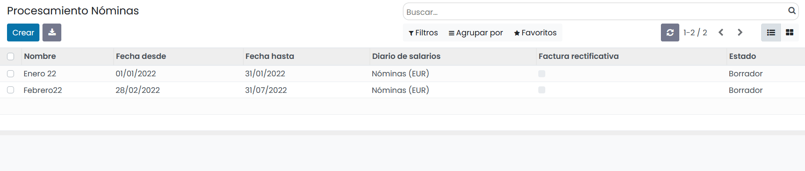

Al crear un **nuevo registro** será necesario informar el nombre, el período y el diario de salarios asociado.

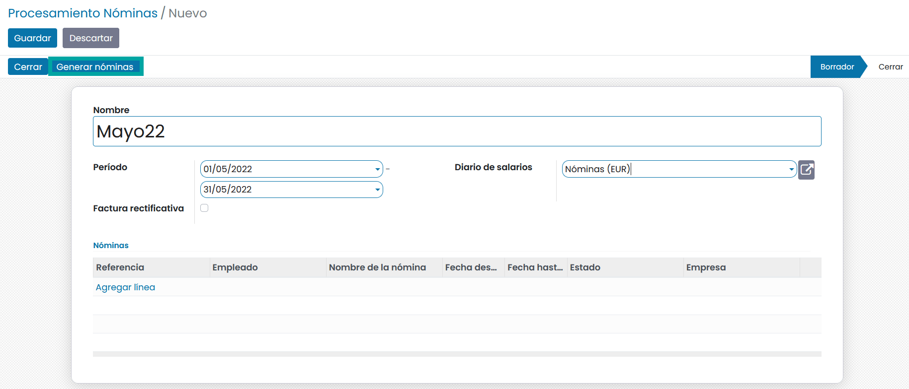

Posteriormente, pulsa el botón **Generar**, que abrirá un desplegable con el que se podrán seleccionar
los empleados a los que se deberá generar la nómina.

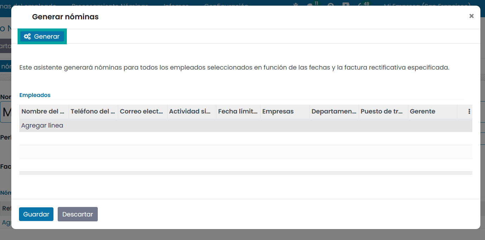

Al pulsar el enlace para **Agregar línea**, el sistema permitirá seleccionar de entre el listado de empleados
de la aplicación,

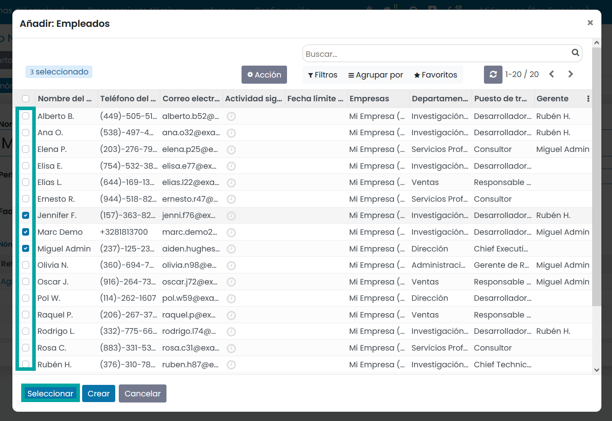

Una vez seleccionados los empleados, se deberá pulsar el botón **Generar**.

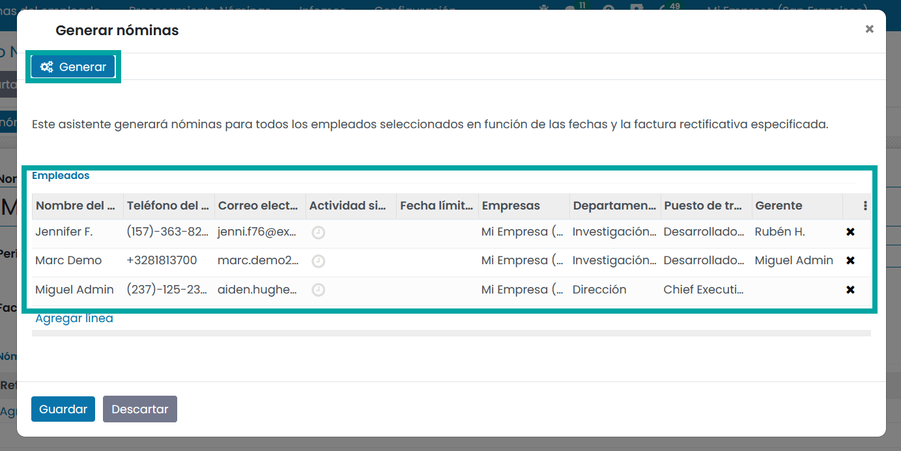

Esta acción generará un **borrador de nómina** para cada empleado seleccionado.

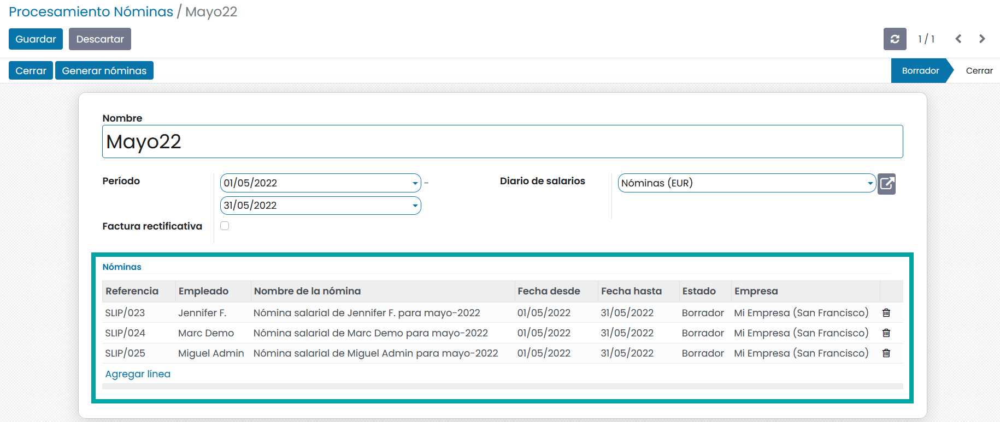

Al pulsar sobre cualquiera de las líneas de nómina, podrás acceder al detalle, desde donde se podrá gestionar
su información.

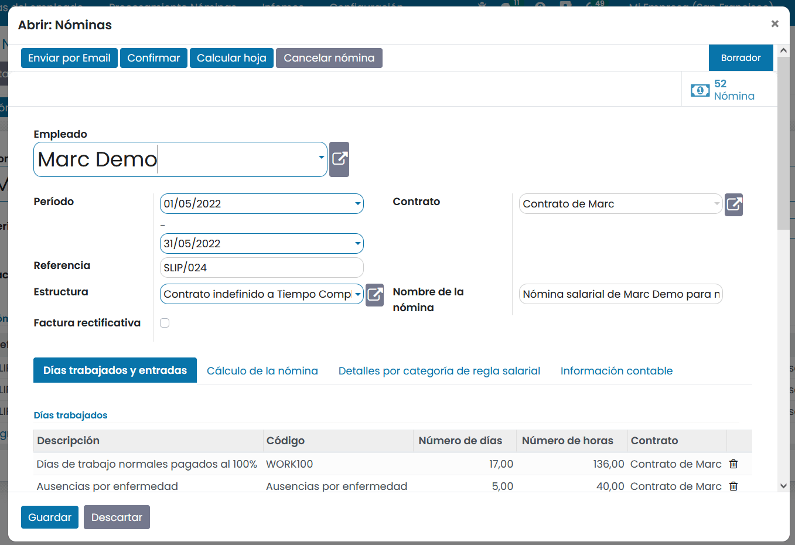

Automatizar la generación de nóminas
---------------------------------------

Desde daeris es posible **automatizar la generación de nóminas** en bloque para generar un borrador de nómina de cada
empleado que disponga de contrato en vigor (estado igual a **En proceso**) para el mes en curso.

Esta acción puede resultar muy interesante en el caso de disponer de muchos empleados.

Para automatizar la generación de nóminas, navegar a la pantalla :menuselection:`Nómina --> Configuración --> Ajustes`
y marca la opción de Nómina automática. Esta acción mostrará tres opciones distintas:

    - **Principio de mes**: Mediante esta opción se generará un registro de procesamiento de nóminas el día 1 de cada mes que incluirá una nómina por cada empleado que disponga de contrato en vigor para el mes en curso. La hora en la que se ejecutará el alta de estas nominas será la misma en la que hayas activado el proceso.
    - **Fin de mes**: Mediante esta opción se generará un registro de procesamiento de nóminas el último día de cada mes que incluirá una nómina por cada empleado que disponga de contrato en vigor para el mes en curso. La hora en la que se ejecutará el alta de estas nominas será la misma en la que hayas activado el proceso.
    - **Fecha específica**: Mediante esta opción se generará un registro de procesamiento de nóminas el día informado de cada mes que incluirá una nómina por cada empleado que disponga de contrato en vigor para el mes en curso. La hora en la que se ejecutará el alta de estas nominas será la misma en la que hayas activado el proceso.

Al hacer clic sobre el botón **Guardar**, se creará la regla automática de generación de nóminas en el sistema.

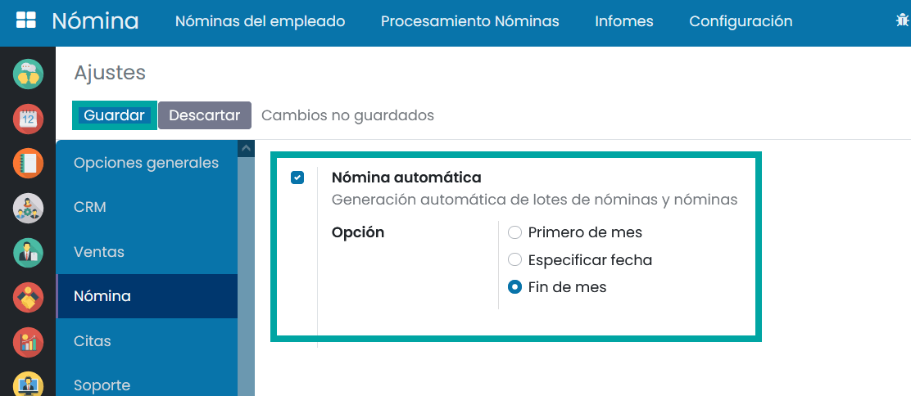

Una vez hecho esto, cada vez que se ejecute la regla, se creará un registro de procesamiento de nóminas del mes
en curso en estado **borrador**.

Será necesario incorporar el **diario** adecuado sobre el registro de procesamiento de nóminas.

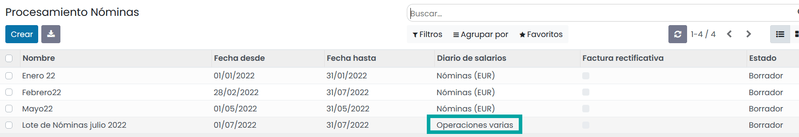

Entrega
========

Entregar las nóminas a los empleados
---------------------------------------

.. note::
   Según el artículo 29 del estatuto de trabajadores referente a la entrega de la nómina: “La liquidación y el pago del salario se harán puntual y documentalmente en la fecha y lugar convenidos o conforme a los usos y costumbres. El periodo de tiempo a que se refiere el abono de las retribuciones periódicas y regulares no podrá exceder de un mes. La documentación del salario se realizará mediante la entrega al trabajador de un recibo individual y justificativo del pago del mismo”.

Daeris , permite **imprimir las nóminas** en formato PDF para su posterior impresión a papel, en caso de querer
realizar la entrega de la nómina en formato físico. También se permite realizar el envío por correo electrónico
al empleado.

Para **imprimir una nómina** en formato PDF, navega a la pantalla :menuselection:`Nómina --> Nóminas del empleado`,
y desde el detalle de la nómina, selecciona la opción :menuselection:`Imprimir --> Nómina`.

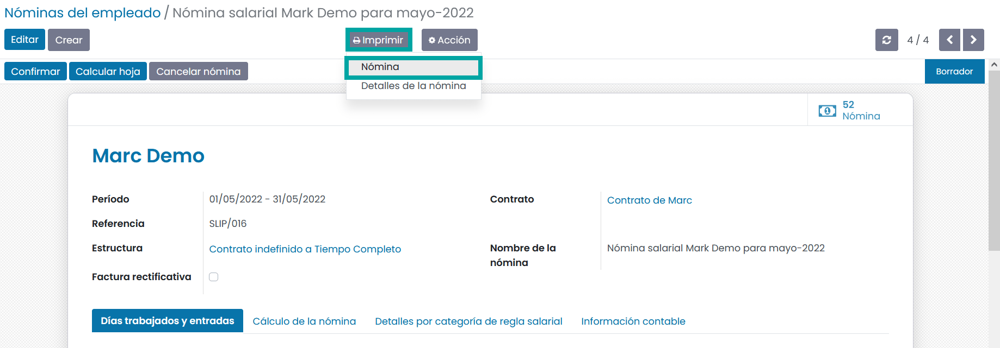

Esta acción generará un **fichero en formato PDF**, cuya impresión a papel será posible realizar desde
cualquier visor de ficheros PDF.

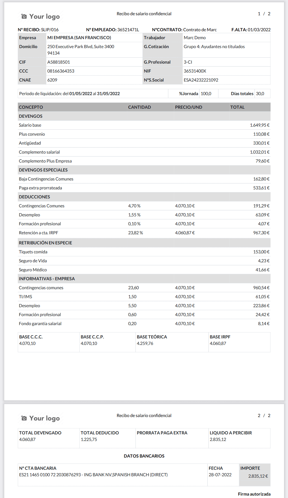

Desde el detalle de una nómina, también puedes **enviar por correo electrónico** a la dirección de email del empleado,
el registro de nómina correspondiente, pulsando el botón **Enviar por email**. Esta acción, solo es posible ejecutarla una unica vez.

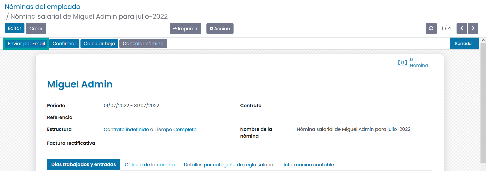

Del mismo modo, sobre el listado de nóminas del empleado, puedes seleccionar todas las nóminas que quieras enviar
por email de forma masiva, mediante la opción **Enviar nomina por email**.

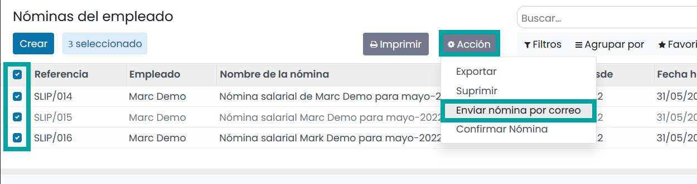

Esta acción abrirá un asistente de envío masivo desde donde puedes seleccionar las nóminas que quieres enviar.
Al enviar las nóminas, solo se enviarán aquellas que no se hubieran enviado con anterioridad, independientemente de que se hayan vuelto
se hubieran seleccionado.

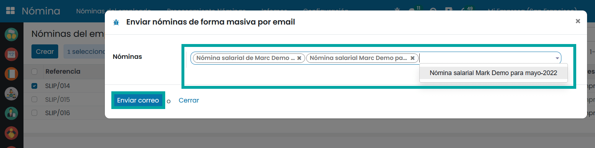

Una vez enviada, el empleado recibirá en su correo electrónico un email con la nómina generada en sistema.

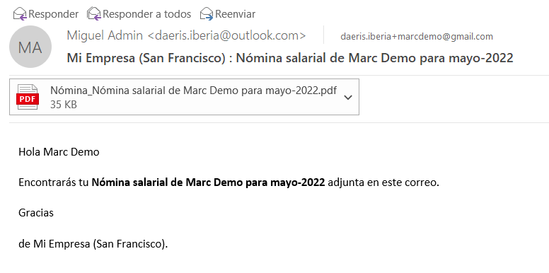
