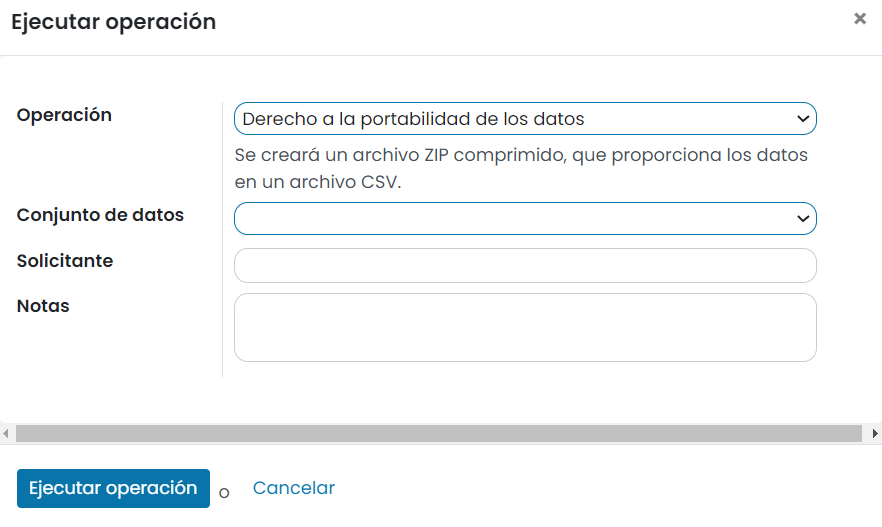
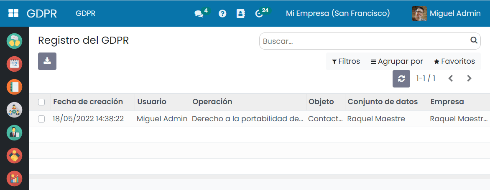
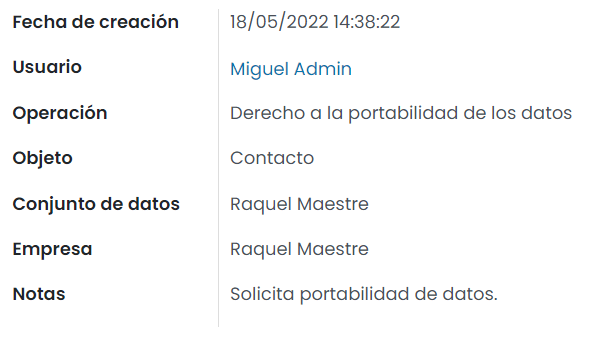

:show-content:

====
GDPR
====

La Unión Europea (UE) ha actualizado su normativa en materia de protección de datos. Esta nueva norma recibe el nombre
de Reglamento General de Protección de Datos (RGPD, en español o GDPR en inglés), y se aplica de forma general a todo
tipo de entidades, desde a autoridades públicas a pequeñas y medianas empresas, sin diferenciar si el tratamiento tiene
lugar dentro de la UE o fuera, siempre que afecte a ciudadanos europeos.

El GDPR pasó a ser de obligado cumplimiento el pasado 25 de mayo de 2018, cambiando algunos aspectos relevantes en el
tratamiento de datos personales por parte de las empresas.

Se anula “de facto” el **consentimiento** implícito que en muchos tratamientos de datos se venía haciendo y se implanta
un consentimiento expreso y explícito real. Con el nuevo reglamento, el consentimiento tiene que informar de cuáles van a
ser los objetivos del tratamiento y del responsable del mismo. Deberá informarse si los datos personales objeto del
tratamiento, van a ser gestionados en terceros países. Es recomendable que esta gestión internacional se realice en
países de la UE.

Con el nuevo reglamento aumentan los controles sobre los **proveedores con acceso a datos** sobre todo para los proveedores
de fuera de la UE. Estos deberán ser más exhaustivos y contractualmente se regularán todos aquellos aspectos que inciden
en la seguridad de la información que se maneje. La comunicación de las incidencias de seguridad de los proveedores será,
por ejemplo, un aspecto a regular a la hora de ofrecer servicios por parte de un tercero.

Será necesario **actualizar los procedimientos y registros existentes** para su adecuación a la nueva normativa. El inicio
de cualquier operación de gestión de información y datos personales llevará implícita la filosofía de “privacy by default”.
Es decir que el planteamiento de cualquier nueva actividad tiene que pasar por proteger la privacidad de la información que
se maneje, desde el momento de su concepción.

Los procedimientos implantados tienen que reflejar la realidad de la entidad y han de poderse auditar en cualquier momento.
El nuevo reglamento prevé **nuevos procedimientos y controles** sobre la retención de la información, gestión de los backups y
otros aspectos prácticos del funcionamiento de cualquier entidad.

Cuando la gestión de datos pueda incurrir en un alto riesgo para los derechos y libertades de las personas, se debe llevar
a cabo un **análisis de riesgos sobre la protección de los datos de carácter personal** antes del inicio del tratamiento.

El GDPR refuerza los derechos que ya tenían las personas en cuanto a la gestión de sus datos personales y crea otros nuevos.
En concreto se trata del **derecho al olvido**, que posibilita la eliminación de los datos de los usuarios; el **derecho de
portabilidad**, que permite llevar los datos de un proveedor a otro y el **derecho de oposición** a que se realicen perfiles con
objetivos de marketing con la información de los usuarios.

Las incidencias que tenga repercusión en la seguridad de la información y de los datos personales tendrán que ser **comunicadas
a las autoridades de control en un plazo máximo de 72 horas**. Los **usuarios también deberán ser informados** de las incidencias
que afecten a sus datos personales.

El nuevo reglamento contempla la creación de la figura del **Delegado de Protección de Datos** (DPO, por sus siglas en inglés),
obligatoria para las entidades públicas y en aquellas empresas en que la gestión de datos personales sea crítica por formar
parte del núcleo de su negocio. Deberá informarse a la hora de recoger datos de los interesados de la identidad concreta y
datos de contacto del responsable que va a llevar a cabo esta recogida y gestión de la información o de su representante.

Por último, las entidades que gestionen datos personales deberán someterse a **auditorías periódicas** que revisen el estado de
los procedimientos de gestión de esos datos personales.

.. youtube:: P4_e5A-OmAY
    :align: right
    :width: 700
    :height: 394

Ejecutar una operación GDPR
===========================

Desde la pantalla :menuselection:`GDPR > GDPR > Ejecutar Operación`, puedes navegar a la vista de operaciones GDPR, en donde
aparece un formulario que te permite introducir la siguiente información:

-  **Operación**: Puedes seleccionar entre las siguientes opciones:

   -  **Derecho a la portabilidad de datos**: Al seleccionar esta opción, se creará un archivo ZIP comprimido,
      que proporciona los datos en un archivo CSV.

   -  **Derecho de supresión**: Mediante esta opción, el sistema intentará realizar la eliminación
      de los datos seleccionados. También se eliminarán los conjuntos de datos relacionados, que hacen referencia
      a estos datos. Se deben tener en cuenta la conservación de registros legales para algunos tipos de entidades,
      como, por ejemplo, los relacionados con derecho contable, tributario y aduanero. En estos casos, no se debería
      ejecutar esta opción. Si no es posible realizar la eliminación por razones técnicas, los datos se configurarán
      como inactivos y serán reemplazados por seudónimos.

   -  **Derecho de rectificación**: Al seleccionar esta opción se creará una entrada en el registro GDPR.
      La modificación de datos se deberá hacer manualmente.

   -  **Derecho a la limitación del tratamiento**: Al seleccionar esta opción, se establecerán los datos relacionados
      con el individuo como inactivos.

-  **Conjunto de Datos**: Puedes seleccionar entre los siguientes conjuntos de datos:

   -  Cliente Potencial/Oportunidad

   -  Contacto

   -  Usuarios

   -  Empleado

   -  Solicitante de empleo/candidato

-  **Solicitante**: Se debe especificar los datos del solicitante de la operación.

-  **Notas**: En este campo se pueden añadir notas relacionadas con la operación.

Una vez informados los campos necesarios, debes pulsar el botón *Ejecutar*, que llevará a cabo la operación seleccionada.

Consultar el registro GDPR
==========================

Para consultar el registro de operaciones GDPR ejecutadas, debes navegar a la pantalla :menuselection:`GDPR > GDPR > Registro GDPR`,
donde aparece un listado con todas las operaciones ejecutadas:

Si accedes al detalle de una operación, puedes consultar sus datos en modo formulario:

De esta manera, puedes visualizar el tipo de operación ejecutada, y el resto de datos asociados a la petición.