==================
Acuerdos de compra
==================

Hay dos tipos principales de **acuerdos de compra** preconfiguradas en Daeris: órdenes generales y convocatoria de ofertas.

#. Las órdenes generales son acuerdos a largo plazo entre una empresa y un proveedor para suministrar productos de forma
   recurrente con un precio predeterminado. Se recomienda que tu empresa considere la posibilidad de utilizarlos cuando
   compres con frecuencia los mismos productos al mismo proveedor en cantidades variables y/o en diferentes momentos.
   Entre sus muchas ventajas, puedes ahorrar tiempo, ya que se simplifica el proceso de compra, y dinero, ya que los
   precios al por mayor son mejores.

#. Las convocatorias de ofertas utilizan un procedimiento especial para solicitar ofertas a varios proveedores al mismo
   tiempo. Aunque las organizaciones del sector público suelen estar obligadas por ley a publicar convocatorias de ofertas
   cuando quieren adquirir bienes o servicios, las organizaciones privadas también pueden utilizarlas para conseguir la
   mejor oferta entre varios proveedores.

.. _inventario_y_fabricacion/compras/acuerdos/habilitar_acuerdos:

Habilitar los acuerdos de compra
================================

Para habilitar los acuerdos de compra, navega a la pantalla :menuselection:`Compra --> Configuración --> Ajustes` y
activa la opción **Acuerdos de compra**:

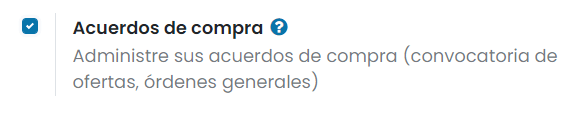

Una vez activado, pulsa el botón *Guardar* de la pantalla de ajustes.

.. _inventario_y_fabricacion/compras/acuerdos/crear_tipos_acuerdos:

Configurar o crear nuevos tipos de acuerdos de compra
=====================================================

Antes de empezar a utilizar los acuerdos de compra, asegúrate de haberlos configurado a tu gusto navegando a la pantalla
:menuselection:`Compra --> Configuración --> Tipo de acuerdo de compra`:

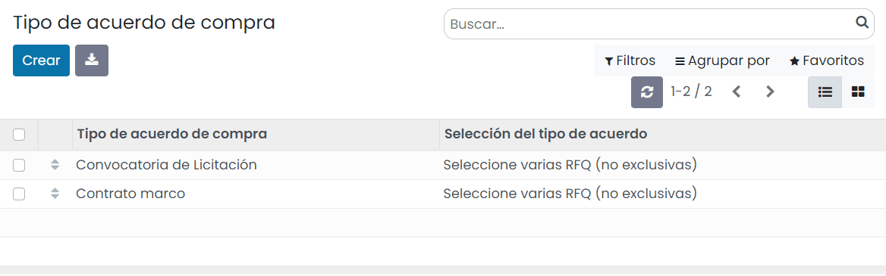

Una vez ahí, puedes editar las órdenes generales (*Contrato marco*) y las convocatorias de ofertas (*Convocatoria de Licitación*)
o *Crear* un nuevo tipo de acuerdo de compra. Al editar o crear un tipo de solicitud de compra, puedes encontrar un
formulario con los siguientes campos:

-  **Tipo de acuerdo de compra**: Nombre descriptivo del tipo de solicitud de compra.

-  **Selección del tipo de acuerdo**

   -  **Seleccionar solo una SdP (exclusivo)**: Permite seleccionar una única solicitud de presupuesto de todas las que
      hayan enviado los proveedores. Al seleccionar una solicitud el sistema rechazará el resto.

   -  **Seleccionar múltiples SdPs (no exclusivas)**: Permite seleccionar varias solicitudes de presupuesto.

-  **Líneas**

   -  **Utilizar líneas de acuerdo**: Las líneas que dispone el acuerdo se traspasarán directamente a las líneas del presupuesto.

   -  **No crear líneas de SdP automáticamente**: Se deberán informar las líneas sobre el presupuesto manualmente.

-  **Cantidades**

   -  **Utilizar cantidades de acuerdo**: Las cantidades de que dispone el acuerdo se traspasarán directamente a las
      cantidades del presupuesto.

   -  **Establecer cantidades manualmente**: Se deberán informar las cantidades sobre el presupuesto manualmente.

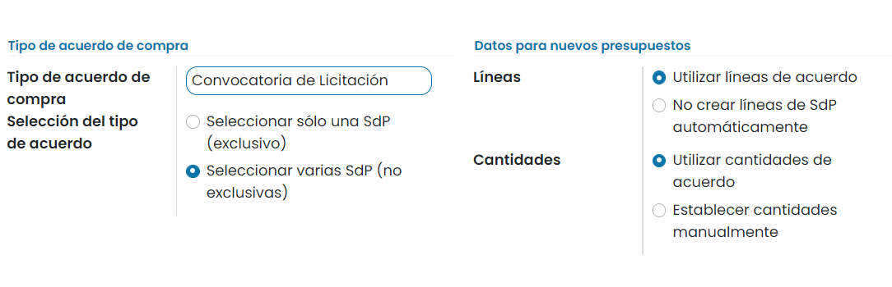

Una vez informados los campos necesarios, pulsa el botón *Guardar*

Establecer una orden general
============================

Para establecer una orden general, navega a la pantalla :menuselection:`Compra --> Pedidos --> Acuerdos de compra` y haz
clic en *Crear*.

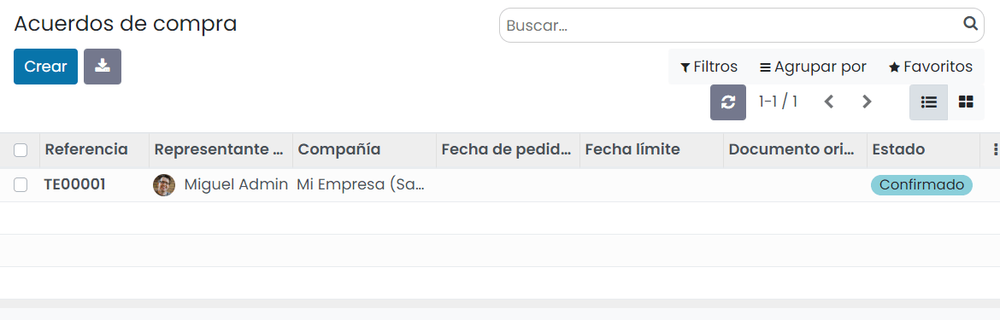

Selecciona *Contrato marco* como **Tipo de acuerdo de compra**. Después, selecciona el **Proveedor**. Los demás campos
no son obligatorios:

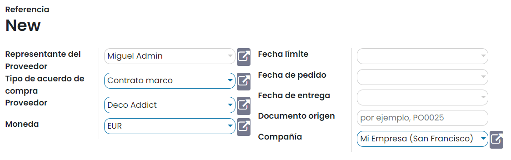

Después, añade los productos que deseas pedir y su precio. Ten en cuenta que también puedes añadir una cantidad para cada
producto, por ejemplo, si acordaste con tu proveedor pedir una cantidad mínima específica cada vez o en total. Si configuraste
tu orden general como *Establecer cantidades manualmente*, esto solo se utiliza con fines informativos:

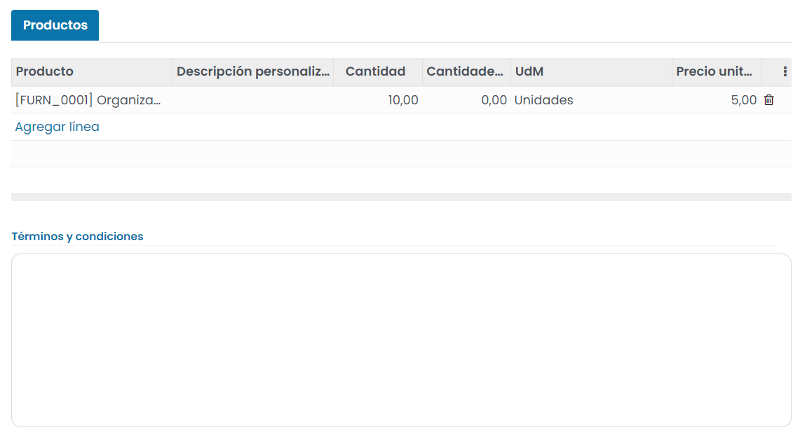

También puedes escribir los **Términos y condiciones** al final del acuerdo. Una vez que estés satisfecho con tu orden general,
haz clic en *Confirmar*. Su estado cambiará de *Borrador* a *En proceso* y estará listo para usarse:

Crear solicitudes de presupuesto a partir de la orden general
-------------------------------------------------------------

Ahora puedes crear nuevos presupuestos desde la orden general cada vez que lo necesites. Solo debes hacer clic en el botón
**Nuevo Presupuesto**:

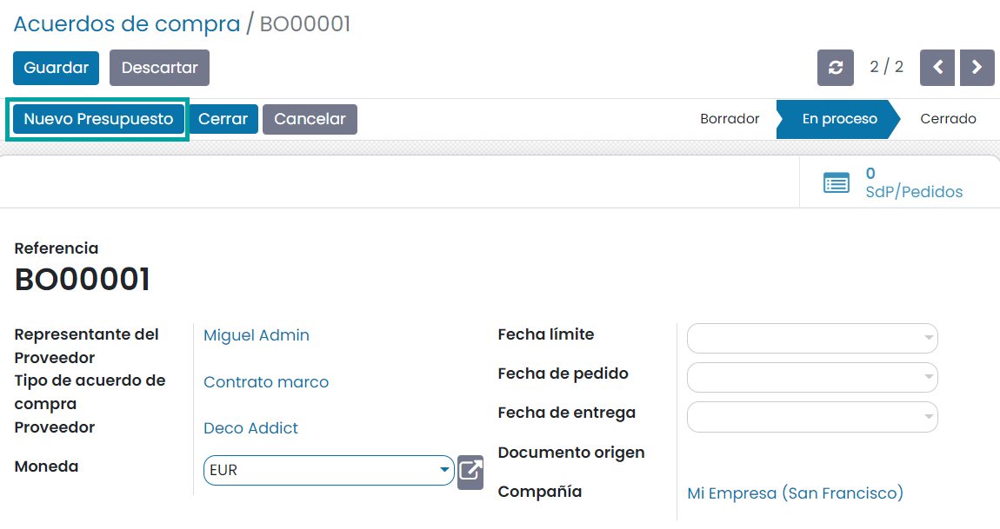

Daeris completará automáticamente las solicitudes de presupuesto con la información definida inicialmente cuando se
configuró la orden general. Dependiendo cómo configuró el tipo de acuerdo de compra, puede que también se completen
las líneas de productos:

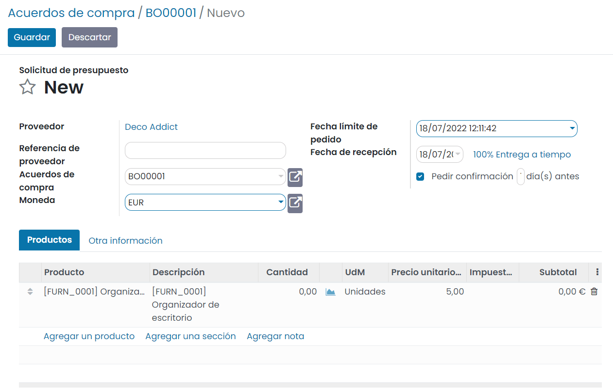

Podrás ver todas las solicitudes de presupuesto hechas a partir de la orden general al hacer clic en el botón **SdP/Pedidos**:

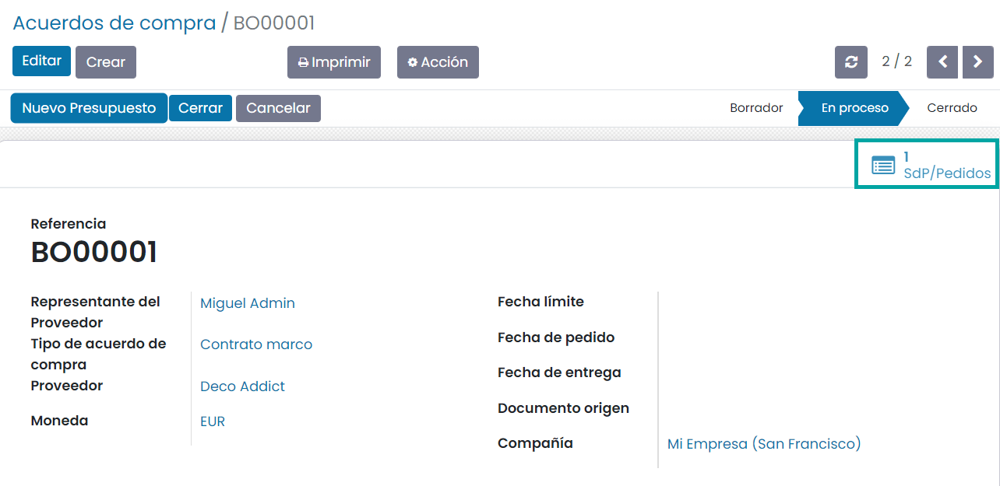

.. tip::
   También puedes crear una solicitud de presupuesto como lo harías normalmente, para después vincularla con una orden
   general existente.

Proponer una convocatoria de ofertas
====================================

Para proponer una convocatoria de ofertas, navega a la pantalla :menuselection:`Compra --> Pedidos --> Acuerdos de compra` y haz
clic en *Crear*.

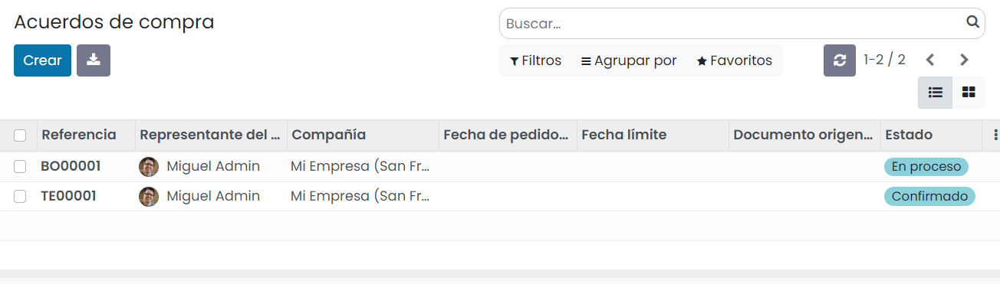

Selecciona *Convocatoria de Licitación* como **Tipo de acuerdo de compra**. Los otros campos no son obligatorios pero
puedes añadir la fecha de entrega y fijar una fecha límite. Por lo general, no se selecciona un proveedor para las
convocatorias de ofertas, ya que lo que se busca es obtener ofertas de varios proveedores:

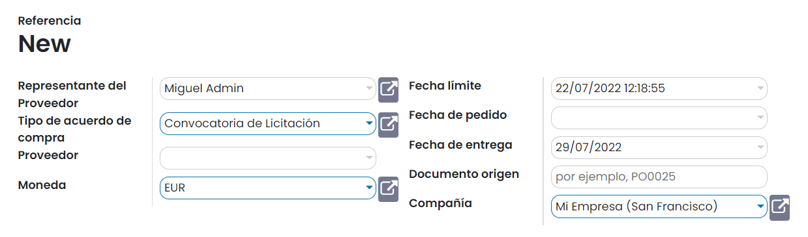

A continuación, añade los productos que deseas pedir y la cantidad. En el caso de las convocatorias de ofertas, lo
normal es no añadir el precio, ya que los proveedores deben ofrecerte su mejor precio:

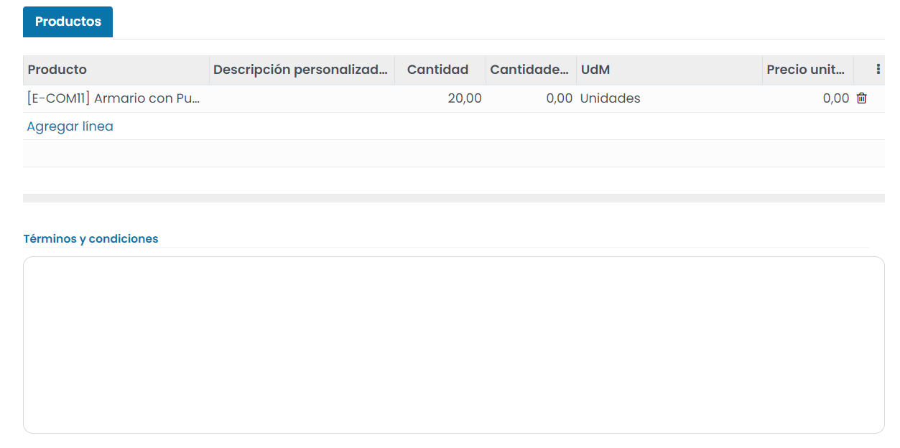

También puedes añadir tus términos y condiciones en la parte inferior del acuerdo. Una vez que hayas terminado, haz clic
en *Confirmar*:

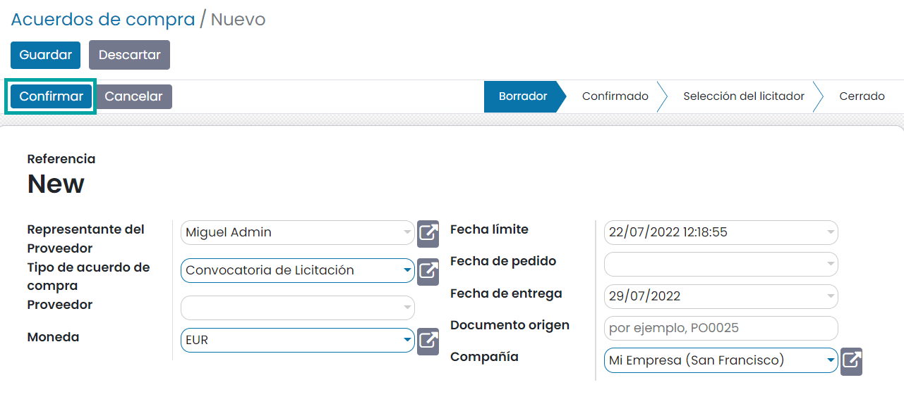

Solicitar presupuestos en la convocatoria de ofertas
----------------------------------------------------

Ahora puedes solicitar nuevos presupuestos provenientes de la convocatoria de ofertas. Haz clic en **Nuevo Presupuesto**:

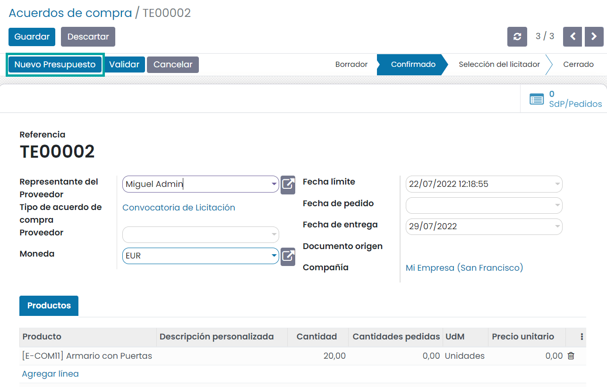

A continuación, selecciona uno de los proveedores que deseas invitar a la convocatoria de ofertas. Las líneas de producto también
deberían estar precompletadas, dependiendo de como configuraste el tipo de acuerdo de compra:

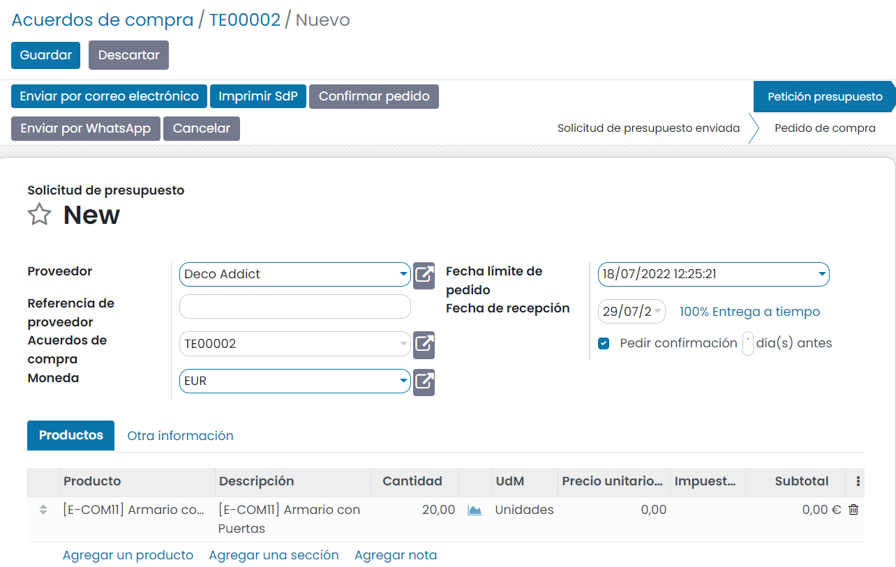

Haz clic en **Enviar por correo electrónico** para enviarlo al proveedor y vuelve a la convocatoria de ofertas para repetir
este proceso para cada proveedor.

Una vez que hayas recibido los presupuestos de cada proveedor, haz clic en **Validar** para continuar con la selección
del licitador. Después haz clic en **SdP/Pedidos** para ver todos los presupuestos de proveedor:

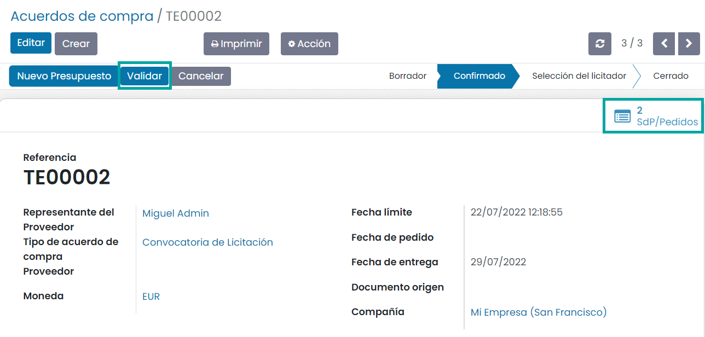

Haz clic en cada solicitud de presupuesto para añadir manualmente el precio que te hayan indicado tus proveedores:

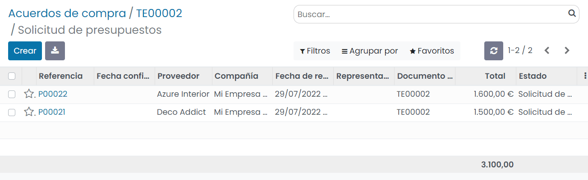

Confirmar el pedido de la convocatoria de ofertas
-------------------------------------------------

Una vez realizados los pasos anteriores, selecciona la mejor oferta y haz clic en **Confirmar pedido**:

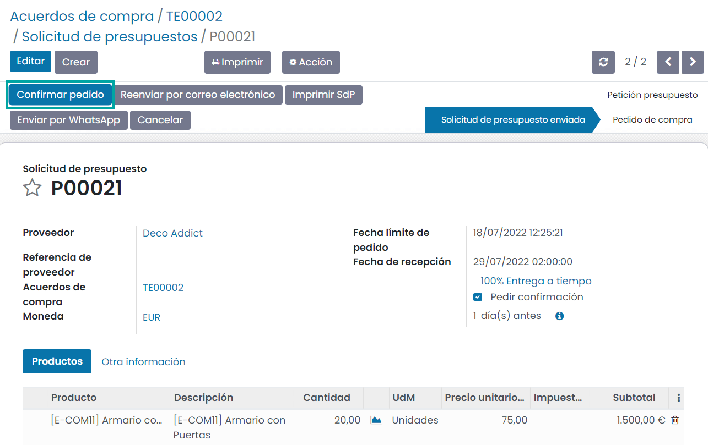

Finalmente, en función de la configuración del tipo de acuerdo, la convocatoria de ofertas se cerrará automáticamente, o
bien, se deberá cerrar de forma manual mediante el botón **Cerrar**:

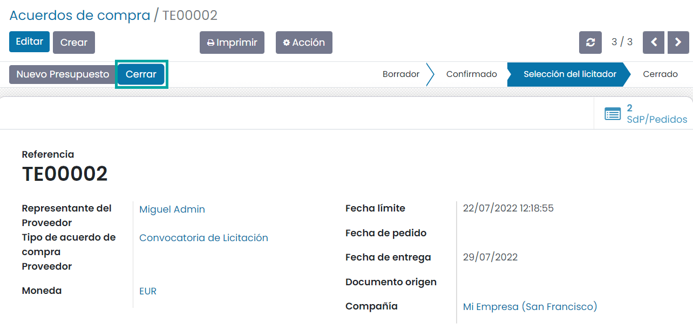

.. note::
   Si el cierre se debe hacer de forma manual, deberás confirmar o cancelar cada uno de las solicitudes de presupuesto
   asociadas al acuerdo.

Una vez cerrada la convocatoria de ofertas, el acuerdo pasará al estado *Cerrado*:

