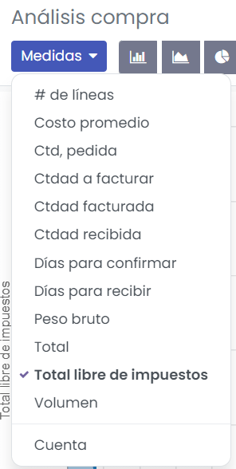

========
Informes
========

Analiza el rendimiento de tus compras
=====================================

Si tu empresa suele comprar productos, tienes varias razones para analizar su rendimiento. Realizar este análisis te
servirá para mejorar tus pronósticos y planificación de tus futuros pedidos. Por ejemplo, puedes evaluar si tu empresa
depende de ciertos proveedores y esta información puede ayudarte a negociar descuentos en los precios.

Para acceder al análisis de compras, navega a la pantalla :menuselection:`Compra --> Informes --> Compra`. De forma
predeterminada, el análisis de compras muestra un gráfico de líneas que presenta la cantidad sin impuestos de tus pedidos
de compra por día:

Aunque los datos presentados al principio son útiles, hay varias herramientas y funciones que puedes utilizar para obtener
aún más información sobre tus compras.

Usa filtros para seleccionar los datos necesarios
-------------------------------------------------

Daeris cuenta con varios filtros predeterminados que puedes usar y combinar al hacer clic en *Filtros*. Cuando se selecciona
algún filtro, Daeris busca todos los pedidos que coincidan con al menos un filtro seleccionado y completa el gráfico, las
métricas principales y la tabla dinámica con los datos. Los filtros preconfigurados son:

#. Todas las solicitudes de presupuesto

#. Todos los pedidos de compra, con excepción de los cancelados

#. La fecha de confirmación el año pasado incluye todos los pedidos que se confirmaron el año anterior, incluyendo los
   pedidos cancelados.

#. La fecha de pedido incluye todos los pedidos y solicitudes de presupuesto (incluyendo los cancelados), dependiendo de
   su fecha de creación.

#. La fecha de confirmación incluye todos los pedidos confirmados, incluso los cancelados, dependiendo de su fecha de
   confirmación.

.. tip::
   Si utilizas los filtros *Fecha de pedido* o *Fecha de confirmación*, la opción *Comparación* aparecerá junto a la de *Filtros*.
   Esto te permite comparar el periodo filtrado con el anterior.

Gracias a las opciones de filtros entre las que puedes elegir, las posibilidades de personalización de tus datos son casi
ilimitadas. Selecciona :menuselection:`Filtros --> Añadir filtro personalizado`, especifica la condición que debe cumplir
la opción de filtrado y haz clic en *Aplicar*. Si deseas seleccionar pedidos que cumplan varias condiciones a la vez, repite
el proceso para añadir otro filtro personalizado. Si deseas utilizar el operador *o*, haz clic en *Agregar condición*.

.. tip::
   Para evitar tener que volver a crear los filtros personalizados en cada ocasión, guárdalos haciendo clic en
   :menuselection:`Favoritos --> Guardar búsqueda actual --> Guardar`. A continuación, se puede acceder al filtro de
   búsqueda personalizado haciendo clic en *Favoritos* o incluso se puede establecer como filtro predeterminado al
   acceder al informe.

Selecciona las medidas deseadas
-------------------------------

Antes de seleccionar las medidas que deseas implementar, debes decidir si prefieres utilizar la vista de gráfico o la
vista de tabla dinámica. Puedes acceder a cada vista por separado haciendo clic en los iconos de la parte superior
derecha del informe:

Aunque existan varias medidas diferentes, solo puedes utilizar una a la vez:

En cambio, puedes agrupar la medida utilizando uno o varios de los grupos:

En el caso de los gráficos de barras y líneas, la medida seleccionada es el eje Y, y el primer grupo que selecciones se
utilizará para crear el eje X. Si se añaden más grupos, se añaden líneas adicionales (gráfico de líneas) o el gráfico de
barras se transforma en un gráfico de barras apiladas. En el caso de los gráficos circulares, mientras más grupos se
seleccionen, se mostrarán más secciones.

Explorar datos
--------------

La vista de tabla dinámica te permite analizar tus datos con gran detalle. Al contrario de la vista de gráfico, la vista
de tabla dinámica permite añadir varias medidas al mismo tiempo. Si haces clic en los botones de *Medidas* o *+* ubicados
en la columna de *Total*, podrás agregar todas las medidas que desees, cada una en una nueva columna. Si haces clic en el
botón *+* ubicado en la fila de *Total*, podrás agregar *Grupos*. Si haces clic en el botón *+* de un grupo, podrás añadir
un subgrupo y así sucesivamente:

.. seealso::
   * :ref:`productividad/informes/analizar_datos`