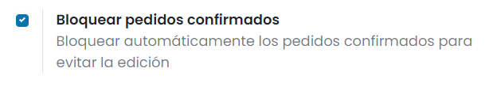

=============
Configuración
=============

.. _inventario_y_fabricacion/compras/presupuestos_pedidos/aprobacion_importe:

Solicitar a administradores que aprueben pedidos superiores a un importe mínimo
===============================================================================

Es posible solicitar a los administradores que aprueben pedidos superiores a un importe mínimo. Para activar esta función,
navega a la pantalla :menuselection:`Compra --> Configuración --> Ajustes` y activa la opción **Aprobación de pedido de compra**:

En el campo **Importe mínimo**, informa el importe a partir del cuál se solicitará aprobación al administrador.

Una vez hecho esto, pulsa el botón *Guardar* de la pantalla de ajustes.

A partir de ese momento, los usuarios que no dispongan de perfil administrador en la aplicación de compras, cuando realicen
una solicitud de presupuesto por un importe mayor al importe mínimo definido, necesitarán de aprobación de un administrador
para poder confirmar el pedido, quedando el mismo en estado *Para aprobar*:

El administrador tendrá la opción de aprobar el pedido mediante el botón **Aprobar pedido**:

Una vez aprobado el pedido, el estado cambia a *Pedido de compra*:

.. _inventario_y_fabricacion/compras/presupuestos_pedidos/recibir_advertencias:

Recibir advertencias en pedidos de productos o proveedores
==========================================================

Activar las advertencias de compra
----------------------------------

Es posible recibir mensajes de advertencia en pedidos de ciertos productos o proveedores de la aplicación. Para ello,
navega a la pantalla :menuselection:`Compra --> Configuración --> Ajustes` y activa la opción
**Avisos**:

Una vez hecho esto, pulsa el botón *Guardar* de la pantalla de ajustes.

Recibir una advertencia al comprar un producto
----------------------------------------------

Para recibir una advertencia al comprar un producto, navega al detalle de un producto desde la pantalla
:menuselection:`Compra --> Productos --> Productos` y desde la pestaña de *Compra* informa el campo
**Aviso cuando compra este producto**:

-  **Sin mensaje**: No se muestra ninguna advertencia para este producto.

-  **Alerta**: Se muestra una alerta al comprar este producto.

-  **Mensaje de bloqueo**: Se muestra una excepción con el mensaje y se bloquea el flujo.

Una vez configurada la advertencia, pulsa el botón *Guardar* del formulario del producto.

A partir de ese momento, al crear una solicitud de presupuesto de compra y seleccionar ese producto, se mostrará la
alerta configurada:

Recibir una advertencia al comprar a un proveedor
-------------------------------------------------

Para recibir una advertencia al comprar a un proveedor, navega al detalle de un contacto desde la pantalla
:menuselection:`Contactos --> Contactos` y desde la pestaña de *Notas internas* informa el campo
**Aviso en el pedido de compra**:

-  **Sin mensaje**: No se muestra ninguna advertencia para este contacto.

-  **Alerta**: Se muestra una alerta al comprar a este contacto.

-  **Mensaje de bloqueo**: Se muestra una excepción con el mensaje y se bloquea el flujo.

Una vez configurada la advertencia, pulsa el botón *Guardar* del formulario del contacto.

A partir de ese momento, al crear una solicitud de presupuesto de compra y seleccionar ese proveedor, se mostrará la
alerta configurada:

.. _inventario_y_fabricacion/compras/presupuestos_pedidos/recordar_fecha_recepcion:

Recordar automáticamente la fecha de recepción a los proveedores
================================================================

Es posible enviar un correo electrónico a los proveedores de forma automática para que confirmen la fecha de entrega
de los pedidos de compra. Para activar esta función, navega a la pantalla :menuselection:`Compra --> Configuración --> Ajustes`
y activa la opción **Recordatorio de recibo**:

Una vez hecho esto, pulsa el botón *Guardar* de la pantalla de ajustes.

A partir de ese momento, al crear una solicitud de presupuesto de compra, podrás marcar la opción **Pedir confirmación**
para que el sistema envíe un correo de confirmación al proveedor X días antes de la fecha de recepción prevista:

Llegado el momento, el sistema realizará el envío del correo, solicitando confirmación al proveedor.

.. seealso::
   * :doc:`../../../varios/correo_electronico/enviar_correos`

.. _inventario_y_fabricacion/compras/presupuestos_pedidos/bloquear_pedidos:

Bloquear automáticamente los pedidos confirmados para evitar la edición
=======================================================================

Es posible bloquear los pedidos de compra para que no puedan ser modificados una vez confirmados. Para ello,
navega a la pantalla :menuselection:`Compra --> Configuración --> Ajustes` y activa la opción
**Bloquear pedidos confirmados**:

Una vez hecho esto, pulsa el botón *Guardar* de la pantalla de ajustes.

A partir de ese momento, tras confirmar una solicitud de presupuesto de compra, el pedido quedará bloqueado:

Al estar en estado bloqueado, el pedido no podrá ser modificado.

.. note::
   También es posible bloquear y desbloquear los pedidos de forma manual, mediante los botones ubicados en el formulario
   del pedido de compra.

.. _inventario_y_fabricacion/compras/presupuestos_pedidos/politica_facturacion:

Establecer la política de control de facturas predeterminada
============================================================

Puedes definir la manera en la cuál se manejan tus facturas de proveedor. En cuanto al pago de dichas facturas, puedes
pagar antes o después de haber recibido tus productos. También podrás ver un resumen del estado de facturación de cada
pedido de compra.

Primero, navega a la pantalla :menuselection:`Compra --> Configuración --> Ajustes` para establecer la política de
control de facturas predeterminada para todos los productos que se van a crear después:

Si seleccionas *Cantidades pedidas*, puedes crear una factura de proveedor al momento de confirmar un pedido. Las cantidades
incluidas en el pedido de compra se usarán para crear el borrador de factura.

En cambio, si seleccionas *Cantidades recibidas*, solo puedes crear una factura después de recibir algunos de los productos
pedidos. Se usarán las cantidades recibidas para generar el borrador de factura. Si intentas crear una factura sin haber
recibido ningún producto, obtendrás un mensaje de error.

Una vez seleccionada la opción correspondiente, pulsa el botón *Guardar* de la pantalla de ajustes.

Cambiar la política de control de un producto específico
--------------------------------------------------------

Si deseas modificar la política de control de un producto específico, navega al detalle de un producto desde la pantalla
:menuselection:`Compra --> Productos --> Productos`, haz clic en *Editar* y selecciona la pestaña de **Compra**. Ahí podrás
cambiar la política de control de facturas predeterminada de un producto:

Ver el estado de facturación de un pedido
-----------------------------------------

Una vez que confirmes un pedido, puedes ver su **Estado de facturación** yendo a la pestaña *Otra información*:

La siguiente lista contiene los diferentes estados de facturación y en qué momento se muestran, según la política de
control de facturación de los productos:

+---------------------------+-----------------------------------------------------------------------------------------------+
| **Estado de facturación** |                                         **Condiciones**                                       |
|                           +------------------------------------------------------------+----------------------------------+
|                           |           *Sobre cantidades recibidas*                     |    *Sobre cantidades pedidas*    |
+---------------------------+------------------------------------------------------------+----------------------------------+
|   *Nada para facturar*    |      Pedido confirmado; no se han recibido productos       |         *(No aplica)*            |
+---------------------------+------------------------------------------------------------+----------------------------------+
|      *Para facturar*      |    Todos/algunos productos recibidos; factura no creada    |        Pedido confirmado         |
+---------------------------+------------------------------------------------------------+----------------------------------+
|  *Totalmente facturado*   | Todos/algunos productos recibidos; factura borrador creada |      Factura borrador creada     |
+---------------------------+------------------------------------------------------------+----------------------------------+