================
Flujo de compras
================

Crear una solicitud de presupuesto de compra
============================================

Una **solicitud de presupuesto de compra** es un documento que el comprador facilita al vendedor e incluye los servicios
y/o productos que desea adquirir, así como las condiciones de la compra. Si finalmente se confirma dicha solicitud de
presupuesto, se procede a crear un pedido de compra.

Para crear una solicitud de presupuesto de compra navega a la pantalla :menuselection:`Compra --> Pedidos --> Solicitudes de presupuesto`,
y pulsa el botón *Crear*:

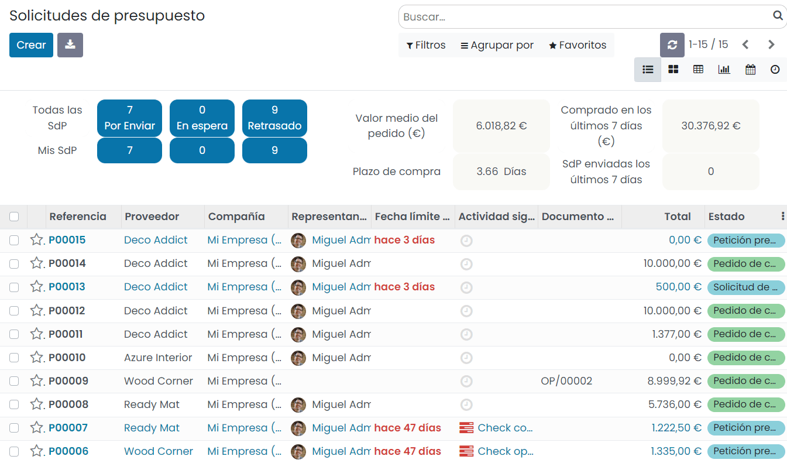

Al crear una nueva solicitud de presupuesto es posible informar los siguientes campos:

-  **Proveedor**: Proveedor del producto a comprar.

-  **Referencia de proveedor**: Referencia asociada al proveedor seleccionado.

-  **Moneda**: Moneda asociada a la solicitud de presupuesto.

-  **Fecha límite de pedido**: Fecha y hora del pedido. Se establece por defecto la fecha actual.

-  **Fecha de recepción**: Fecha prevista de recepción del pedido.

En la pestaña de **Productos** se deben seleccionar los productos a incorporar al presupuesto, así como información
relacionada. También es posible informar los términos y condiciones asociados al presupuesto:

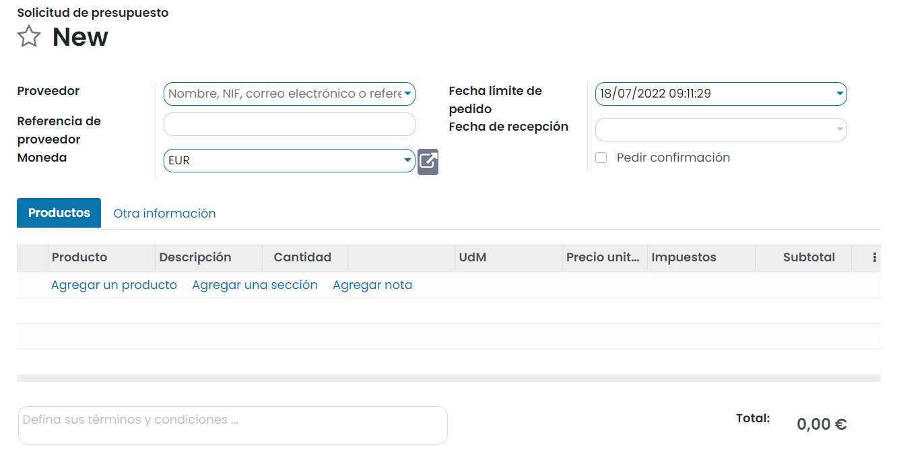

En la pestaña de **Otra información** se puede incorporar la siguiente información relacionada con el presupuesto:

-  **Representante de Compra**: Gestor de la empresa que contacta y negocia con el proveedor.

-  **Compañía**: Empresa asociada a la solicitud de presupuesto.

-  **Documento origen**: Referencia del documento que generó esta solicitud (por ejemplo, un pedido de cliente).

-  **Incoterm**: Términos de comercio internacional.

-  **Plazos de pago**: Plazos en los que se pagará el pedido.

-  **Posición fiscal**: Seleccionar la posición fiscal del pedido.

.. image:: flujo_compras/crear-sdp-3.png
   :align: center
   :alt: Crear una solicitud de presupuesto de compra (3)

Una vez completados los campos necesarios, pulsa el botón *Guardar*. Al guardar la solicitud, se genera un código de
solicitud de presupuesto que servirá para su posterior seguimiento:

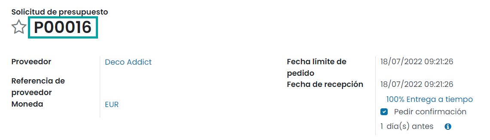

Imprimir una solicitud de presupuesto de compra
===============================================

Para descargar una solicitud de presupuesto de compra, navega a la pantalla :menuselection:`Compra --> Pedidos --> Solicitudes de presupuesto`
y accede al detalle de una solicitud. Al descargar la solicitud de presupuesto en formato PDF, puedes enviársela al
proveedor por correo, o imprimirla y dársela en persona. Para ello, pulsa el botón **Imprimir SdP**:

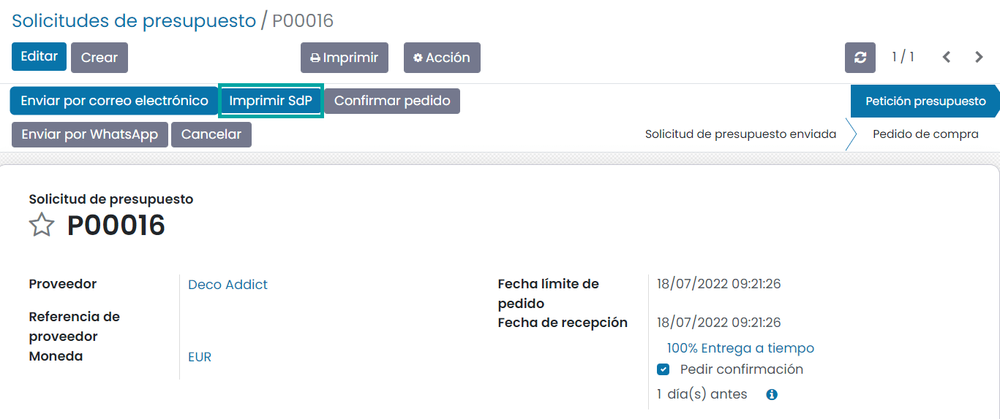

Al imprimir la solicitud de presupuesto, el sistema descargará una copia en formato PDF:

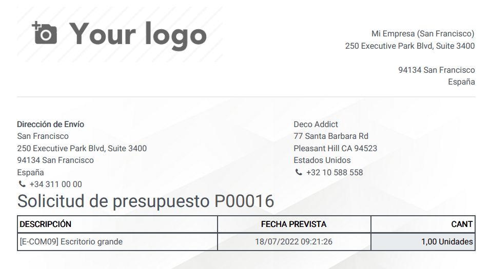

Además, se cambiará el estado de la solicitud de presupuesto a *Solicitud de presupuesto enviada*:

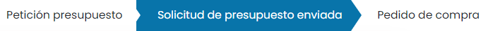

Enviar una solicitud de presupuesto de compra por correo electrónico
====================================================================

Para enviar una solicitud de presupuesto de compra por correo electrónico, navega a la pantalla :menuselection:`Compra --> Pedidos --> Solicitudes de presupuesto`,
accede al detalle de una solicitud y pulsa el botón **Enviar por correo electrónico**:

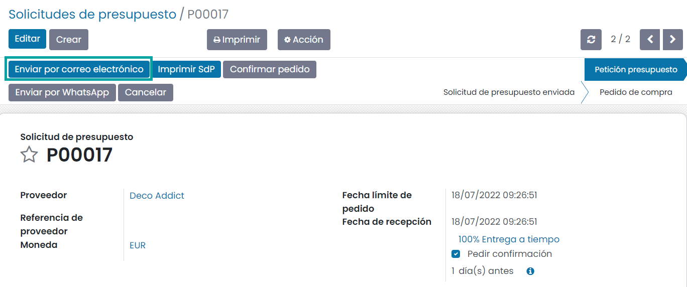

El sistema abrirá un asistente e informará la plantilla de correo electrónico de solicitud de presupuesto, anexando la
solicitud en formato PDF:

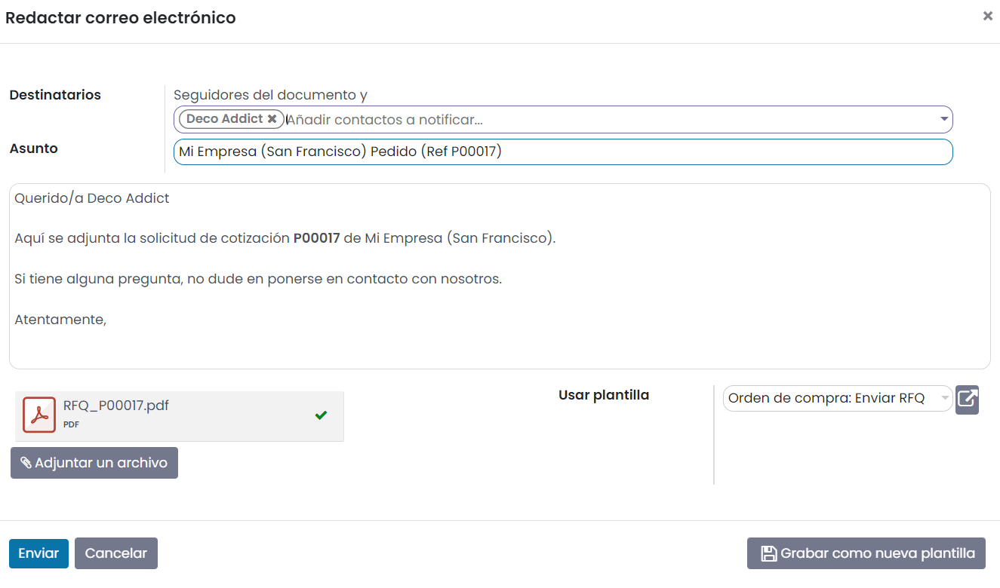

Una vez completados los campos necesarios pulsa el botón **Enviar**. Tras hacer esto, el estado de la solicitud de
presupuesto cambiará a *Solicitud de presupuesto enviada*:

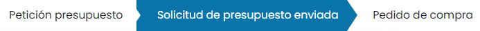

Pasados unos minutos, el proveedor recibirá un correo con la solicitud de presupuesto adjunta en formato PDF y un enlace
que le permitirá visualizar la solicitud dada de alta en el sistema:

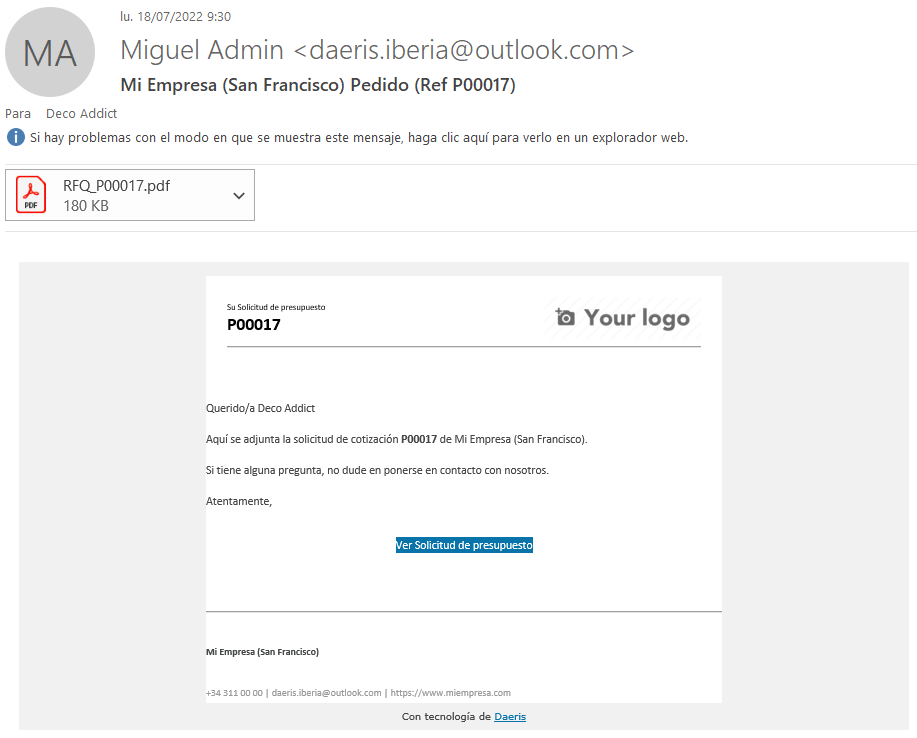

Si el proveedor pulsa el enlace de **Ver Solicitud de presupuesto**, podrá visualizar el detalle de la solicitud desde el
portal web:

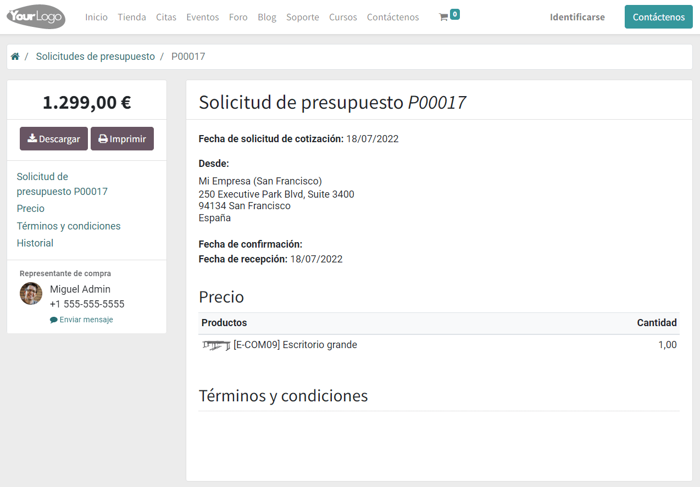

Por otro lado, si el proveedor responde al correo recibido, la respuesta se asocia a la solicitud de presupuesto original,
quedando disponible en la aplicación para su revisión por parte del equipo de compras.

.. seealso::
   * :doc:`../../../varios/correo_electronico/enviar_correos`
   * :doc:`../../../varios/correo_electronico/recibir_correos`

Confirmar un pedido de compra
=============================

Para confirmar un pedido de compra, navega a la pantalla :menuselection:`Compra --> Pedidos --> Solicitudes de presupuesto`
y accede al detalle de una solicitud.

Independientemente de la forma de contacto del proveedor con el gestor de la solicitud, cuando establecen comunicación y
llegan a un acuerdo, el gestor introduce los términos en la solicitud de presupuesto, informando el precio unitario de cada
uno de los productos a adquirir. Una vez ha establecido todos los términos sobre el presupuesto, debe confirmar el pedido
mediante el botón **Confirmar pedido**:

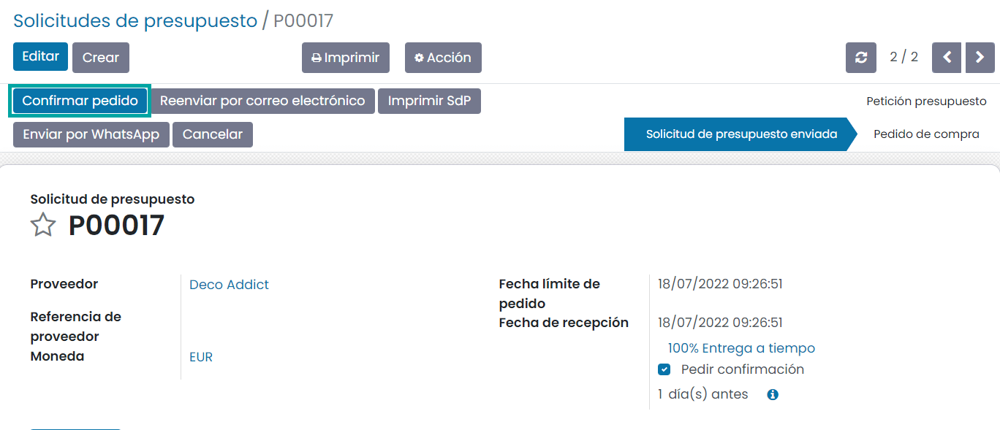

Esta acción transforma la solicitud de presupuesto en pedido de compra y genera una orden de recepción pendiente de
tramitar disponible mediante el botón de recepciones:

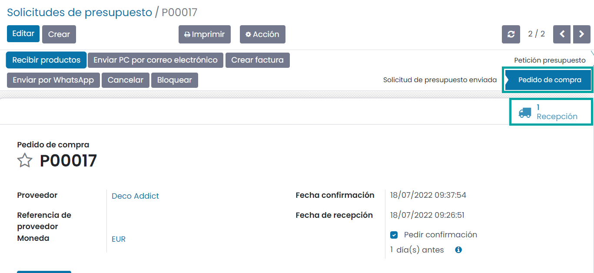

Recibir productos de un pedido de compra
========================================

Para recibir los productos de un pedido de compra, navega a la pantalla :menuselection:`Compra --> Pedidos --> Pedidos de compra`
y accede al detalle de un pedido. Una vez hayas recibido los productos del pedido, pulsa el botón **Recibir productos**:

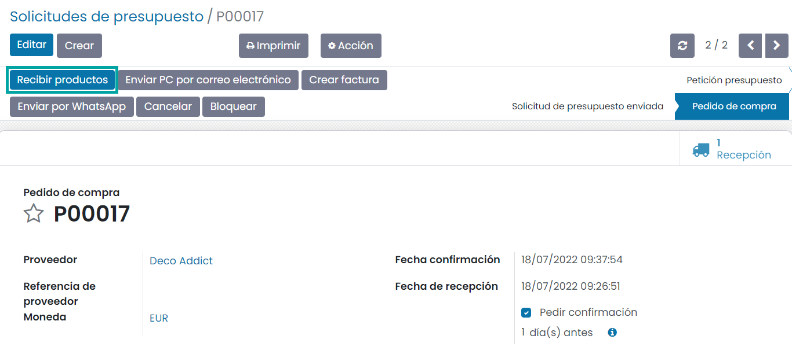

La aplicación navegará al detalle de la recepción del producto. A continuación, incorpora sobre cada línea de producto
las cantidades recibidas:

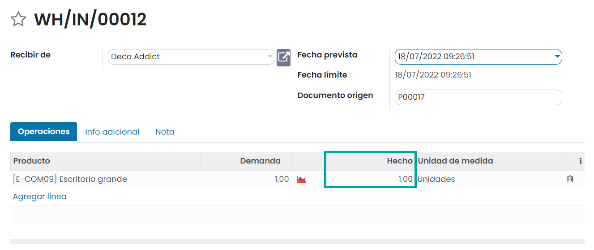

Si las cantidades recibidas concuerdan con las cantidades esperadas, puedes validar la recepción completa de los productos
mediante el botón **Validar**:

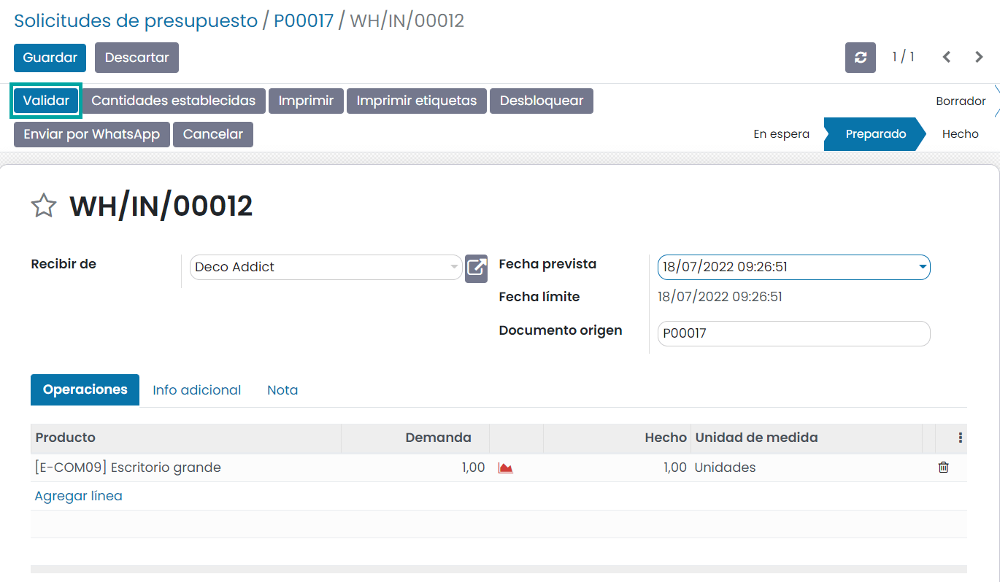

Al validar la recepción, se actualizará el estado de la misma a *Hecho*:

Crear la factura de un pedido de compra
=======================================

Para crear la factura de un pedido de compra, navega a la pantalla :menuselection:`Compra --> Pedidos --> Pedidos de compra`
y accede al detalle de un pedido. Sobre el pedido de compra, puedes crear la factura mediante el botón **Crear factura**:

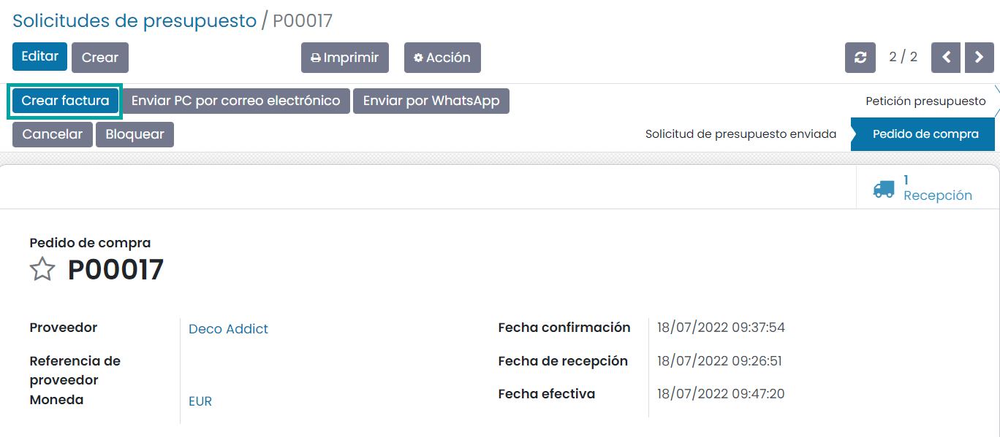

Esta acción generará un borrador de factura con los datos del pedido:

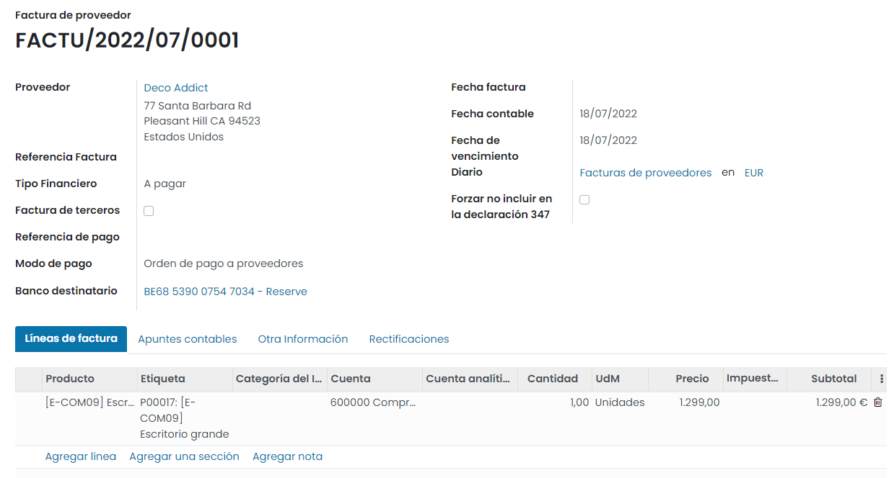

Una vez revisada la factura, pulsa el botón **Confirmar**:

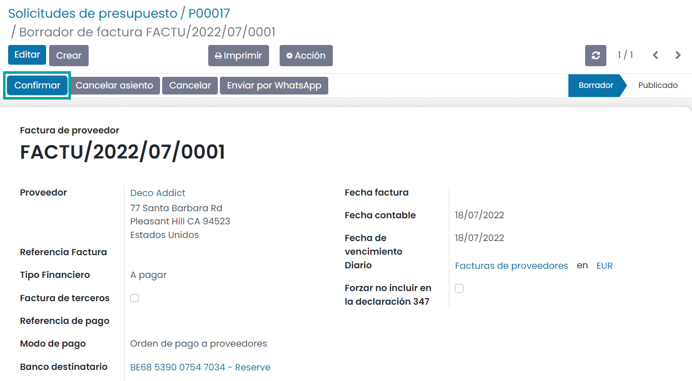

.. note::
   Si el sistema lo solicita, informa la **Fecha factura** para poder confirmar la misma.

Por último, pulsa el botón **Registrar pago**, para realizar los pagos correspondientes:

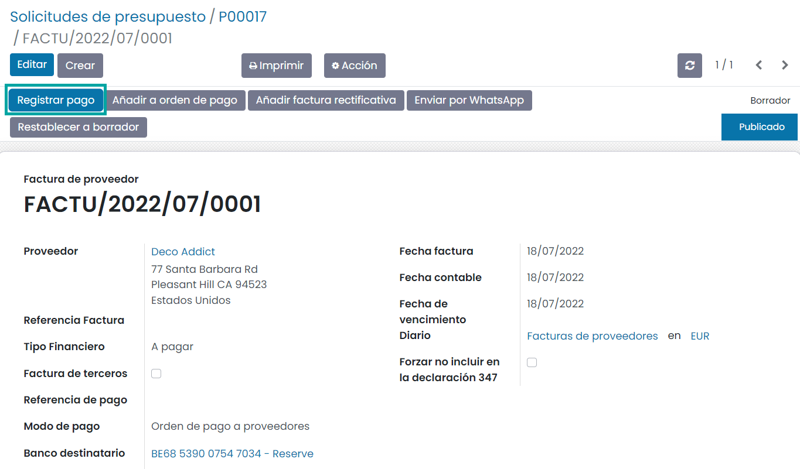

La aplicación desplegará un formulario donde especificar los detalles del pago:

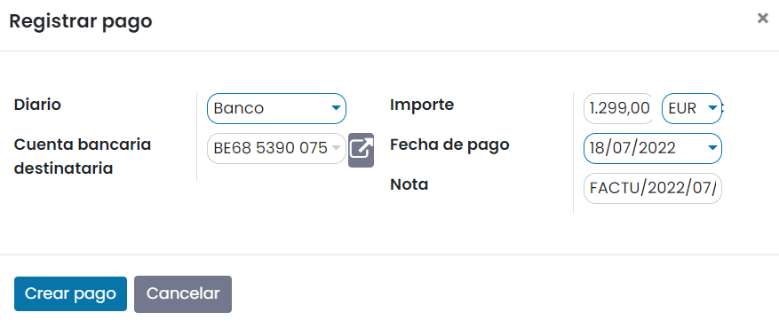

Una vez completados los campos necesarios, pulsa el botón *Crear pago*.

Si vuelves al detalle del pedido de compra, puedes consultar la factura emitida:

.. _compras/presupuestos_pedidos/enviar_whatsapp_pedidos_compra:

Enviar un mensaje de WhatsApp en un pedido de compra
====================================================

.. seealso::
   * :doc:`../../../varios/whatsapp`

Es posible enviar un WhatsApp a un proveedor desde el formulario de pedidos de compra. Para ello, debes navegar a la
pantalla :menuselection:`Compra --> Pedidos --> Pedidos de compra`, y acceder al detalle de un pedido.

Desde esta pantalla, aparecerá un botón que permitirá enviar un mensaje de WhatsApp:

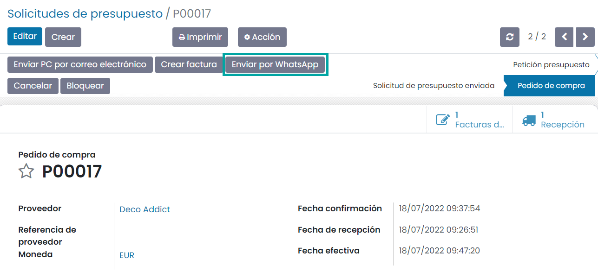

.. note::
   El número de teléfono móvil del proveedor debe estar informado con formato internacional (por ejemplo, +33123456789).

El sistema desplegará un formulario desde donde podrás redactar el mensaje de WhatsApp o seleccionar una plantilla que
informe el mensaje de forma automática:

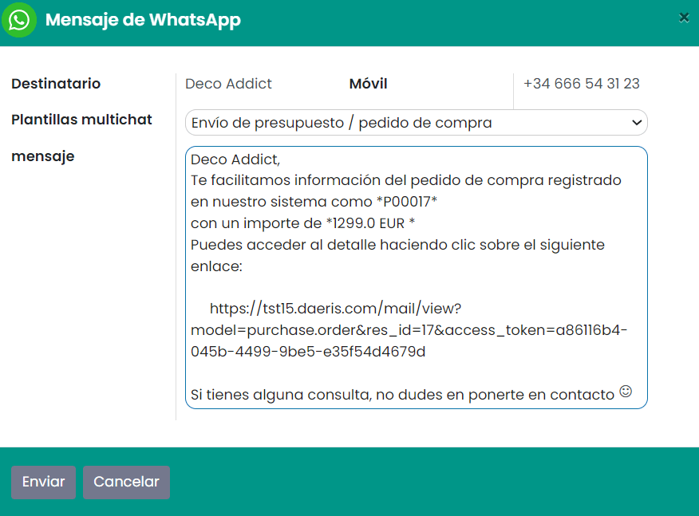

Una vez informado el mensaje, debes pulsar el botón *Enviar*.

En caso de estar conectado a la aplicación mediante un dispositivo de escritorio, el sistema tratará de establecer
conexión mediante la aplicación WhatsApp Web, para lo cual, habrá que escanear el código QR mostrado en pantalla, e
iniciar sesión en tu cuenta de WhatsApp.

Por otro lado, en caso de estar conectado a la aplicación mediante un dispositivo móvil, el sistema tratará de enviar
el mensaje mediante la aplicación WhatsApp instalada en el dispositivo.

Una vez enviado el mensaje desde WhatsApp, cierra la ventana del mensaje mediante la cruz ubicada en la parte superior
derecha del formulario:

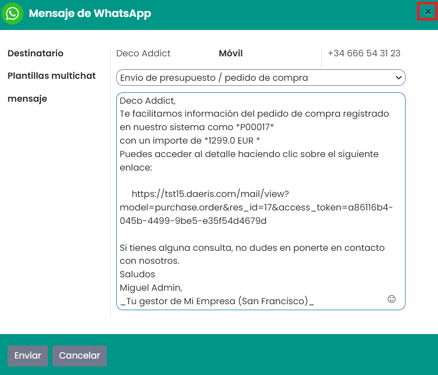