==============
Gestión básica
==============

Configuración
=============

.. _inventario_y_fabricacion/compras/productos/gestion_basica/diferentes_unidades_medida:

Comprar productos en diferentes unidades de medida
--------------------------------------------------

Una **unidad de medida** es una cantidad estandarizada de una determinada magnitud física, definida y adoptada por
convención o por ley. Cualquier valor de una cantidad física puede expresarse como un múltiplo de la unidad de medida.

Para comprar productos en diferentes unidades de medida, navega a la pantalla
:menuselection:`Ventas --> Configuración --> Ajustes` y activa la opción de **Unidades de medida**:

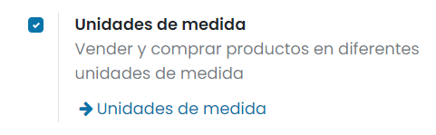

Una vez activado, pulsa el botón *Guardar* de la pantalla de ajustes.

Las unidades de medida de los productos se agrupan en categorías. De este modo, puedes disponer de una categoría (por
ejemplo, peso) que engloba varias unidades de medida (por ejemplo, gramos, kilos o toneladas).

Para gestionar las categorías de las unidades de medida, navega a la pantalla :menuselection:`Compra --> Configuración --> Categorías de las unidades de medida`.
Por defecto, dispones de las siguientes categorías:

-  Unidad

-  Peso

-  Horario de trabajo

-  Longitud/Distancia

-  Superficie

-  Volumen

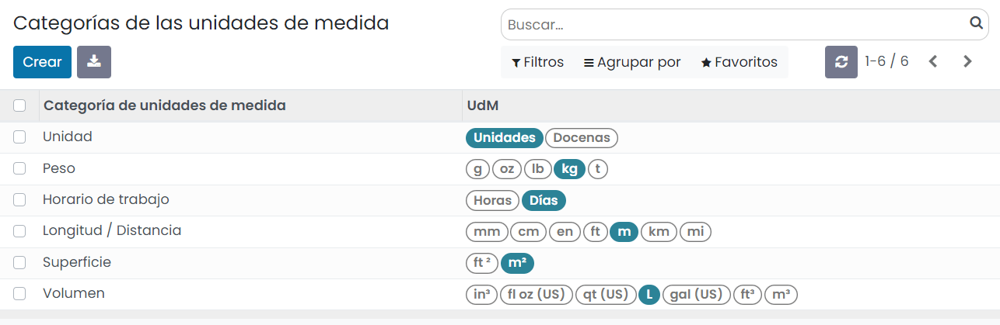

Para gestionar las unidades de medida, navega al formulario de detalle de una categoría:

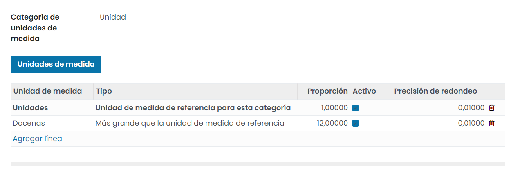

Al editar o crear una nueva unidad de medida, puedes encontrar los siguientes campos:

-  **Unidad de medida**: Nombre de la unidad de medida.

-  **Tipo**: Dispones de las siguientes opciones:

   -  **Unidad de medida de referencia para esta categoría**

   -  **Más pequeña que la unidad de medida de referencia**: Si seleccionas este valor, deberás informar la ratio entre esta
      unidad y la de referencia en el campo *Proporción*.

   -  **Más grande que la unidad de medida de referencia**: Si seleccionas este valor, deberás informar la ratio entre esta
      unidad y la de referencia en el campo *Proporción*.

-  **Precisión de redondeo**: Número máximo de decimales hasta realizar el redondeo.

Una vez hayas configurado las unidades de medida de los productos, al editar un producto desde la pantalla
:menuselection:`Compra --> Productos --> Productos`, podrás seleccionar las unidades de medida del producto de compra
mediante el campo **UdM de Compra**:

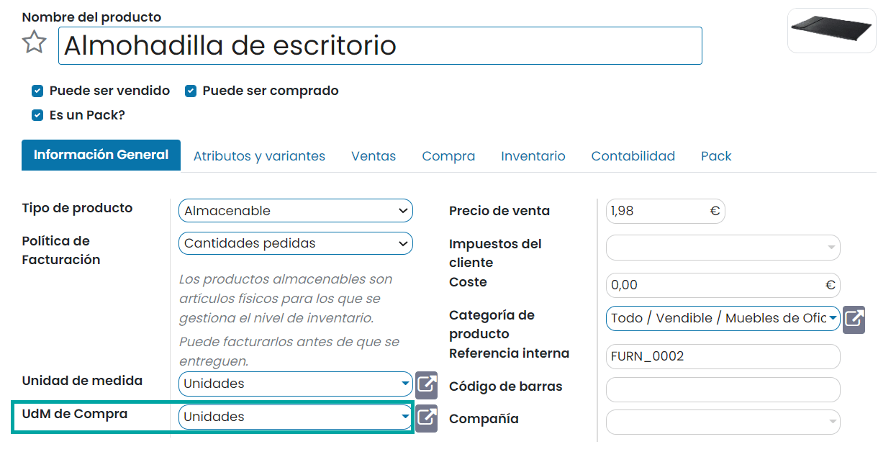

.. _inventario_y_fabricacion/compras/productos/gestion_basica/productos_empaquetados:

Comprar productos empaquetados
------------------------------

El **empaquetado** es el contenedor físico que protege a tu producto. Por ejemplo, si compras ordenadores, el empaquetado
contiene el ordenador y los cables de energía.

Para activar esta función, navega a la pantalla :menuselection:`Compra --> Configuración --> Ajustes` y activa
la opción de **Empaquetados del producto**:

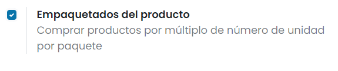

A continuación, pulsa el botón *Guardar* de la pantalla de ajustes.

En Daeris, los empaquetados se utilizan en los pedidos de compra con propósitos informativos. Se pueden configurar dichos
empaquetados en el formulario de detalle de los productos, desde la vista :menuselection:`Compra --> Productos --> Productos`,
en la pestaña de *Inventario*:

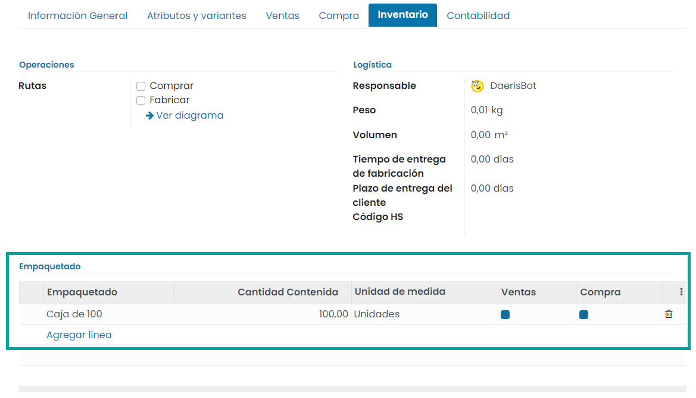

Una vez hecho esto, al crear una solicitud de presupuesto de compra, será posible informar el empaquetado del producto
mediante el campo **Empaquetado**:

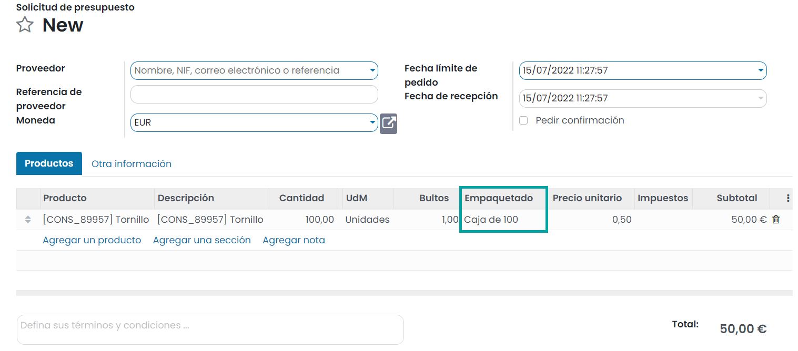

.. note::
   Otro uso útil de los empaquetados es para la recepción de productos. Al escanear el código de barras del empaquetado,
   Daeris agrega el número de unidades contenidas en el empaquetado al inventario.

.. _inventario_y_fabricacion/compras/productos/gestion_basica/crear_productos_compra:

Crear un producto de compra
===========================

Para crear un producto de compra navega a la pantalla :menuselection:`Compra --> Productos --> Productos` y pulsa el botón
*Crear*:

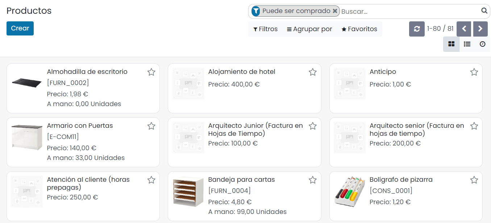

Desde el formulario de detalle del producto, para indicar que se trata de un producto de compra, asegúrate de que esté
marcada la opción **Puede ser comprado**:

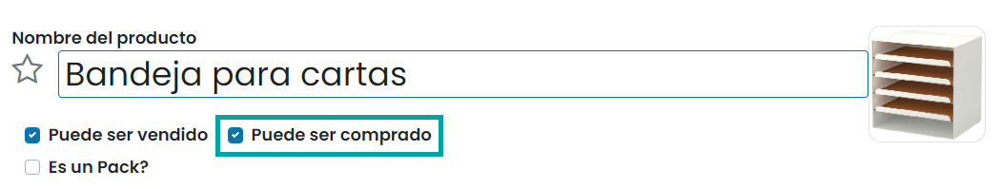

Desde la pestaña de *Compra*, puedes incluir la siguiente información:

-  **Proveedores**: Permite añadir el listado de proveedores del producto, así como su precio, cantidad y tiempo inicial
   de entrega.

-  **Impuestos de proveedor**: Impuestos por defecto usados cuando se compra el producto.

-  **Política de control**: Dispones de dos opciones:

   -  **Sobre cantidades pedidas**: Facturas de control basadas en las cantidades pedidas.

   -  **Sobre cantidades recibidas**: Facturas de control basadas en las cantidades recibidas.

-  **Descripción de compra**: Nota que aparecerá en los pedidos de compra del producto.

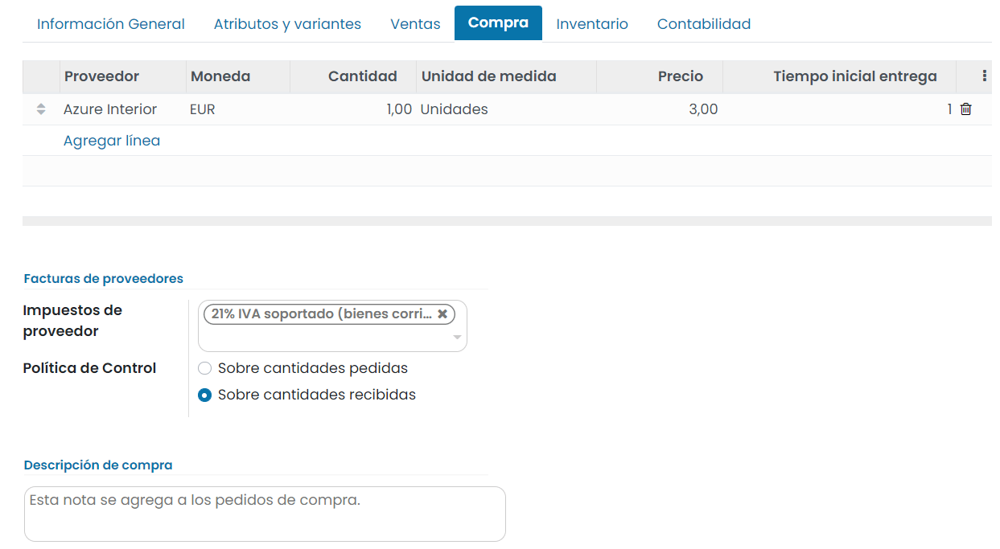

Una vez configurado el producto, pulsa el botón *Guardar*.

A partir de ese momento, ya podrá ser seleccionado al crear una nueva solicitud de presupuesto desde la pantalla
:menuselection:`Compra --> Pedidos --> Solicitudes de presupuesto`:

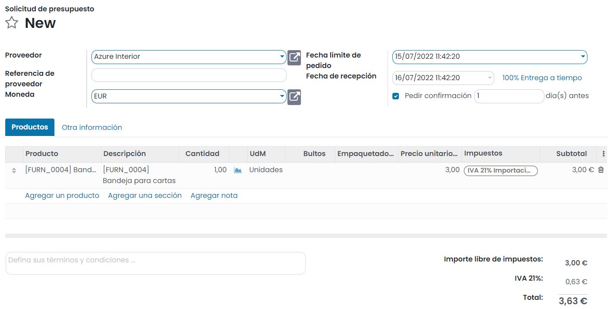

.. _inventario_y_fabricacion/compras/productos/gestion_basica/lotes_y_serie:

Utilizar lotes y números de serie en la compra de productos
===========================================================

Si quieres realizar el seguimiento de productos por lotes y números de serie, navega al detalle del producto desde la
pantalla :menuselection:`Compra --> Productos --> Productos`, y desde la pestaña de *Inventario*, modifica el campo
**Seguimiento**.

En este ejemplo, se modifica un producto para poder hacer seguimiento por número de serie, de manera que cada producto
vendido deberá disponer de un número de serie único:

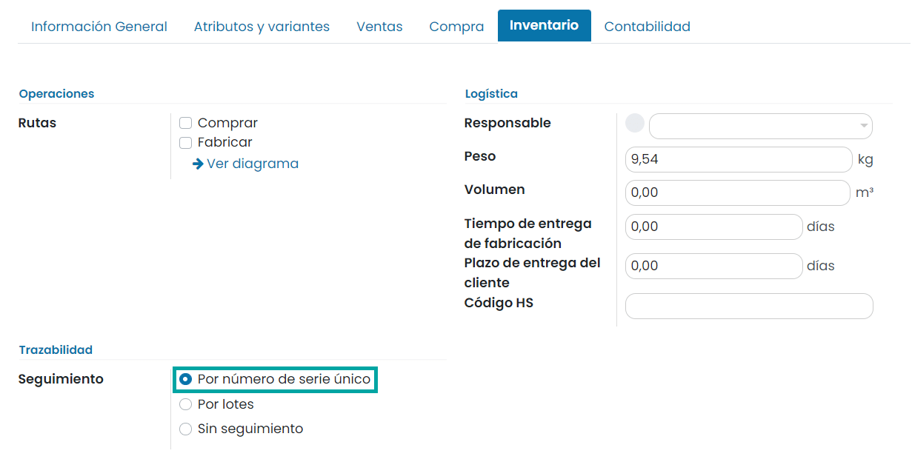

Por otro lado, se modifica otro producto para poder hacer seguimiento por lotes:

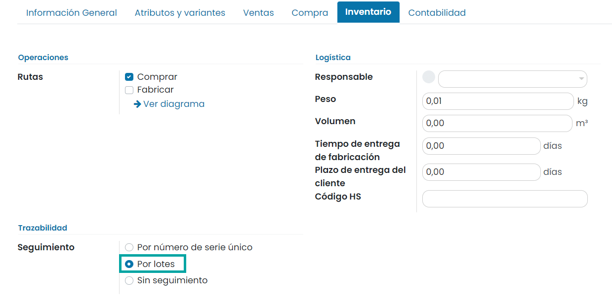

Además, debes asegurarte de que este producto es **Almacenable**, cosa que puedes indicar desde la pestaña de *Información General*:

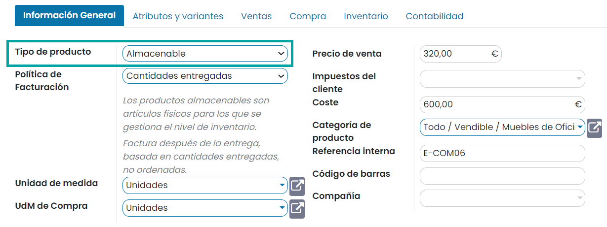

.. note::
   La diferencia entre números de serie y lotes es, básicamente, que un número de serie solamente puede ser asignado a
   un único producto (una sola cantidad de producto), mientras que un número de lote puede estar asignado a una cierta
   cantidad de producto (varios elementos pertenecen al mismo lote).

A continuación, genera una nueva solicitud de presupuesto desde la pantalla :menuselection:`Compra --> Pedidos --> Solicitudes de presupuesto`.
Selecciona los productos correspondientes y pulsa el botón *Guardar*:

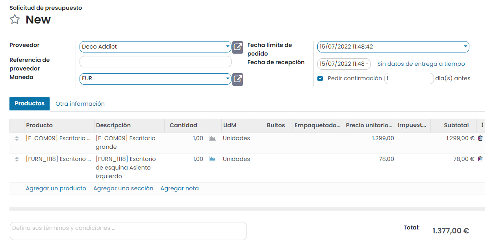

Una vez validados que todos los datos del pedido son correctos, procede a confirmar el pedido mediante el botón
correspondiente. Una vez confirmado el pedido, el sistema genera una recepción del pedido:

La recepción del pedido se puede consultar desde ese mismo botón:

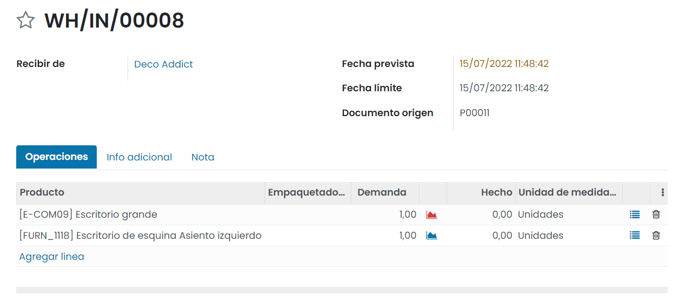

Llegados a este punto, si pulsas el botón **Validar**, el sistema requerirá que informes el número de lote/serie:

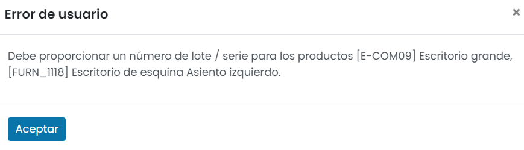

Para informar el número de lote/serie debes pulsar el siguiente icono ubicado en el listado del producto de la pestaña
**Operaciones**:

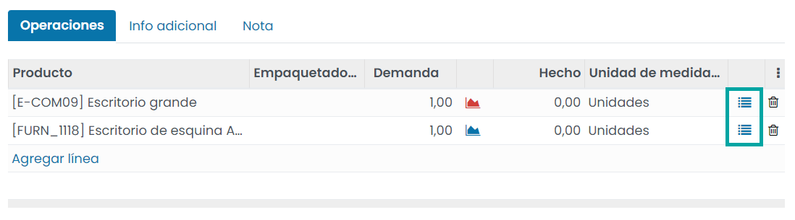

Esto abrirá un formulario que permite informar el número de lote/serie del producto y también confirmar que han
entregado el producto:

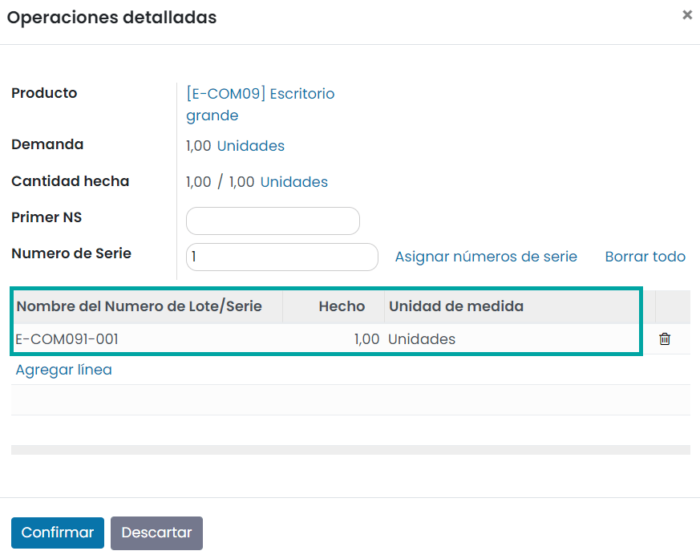

Una vez hecho esto, pulsa el botón **Confirmar**.

Al disponer ya del número de lote y de serie informado en los productos, puedes volver a pulsar el botón **Validar**, lo
que confirmará que has recibido el stock de los productos en el almacén:

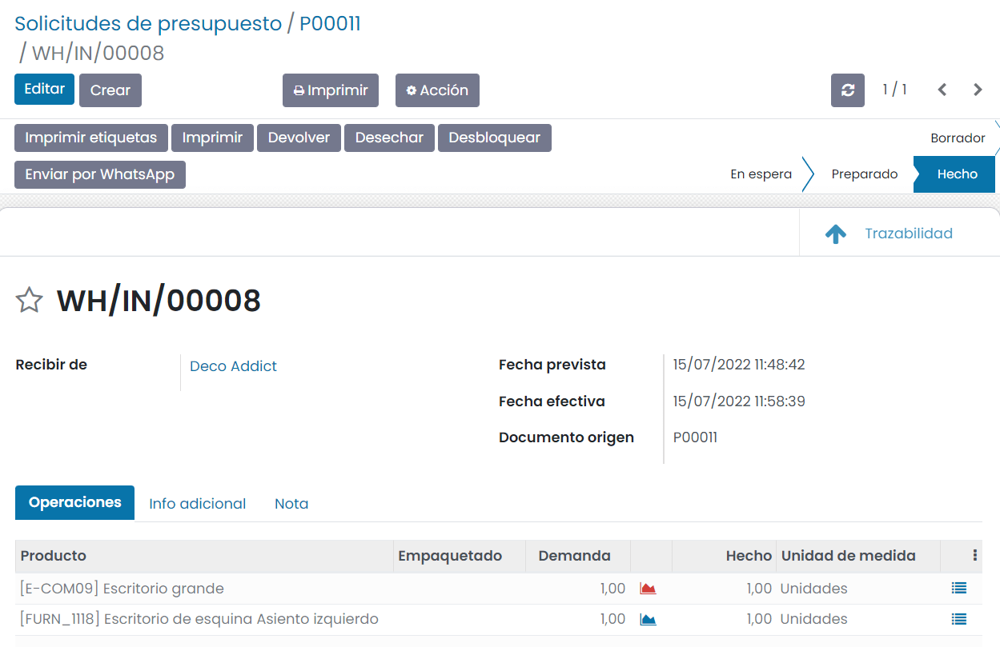

Una vez validada la recepción, puedes consultar el informe de trazabilidad desde el botón ubicado en la parte superior
derecha del formulario:

En este informe puedes consultar todos productos comprados, junto con sus números de lote y de serie:

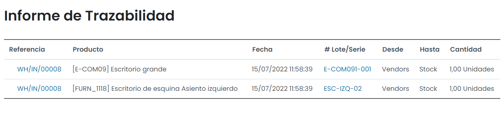