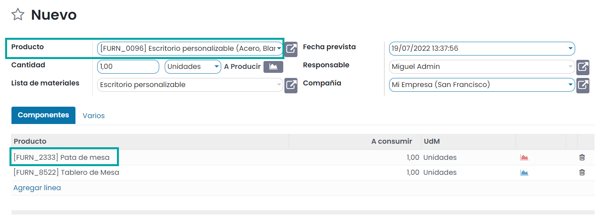

====================
Listas de materiales
====================

Crear listas de materiales
==========================

En primer lugar, navega a la pantalla :menuselection:`Fabricación --> Productos --> Productos`, donde puedes consultar la
vista kanban de productos dados de alta en la aplicación:

Si accedes al detalle de un producto que represente un producto fabricado, puedes consultar y editar las propiedades de
dicho producto:

Si navegas a la pestaña de **Inventario** puedes editar las propiedades relativas al módulo de fabricación:

-  **Rutas**: Permite definir la ruta del producto: si será comprado o fabricado.

-  **Tiempo de entrega de fabricación**: Promedio de tiempo de entrega en días para fabricar este producto.

-  **Plazo de entrega del cliente**: Es el número de días, desde la confirmación del pedido hasta la entrega del mismo
   al cliente.

Si pulsas el botón *Ver diagrama* ubicado en el apartado de **Rutas**, el sistema muestra un diagrama que describe las rutas
que sigue el producto para ser fabricado:

En el caso de los productos fabricados, es necesario definir la lista de materiales necesarios para su fabricación. Para
ello, haz clic en el botón de **Lista de materiales** ubicado en la parte superior derecha del formulario del producto:

Al pulsar el icono, la aplicación navega a la pantalla de lista de materiales del producto, desde donde es posible
consultar todas las listas de materiales asociadas al producto o crear una nueva lista de materiales mediante el
botón *Crear*:

Al crear una nueva lista de materiales, el sistema navega al formulario de detalle, desde donde es posible informar
el producto asociado, las variantes del producto (en caso de haberlas), la cantidad de producto, la referencia,
el tipo de lista de materiales, donde es posible seleccionar entre *Fabricar este producto*, o *Kit*, y la compañía
asociada:

Para definir los distintos materiales que compondrán el producto, debes añadir en la pestaña de **Componentes** todos
los materiales necesarios, junto con sus cantidades.

En la pestaña **Varios** es posible introducir la siguiente información:

-  **Consumo flexible**: Define si se puede consumir más o menos componentes que la cantidad definida en la lista de materiales:

   -  **Permitido**: Permitido para todos los usuarios de fabricación.

   -  **Permitido con advertencia**: Permitido para todos los usuarios de fabricación, con un resumen de las diferencias
      de consumo al cerrar la orden de fabricación.

   -  **Bloqueada**: Sólo un administrador puede cerrar una orden de fabricación cuando no se ha seguido la lista de materiales.

-  **Cuenta analítica**: Cuenta analítica en la que se realizarán entradas de costes e ingresos para la gestión financiera
   de la orden de fabricación.

Una vez añadidos todos los componentes de fabricación del producto, pulsa el botón *Guardar* para que los cambios queden
registrados.

Desde el menú ubicado en la parte superior derecha del formulario de listado de materiales, puedes pulsar el botón
**Estructura y coste**:

Por defecto, aparece seleccionado el informe de estructura y coste de lista de materiales, que proporciona información
acerca de todos los materiales utilizados y su respectivo coste:

Mediante el botón **Imprimir**, ubicado en la parte superior izquierda de la pantalla, puedes imprimir el informe en
formato PDF. La aplicación generará un informe en PDF y lo permitirá descargar en el sistema para su posterior uso.

Utilizar variantes de producto con listas de materiales
=======================================================

Desde la pantalla :menuselection:`Fabricación --> Productos > Productos`, navega al detalle de un producto, y posiciónate
en la pestaña de **Atributos y variantes**. En este ejemplo, el producto tiene dos atributos con varios valores cada uno:

.. note::
   Es posible crear tantos atributos como sean necesarios, así como añadir o eliminar valores dentro de cada uno de los
   atributos.

A continuación, asegúrate de que el producto tiene marcada la ruta de *Fabricar* desde la pestaña de **Inventario**:

Ahora, navega a la lista de materiales del producto seleccionado, mediante la opción correspondiente del menú:

Crea una nueva lista de materiales o edita la lista de materiales existente. Dentro del listado de materiales del producto,
puedes asociar variantes a los componentes del producto. De esta manera, los componentes que dispongan del campo
**Aplicar en variantes** informado, solo se utilizarán cuando se fabrique esa variante en concreto:

.. tip::
   Si el campo de **Aplicar en variantes** no aparece en el listado, pulsa los tres puntos ubicados a la derecha del listado
   para seleccionar dicho campo.

Al definir las listas de materiales con variantes en los componentes, el campo **Variantes del producto** en la sección
principal de la lista de materiales debe dejarse en blanco. Este campo se utiliza al crear una lista de materiales para
una variante específica de un producto únicamente:

Una vez configurada la lista de materiales, pulsa el botón *Guardar*.

A partir de ese momento, al crear una nueva orden de producción que utilice el producto con variantes, se informarán
los componentes de forma dinámica en función de la variante seleccionada para producir:

Fabricar kits de productos
==========================

Un kit es un conjunto de componentes que no están preensamblados ni mezclados. Esto es útil para vender, pero también
para crear listas de materiales más limpias y eficaces.

Configuración
-------------

Desde la pantalla el menú :menuselection:`Fabricación --> Productos > Productos`, crea cada producto de componente (como
lo harías con cualquier otro producto), y luego crea el producto de nivel superior o kit. Debido a que no puedes realizar
un seguimiento del stock de productos del kit, el **Tipo de producto** debe establecerse en *Consumible*:

.. note::
   Si estás utilizando la contabilidad anglosajona y deseas que se registren los COGS al facturar tus kits (y solo por
   este motivo), debes seleccionar el tipo de producto *Almacenable* en su lugar.

Debido a que no se puede comprar un producto de kit, se debe desmarcar la opción *Puede ser comprado*:

La ruta del producto del kit en la pestaña **Inventario** realmente no importa, ya que, para la reposición, solo se tendrá
en cuenta la ruta de los componentes.

Se pueden modificar todos los demás elementos del kit de acuerdo con tus preferencias. Los componentes del producto no
requieren ninguna configuración particular.

Una vez que los productos estén configurados, crea una lista de materiales para el producto del kit. Añade cada componente
y su cantidad. Selecciona *Kit* como tipo de lista de materiales. Todas las demás opciones se pueden dejar con sus
valores predeterminados:

Gestión del stock de los componentes
------------------------------------

Si deseas ensamblar los kits a medida que se venden, administrando el stock de los componentes del kit únicamente,
utiliza un tipo de lista de materiales de *Kit* sin ninguna operación de fabricación.

Un producto que utilice una lista de materiales de *Kit* aparecerá como un artículo de una sola línea en un presupuesto
y un pedido de venta:

Este pedido generará una orden de entrega con un artículo de línea para cada uno de los componentes del kit:

Gestión del stock de los productos kit y sus componentes
--------------------------------------------------------

Si deseas gestionar el stock del producto de kit de nivel superior, utiliza en su lugar *Fabricar este producto* como tipo
de lista de materiales. En este caso, el producto lo fabricarás tu mismo a través de una orden de fabricación:

En este caso, el tipo de producto será *Almacenable*:

Crea una lista de materiales más limpia
---------------------------------------

Como se sugirió anteriormente, una lista de materiales de tipo kit también se puede usar simplemente para administrar
una lista de materiales más compleja.

Imagínate que las partes de un kit fueran parte de otro producto final. Sería mucho más claro y simple si las listas de
materiales se sumaran en lugar de agregar todas las partes individuales una por una:

Esto se ilustra aún mejor cuando se consulta el informe de estructura de la lista de materiales, donde es fácil expandir
y ocultar las listas de materiales específicas del nivel del kit o del tipo de subensamblaje:

En la creación de la orden de producción, la lista de materiales se expandirá automáticamente para mostrar todos los
componentes de nivel superior y nivel de kit. Sin embargo, puedes volver a la lista de materiales en cualquier momento,
ya que permanece disponible en la vista de formulario de tu orden de producción:

.. note::
   Ten en cuenta que si hubiera operaciones en la lista de materiales del kit, estas también se agregarían simplemente a
   la lista de órdenes de trabajo del componente principal.

Gestionar productos semiacabados
================================

Con Daeris, puedes usar productos semiacabados para simplificar una lista de materiales compleja o para representar tu
flujo de fabricación con mayor precisión. Un producto semiacabado es un producto fabricado que se utiliza como componente
en una lista de materiales.

Una lista de materiales que emplea productos semiacabados se denomina lista de materiales de varios niveles, en la que
distinguimos entre el producto de nivel superior y los subensamblajes.

Configurar una lista de materiales de varios niveles
----------------------------------------------------

Para configurar una lista de materiales de varios niveles, necesitarás el producto de nivel superior y sus subensamblajes.
Por lo tanto, primero debes crear los productos de subensamblaje y su respectiva lista de materiales:

Configurar la lista de materiales principal
-------------------------------------------

Luego, en el formulario de producto final, simplemente agrega tus productos semiacabados a la lista de materiales:

Gestionar tu planificación de producción
----------------------------------------

Existen varios métodos para gestionar la activación de las distintas órdenes de producción.

Si cada vez que se confirma una orden de producción para el producto principal, también deseas una para los productos
semiacabados, tienes dos opciones:

#. Crea reglas de reabastecimiento para los productos semiacabados, con las cantidades mínimas y máximas de existencias
   deseadas en 0.

#. Utiliza la ruta de *Obtener Bajo Pedido (MTO)* en el producto semiacabado, así como en el de fabricación:

Ten en cuenta que la opción 1 generalmente se recomienda sobre la opción 2, ya que es más flexible. La ruta de obtener bajo
pedido crea un vínculo único entre el producto semiacabado y el de nivel superior, mientras que la regla de reabastecimiento
te permite simplemente anular la reserva de esa producción de la producción de productos de nivel superior y redirigirla
a otra orden más urgente.

En cualquier caso, tan pronto como se produzca el producto semiacabado, estará disponible en la orden de producción del
producto final:

Producción de subproductos
==========================

Agregar subproductos a las listas de materiales es muy simple en Daeris. Los subproductos son aquellos productos que se
fabrican junto con los productos principales en las listas de materiales. Para habilitar la adición de subproductos a las
listas de materiales, navega a la pantalla :menuselection:`Fabricación --> Configuración --> Ajustes` y habilita la opción
**Subproductos**:

.. image:: listas_de_materiales/habilitar-subproductos.png
   :align: center
   :alt: Habilitar subproductos

Una vez hecho esto, pulsa el botón *Guardar* de la pantalla de ajustes.

Al crear las nuevas listas de materiales, puedes ver la pestaña **Subproductos** recién creada. En la pestaña,
agrega detalles como el nombre del producto usando la opción *Agregar línea*:

Puedes configurar la cantidad, unidad de medida, porcentaje de participación en los costos y agregar las variantes de los
productos sobre los cuales se debe aplicar el mismo. Se pueden agregar varios subproductos seleccionando la opción *Agregar línea*:

Una vez configurada la lista de materiales, pulsa el botón *Guardar*.

A partir de ese momento, al crear y finalizar una orden de producción para el producto asociado a la lista de materiales,
se obtendrá como resultado, además del producto principal, los subproductos definidos en la lista de materiales. Esto se
puede comprobar desde el informe de trazabilidad de la orden de fabricación:

