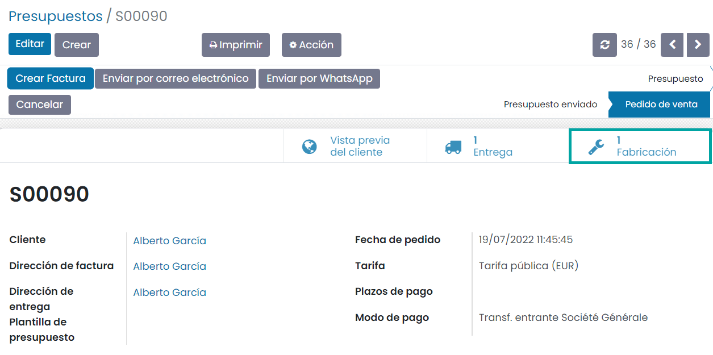
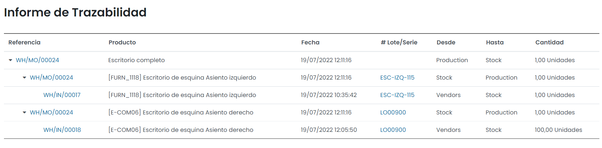

=========================
Gestión de la fabricación
=========================

Crear una orden de producción básica
====================================

Para crear una orden de producción navega a la pantalla :menuselection:`Fabricación --> Operaciones --> Órdenes de producción`:

A continuación, pulsa el botón *Crear*, que te llevará al formulario de detalle de la orden de producción:

Debes informar en el desplegable de producto, el producto que quieres fabricar, y de forma automática se informará la
lista de materiales y los componentes asociados. Por otro lado, informa la cantidad a producir, así como la fecha prevista,
el responsable y la compañía asociada.

En la pestaña de **Varios** puedes informar el tipo de operación, el origen, haciendo referencia al documento que generó
esta orden de fabricación, y la cuenta analítica en la que se realizarán entradas de costes e ingresos para la gestión
financiera de la orden de fabricación:

Una vez informados los campos necesarios, pulsa el botón *Guardar*.

El siguiente paso será comprobar la disponibilidad de los materiales a utilizar, mediante el icono ubicado a la derecha
de cada uno de los componentes:

Una vez comprobada la disponibilidad de los materiales, si todo ha ido bien, el listado de materiales cambiará de color
rojo a azul, lo que indica que tienes suficiente stock de materiales para fabricar el producto seleccionado.

.. image:: gestion_fabricacion/disponibilidad-ordenes-produccion-2.png
   :align: center
   :alt: Disponibilidad de componentes de órdenes de producción (2)

.. note::
   Si no tienes disponibilidad de alguno de los materiales a fabricar, o si el stock no está actualizado en el sistema,
   realiza las compras o ajustes de inventario necesarios.

A continuación, confirma la orden de producción mediante el botón **Confirmar**:

El siguiente paso será **Planificar** la orden de producción mediante el botón correspondiente:

A continuación, conforme se vayan produciendo los productos, actualiza el campo **Cantidad**. Esto cambiará el estado
de la orden de producción a *En progreso*:

.. image:: gestion_fabricacion/cantidad-ordenes-produccion.png
   :align: center
   :alt: Cantidad de órdenes de producción

Una vez finalizada la fabricación del producto, pulsa el botón **Validar**:

.. image:: gestion_fabricacion/validar-ordenes-produccion.png
   :align: center
   :alt: Validar órdenes de producción

Esto cambiará el estado de la orden de producción a *Hecho*:

.. _inventario_y_fabricacion/fabricacion/orden_produccion_bajo_pedido:

Crear una orden de producción bajo pedido
=========================================

Con las órdenes de producción bajo pedido, las órdenes de producción son creadas de forma automática por el sistema al
registrar una venta, para que los productos puedan ser enviados al cliente.

Para activar esta función, navega a la pantalla :menuselection:`Inventario --> Configuración --> Almacenes` y accede al
detalle de tu almacén:

En la vista de detalle del almacén, pulsa en el botón de **Rutas**:

En el listado de rutas, filtra por las rutas inactivas, pulsando la opción del menú :menuselection:`Filtros --> Archivado`:

Una vez aplicado el filtro, aparecerá en el listado la ruta *Obtener Bajo Pedido (MTO)*. Selecciona el registro y pulsa
la opción del menú :menuselection:`Acción --> Desarchivar`:

A continuación, navega al detalle del producto a fabricar, desde la pantalla :menuselection:`Fabricación --> Productos > Productos`,
y desde la pestaña de **Inventario**, marca la opción *Obtener Bajo Pedido (MTO)*, dentro de **Rutas**:

.. note::
   Se debe tener en cuenta que las opciones *Obtener Bajo Pedido (MTO)* y *Fabricar*, dentro de **Rutas**, pueden convivir
   sin problema, así que puedes tener ambas opciones marcadas.

Una vez hecho esto, guarda el registro mediante el botón *Guardar*.

A continuación, para comprobar el correcto funcionamiento, genera una venta del producto desde la pantalla
:menuselection:`Ventas --> Pedidos --> Presupuestos`, pulsando el botón *Crear*, que desplegará un formulario, donde
informar los siguientes campos:

-  **Cliente**: Cliente al que has realizado la venta.

-  **Líneas del pedido**: Agrega el producto que deberá generar una orden de producción.

Una vez creada la venta, guarda el registro mediante el botón *Guardar*, y confirma la venta mediante el botón *Confirmar*.

Una vez hecho esto, puedes consultar la nueva orden de producción creada de forma automática por el sistema, pulsando
en el botón **Fabricación**, que aparece en el detalle del pedido tras confirmar la venta:

Si navegas al detalle de la orden, ya puedes iniciar la producción, como si de una orden básica de producción se tratase:

.. _inventario_y_fabricacion/fabricacion/operaciones/gestion_fabricacion/desbloquear_ordenes:

Desbloquear órdenes de producción
=================================

Por defecto, las órdenes de producción confirmadas, quedan bloqueadas, y no es posible modificar las cantidades a consumir:

Para permitir a los usuarios de fabricación modificar las cantidades a consumir, navega a la pantalla
:menuselection:`Fabricación --> Configuración --> Ajustes` y marca la opción **Desbloquear pedidos de fabricación**:

Una vez hecho esto, pulsa el botón *Guardar* de la pantalla de ajustes.

A partir de ese momento, las órdenes de fabricación confirmadas, quedarán desbloqueadas por defecto, pudiéndose modificar
las cantidades a consumir:

Utilizar lotes y números de serie en la fabricación de productos
================================================================

Si quieres realizar el seguimiento de productos por lotes y números de serie, navega al detalle del producto desde la
pantalla :menuselection:`Fabricación --> Productos --> Productos`, y desde la pestaña de *Inventario*, modifica el campo
**Seguimiento**.

En este ejemplo, se modifica un producto para poder hacer seguimiento por número de serie, de manera que cada producto
vendido deberá disponer de un número de serie único:

Por otro lado, se modifica otro producto para poder hacer seguimiento por lotes:

Además, debes asegurarte de que este producto es **Almacenable**, cosa que puedes indicar desde la pestaña de *Información General*:

.. note::
   La diferencia entre números de serie y lotes es, básicamente, que un número de serie solamente puede ser asignado a
   un único producto (una sola cantidad de producto), mientras que un número de lote puede estar asignado a una cierta
   cantidad de producto (varios elementos pertenecen al mismo lote).

A continuación, genera una nueva orden de producción desde la pantalla :menuselection:`Fabricación --> Operaciones --> Órdenes de producción`.
Selecciona el producto correspondiente y pulsa el botón *Guardar*:

Una vez validado que todos los datos de la orden son correctos, procede a confirmar la orden mediante el botón
correspondiente. Una vez confirmada, informa las cantidades a producir:

Por último, accede al detalle de cada uno de los componentes, mediante el icono ubicado en el listado:

El sistema desplegará una ventana en donde poder informar el lote/número se serie e informar las cantidades consumidas
de cada uno de los componentes:

Una vez hecho esto para todos los componentes, marca la orden de fabricación como hecha.

Ahora, puedes consultar el informe de trazabilidad desde el botón ubicado en la parte superior derecha del formulario:

En este informe puedes consultar todos los productos fabricados, junto con sus números de lote y de serie:

Crear una orden de deconstrucción
=================================

Una orden de deconstrucción se utiliza para deshacer un producto terminado en sus componentes. Para acceder a la pantalla
de órdenes de deconstrucción navega a :menuselection:`Fabricación --> Operaciones --> Órdenes de deconstrucción`:

.. image:: gestion_fabricacion/listado-ordenes-deconstruccion.png
   :align: center
   :alt: Listado de órdenes de deconstrucción

Para crear una nueva orden de deconstrucción pulsa el botón *Crear*. Esto abrirá un formulario con los siguientes campos:

En esta pantalla debes informar los campos necesarios, básicamente el producto a deconstruir, la cantidad, y si quieres
especificar la orden de fabricación, en caso de disponer de una.

Una vez informados los campos, pulsa el botón **Deconstruir**:

Esto marcará la orden de deconstrucción como *Hecha*:

Una vez hecho esto, es posible consultar los movimientos de los productos al inventario mediante el botón **Movimientos productos**:

La aplicación navegará al listado de movimientos de existencias relacionados con la orden de deconstrucción:

Crear una orden de desecho
==========================

El desecho de un producto eliminará el producto de tu stock. Cuando el producto no cumple con los estándares de calidad,
el producto debe convertirse en desechos. Cuando el producto está dañado, y no puede ser reparado o manejado por la
empresa, y también cuando el producto sobrepasa la fecha de caducidad, el producto es retirado. La salida de producto
del stock debe ser introducida en los registros para la generación de los informes.

Para acceder a la pantalla de órdenes de desecho navega a :menuselection:`Fabricación --> Operaciones --> Desechar`:

Para crear una nueva orden de desecho pulsa el botón *Crear*. Esto abrirá un formulario con los siguientes campos:

-  **Producto**: Selecciona el producto que has decidido convertir en chatarra en este campo.

-  **Cantidad**: En este campo se debe informar la cantidad del producto que será retirado del stock junto con la unidad
   de medida.

-  **Documento origen**: Los documentos relacionados con la eliminación del producto se pueden insertar en este campo específico.

-  **Compañía**: Nombre de la empresa que presenta el borrador de baja de stock.

.. image:: gestion_fabricacion/detalle-ordenes-desecho.png
   :align: center
   :alt: Detalle de órdenes de desecho

La orden de desecho guardada se puede confirmar seleccionando el botón **Validar**:

Después de validar la orden, podrás visualizar el movimiento del producto desde el inventario seleccionando el botón de
**Movimientos productos**:

También puedes desechar los componentes del producto antes de iniciar la orden de producción. Para esto, puedes acceder
al detalle de una orden de producción desde la pantalla :menuselection:`Fabricación --> Operaciones --> Órdenes de producción`.
Al seleccionar el botón *Desechar*, aparecerá la ventana de desecho:

En la ventana introduce los detalles del producto que necesitas retirar del stock, y la cantidad del producto junto con su
unidad de medida:

.. image:: gestion_fabricacion/desechar-orden-produccion-2.png
   :align: center
   :alt: Desechar una orden de producción (2)

Una vez introducidos los detalles, pulsa el botón *Hecho*. La orden de desecho aparecerá asociada a la orden de producción:

.. image:: gestion_fabricacion/desechar-orden-produccion-3.png
   :align: center
   :alt: Desechar una orden de producción (3)