===============================
Centros de trabajo alternativos
===============================

La fabricación de varios productos diferentes simultáneamente en el mismo centro de trabajo es un problema común para las
empresas de fabricación. Aunque en la práctica, los empleados pueden fabricar los productos en otro centro de trabajo en
lugar de esperar a que haya uno disponible, no siempre es sencillo tener visibilidad de qué centro de trabajo está ocupado
y planificar los recursos en consecuencia en tiempo real.

Con Daeris, puedes configurar centros de trabajo alternativos para resolver este problema. Esto comprueba automáticamente
qué centro de trabajo está ocupado y cuáles equivalentes están libres, y programa los pedidos y el mantenimiento en
consecuencia.

De esta forma, tu proceso se vuelve más eficiente, ya que se optimiza la utilización del centro de trabajo.

.. _inventario_y_fabricacion/fabricacion/operaciones/ordenes_trabajo/habilitar_ordenes:

Habilitar las órdenes de trabajo
================================

Para habilitar las órdenes de trabajo, navega a la pantalla :menuselection:`Fabricación --> Configuración --> Ajustes`
y activa la opción **Ordenes de trabajo**:

Una vez hecho esto, pulsa el botón *Guardar* de la pantalla de ajustes.

.. _inventario_y_fabricacion/fabricacion/operaciones/ordenes_trabajo/configurar_centros:

Configurar los centros de producción
====================================

Para configurar los centros de producción, navega a la pantalla :menuselection:`Fabricación --> Configuración --> Centros de producción`,
donde puedes consultar los centros de producción actuales, y puedes crear nuevos centros mediante el botón *Crear*:

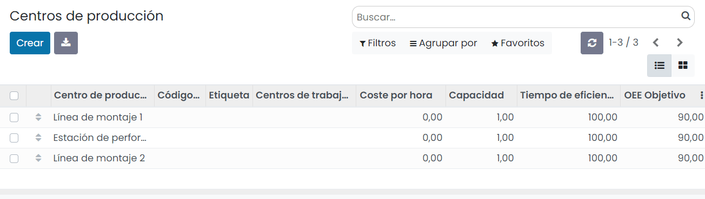

En la creación de un nuevo centro tienes disponibles las siguientes opciones:

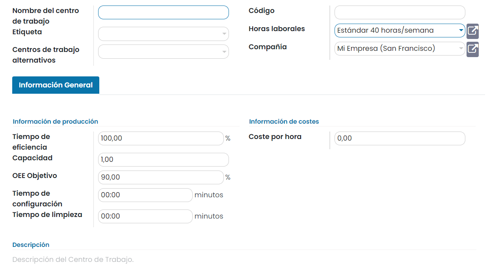

La información básica que debes proporcionar es el nombre del centro, el código del centro y el calendario de trabajo del
centro. Selecciona también un centro de trabajo alternativo que pueda ser sustituido por este para despachar la
producción. El resto de campos de la pestaña de **Información general** son datos adicionales que se pueden informar para
posteriormente ser explotados mediante informes.

Una vez hayas completado los campos correspondientes pulsa el botón *Guardar*.

.. _inventario_y_fabricacion/fabricacion/operaciones/ordenes_trabajo/configurar_operaciones:

Configurar las operaciones
==========================

Para configurar las operaciones navega a la pantalla :menuselection:`Fabricación --> Configuración --> Operaciones`. Se
despliega la lista de operaciones junto con la lista de materiales, centro de producción, cálculo de duración, minutos de
duración y nombre de la empresa:

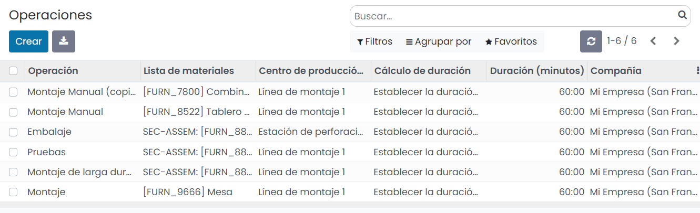

Para crear y agregar nuevas operaciones al sistema, pulsa el botón *Crear*. El sistema navegará al formulario de detalle
de la operación:

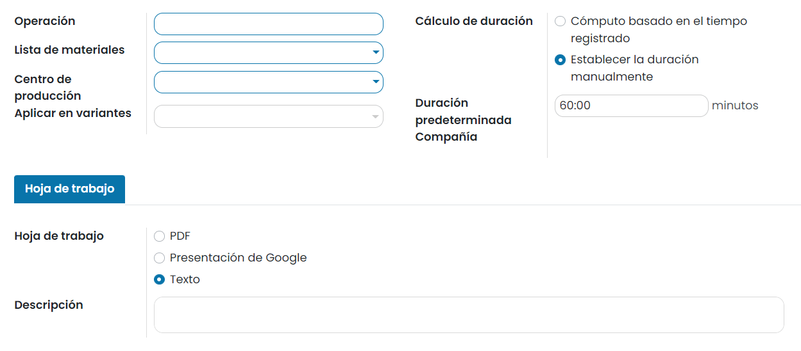

Aquí, debes informar el nombre de la operación, la lista de materiales y el centro de producción en donde se llevará a
cabo la producción de esta operación. Además, puedes informar cómo se calcula la duración de esta operación y una
duración predeterminada.

En la pestaña de **Hoja de trabajo**, puedes subir un fichero en formato PDF, un enlace a una presentación de Google, o
un texto con las instrucciones a seguir para fabricar el producto.

Una vez informados los campos necesarios, pulsa el botón *Guardar*.

Crear órdenes de producción con órdenes de trabajo
==================================================

En primer lugar, crea una orden de producción desde la pantalla :menuselection:`Fabricación --> Operaciones --> Órdenes de producción`,
mediante el botón *Crear*. Selecciona el producto y pulsa el botón *Guardar*. Puedes observar cómo se informa de forma
automática la lista de materiales:

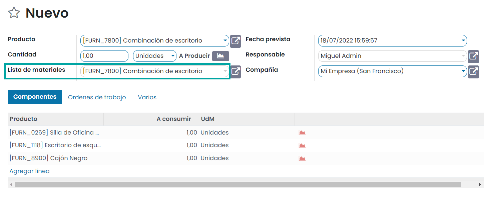

A continuación, confirma la orden de producción mediante el botón *Confirmar*:

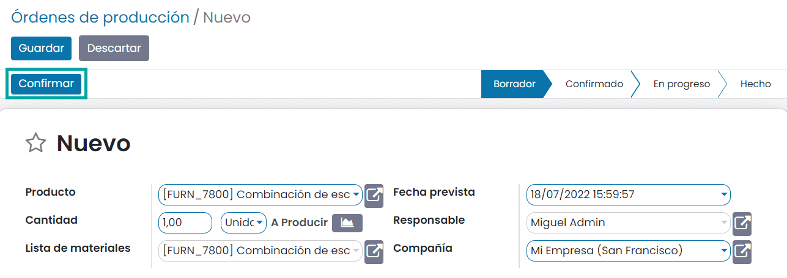

Por último, planifica la orden de trabajo mediante el botón *Planificar*:

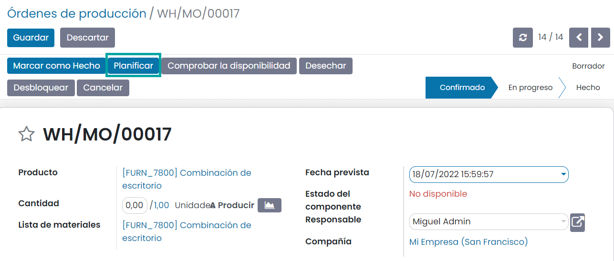

Desde la pestaña de *Órdenes de trabajo* se puede comprobar la fecha de inicio programada y el centro de producción
asignado:

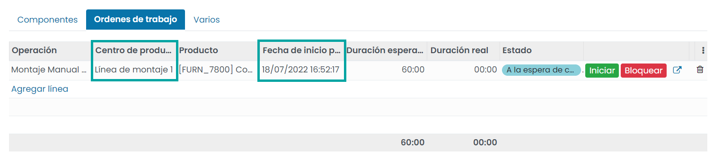

A partir de ese momento, cada nueva orden de trabajo que se cree antes del final de la primera, se programará en el
centro de trabajo alternativo que configuraste, como se muestra a continuación:

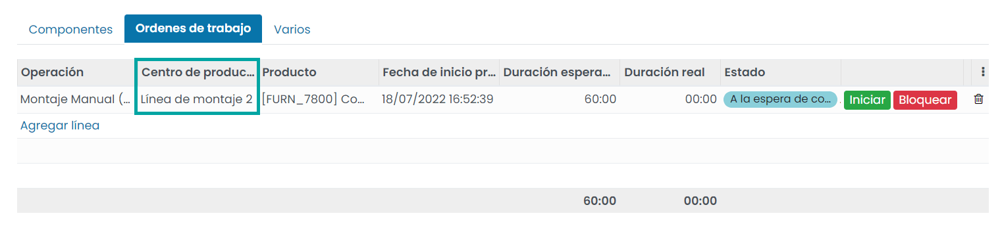

Puedes iniciar o bloquear el trabajo que está en progreso con la ayuda de las opciones **Iniciar** y **Bloquear**:

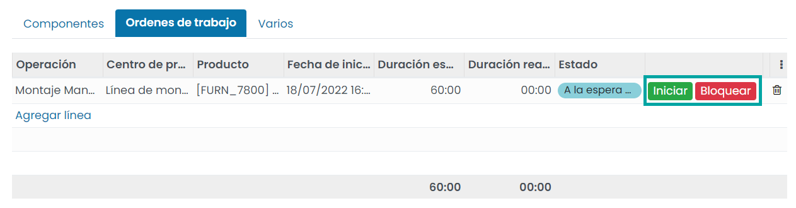

Cuando se hace clic en el botón de inicio, la duración real comenzará a contar, calculando el tiempo necesario para la
orden de trabajo:

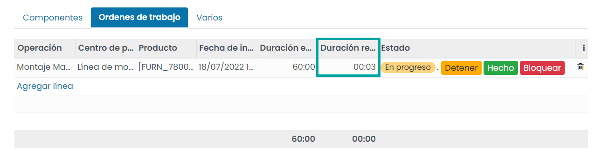

Al seleccionar el botón **Bloquear**, aparecerá una ventana en la que tendrás que seleccionar el motivo de la pérdida y
explicarlo en el cuadro de descripción:

.. image:: ordenes_trabajo/ordenes-trabajo-8.png
   :align: center
   :alt: Órdenes de trabajo (8)

Por último, puedes pulsar el botón **Hecho** para confirmar que el trabajo se ha finalizado.