===========================
Subcontratar la fabricación
===========================

Subcontratar una parte o la totalidad de las necesidades de fabricación de tu empresa no es fácil. Para que funcione
correctamente, tienes que:

-  Gestionar el inventario de materias primas en tu subcontratista.

-  Enviar materia prima a tus subcontratistas, en el momento adecuado.

-  Controlar la calidad de las mercancías entrantes.

-  Controlar las facturas de los subcontratistas.

El siguiente es un ejemplo de subcontratación de la fabricación de "C", que se produce a partir de las materias primas
"A" y "B".

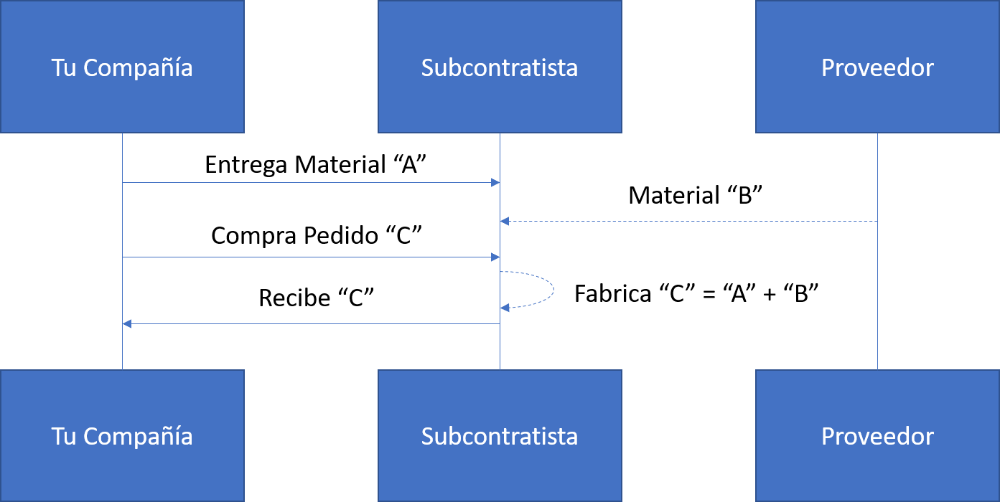

Con su función de subcontratación de la fabricación, Daeris te ayuda a manejar este flujo fácilmente.

.. _inventario_y_fabricacion/fabricacion/operaciones/subcontratacion/activar:

Configuración
=============

Para utilizar la función de subcontratación, navega a la pantalla :menuselection:`Fabricación --> Configuración --> Ajustes`
y marca la opción de **Subcontratación**:

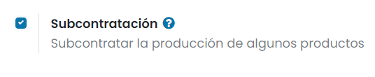

Una vez hecho esto, pulsa el botón *Guardar* de la pantalla de ajustes.

Para definir si un producto se debe subcontratar, utiliza una lista de materiales de tipo *Subcontratación*. Para crear
una nueva lista de materiales, navega a la pantalla a :menuselection:`Fabricación --> Productos --> Lista de materiales`
y pulsa el botón *Crear*:

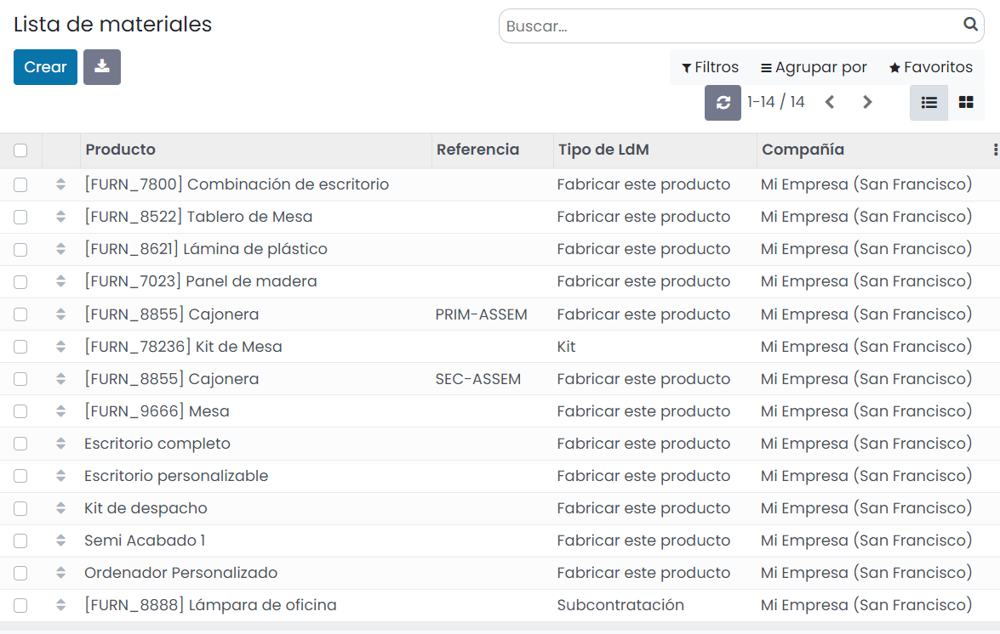

Luego, enumera los componentes que tu subcontratista necesita para fabricar el producto. A efectos de cálculo de costes,
es posible que quieras registrar todos los componentes, incluso los que se obtienen directamente del subcontratista.
Una vez que hayas establecido el tipo de lista de materiales en *Subcontratación*, especifica a uno o varios subcontratistas:

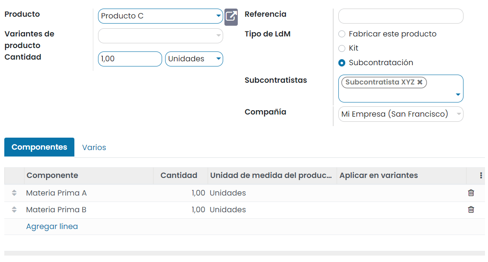

Flujo básico de subcontratación
===============================

Para que tu subcontratista sepa cuántos productos necesitas, crea y envíale pedidos de compra. Para hacerlo, navega a la
pantalla :menuselection:`Compra --> Pedidos --> Solicitudes de presupuesto` y crea un nueva solicitud de presupuesto.
Asegúrate de enviar el pedido de compra a un proveedor que esté definido como subcontratista en la lista de materiales de
estos productos.

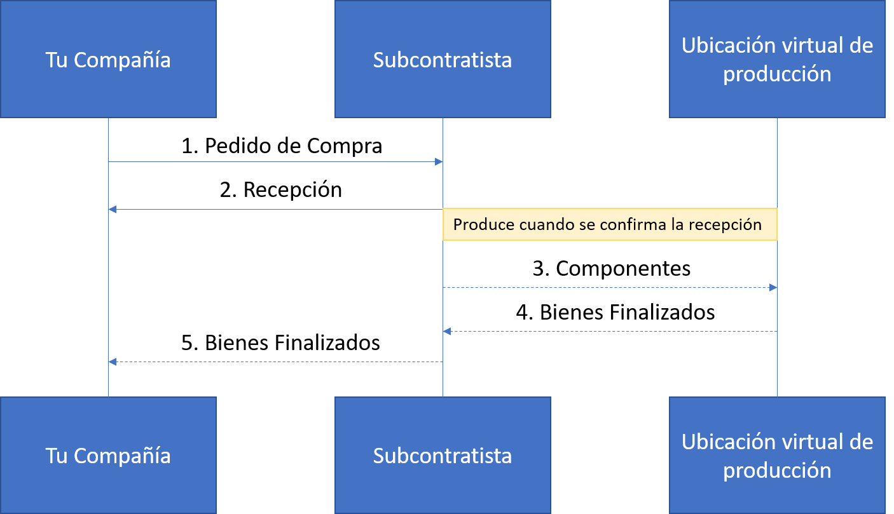

Una vez que se valida el pedido de compra (1), se crea una recepción pendiente. Cuando recibas los productos, valida
la recepción (2), con la cantidad real recibida. Como resultado, Daeris hace lo siguiente por ti:

-  Consume los componentes respectivos en la ubicación del subcontratista, según la lista de materiales y su entrada (3);

-  Produce los productos terminados en la ubicación del subcontratista (4);

-  Mueve productos desde la ubicación de ese subcontratista a tu empresa a través de la recepción validada (5).

.. note::
   El pedido de compra es opcional. Si creas una recepción manualmente, con el subcontratista correcto, Daeris también
   realiza todos los movimientos. Esto puede ser útil si el subcontratista no factura un precio fijo por artículo, sino
   el tiempo y los materiales utilizados.

Valoración del inventario
=========================

El coste del producto fabricado "C" se define como:

**C = A + B + s**

Donde:

-  **A**: Coste de las materias primas provenientes de tu empresa;

-  **B**: Coste de las materias primas obtenidas directamente del subcontratista;

-  **s**: Coste del servicio subcontratado.

El envío de materias primas a tus subcontratistas (**A**) no afecta la valoración del inventario, ya que los componentes
todavía se valoran como parte de tu stock. Esto se gestiona haciendo que la ubicación de subcontratación sea una
ubicación interna.

Entonces, el precio del proveedor fijado en el formulario C del producto es lo que hay que pagar al subcontratista por
sus piezas y tiempo de servicio: **B + s**. El coste del producto tiene que ser: **A + B + s**, lo que se valora el
producto en la contabilidad.

Finalmente, la factura del subcontratista coincide con el pedido de compra, con el precio propuesto proveniente de los
productos terminados C.

.. note::
   Si la gestión de la reposición de las materias primas **B** en la ubicación de tu subcontratista no es necesaria,
   simplemente incluye el costo de **B** en el precio del subcontratista **s** y elimina los productos **B** de la
   lista de materiales.

Trazabilidad
============

En caso de que los productos recibidos del subcontratista contengan componentes con seguimiento, sus números de serie o
de lote deben especificarse durante la recepción.

En ese caso, en la recepción del producto subcontratado, aparece un botón de *Registrar componentes*. Haz clic en él
para abrir un cuadro de diálogo y registrar los números de serie/lote de los componentes. Si también se hace seguimiento
del producto terminado, su número de serie/lote también se puede registrar aquí.

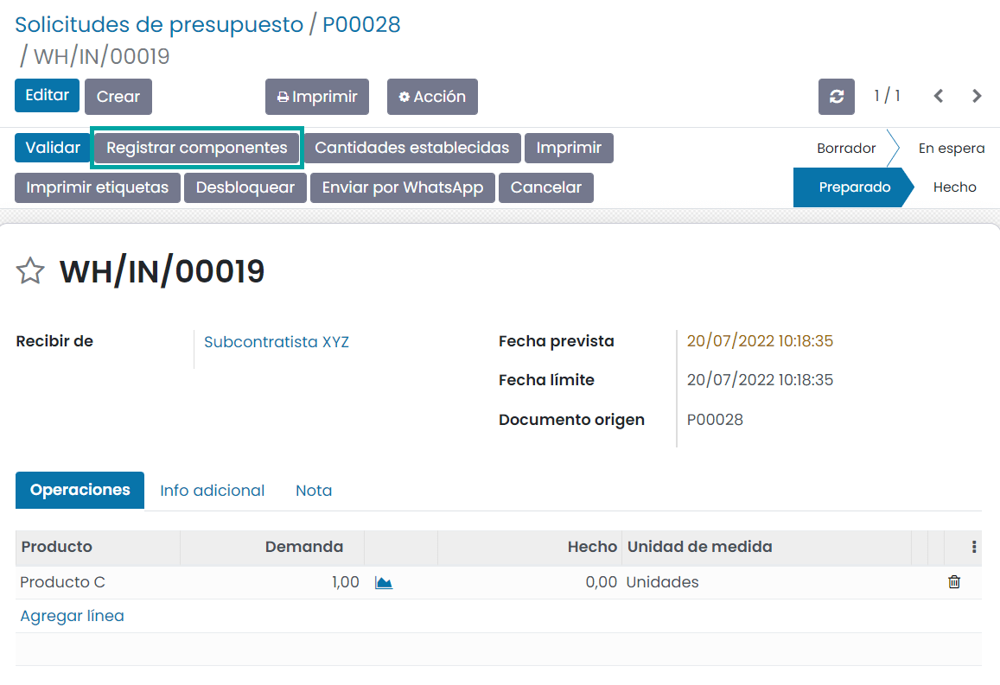

A efectos de auditoría, es posible comprobar los números de lote registrados en una recepción utilizando el icono situado
a la derecha de los productos finales:

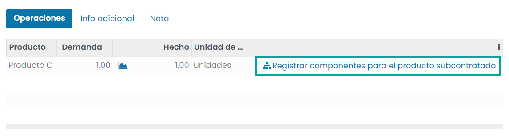

.. note::
   Ten en cuenta que en caso de que se haya seleccionado el consumo flexible en la lista de materiales subcontratada
   para un producto sin seguimiento, la opción de registrar componentes también aparecerá opcionalmente en cada línea de
   movimiento, por si deseas registrar más o menos consumo de componentes en tu ubicación de subcontratación, al recibir tu
   producto final.

Automatizar la reposición de los subcontratistas
================================================

Hay dos formas de automatizar el suministro de materias primas a tus subcontratistas al comprar el producto final. El
método elegido depende de si deseas o no que los materiales transiten por tu almacén. Ambos métodos se describen como
mecanismos de estilo *pull*, ya que su desencadenante es el pedido de compra inicial al subcontratista, lo que crea una
necesidad en el lugar de subcontratación de materia prima.

Si estás abasteciendo a tu subcontratista con materia prima desde tu propio almacén, debes activar la ruta
*Subcontratista de reabastecimiento en el pedido* como se muestra a continuación. Si se trata de un componente que compras
a un proveedor, la ruta de compra también debe activarse:

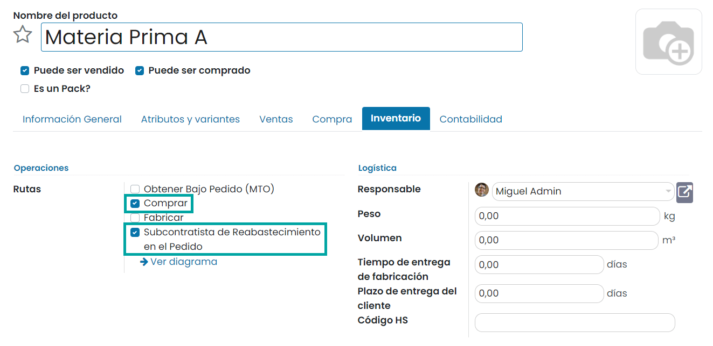

Por otro lado, si deseas que tu proveedor reabastezca a tu subcontratista directamente, debes elegir la ruta
*Subcontratista de Dropship bajo pedido*. Para que esta ruta esté activa en el formulario del producto, primero debes
activar la opción **Dropshipping** desde la pantalla :menuselection:`Compra --> Configuración --> Ajustes`. Una vez que
se valida el pedido de compra para el subcontratista, esta ruta creará una solicitud de presupuesto de envío directo de
tu proveedor a ese subcontratista. Luego solo necesitas revisarlo y validarlo:

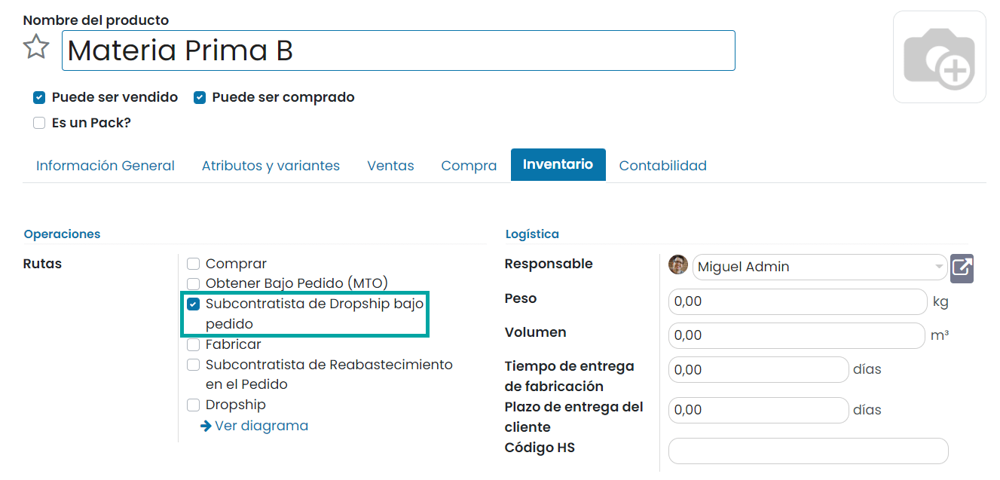

Ten en cuenta que la ruta de compra no se selecciona en este caso, ya que la ruta de Dropship ya es una ruta de compra.

Finalmente, si deseas realizar un seguimiento del stock de estas materias primas en tus ubicaciones de subcontratación,
debes activar la opción **Ubicaciones de almacenamiento** en la pantalla :menuselection:`Inventario --> Configuración --> Ajustes`.

Desde el formulario de la ubicación, podrás acceder al stock actual:

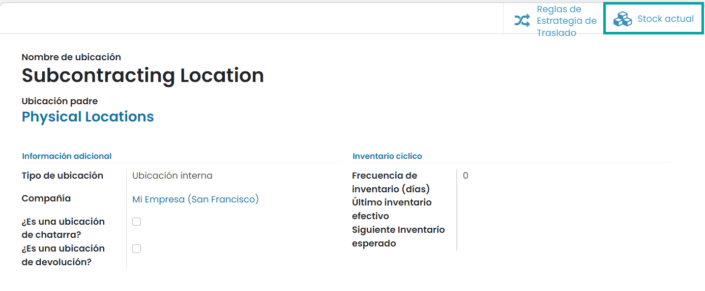

Abastecimiento manual
=====================

También puedes optar por reabastecer a tus subcontratistas manualmente. Si deseas enviar componentes a tu subcontratista
cuando lo desees, selecciona el tipo de operación "Subcontratista de reabastecimiento" en el módulo de inventario y crea
una transferencia, especificando a qué subcontratista estás entregando:

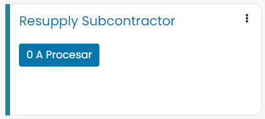

Alternativamente, también puedes pedirle manualmente a tu proveedor que reabastezca a su subcontratista creando un
pedido de compra de tipo *Dropship*, con tu subcontratista establecido como la dirección de entrega:

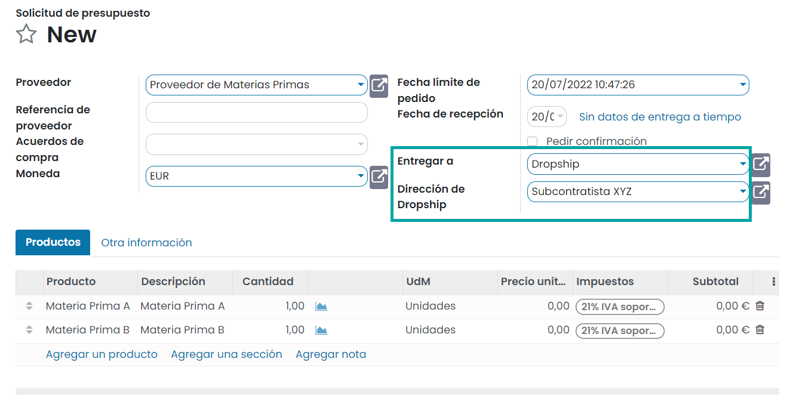