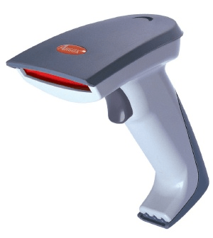
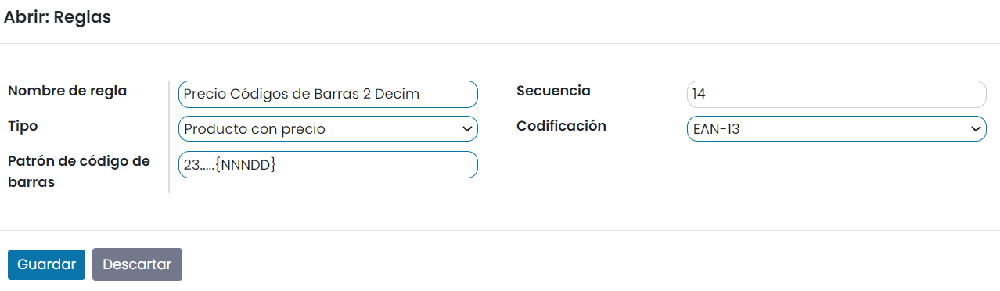

:show-content:

=================
Códigos de barras
=================

Un **código de barras** es un código basado en la representación de un conjunto de líneas paralelas de distinto grosor y
espaciado que en su conjunto contienen una determinada información (las barras y espacios representan cadenas de caracteres).
El código de barras permite reconocer rápidamente un artículo de forma única, global y no ambigua en un punto de la cadena
logística.

Configuración
=============

Configurar tu escáner de código de barras
-----------------------------------------

Aprender a trabajar con el lector de código de barras en Daeris es bastante fácil. De todos modos, una buena experiencia
de usuario depende de una configuración adecuada de las herramientas. Esta guía te ayudará a través de tareas de elección
y configuración del escáner de código de barras.

Encuentra el escáner de código de barras que se adapte a tus necesidades
~~~~~~~~~~~~~~~~~~~~~~~~~~~~~~~~~~~~~~~~~~~~~~~~~~~~~~~~~~~~~~~~~~~~~~~~

Los tipos recomendados de lectores de códigos de barras para trabajar con Daeris son el **lector por USB**, el
**lector por bluetooth** y el **lector móvil por ordenador**.

-  Si vas a escanear los productos cerca de un ordenador, el **lector por USB** es la mejor manera de hacerlo. Simplemente
   conéctalo al ordenador para empezar a escanear. Solo asegúrate cuando lo compres que el escáner es compatible con tu
   distribución de teclado o que se puede configurar para que lo sea.

-  El **lector por bluetooth** se puede usar junto con un teléfono inteligente o una tableta y es una buena opción si deseas
   contar con movilidad pero no necesitas realizar una gran inversión. Una de las formas de hacerlo es iniciar sesión en
   Daeris en tu teléfono inteligente, emparejar el lector por bluetooth con el teléfono inteligente y trabajar en el
   almacén con la posibilidad de revisar tu teléfono inteligente de vez en cuando y usar la aplicación.

-  Para uso intensivo, el **lector móvil por ordenador** es la solución más práctica. Consiste en un pequeño ordenador
   con un lector de código de barras incorporado. Esta puede resultar una solución muy productiva, sin embargo, debes
   asegurarte de que sea capaz de ejecutar Daeris sin problemas. Podrás trabajar con los modelos más recientes que usan
   Android + Google Chrome o Windows + Internet Explorer Mobile. Sin embargo, debido a la variedad de modelos y
   configuraciones en el mercado, es esencial probarlo primero.

Configurar tu lector de código de barras
~~~~~~~~~~~~~~~~~~~~~~~~~~~~~~~~~~~~~~~~

Un escáner USB de código de barras necesita estar configurado para usar la misma **distribución de teclado** que tu sistema
operativo. La mayoría de los escáneres están configurados para escanear el código de barras apropiado en el manual del
usuario.

Por defecto, Daeris tiene unos 50 milisegundos de retraso cada vez que escaneas productos consecutivamente (esto ayuda a
evitar que escanees el código de barras dos veces por accidente). Si quieres omitir este retraso, puedes configurar tu
lector para **insertar un salto de línea** al final de cada código de barras. Usualmente esta es la configuración automática
y se puede configurar explícitamente para esto si escaneas un código de barras específico en el manual del usuario.

Configurar las nomenclaturas de los códigos de barras
-----------------------------------------------------

Las **nomenclaturas de los códigos de barras** definen cómo se reconocen y categorizan los códigos de barras. Cuando se
escanea un código de barras se asocia a la primera regla con un patrón coincidente. La sintaxis de los patrones es la de
una expresión regular, y un código de barras se reconoce si la expresión regular coincide con un prefijo del código de barras.

Existen diferentes situaciones en las que las nomenclaturas de códigos de barras pueden ser útiles. Un caso de uso conocido
es el de un punto de venta que vende productos a granel, en el que los clientes escalarán sus productos por sí mismos y
obtendrán el código de barras impreso para pegarlo en el producto. Este código de barras contendrá el peso del producto y
ayudará a calcular el precio debidamente.

Los patrones también pueden definir cómo se codifican valores numéricos, tales como el peso o el precio, en el código de
barras. Se indican por **{NNN}**, donde las *N* definen en qué posición se codifican los números. También se permiten
números reales si los decimales se indican con *D*, por ejemplo **{NNNDD}**. En estos casos, el campo de código de barras
en los registros asociados debe mostrar ceros en esas posiciones.

Para gestionar las nomenclaturas de códigos de barras navega a la pantalla
:menuselection:`Inventario --> Configuración --> Nomenclaturas de código de barras`. Sobre el listado inicial existe un
registro por defecto, que dispone de un conjunto de reglas básico listo para su uso:

Al acceder al formulario de detalle de la nomenclatura, el sistema muestra los siguientes campos:

-  **Nomenclatura del código de barras**: Nombre descriptivo de la agrupación de reglas.

-  **Conversión UPC/EAN**: Seleccionable para indicar si se requiere conversión. Los valores disponibles son los siguientes:

   -  Nunca

   -  Siempre

   -  EAN-13 a UPC-A

   -  UPC-A a EAN-13

.. note::
   Los códigos UPC se pueden convertir a EAN prefijándolos con un cero. Este ajuste determina si un código de barras
   UPC/EAN debe ser convertido automáticamente en uno u otro sentido al buscar una coincidencia con la otra codificación.

Al editar o crear una nueva regla, el sistema muestra una ventana con los siguientes campos:

-  **Nombre de regla**: Nombre descriptivo de la regla.

-  **Tipo**: Dispones de las siguientes opciones:

   -  **Alias**: El patrón de concordancia será un alias para este código de barras.

   -  **Unidad de producto**: Te permite identificar un producto tanto para TPV como para transferencias.

   -  **Producto Pesado**: Te permite identificar el producto y especificar su peso, utilizado tanto en el punto de venta
      (en el que el precio se calcula en función del peso) como en el inventario.

   -  **Ubicación**: Te permite identificar la ubicación en una transferencia cuando se activa la ubicación múltiple.

   -  **Lote**: Te permite identificar lotes en una transferencia cuando la trazabilidad del producto está activada.

   -  **Paquete**: Te permite identificar paquetes en una transferencia cuando los paquetes están activados.

   -  **Producto con precio**: Te permite identificar el producto y especificar el precio utilizado en TPV.

   -  **Producto con descuento**: Te permite crear un código de barras por descuento aplicado. Luego puedes escanear tu
      producto en el punto de venta y luego escanear el código de barras de descuento, el descuento se aplicará al precio
      normal del producto.

   -  **Cliente**: Te permite identificar al cliente, por ejemplo, utilizado con el programa de fidelización.

   -  **Cajero**: Te permite identificar al cajero al ingresar al TPV.

-  **Patrón de código de barras**: El patrón de código de barras es una expresión regular que define la estructura del
   código de barras. Por ejemplo, para el patrón "21.....{NNDDD}", 21 define los productos en los que se aplicará la regla,
   esos son los números con los que debe comenzar el código de barras del producto. Los 5 puntos son los siguientes números
   del código de barras del producto y están ahí simplemente para identificar el producto en cuestión. La "N" define un
   número y la "D" define los decimales. Cuando el patrón de código de barras contiene "*", significa que puede contener
   cualquier número de caracteres y estos caracteres pueden ser cualquier número.

-  **Secuencia**: Secuencia de la regla.

-  **Codificación**: La regla solo aplicará si el código de barras está codificado con la codificación aquí indicada.
   Los posibles valores son: Cualquiera, EAN-13, EAN-8 y UPC-A.

Operaciones
===========

Procesar transferencias de inventario
-------------------------------------

Es posible utilizar el lector de códigos de barras para introducir productos en las operaciones de una transferencia
de inventario. Para activar esta función, navega a la pantalla :menuselection:`Inventario --> Configuración --> Ajustes`
y marca la opción **Escaneo de código de barras de inventario**:

Una vez activada esta opción, pulsa el botón *Guardar* de la pantalla de ajustes.

A partir de ese momento, al crear una nueva transferencia de inventario desde la pantalla
:menuselection:`Inventario --> Operaciones --> Transferencias`, aparecerá el campo **Código de barras** en el listado
de operaciones:

Si posicionas el cursor sobre el campo de código de barras, y escaneas un código de barras con el lector, el sistema
informará de forma automática el producto en el listado:

Por otro lado, es posible saber si un producto ya ha sido añadido en el listado de operaciones, posicionándote sobre el campo
**Código de barras** del formulario y escaneando o introduciendo el código de barras a validar. Esto es útil para albaranes
con un gran número de operaciones:

.. image:: codigos_de_barras/escaneo-codigo-barras-inventario-4.png
   :align: center
   :alt: Escaneo de código de barras de inventario (4)

.. warning::
   Si el producto no se encuentra dado de alta en el sistema, o si el producto no ha sido dado de alta en el listado de
   operaciones, el sistema mostrará un mensaje de advertencia.