======================
Configuración de envío
======================

.. _inventario/envio/configurar_metodo_envio:

Configurar un método de envío
=============================

Mediante la configuración de los **métodos de envío** se ponen a disposición de los usuarios una serie de agencias de
transporte que se pueden seleccionar al realizar un pedido. Cada método de envío se puede configurar en base a una serie
de reglas para que, si se cumplen, aparezca como método de envío disponible al usuario. También se puede configurar el
precio del envío en función de las características del producto (dimensiones, peso, etc.).

Además, en base al método de envío seleccionado, siempre que sea uno de los preconfigurados y se haya informado el
código de seguimiento sobre el pedido, se permitirá el acceso mediante un botón al seguimiento del envío desde la web
de la agencia de transporte (para pedidos de Correos, Correos Express, Fedex, GLS, SEUR, TNT, UPS e Integra2).

Para configurar los métodos de envío, navega a la pantalla :menuselection:`Inventario --> Configuración --> Métodos de envío`.
Por defecto, se encuentran preconfigurados varios métodos de envío:

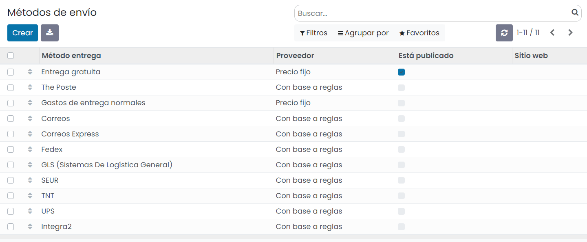

Al crear un nuevo método de envío o editar uno de los existentes, el sistema navega al formulario de detalle, donde
puedes encontrar la siguiente información:

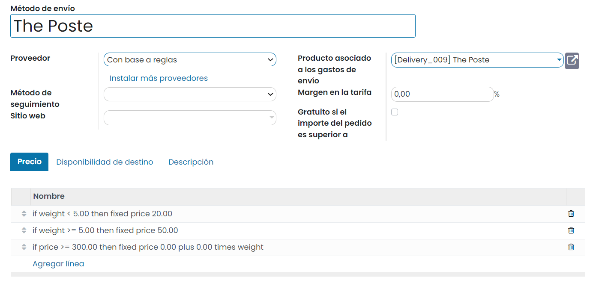

-  **Nombre**: Nombre descriptivo del método de envío.

-  **Proveedor**: Indica si el precio es fijo o se calcula en base a reglas. En el caso de indicar que es fijo aparece el
   campo **Precio fijo** sobre la pestaña **Precio**, donde puedes indicar el coste fijo del envío. En el caso de indicar
   que el coste es en base a reglas, puedes informar las reglas sobre la pestaña **Precio**. Mediante las reglas de precios
   puedes definir las condiciones en base al peso, dimensiones, cantidad de artículos, precio del pedido, etc. Al cumplirse
   una condición puedes definir el coste de envío. En este ejemplo se han configurado las siguientes reglas de precio:

   -  20,00 euros en el caso de que el peso sea menor que 5 kg

   -  50,00 euros en el caso de que el peso sea mayor o igual a 5 kg

   -  0,00 euros en el caso de que el precio sea mayor o igual a 300,00 euros

-  **Método de seguimiento**: En función del valor incorporado puedes acceder mediante un botón al seguimiento del envío
   desde la web de la agencia de transporte. Los métodos de seguimiento disponibles son los siguientes: Correos, Correos
   Express, Fedex, GLS, SEUR, TNT, UPS e Integra2.

-  **Sitio web**: Indica el sitio web en el que estará disponible este método de envío. Si este campo se deja en blanco,
   el método de envío estará disponible en todos los sitios web.

-  **Producto asociado a los gastos de envío**: Un gasto de envío es un producto que se asocia a la venta. Este campo se
   usa para definir dicho producto. En función del IVA asociado a este producto, se calculará el impuesto del coste del envío.

-  **Margen en la tarifa**: Porcentaje a añadir al precio del envío en el caso de que quieras aplicar una comisión.

-  **Gratuito si el importe del pedido es superior a**: Si el importe total del pedido (gastos de envío excluidos) es
   igual o superior a este valor, el envío es gratuito para el cliente.

Desde la pestaña **Disponibilidad de destino** se permite filtrar los transportistas según la dirección de entrega del
cliente. De este modo puedes incorporar países, provincias o rangos de códigos postales. Si la dirección de entrega
coincide con el país, provincia o rango de código postal, el método de envío estará disponible para el cliente.

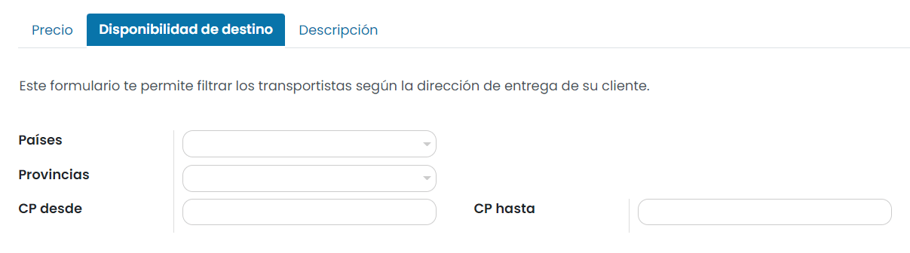

Desde la pestaña **Descripción** se permite informar una descripción que quieras mostrar a tus clientes. Esta descripción
se informará sobre cada pedido, albarán y factura:

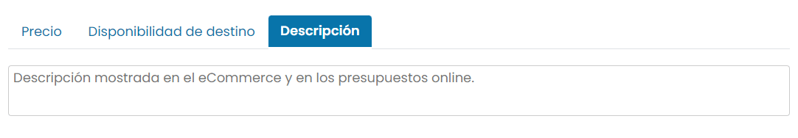

Una vez configurado el método de envío, se debe publicar el mismo mediante el botón ubicado en la parte superior derecha
del formulario:

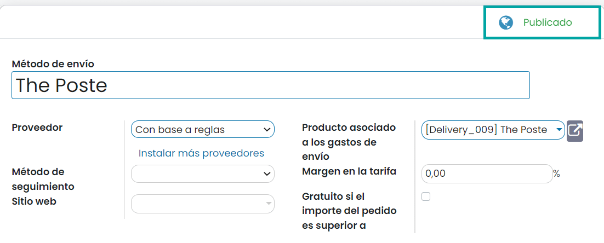

A partir de ese momento, cuando se realice una venta, los usuarios ya podrán utilizar el método de envío publicado.

.. seealso::
   * :ref:`inventario/envio/facturar_coste_envio`
   * :ref:`inventario/envio/informar_codigo_seguimiento`

Confirmar entregas por correo electrónico
=========================================

Para enviar un correo electrónico al cliente cuando se realice la entrega de un pedido, navega a la pantalla
:menuselection:`Inventario --> Configuración --> Ajustes` y marca la opción de **Confirmación de correo electrónico**:

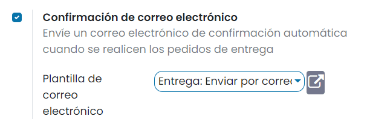

Por defecto, hay una plantilla de correo para realizar el envío del mensaje. Si lo necesitas, puedes modificar dicha
plantilla o crear una nueva.

Una vez activada la opción, pulsa el botón *Guardar* de la pantalla de ajustes.

A partir de ese momento, cuando valides la entrega de un pedido desde la pantalla :menuselection:`Inventario --> Operaciones --> Transferencias`,
el sistema enviará un correo electrónico, que podrá ser consultado desde el apartado de *Chatter*:

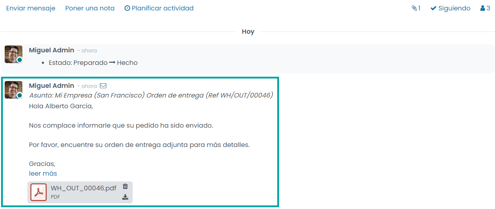

.. seealso::
   * :doc:`../../../varios/correo_electronico/enviar_correos`

.. _inventario/envio/confirmar_entregas_sms:

Confirmar entregas por SMS
==========================

Para enviar un SMS al cliente cuando se realice la entrega de un pedido, navega a la pantalla
:menuselection:`Inventario --> Configuración --> Ajustes` y marca la opción de **Confirmación por SMS**:

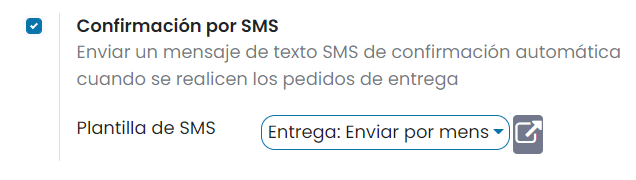

Por defecto, hay una plantilla de SMS para realizar el envío del mensaje. Si lo necesitas, puedes modificar dicha
plantilla o crear una nueva.

Una vez activada la opción, pulsa el botón *Guardar* de la pantalla de ajustes.

A partir de ese momento, cuando valides la entrega de un pedido desde la pantalla :menuselection:`Inventario --> Operaciones --> Transferencias`,
el sistema enviará un mensaje de texto SMS, que podrá ser consultado desde el apartado de *Chatter*:

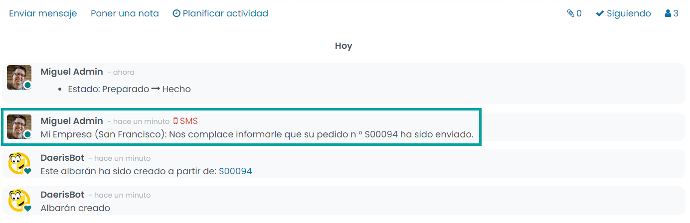

.. seealso::
   * :doc:`../../../varios/sms`

Requerir una firma en tus entregas
==================================

Es posible requerir una firma en la entrega de pedidos para que quede constancia de que se ha efectuado la misma. Para
activar esta función, navega a la pantalla :menuselection:`Inventario --> Configuración --> Ajustes` y marca la opción
**Firma**:

Una vez marcada la opción, pulsa el botón *Guardar* de la pantalla de ajustes.

A partir de ese momento, al validar una orden de entrega, aparecerá un nuevo botón que dará la posibilidad de **Firmar**:

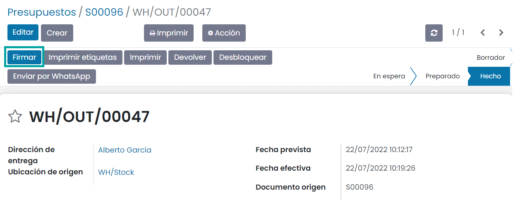

Al pulsar el botón de firma, el sistema desplegará una ventana en donde será posible dibujar una firma, generar una firma
automática, o cargar una firma de un archivo:

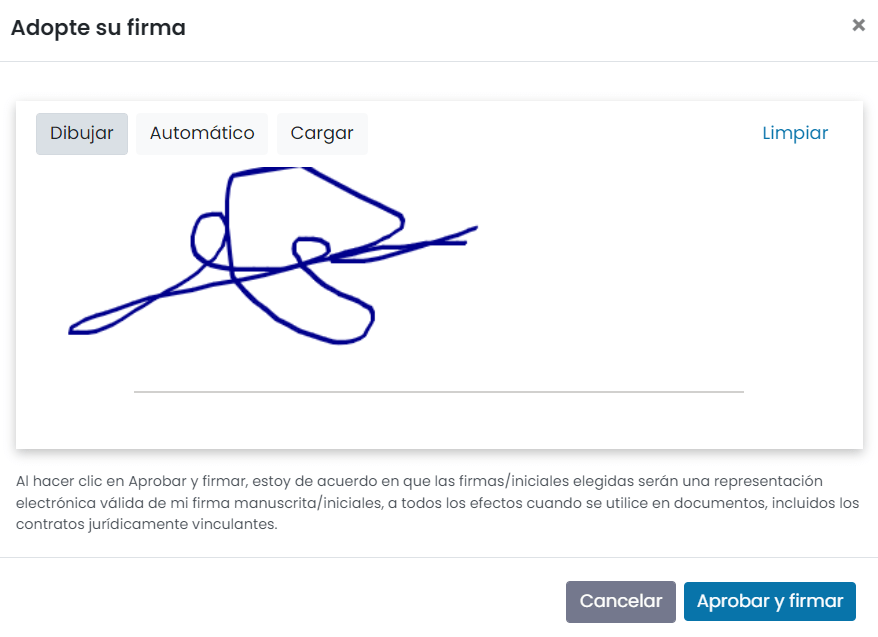

Una vez firmado, se deberá pulsar el botón **Aprobar y firmar**.

En el apartado de *chatter* quedará registrada la firma para que pueda ser consultada posteriormente:

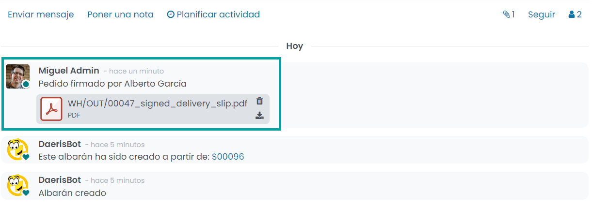

El documento PDF contiene el albarán de entrega junto con la firma del cliente:

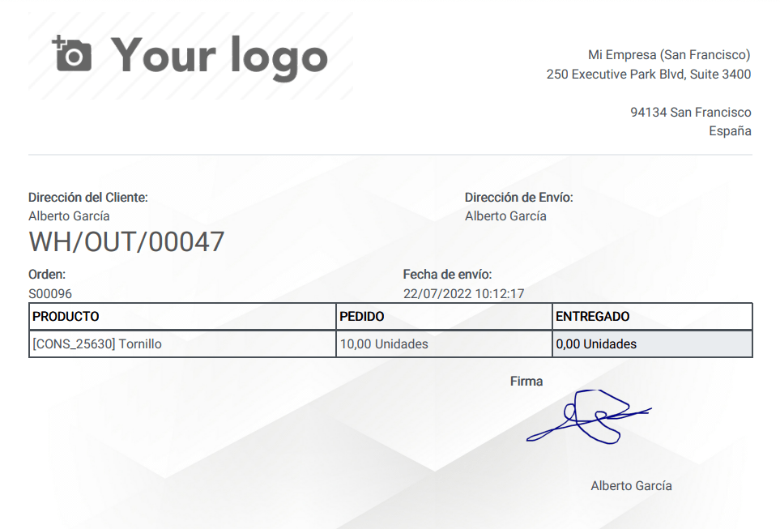

Mostrar incoterms en pedidos y facturas
=======================================

Los **incoterms** (*international commercial terms* o *términos de comercio internacional*) son términos, de tres letras
cada uno, que reflejan las normas de aceptación voluntaria por las partes en un contrato de compraventa internacional de
mercancías acerca de las condiciones de entrega de las mercancías. Se usan para aclarar los costes de las transacciones
comerciales internacionales, delimitando las responsabilidades entre el comprador y el vendedor, y reflejan la práctica
actual en el transporte internacional de mercancías.

Para mostrar los incoterms en pedidos y facturas, navega a la pantalla :menuselection:`Ventas --> Configuración --> Ajustes`
y marca la opción **Incoterms**:

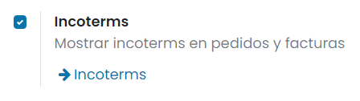

Una vez marcada la opción, pulsa el botón *Guardar* de la pantalla de ajustes.

A continuación, pulsa el enlace *Incoterms*:

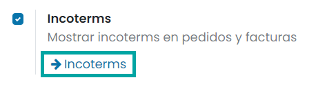

El sistema navegará al listado de términos de comercio internacional dados de alta en la aplicación, donde será posible
modificar los códigos existentes o crear nuevos:

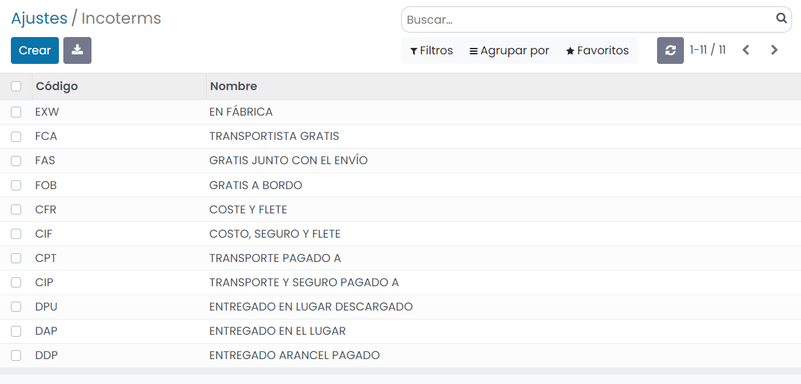

A partir de ese momento, al crear un nuevo pedido de ventas, será posible informar los incoterms desde la pestaña
**Otra información** del detalle de un pedido:

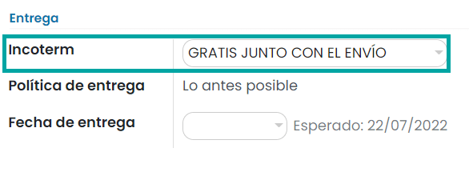

Al enviar el pedido por correo electrónico, se puede observar que se ha incluido un nuevo campo con el **Incoterm**:

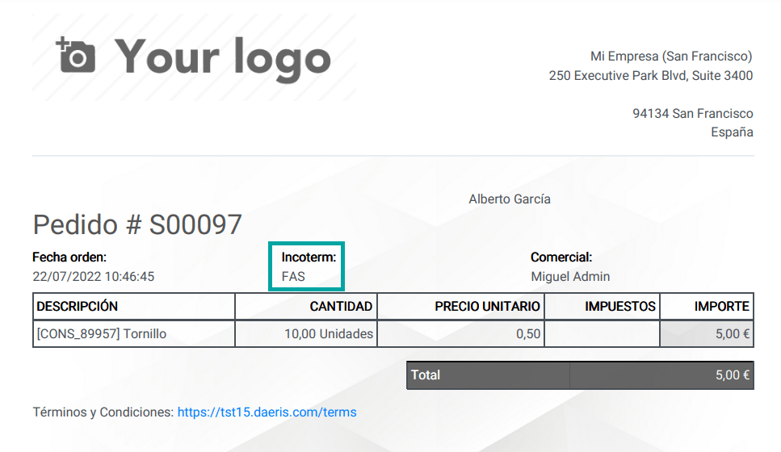

Del mismo modo, al generar la factura, se puede observar que se ha incluido un nuevo campo con el **Incoterm**:

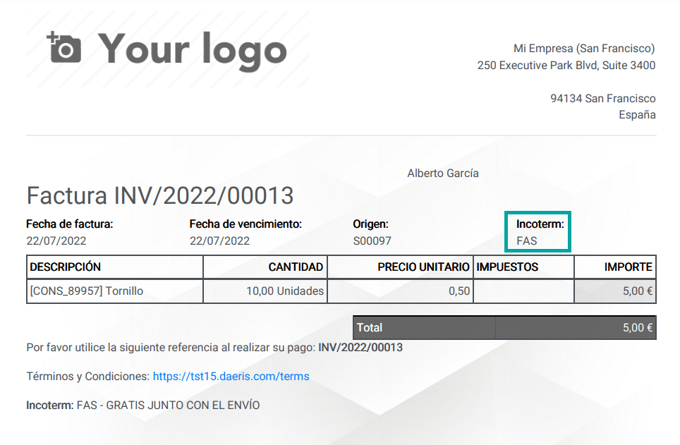

Definir la política de entrega por defecto
==========================================

Es posible definir la política de entrega por defecto en los pedidos de venta. Para ello, navega a la pantalla
:menuselection:`Inventario --> Configuración --> Ajustes` y selecciona un valor para el campo **Política de las Operaciones**:

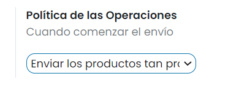

Las opciones disponibles son *Enviar los productos tan pronto como estén disponibles, con los pedidos en espera* o
*Enviar todos los productos a la vez*.

Una vez seleccionada la opción deseada, pulsa el botón *Guardar* de la pantalla de ajustes.

A partir de ese momento, al crear un nuevo presupuesto de venta, desde la pestaña de **Otra información**, el campo
**Política de entrega** aparecerá informado con el valor por defecto seleccionado en los ajustes.

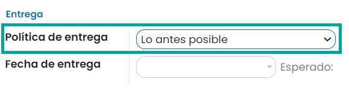

.. note::
   Si entregas todos los productos a la vez, el pedido de entrega se programará en función del mayor tiempo de entrega
   del producto. De lo contrario, se basará en el tiempo de entrega más corto.