====================
Operaciones de envío
====================

.. _inventario/envio/facturar_coste_envio:

Facturar el coste de envío al cliente
=====================================

Para facturar el coste de envío al cliente, los usuarios deberán pulsar el botón **Agregar un envío** en el formulario de
detalle de un presupuesto, una vez informadas las líneas del pedido:

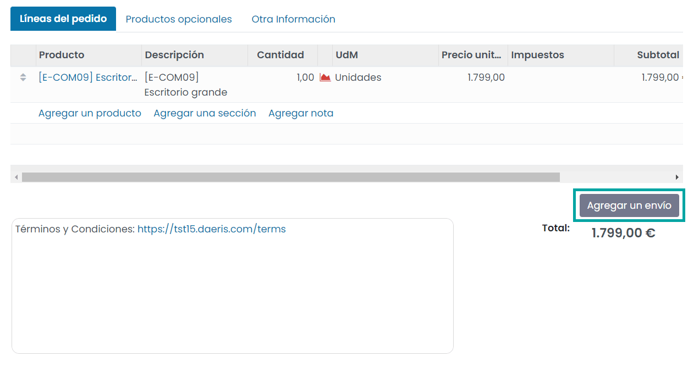

El sistema desplegará una ventana donde será posible seleccionar el método de envío:

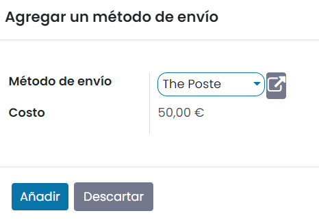

Tras pulsar el botón *Añadir*, el producto asociado al método de envío se añadirá a las líneas del pedido de venta, junto
con el precio:

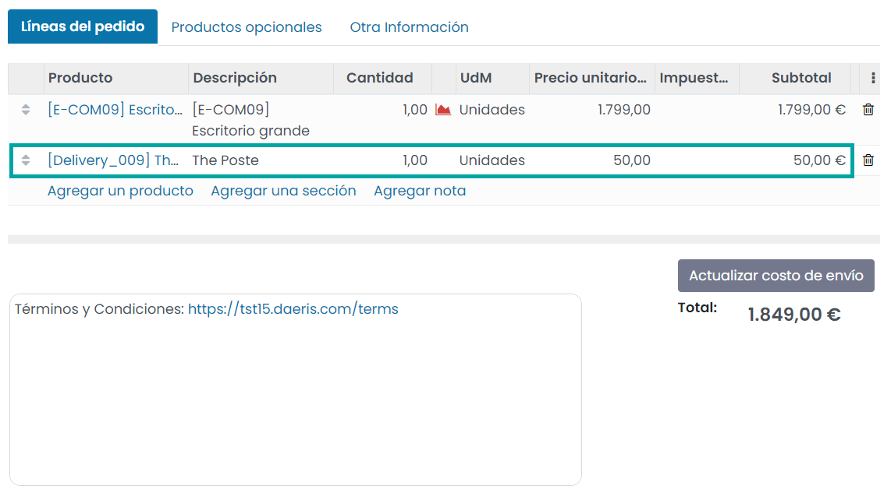

Por último, es posible cambiar el método de envío seleccionado pulsando el botón **Actualizar costo de envío**. Esto
desplegará una ventana en donde poder actualizar el método de envío, lo que actualizará de nuevo las líneas del pedido
de venta con el nuevo método seleccionado.

.. seealso::
   * :ref:`inventario/envio/configurar_metodo_envio`

.. _inventario/envio/informar_codigo_seguimiento:

Informar el código de seguimiento de un pedido
==============================================

Una vez realizado el pago de un pedido, accediendo al detalle del mismo en la pantalla :menuselection:`Ventas --> Pedidos --> Pedidos`,
puedes observar cómo se ha incluido una línea con el método de envío seleccionado y el coste asociado:

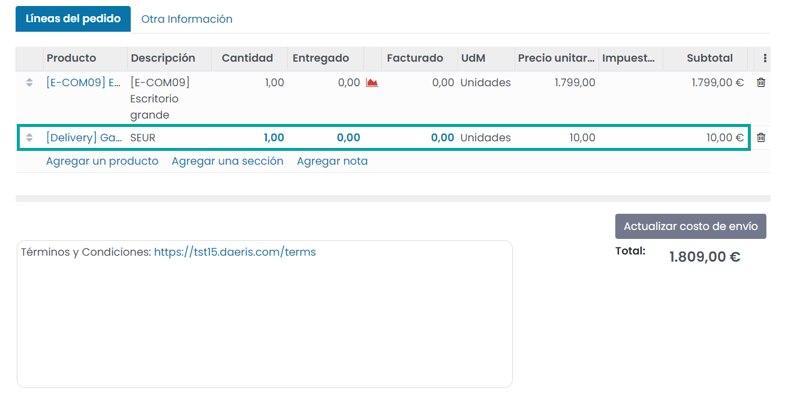

Posteriormente, cuando hayas tramitado con la empresa de transportes el envío, te emitirán un código de referencia para
realizar el seguimiento del paquete. Este número debes incorporarlo al sistema para que el cliente pueda realizar el
seguimiento de su paquete.

.. note::
   El servicio de seguimiento se puede realizar para pedidos de Correos, Correos Express, Fedex, GLS, SEUR, TNT, UPS e Integra2.

Para incorporar el código de seguimiento al pedido, navega a la entrega asociada al pedido desde el icono de entregas
ubicado en la parte superior derecha del formulario del pedido:

En el detalle de la entrega, navega a la pestaña de **Info adicional** e informa el código de seguimiento en el campo
**Número de seguimiento**:

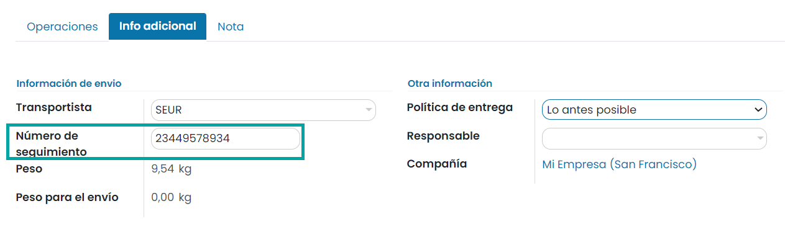

Una vez incorporada la referencia de seguimiento, para validar que todo es correcto, haz clic sobre el icono de
seguimiento ubicado en la parte superior derecha del formulario:

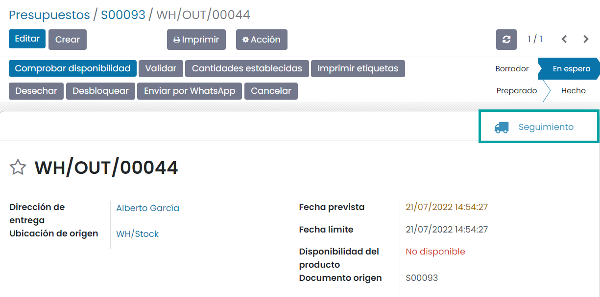

El sistema abrirá la página web del transportista posicionándose sobre el pedido en cuestión:

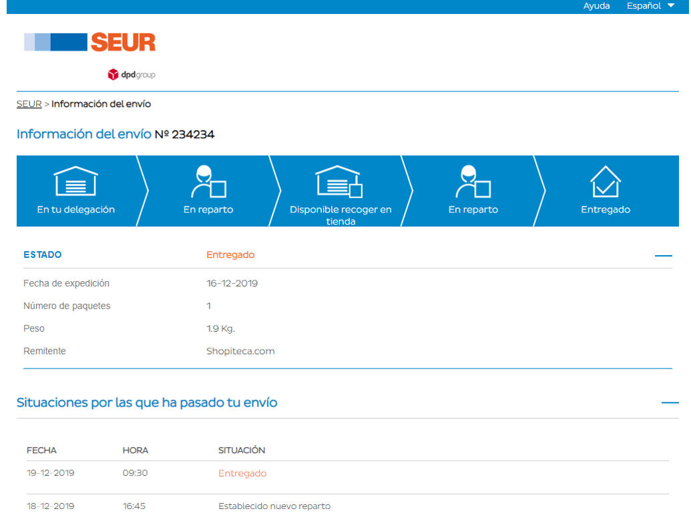

Del mismo modo, si el cliente accede a su pedido a través del área privada de clientes, podrá encontrar el acceso al
seguimiento del pedido desde el apartado de **Órdenes de entrega** del detalle del pedido:

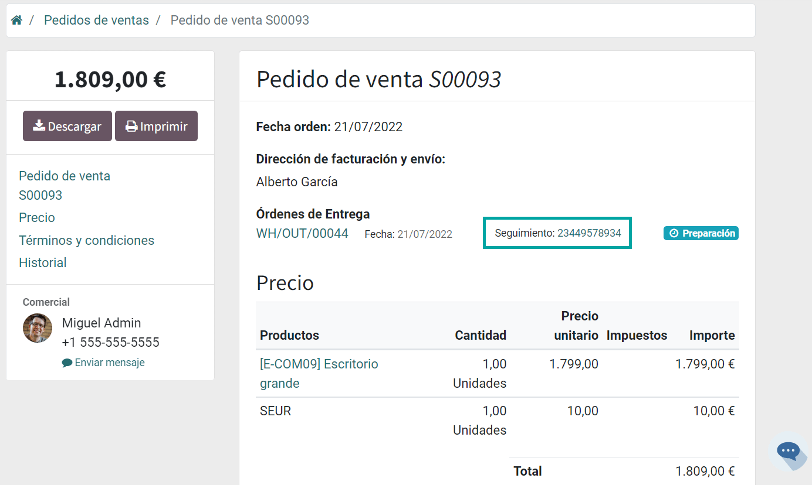

.. seealso::
   * :ref:`inventario/envio/configurar_metodo_envio`

Imprimir etiquetas de envío
===========================

Es posible imprimir etiquetas de envío en una entrega. Para ello, accede al detalle de una entrega desde la pantalla
:menuselection:`Inventario --> Operaciones --> Transferencias`, y pulsa el botón **Imprimir etiquetas**:

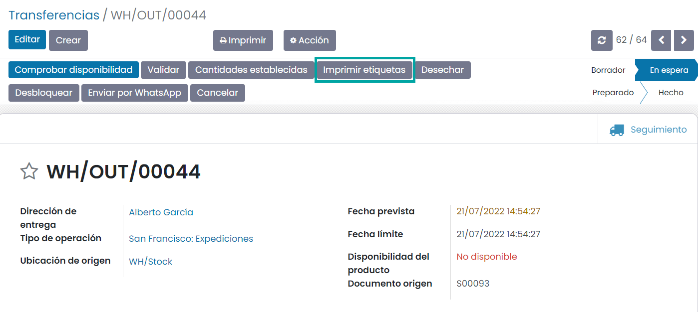

El sistema desplegará una ventana en donde poder informar los siguientes campos:

-  **Cantidad a imprimir**: Permite seleccionar entre *Transferir cantidades* o *Personalizado*, que permite introducir
   una cantidad a imprimir.

-  **Formatear**: Las opciones posibles son *Dymo*, *2 x 7 con precio*, *4 x 7 con precio*, *4 x 12*, *4 x 12 con precio*,
   *Etiquetas ZPL* y *Etiquetas ZPL con precio*.

-  **Añadir comentario extra**: En algunas de las opciones de formateo, se permite añadir un comentario extra a la etiqueta.

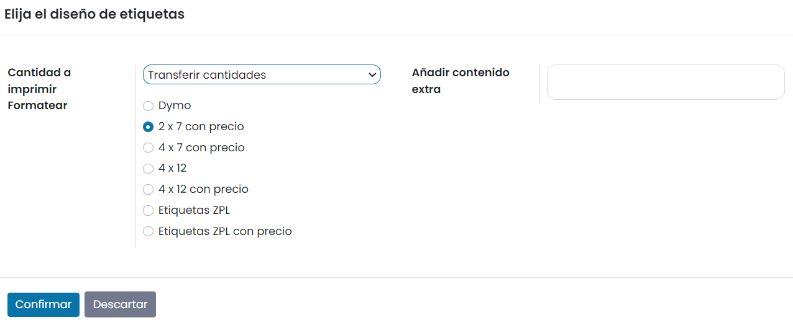

Tras pulsar el botón *Confirmar*, el sistema genera una etiqueta con el formato seleccionado y la descarga en tu equipo:

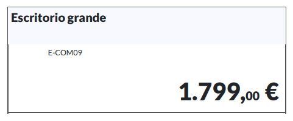