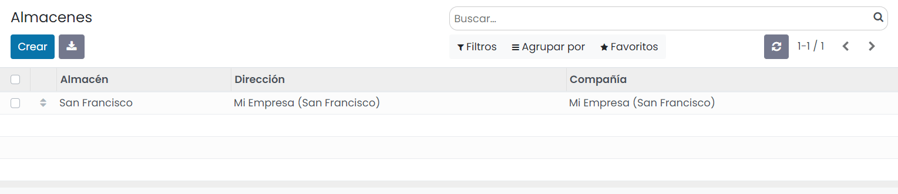
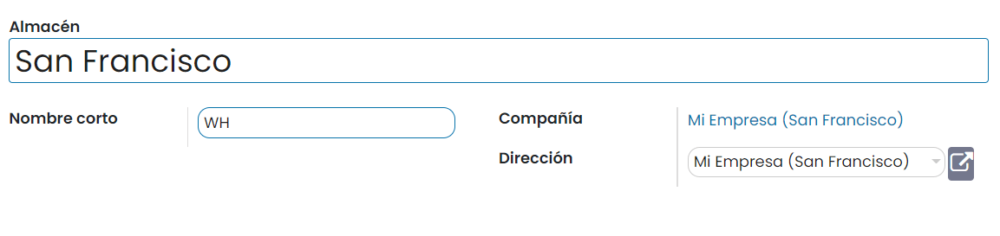
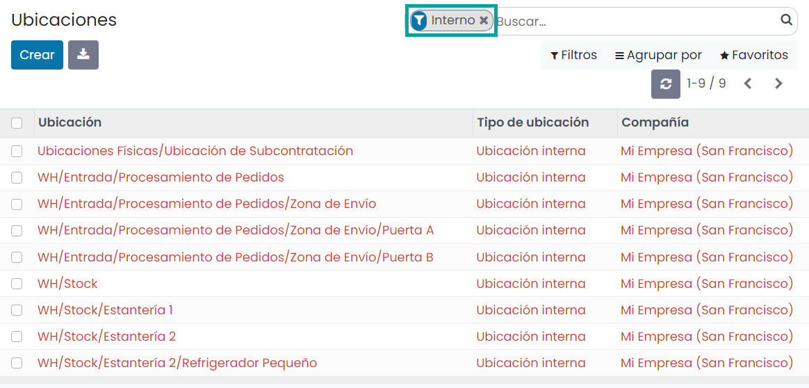
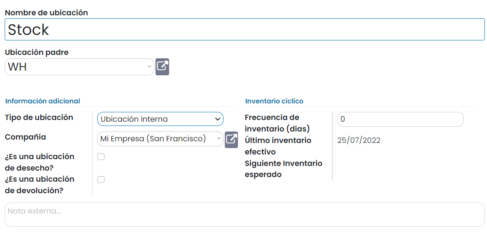

=========
Almacenes
=========

Un **almacén** es un lugar físico (edificio, local, nave industrial, etc.) donde se depositan géneros de cualquier tipo,
generalmente mercancías. En Daeris se pueden crear varios almacenes y realizar movimientos de mercancías entre ellos.

Una **ubicación** es un espacio específico dentro de tu almacén. Se puede considerar una sububicación de tu almacén: un
estante, un piso, un pasillo, etc. Por lo tanto, una ubicación es parte solo de un almacén y no es posible vincularla a
múltiples almacenes. Puedes configurar tantas ubicaciones como necesites en un almacén.

Hay tres tipos de ubicaciones:

-  Las **ubicaciones físicas** son ubicaciones internas de las cuales tú eres el propietario. Estas pueden ser el área
   de carga y descarga de tu almacén, una estantería o un departamento, etc.

-  Las **ubicaciones de contacto** son espacios dentro del almacén de un proveedor o cliente. Estos funcionan de la misma
   manera que las ubicaciones físicas con la única diferencia que tú no eres el propietario del almacén.

-  Las **ubicaciones virtuales** son lugares que no existen, pero en los cuales se pueden colocar productos cuando no
   están físicamente en un inventario aún (o ya no lo están). Son útiles cuando quieres colocar productos perdidos fuera
   de tus existencias (en la pérdida de inventario), o cuando quieres tomar en cuenta productos que van camino a tu
   almacén (aprovisionamientos).

Las ubicaciones se estructuran jerárquicamente mediante una relación padre-hijo, lo que permite conseguir un nivel exacto
en la organización del almacén y analizar en detalle las operaciones relacionadas con el inventario.

.. _inventario_y_fabricacion/inventario/gestion/almacenes/configurar_almacenes:

Configurar los almacenes de inventario
======================================

Para configurar los almacenes de inventario, navega a la pantalla :menuselection:`Inventario --> Configuración --> Almacenes`:

Al crear o editar un almacén, el sistema navega a la pantalla de detalle, donde aparecen los siguientes campos:

-  **Almacén**: Nombre completo del almacén.

-  **Nombre corto**: Nombre corto o código identificativo del almacén.

-  **Compañía**: Compañía asociada al almacén.

-  **Dirección**: Dirección del almacén. Si seleccionas una empresa, la dirección del almacén será la misma que la de la
   compañía.

Una vez informados los campos necesarios, pulsa el botón *Guardar*.

.. _inventario_y_fabricacion/inventario/gestion/almacenes/configurar_ubicaciones:

Configurar las ubicaciones de inventario
========================================

Para permitir controlar la ubicación de productos dentro de los almacenes, navega a la pantalla
:menuselection:`Inventario --> Configuración --> Ajustes` y activa la opción **Ubicaciones de almacenamiento**:

Una vez activada esta opción, pulsa el botón *Guardar* de la pantalla de ajustes.

Para configurar las ubicaciones, navega a la pantalla :menuselection:`Inventario --> Configuración --> Ubicaciones`.
Inicialmente aparece un listado con las ubicaciones filtradas por el tipo de ubicación *Interno*. Si se requiere ver
todas las ubicaciones se puede eliminar el filtro *Interno*:

Al crear o editar una ubicación, el sistema navega a la pantalla de detalle, donde aparecen los siguientes campos:

-  **Nombre de ubicación**: Nombre descriptivo de la ubicación.

-  **Ubicación padre**: Campo de selección que permite escoger la ubicación (física, ajena o virtual) de un nivel superior,
   en el caso de disponer de ella.

-  **Tipo de ubicación**

   -  **Ubicación de proveedor**: Ubicación virtual que representa la ubicación de origen de los productos que provienen
      de los proveedores.

   -  **Vista**: Ubicación virtual utilizada para crear estructuras jerárquicas para el almacén, incorporando ubicaciones
      secundarias. No puede contener productos directamente.

   -  **Ubicación interna**: Ubicaciones físicas dentro del almacén.

   -  **Ubicación de cliente**: Ubicación virtual que representa la ubicación de destino para los productos enviados a
      los clientes.

   -  **Pérdida de inventario**: Ubicación virtual que sirve como contraparte para las operaciones de inventario
      utilizadas para corregir los niveles de stock (inventarios físicos).

   -  **Producción**: Ubicación de contrapartida virtual para las operaciones de producción. Esta ubicación consume la
      materia prima y produce productos acabados.

   -  **Ubicación de tránsito**: Ubicación de contrapartida que se debe usar en operaciones entre compañías o entre almacenes.

-  **¿Es una ubicación de desecho?**: Se informa esta opción si la ubicación se usa como depósito de mercancías
   defectuosas o desechadas.

-  **¿Es una ubicación de devolución?**: Se informa esta opción si la ubicación se usa como depósito de mercancías devueltas.

-  **Frecuencia de inventario (días)**: La frecuencia cíclica se puede establecer en ubicaciones seleccionando una
   frecuencia para verificar el inventario del producto en esta ubicación en particular en los intervalos especificados.

-  **Último inventario efectivo**: Fecha del último inventario realizado en esta ubicación.

-  **Siguiente Inventario esperado**: Fecha para el próximo inventario esperado basado en el cronograma cíclico.

-  **Notas**: Información para describir la ubicación.

Una vez informados los campos necesarios, pulsa el botón *Guardar*.