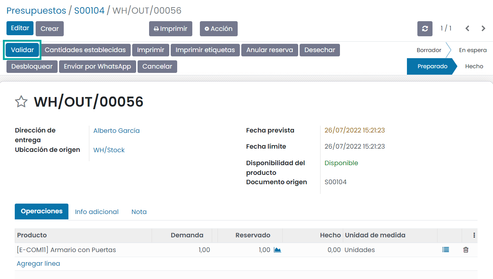
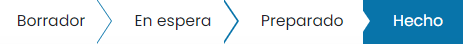

============
Expediciones
============

Dependiendo de factores como el tipo de artículos que vendes, el tamaño de tu almacén o el número de pedidos que registras
cada día, la manera como gestionas las entregas a tus clientes puede variar mucho.

Con Daeris puedes gestionar los envíos que salgan de tu almacén de 3 formas diferentes:

-  **Un paso (envío)**: Enviar directamente desde existencias.

-  **Dos pasos (recoger + enviar)**: Traer bienes a la ubicación de salida antes del envío.

-  **Tres pasos (recoger + empaquetar + enviar)**: Crear los paquetes en una ubicación especializada para después llevarlos
   a la ubicación de salida de donde se enviarán.

Para empresas que cuentan con un almacén más pequeño en el que no requieren guardar una gran cantidad de productos, o que
no venden artículos perecederos, la solución más simple es el envío en un paso. Este tipo de envío no requiere mucha
configuración y permite gestionar los pedidos rápidamente.

El uso de métodos de inventario como FIFO, LIFO y FEFO requiere tener por lo menos dos pasos para gestionar un envío. El
método de envío se determinará según la estrategia de traslado, y después los artículos trasladados se enviarán al cliente.
Este método también es interesante si cuentas con muchas existencias y especialmente cuando los artículos que almacenas
son de tamaño grande.

El sistema de tres pasos es útil en situaciones más específicas, principalmente para gestionar almacenes grandes. Los
artículos se transfieren a un área de empaquetado, donde se agruparán por área de destino. Después de esto, se enviarán
a camiones de salida para la entrega final a clientes.

.. _inventario_y_fabricacion/inventario/gestion/expedicieones/entregar_bienes_directamente:

Entregar bienes directamente (1 paso)
=====================================

Configuración
-------------

No se necesita ninguna configuración para entregar en un paso. Los envíos salientes se configuran de tal manera que se
entregan directamente desde el inventario a los clientes.

Sin embargo, si se activan las **Rutas multietapa** desde la pantalla :menuselection:`Inventario --> Configuración --> Ajustes`
y configuras otra configuración de envío en tu almacén, puedes regresar a la configuración de envío en un paso. Para ello,
navega a la pantalla :menuselection:`Inventario --> Configuración --> Almacenes` y edita el almacén que necesites. Después,
selecciona *Entregar bienes directamente (1 paso)* como tu estrategia de envíos salientes:

Crear pedidos de venta
----------------------

Navega a la aplicación de **Ventas** y crea un presupuesto con productos almacenables para entregar y confírmalo. Podrás
ver que ahora hay una entrega asociado con este pedido de venta en el botón inteligente que se encuentra en la parte superior
del pedido de venta:

Si haces clic en el botón de entrega, podrás ver la orden de entrega:

Procesar una entrega
--------------------

Desde el detalle de la orden de entrega, podrás hacer clic en **Validar** para completar el movimiento si tienes productos
en existencias:

Cuando validas la orden de entrega, los productos dejan tu almacén y se mueven a la ubicación del cliente. Puedes ver que
la entrega se ha producido gracias a que el estado de la orden ahora es *Hecho*:

.. _inventario_y_fabricacion/inventario/gestion/expedicieones/entregar_bienes_dos_pasos:

Enviar bienes a ubicación de salida y entregar (2 pasos)
========================================================

Configuración
-------------

El primer paso es permitir el uso de rutas multietapa. Las rutas te permitirán tener un mecanismo para encadenar acciones.
En este caso, encadenaremos la etapa de recolección con la etapa de envío.

Para permitir rutas multietapa navega a la pantalla :menuselection:`Inventario --> Configuración --> Ajustes` y activa la
opción correspondiente. Ten en cuenta que al activar las rutas multietapa también se activarán las ubicaciones de almacén.
Una vez marcada la opción, pulsa el botón *Guardar* de la pantalla de ajustes.

Una vez que actives las rutas multietapa puedes navegar a la pantalla :menuselection:`Inventario --> Configuración --> Almacenes`
y acceder al detalle del almacén que usará la entrega en dos pasos. Puedes seleccionar la opción *Enviar bienes a ubicación de salida y entregar (2 pasos)*
para los envíos salientes:

Si activas esta opción, se creará una nueva ubicación de salida. Si quieres cambiarle el nombre navega a
:menuselection:`Inventario --> Configuración --> Ubicaciones`. Después, seleccione la ubicación con nombre *Salida* y
actualiza el nombre:

Crear pedidos de venta
----------------------

Navega a la aplicación de **Ventas** y crea un presupuesto con productos almacenables para entregar y confírmalo. Podrás
ver que ahora hay dos entregas asociadas con este pedido de venta en el botón inteligente que se encuentra en la parte superior
del pedido de venta:

Si haces clic en el botón de entregas, debería ver dos recolecciones distintas, una que tenga referencia de *PICK*
para designar el proceso de recolección y otra con referencia *OUT* para designar el proceso de envío:

Procesar la recolección y la entrega
------------------------------------

La operación de recolección es la primera que se procesa. Si tienes existencias del producto, se reservará automáticamente
y solo tienes que validar la orden de recolección:

Una vez que se valide la recolección, la orden de entrega estará lista para procesarse. Gracias a que los documentos
están encadenados, los productos que se recolectaron previamente se reservan de manera automática en la orden de entrega:

Puedes ver que la entrega se ha producido gracias a que el estado de la orden ahora es *Hecho*:

.. _inventario_y_fabricacion/inventario/gestion/expedicieones/entregar_bienes_tres_pasos:

Empaquetar, transferir bienes a ubicación de salida, y enviar (3 pasos)
=======================================================================

Configuración
-------------

El primer paso es permitir el uso de rutas multietapa. Las rutas te permitirán tener un mecanismo para encadenar acciones.
En este caso, encadenaremos la etapa de recolección con la etapa de envío.

Para permitir rutas multietapa navega a la pantalla :menuselection:`Inventario --> Configuración --> Ajustes` y activa la
opción correspondiente. Ten en cuenta que al activar las rutas multietapa también se activarán las ubicaciones de almacén.
Una vez marcada la opción, pulsa el botón *Guardar* de la pantalla de ajustes.

Una vez que actives las rutas multietapa puedes navegar a la pantalla :menuselection:`Inventario --> Configuración --> Almacenes`
y acceder al detalle del almacén que usará la entrega en tres pasos. Puedes seleccionar la opción *Empaquetar, transferir bienes a ubicación de salida, y enviar (3 pasos)*
para los envíos salientes:

Si activas esta opción, se crearán dos nuevas ubicaciones. Si quieres cambiarles el nombre navega a
:menuselection:`Inventario --> Configuración --> Ubicaciones`. Después, seleccione las ubicaciones con nombre *Salida* y
*Zona de Embalaje* y actualizales el nombre:

Crear pedidos de venta
----------------------

Navega a la aplicación de **Ventas** y crea un presupuesto con productos almacenables para entregar y confírmalo. Podrás
ver que ahora hay tres entregas asociadas con este pedido de venta en el botón inteligente que se encuentra en la parte superior
del pedido de venta:

Si haces clic en el botón de entregas, deberías ver lo siguiente:

#.  La primera con referencia *PICK* para designar el proceso de recolección.

#.  La segunda con referencia *PACK* para designar el proceso de empaquetado.

#.  La última con referencia *OUT* para designar el proceso de envío.

Procesar la recolección, empaquetado y entrega
----------------------------------------------

La operación de recolección es la primera que se procesa. Si tienes existencias del producto, se reservará automáticamente
y solo tienes que validar la orden de recolección:

La orden de empaquetado está lista para procesarse una vez que se valida la recolección. Gracias a que los documentos
están encadenados, los productos que se recolectan se reservan automáticamente en la orden de empaquetado, que se puede
validar directamente:

Una vez que se valide el empaquetado, la orden de entrega está lista para procesarse, por lo que puede validarse para
transferir los productos a la ubicación del cliente:

Puedes ver que la entrega se ha producido gracias a que el estado de la orden ahora es *Hecho*:

Triangulación de pedidos (dropshipping)
=======================================

La **triangulación de pedidos** (*dropshipping*) es un sistema que permite que los pedidos que llegan a tu tienda se
envíen directamente desde tu proveedor a tu cliente. En un sistema de entrega habitual, los productos se envían desde tu
proveedor a tu almacén para su almacenamiento y luego se envían a tus clientes después de realizar el pedido.

Con la triangulación de pedidos, no se almacena ningún artículo. Cuando un cliente realiza un pedido en tu tienda, el
artículo se entrega directamente del proveedor al cliente. Por lo tanto, el producto no necesita pasar por tu almacén.

Puntos a tener en cuenta al implementar la triangulación
--------------------------------------------------------

-  **Usa la triangulación de pedidos solo para los productos que no puedes o no quieres tener en existencias**

   Una razón es que siempre tendrás márgenes más pequeños en los artículos que se envían directamente, por lo que debes
   mantenerlo solo para los artículos que ocupan mucho espacio en tu almacén.

-  **La triangulación de pedidos es mejor para productos de poca demanda**

   Lo más probable es que los grandes proveedores ofrezcan productos que tienen una gran demanda a una fracción del
   precio que podrás cobrar, por lo que usar un método de envío más costoso no será financieramente gratificante. Pero
   si tu producto es único, entonces tiene sentido.

-  **Para proteger a tus clientes de malas experiencias**

   Prueba de antemano las empresas de triangulación de pedidos y enumera las mejores.

-  **Asegúrate de que el tiempo no esté en tu contra**

   La triangulación de pedidos debería llevar una cantidad de tiempo razonable y seguramente no más de lo que le hubiera
   llevado manejarlo todo por sí mismo. También es bueno poder proporcionarle a tus clientes un número de seguimiento.

-  **Los artículos deben estar disponibles con su proveedor**

   Es bueno saber si el producto que estás vendiendo está disponible previamente. Si no tienes esa información, informa
   a tus clientes que no tienes existencias del artículo y que está sujeto a la disponibilidad de un tercero.

.. _inventario_y_fabricacion/inventario/gestion/expedicieones/triangulacion:

Configurar la triangulación de envíos
-------------------------------------

Para configurar la triangulación de envíos navega a la pantalla :menuselection:`Compra --> Configuración --> Ajustes` y
activa la opción **Triangulación de pedidos**:

Una vez activado, pulsa el botón *Guardar* de la pantalla de ajustes.

Luego, navega a la pantalla :menuselection:`Inventario --> Configuración --> Ajustes` para activar la función **Rutas multietapa**.
Esto te permitirá hacer que el campo **Ruta** aparezca en las líneas del pedido de venta para especificar que el producto
se enviará mediante envío directo:

Una vez activada esta opción, pulsa el botón *Guardar* de la pantalla de ajustes.

Ahora, desde la pantalla :menuselection:`Inventario --> Productos --> Productos`, selecciona el producto que deseas
enviar y agrega una lista de precios de proveedor que contenga al proveedor correcto, a través de la pestaña de *Compra*:

Enviar productos de los proveedores directamente a los clientes
---------------------------------------------------------------

Crea un pedido de venta desde la pantalla :menuselection:`Ventas --> Pedidos --> Presupuestos` y agrega el producto en
el que acabas de establecer el proveedor. Agrega el campo **Ruta** gracias al widget a la derecha de la línea del pedido
de venta. Ahora, puedes especificar que la ruta de tus productos sea **Dropship**:

Una vez que se confirma el pedido de venta, Daeris genera automáticamente una solicitud de presupuesto para el proveedor
que procederá al envío directo. Puedes encontrarlo mediante el botón inteligente de **Compra** asociado al pedido de venta:

Una vez que se confirma esta solicitud de presupuesto, se crea una orden de entrega y se vincula a ella:

La ubicación de origen es la ubicación del proveedor y la ubicación de destino es la ubicación del cliente. El producto
no pasará por tu propio almacén cuando valides la orden de entrega:

Una vez validado, el estado de la orden de entrega pasará a *Hecho*:

