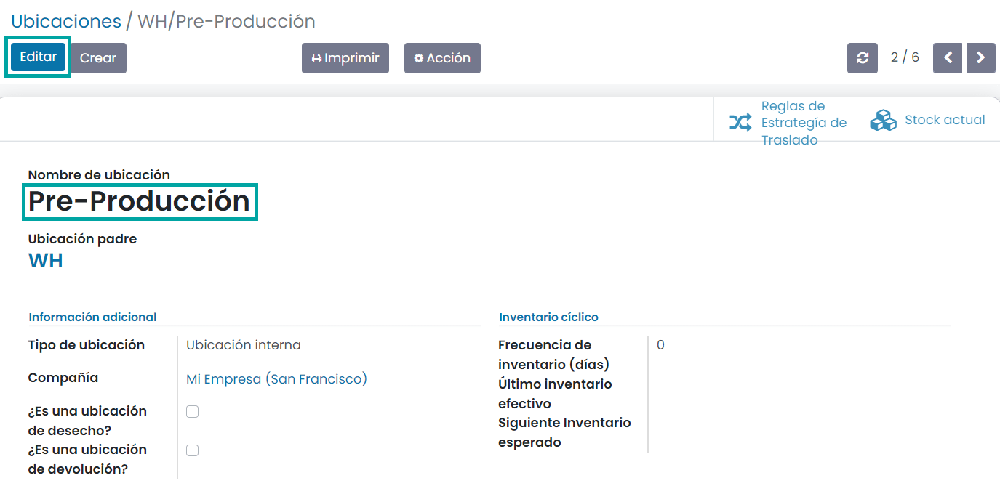
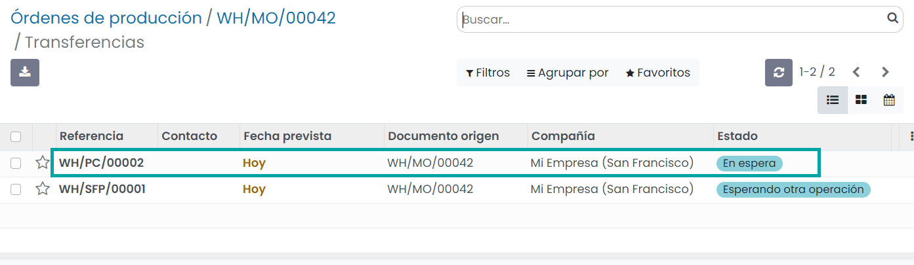
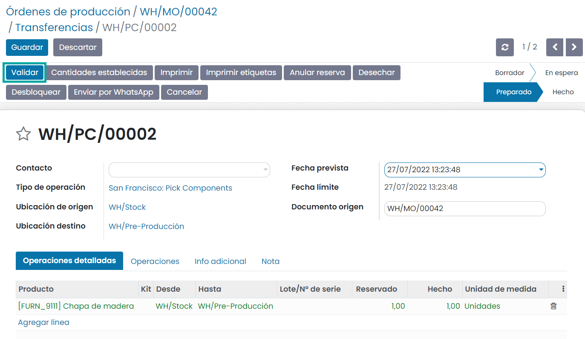

===========
Fabricación
===========

Con Daeris puedes gestionar las órdenes de fabricación de 3 formas diferentes:

-  **Un paso (fabricar)**: Mueve los productos a la ubicación de fabricación directamente y comienza el proceso de
   fabricación.

-  **Dos pasos (recoger + fabricar)**: Mueve primero los componentes del inventario a la ubicación de entrada y luego
   transfiérelos a la ubicación de producción.

-  **Tres pasos (recoger + fabricar + inventario)**: Mueve primero los componentes del inventario a la ubicación de entrada,
   luego transfiérelos a la ubicación de producción, y por último, almacénalos en el inventario.

Fabricar (1 paso)
=================

Configuración
-------------

No se necesita ninguna configuración para fabricar en un paso. Los productos se mueven directamente a la ubicación de
fabricación para que comience la producción.

Sin embargo, si se activan las **Rutas multietapa** desde la pantalla :menuselection:`Inventario --> Configuración --> Ajustes`
y configuras otra configuración de fabricación en tu almacén, puedes regresar a la configuración de fabricación en un paso.
Para ello, navega a la pantalla :menuselection:`Inventario --> Configuración --> Almacenes` y edita el almacén que necesites.
Después, selecciona *Fabricar (1 paso)* como tu estrategia de fabricación:

Crear órdenes de producción
---------------------------

Navega a la aplicación de **Fabricación** y crea una orden de producción. En la pestaña de *Varios* asegúrate de que
has seleccionado el almacén que has configurado para fabricación en 1 paso. Cuando hayas informado todos los campos
necesarios, pulsa el botón *Confirmar*:

Debido a que solo hay un paso en este proceso, ahora completarás la producción de tu producto. Cuando hayas terminado,
introduce la cantidad fabricada en el campo **Cantidad** y luego haz clic en *Validar*:

Tu orden de fabricación ahora está completa. A continuación, haz clic en el botón inteligente **Movimientos productos**:

Aquí podemos ver que los componentes se movieron de stock a producción, y luego los productos terminados se movieron de
producción a stock:

Recoger componentes y luego fabricar (2 pasos)
==============================================

Configuración
-------------

El primer paso es permitir el uso de rutas multietapa. Las rutas te permitirán tener un mecanismo para encadenar acciones.

Para permitir rutas multietapa navega a la pantalla :menuselection:`Inventario --> Configuración --> Ajustes` y activa la
opción correspondiente. Ten en cuenta que al activar las rutas multietapa también se activarán las ubicaciones de almacén.
Una vez marcada la opción, pulsa el botón *Guardar* de la pantalla de ajustes.

Una vez que actives las rutas multietapa puedes navegar a la pantalla :menuselection:`Inventario --> Configuración --> Almacenes`
y acceder al detalle del almacén que usará la fabricación en dos pasos. Puedes seleccionar la opción *Recoger componentes y luego fabricar (2 pasos)*
para la fabricación:

Si activas esta opción, se creará una nueva ubicación de pre-producción. Si quieres cambiarle el nombre navega a
:menuselection:`Inventario --> Configuración --> Ubicaciones`. Después, selecciona la ubicación con nombre *Pre-Producción* y
actualiza el nombre:

Crear órdenes de producción
---------------------------

Navega a la aplicación de **Fabricación** y crea una orden de producción. En la pestaña de *Varios* asegúrate de que
has seleccionado el almacén que has configurado para fabricación en 2 pasos. Cuando hayas informado todos los campos
necesarios, pulsa el botón *Confirmar*:

Ahora verás un botón inteligente de **Transferencias** porque el primer paso de este proceso es mover los componentes a
la ubicación de preproducción. Haz clic en el botón inteligente:

Aquí puedes ver que todos los componentes necesarios han sido reservados para esta operación automáticamente. Haz clic
en *Editar*, y luego introduce las cantidades reales que se están transfiriendo en la columna *Hecho* de la pestaña de
*Operaciones detalladas*. Cuando se hayan ingresado todas las cantidades, haz clic en *Validar*:

Los componentes han sido transferidos desde la ubicación de stock a la ubicación de preproducción; se ha completado el
primer paso del proceso de fabricación.

Ahora completarás la producción de tu producto. Cuando hayas terminado, introduce la cantidad fabricada en el campo
**Cantidad** y luego haz clic en *Validar*:

.. image:: fabricacion/flujo-dos-etapas-7.png
   :align: center
   :alt: Flujo de dos etapas (7)

Tu orden de fabricación ahora está completa. A continuación, haz clic en el botón inteligente **Movimientos productos**:

Aquí podemos ver que los componentes se movieron de pre-producción a producción, y luego los productos terminados se movieron de
producción a stock:

.. image:: fabricacion/flujo-dos-etapas-9.png
   :align: center
   :alt: Flujo de dos etapas (9)

Recoger componentes, fabricar y luego almacenar los productos (3 pasos)
=======================================================================

Configuración
-------------

El primer paso es permitir el uso de rutas multietapa. Las rutas te permitirán tener un mecanismo para encadenar acciones.

Para permitir rutas multietapa navega a la pantalla :menuselection:`Inventario --> Configuración --> Ajustes` y activa la
opción correspondiente. Ten en cuenta que al activar las rutas multietapa también se activarán las ubicaciones de almacén.
Una vez marcada la opción, pulsa el botón *Guardar* de la pantalla de ajustes.

Una vez que actives las rutas multietapa puedes navegar a la pantalla :menuselection:`Inventario --> Configuración --> Almacenes`
y acceder al detalle del almacén que usará la fabricación en tres pasos. Puedes seleccionar la opción
*Recoger componentes, fabricar y luego almacenar los productos (3 pasos)* para la fabricación:

Si activas esta opción, se crearán dos nuevas ubicaciones. Si quieres cambiarles el nombre navega a
:menuselection:`Inventario --> Configuración --> Ubicaciones`. Después, seleccione las ubicaciones con nombre *Pre-Producción* y
*Post-Producción* y actualizales el nombre:

Crear órdenes de producción
---------------------------

Navega a la aplicación de **Fabricación** y crea una orden de producción. En la pestaña de *Varios* asegúrate de que
has seleccionado el almacén que has configurado para fabricación en 3 pasos. Cuando hayas informado todos los campos
necesarios, pulsa el botón *Confirmar*:

Ahora verás un botón inteligente de **Transferencias** porque el primer paso de este proceso es mover los componentes a
la ubicación de preproducción. Haz clic en el botón inteligente:

En el listado de órdenes, selecciona la orden que se encuentra *En espera*:

Aquí puedes ver que todos los componentes necesarios han sido reservados para esta operación automáticamente. Haz clic
en *Editar*, y luego introduce las cantidades reales que se están transfiriendo en la columna *Hecho* de la pestaña de
*Operaciones detalladas*. Cuando se hayan ingresado todas las cantidades, haz clic en *Validar*:

Los componentes han sido transferidos desde la ubicación de stock a la ubicación de preproducción; se ha completado el
primer paso del proceso de fabricación.

Ahora completarás la producción de tu producto. Cuando hayas terminado, introduce la cantidad fabricada en el campo
**Cantidad** y luego haz clic en *Marcar como Hecho*:

Tu orden de fabricación ahora está completa. A continuación, haz clic en el botón inteligente **Movimientos productos**:

.. image:: fabricacion/flujo-tres-etapas-9.png
   :align: center
   :alt: Flujo de tres etapas (9)

Aquí podemos ver que los componentes se movieron de pre-producción a producción, y luego los productos terminados se movieron de
producción a post-producción:

Para completar el paso final, navega al detalle de la orden de producción y haz clic en el botón inteligente **Transferencias**:

Selecciona la transferencia en estado *Preparado*:

Desde la transferencia final, haz clic en *Editar* e introduce la cantidad de artículos que se transfieren en la
columna *Hecho* debajo de la pestaña *Operaciones detalladas*. Cuando hayas terminado, haz clic en *Validar*:

El producto terminado se ha movido de la ubicación de posproducción a la ubicación de stock y tu orden de producción
está completa.