=============
Planificación
=============

Es esencial que la empresa brinde la mejor calidad de servicio a sus clientes. Para lograr esto, se debe planificar cada
movimiento: órdenes de producción, envíos, recepciones, etcétera. Para lograrlo, necesitas configurar el tiempo
de espera apropiadamente y coordinar las fechas programadas.

Al usar los tiempos de espera, Daeris proporciona feches de compromiso para cada proceso. En el pedido de venta, por ejemplo,
esta es la fecha en la que tu cliente obtendrá los productos que compró.

Desde el lado del cliente, la fecha de compromiso es importante porque les da una estimación de cuándo recibirán sus
productos. Para calcular estas fechas se toman todos los tiempos de espera en cuenta, como los de fabricación, envío y
de proveedores.

¿Cómo se calculan los tiempos de espera?
========================================

Como se mencionó anteriormente, hay varios tipos de tiempos de espera. Cada uno se calcula con diferentes indicadores.
Antes de iniciar la configuración, este es un resumen corto de cómo se calculan los tiempos de espera y qué son:

-  **Ventas**

   -  **Plazo de entrega del cliente**: El plazo de entrega del cliente es el tiempo predeterminado que tú estableces. Por
      lo tanto, la fecha esperada en el pedido de venta es hoy más el plazo de entrega del cliente.

   -  **Plazo de seguridad para ventas**: El objetivo es dejar preparado el envío algunos días antes del verdadero compromiso
      que se adquirió con el cliente. Al configurar este plazo, la fecha programada automática en el pedido de venta es la
      fecha de entrega del pedido de venta menos el tiempo de espera de seguridad.

-  **Compra**

   -  **Plazo de entrega de compra**: Este es el tiempo esperado entre la confirmación de un pedido de compra y la recepción
      de los productos. La fecha programada de recepción menos la fecha de entrega del proveedor es la fecha por defecto
      del pedido de compra.

   -  **Plazo de entrega de seguridad de compra**: Margen de error para los plazos de entrega de los proveedores. Cuando el
      sistema genera pedidos de compra para la adquisición de productos, se programarán algunos días antes para hacer frente
      a los retrasos inesperados de los proveedores.

   -  **Días para comprar**: El número de días que le toma al departamento de compra validar un pedido de compra. Si ya se
      abrió una solicitud de presupuesto para el mismo proveedor, Daeris agrega la línea para la solicitud de presupuesto al
      crear una nueva. Después, la fecha específica se configura en la línea.

-  **Fabricación**

   -  **Tiempo de entrega de fabricación**: Este es el tiempo que se espera que tome fabricar un producto. Este plazo de
      espera es independiente de la cantidad que hay que producir y no toma el tiempo de la ruta en cuenta.

   -  **Plazo de seguridad para la fabricación**: Tiempo adicional para mitigar el riesgo de un retraso en la fabricación.
      En caso de una orden de reabastecimiento, la fecha programada de entrega menos el plazo de espera de la fabricación
      menos el plazo de seguridad para la fabricación es la fecha programada de la orden de producción.

Ventas - Plazos de espera
=========================

En la pestaña *Otra información* de los pedidos de ventas, hay un campo que se llama **Fecha de entrega**. Permite ver
un campo adicional en el pedido de venta con la fecha esperada. Esta fecha se calcula automáticamente de acuerdo a los
diferentes tiempos de espera configurados:

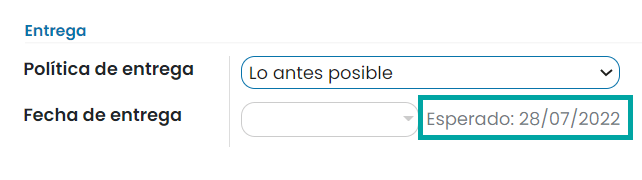

Si la fecha de entrega es anterior a la fecha esperada, se mostrará un mensaje de advertencia:

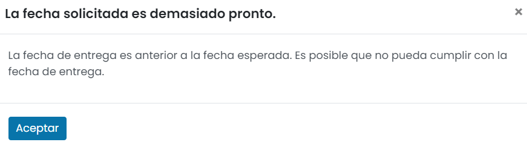

Pero, para que todo esto funcione adecuadamente, todavía es necesario configurar todos los tiempos de espera.

Plazo de entrega del cliente
----------------------------

El plazo de entrega del cliente es el tiempo que se necesita para que tu producto vaya desde el almacén hasta tu cliente.
Se puede configurar en cualquier producto, solo tienes que ir a la pantalla :menuselection:`Ventas --> Productos --> Productos`.
Accede al formulario de detalle del producto, navega a la pestaña de *Inventario* y agrega el plazo de entrega del cliente:

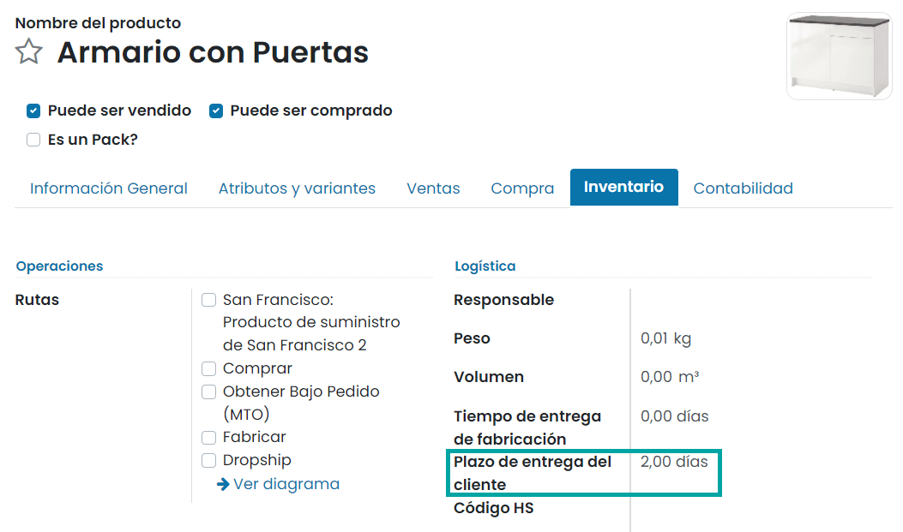

Por ejemplo, el producto se ordena el 28 de julio, pero el plazo de entrega del cliente es de dos días. En este caso, la
fecha de entrega esperada sería el 30 de julio:

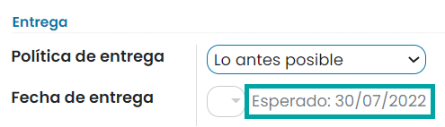

Plazo de seguridad
------------------

En ventas, el plazo de seguridad corresponde a los días de respaldo para asegurarte de que podrás entregar los productos
a tiempo. El objetivo es preparar la entrega antes para que llegue a tiempo. El número de días de seguridad se resta
para calcular una fecha programada antes de la prometida al cliente.

Para configurar esto, navega a la pantalla :menuselection:`Inventario --> Configuración --> Ajustes` y activa la función
**Plazo de seguridad para ventas**:

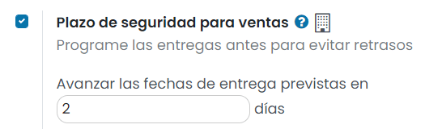

Una vez hecho esto, pulsa el botón *Guardar* de la pantalla de ajustes.

Por ejemplo, se programa la entrega del producto el 2 de agosto pero el plazo de seguridad es de dos días. En ese caso,
la entrega programada para la orden de entrega sería el 31 de julio:

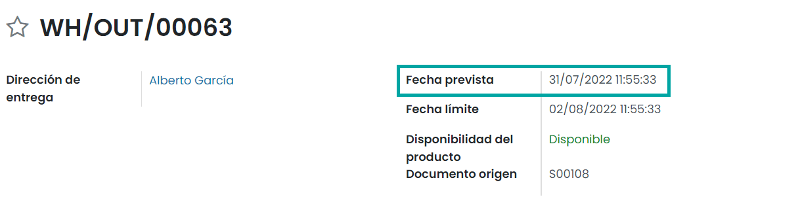

Entregar varios productos
-------------------------

En muchos casos, los clientes compran varios productos al mismo tiempo. Estos productos pueden tener plazos de entrega
diferentes pero se deben entregar, ya sea al mismo tiempo o por separado. Afortunadamente, Daeris te puede ayudar a llevar
estos casos fácilmente.

Desde la pestaña de *Otra información* en tu pedido de venta, puedes elegir entre *Cuando todos los productos estén listos*
y *Lo antes posible*. El primero es para entregar los productos al mismo tiempo, mientras que el segundo es para entregarlos
por separado.

Por ejemplo, los productos "A" y "B" se ordenaron al mismo tiempo. "A" tiene 8 días de espera y "B" tiene 5. Con la primera
opción, la fecha esperada se calcula de acuerdo con el producto con el mayor plazo de espera, que en este caso es "A". Si
el pedido se confirma el 2 de abril, entonces la fecha esperada es el 10 de abril. Con la segunda opción, la fecha esperada
se calcula de acuerdo al producto con el menor plazo de espera del cliente. Por lo tanto, la fecha esperada es el 7 de abril.

Compra - Plazos de espera
=========================

Plazo de entrega de compra
--------------------------

El plazo de entrega de compra es el tiempo que se necesita para que un producto que compraste se pueda entregar. Para
configurarlo, abre el formulario del producto desde la pantalla :menuselection:`Compra --> Productos --> Productos` y
agrega el proveedor y el plazo de entrega en la pestaña de *Compra*:

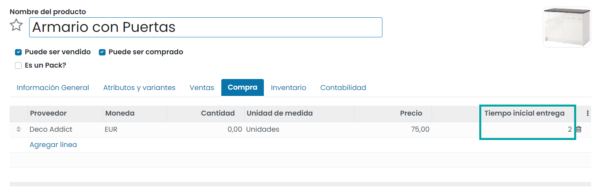

.. note::
   Es posible agregar diferentes proveedores y, por lo tanto, diferentes plazos de entrega dependiendo del proveedor.

Por ejemplo, el producto se ordena el 28 de julio, pero el plazo de entrega del proveedor es de dos días. En este caso, la
fecha de recepción esperada sería el 30 de julio:

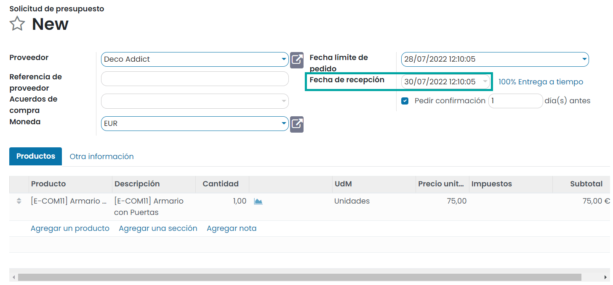

Plazo de seguridad
------------------

El plazo de espera de seguridad para compras sigue la misma lógica que el plazo de ventas, excepto que en este caso
tú eres el cliente. Por lo tanto, es el margen de error de tu proveedor para entregar su pedido.

Para configurar el plazo de espera de seguridad para compras, navega a la pantalla :menuselection:`Inventario --> Configuración --> Ajustes`
y activa la función **Plazo de ejecución de seguridad para la compra**:

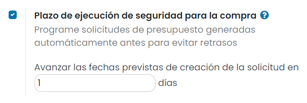

Una vez hecho esto, pulsa el botón *Guardar* de la pantalla de ajustes.

De esta forma, cada vez que el sistema genere pedidos de compra, estos se programarán esos días antes para lidiar con
retrasos inesperados del proveedor.

Días para comprar
-----------------

Los días para comprar son el número de días que le toma al departamento de compra validar un pedido de compra.

Para configurar los días para comprar, navega a la pantalla :menuselection:`Inventario --> Configuración --> Ajustes`
e informa el número de días en el campo **Días para comprar**:

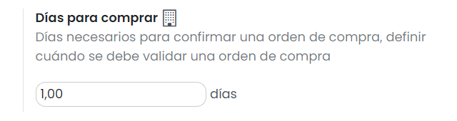

Una vez hecho esto, pulsa el botón *Guardar* de la pantalla de ajustes.

Fabricación - Plazos de espera
==============================

Tiempo de entrega de fabricación
--------------------------------

El tiempo de entrega de fabricación es el tiempo que se necesita para fabricar el producto. Para especificarlo, abre la
pestaña de *Inventario* en el formulario de tu producto y agrega el número de días que requiere la fabricación:

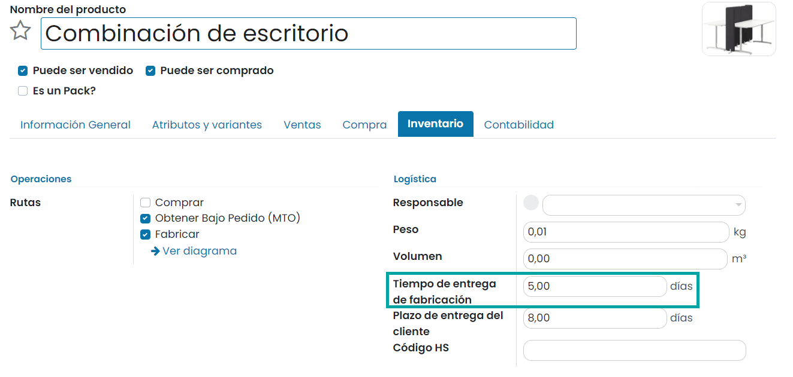

Al trabajar con tiempos de entrega de fabricación la fecha límite de la orden de producción es igual a la fecha de compromiso
menos el tiempo de espera de fabricación.

Plazo de seguridad
------------------

El plazo de seguridad para fabricación permite generar órdenes de producción más temprano para lidiar con el riesgo de
retrasos en la fabricación. Para activarlo navega a la pantalla :menuselection:`Fabricación --> Configuración --> Ajustes`
y marca la opción **Plazo de seguridad**. En el campo que se muestra, informa los días que se utilizarán como plazo de
seguridad:

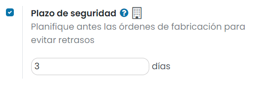

Una vez hecho esto, pulsa el botón *Guardar* de la pantalla de ajustes.

Por ejemplo, un cliente ordena un producto "B" con una fecha de entrega esperada para el 20 de junio. El plazo de espera
para la fabricación es de 14 días y el plazo de seguridad es de 3 días, así que la fabricación del producto "B" debe
empezar al menos el 3 de junio, que es la fecha planificada de la orden de producción.