=====================
Ajustes de inventario
=====================

La gestión de inventario de tu empresa es muy importante al realizar las operaciones de la empresa. Debes actualizar las
existencias y mantenerlas en las ubicaciones específicas para facilitar el acceso a los pedidos. Para una mejor gestión
del inventario, se debe realizar un seguimiento de los registros de entrada y salida de productos del inventario.

Sin embargo, puede haber algunos casos en los que necesites realizar algunos ajustes en función del stock físico disponible
en tu empresa. La plataforma Daeris lo hace posible con su función de ajuste de inventario. El ajuste de inventario en el
sistema Daeris te ayuda a tener una cantidad correcta de unidades que se especifican en las ubicaciones particulares
iguales al stock físico disponible en el almacén de la empresa. Los cambios introducidos en el inventario se registrarán
en la sección de informes y esto te permite tener un registro tanto del ajuste como del stock disponible.

Actualizar la cantidad de un producto
=====================================

La función de ajuste de inventario en Daeris te permite hacer un ajuste de inventario respectivo a cada producto actualizando
la cantidad. Con esta función, puedes actualizar la cantidad del producto para que los registros de tu empresa sean precisos
con el stock físico del producto. La opción para actualizar la cantidad se puede ver en cada formulario de detalle del
producto. Para actualizar la cantidad de los productos, puedes seleccionar el producto respectivo desde la pantalla
:menuselection:`Inventario --> Productos --> Productos`. En el formulario de detalle del producto, puedes ver el número
de unidades disponibles a mano desde el botón inteligente:

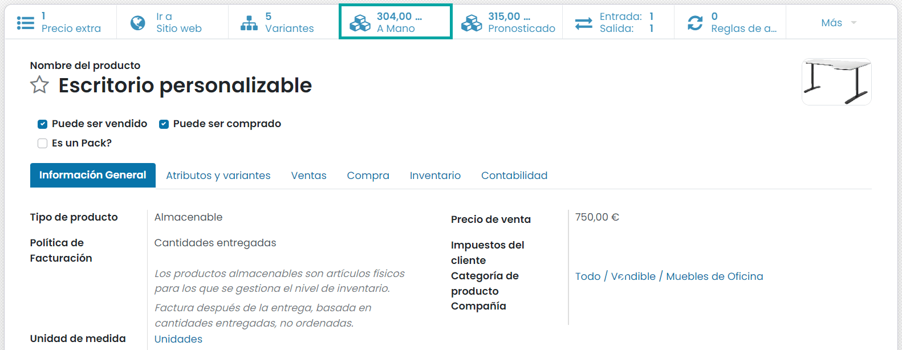

Para actualizar la cantidad de unidades, puedes hacer clic en el botón **Actualizar la cantidad**:

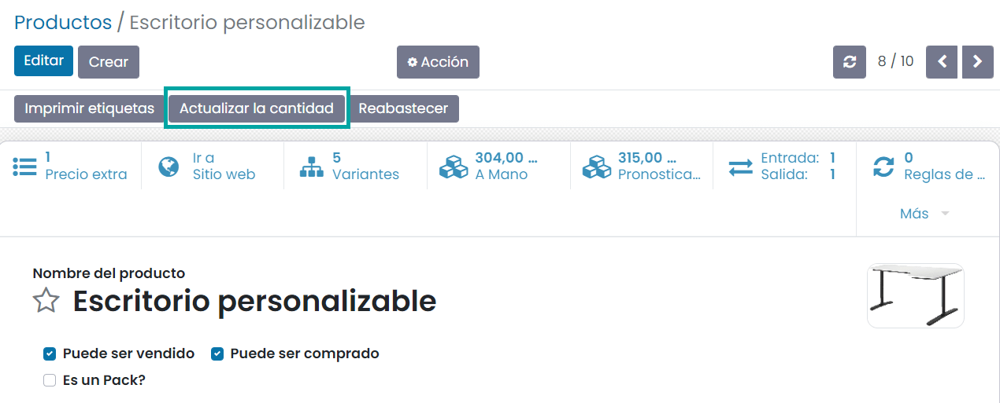

Cuando hagas clic en el botón de actualizar cantidad, el sistema navegará a otra página donde puedes pulsar el botón *Crear*
para crear un registro:

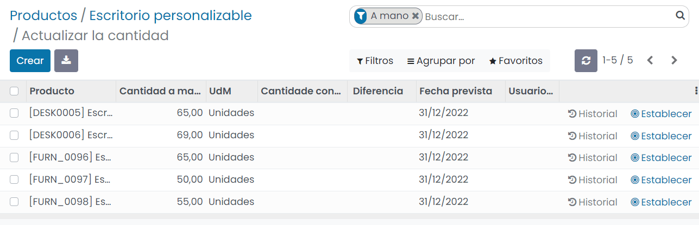

Puedes proporcionar el nombre del producto y la cantidad contada. La cantidad disponible, la unidad de medida, la fecha
programada, etc. se asignarán automáticamente. Después de proporcionar la cantidad contada y el producto, puedes hacer
clic en el botón *Aplicar* para configurar la operación. Ahora, la cantidad de producto se mostrará en el botón inteligente
de unidades a mano disponible en el formulario del producto:

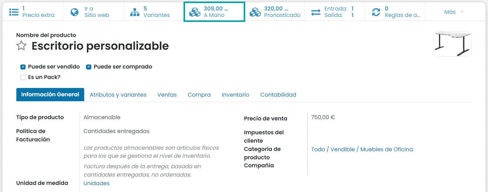

Ajustes de inventario para múltiples productos
==============================================

Daeris también te permite administrar y configurar de manera eficiente las operaciones de ajuste de inventario para
múltiples productos según el almacén o el estante de existencias de tu empresa. Esta operación avanzada es una característica
exclusiva para actualizar las cantidades y configurar modificaciones en los productos disponibles directamente. Se puede
acceder desde la pantalla :menuselection:`Inventario --> Operaciones --> Ajustes de inventario`. Desde esta pantalla, puedes
crear fácilmente ajustes de inventario:

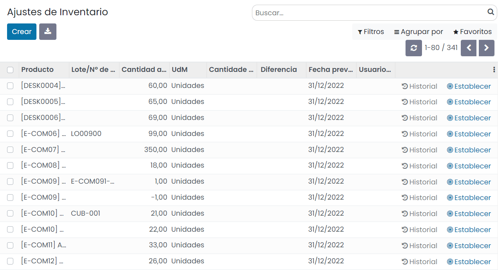

En la pantalla de ajustes de inventario puedes ver todos los ajustes de inventario definidos junto con detalles como
producto, número de lote/serie, cantidad disponible, unidad de medida, cantidad contada, diferencia, fecha programada, etc.
El botón *Historial* te permite ver el historial de cada cantidad:

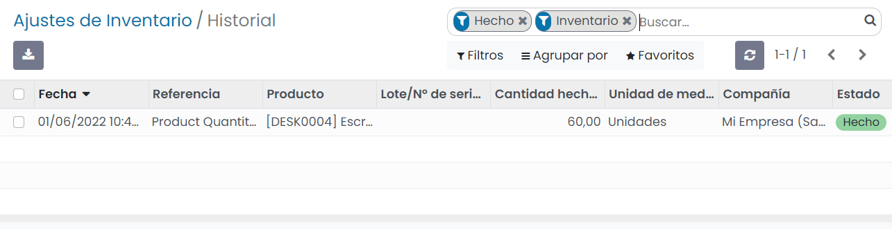

Cuando marques la casilla disponible en el lado izquierdo de los registros, podrás ver más opciones, como *Aplicar*, *Limpiar*,
*Solicitar un recuento*, *Imprimir* y el botón de *Acción*:

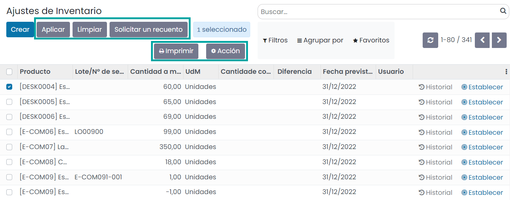

Puedes crear un nuevo ajuste de inventario haciendo clic en el botón *Crear*. El sistema creará un nuevo registro para
completar los detalles del producto en el que debes configurar el ajuste de inventario. Después de proporcionar la cantidad
contada y el producto, puedes hacer clic en el botón *Aplicar* para configurar la operación.

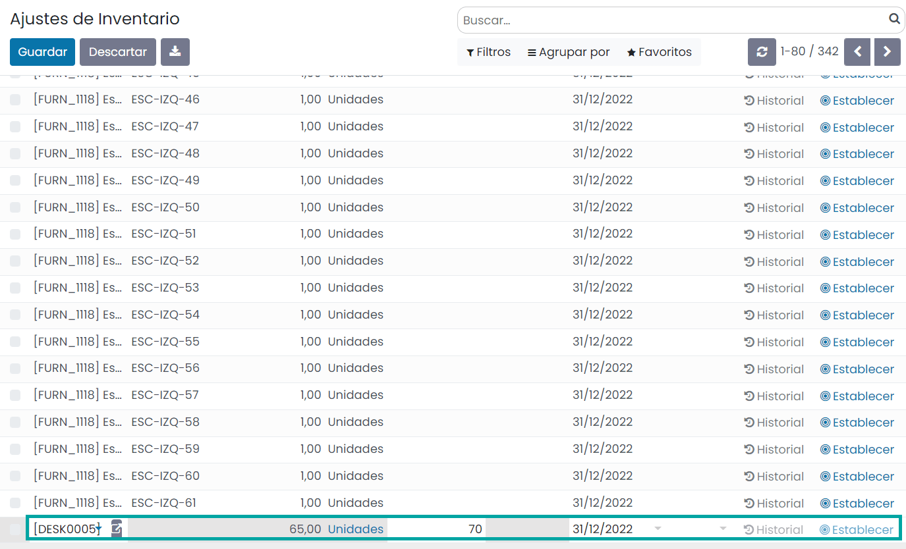

.. _inventario_y_fabricacion/inventario/gestion/productos/dia_mes_inventario:

Configurar el día y mes del inventario anual
============================================

Es posible establecer el día y mes en que debe ocurrir el recuento anual de inventario. Para ello, navega a la pantalla
:menuselection:`Inventario --> Configuración --> Ajustes` e informa el campo **Día y mes del inventario anual** con el
valor correspondiente:

Una vez informado el día y mes del inventario anual, pulsa el botón *Guardar* de la pantalla de ajustes.

A partir de ese momento, si navegas a la pantalla :menuselection:`Inventario --> Operaciones --> Ajustes de inventario`,
y creas un nuevo registro, en el campo **Fecha prevista** se informará por defecto el día y mes del inventario anual
definido en la pantalla de ajustes:

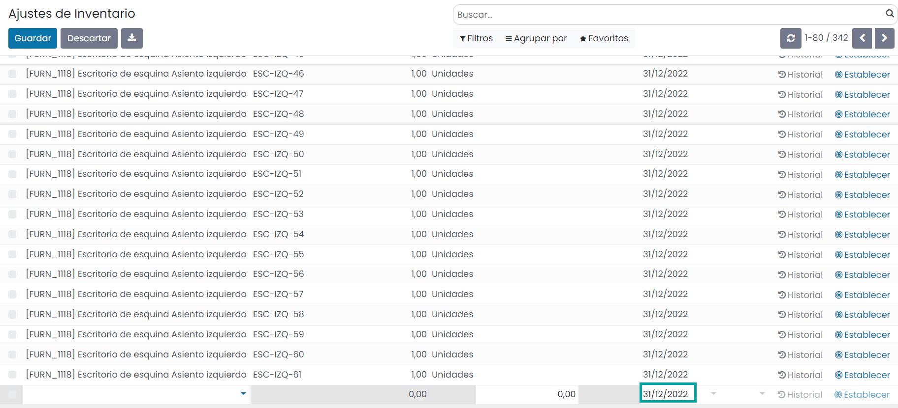

.. _inventario_y_fabricacion/inventario/gestion/productos/inventario_ciclico:

Inventario cíclico en ubicaciones
=================================

Puede haber diferentes productos en un almacén para los cuales algunos de ellos son caros y otros son económicos. Una
pérdida de productos costosos afecta la valoración del inventario, que no puede ser despreciable. Por lo tanto, el
recuento de inventario de dichos productos debe realizarse con mayor frecuencia. En tales circunstancias, realizar
manualmente la valoración cíclica es una tarea desafiante. Como resultado, es factible un ajuste de inventario cíclico.
La frecuencia cíclica se puede establecer en ubicaciones seleccionando una frecuencia para verificar el inventario del
producto en esa ubicación en particular en los intervalos especificados.

En primer lugar, activa las **Ubicaciones de almacenamiento** desde la pantalla :menuselection:`Inventario --> Configuración --> Ajustes`
y pulsa el botón *Guardar*:

A continuación, navega a la pantalla :menuselection:`Inventario --> Configuración --> Ubicaciones`, donde se muestra una
lista de ubicaciones con todas las ubicaciones del inventario:

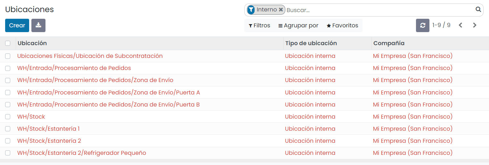

Selecciona una ubicación de la lista. En el formulario de detalle se puede configurar el inventario cíclico:

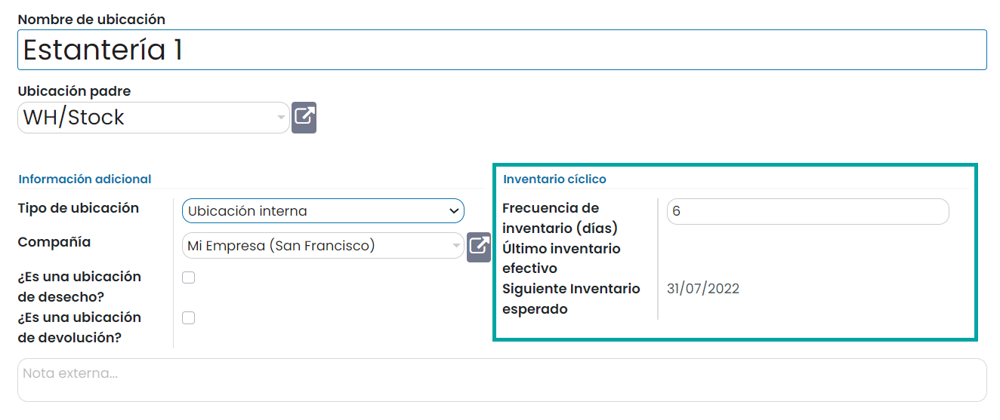

Es posible establecer la frecuencia de inventario, que se especifica en días. Cuando se modifica el campo de frecuencia
de inventario, la siguiente fecha de inventario esperado se actualiza automáticamente.

Para ver los ajustes de inventario que se han realizado en esta ubicación, navega a la pantalla :menuselection:`Inventario --> Operaciones --> Ajustes de inventario`.
Agrupa los elementos de la lista por ubicación. Verifica la fecha prevista del producto para esa ubicación específica.
La fecha prevista ha sido actualizada y se muestra el próximo inventario esperado de la ubicación:

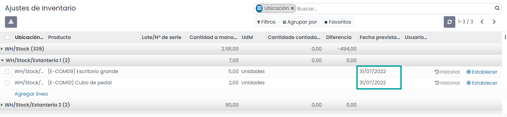