====================
Desecho de productos
====================

Configurar las ubicaciones de desecho de productos
==================================================

Los productos se desechan cuando ya no disponen de valor económico o el valor económico es igual al coste del material
reciclado. Existen varias razones por las que puede ser necesario tener que desechar productos:

-  Productos caducados.

-  Productos defectuosos.

-  Productos que incumplen las normativas vigentes.

-  Productos descatalogados sin recambios que impiden ofrecer garantías.

Habitualmente se identifican los productos a desechar al realizar tareas de ajuste de inventario o tareas de recolección
de materias en el almacén para la fabricación.

.. important::
   Es muy importante realizar tareas de desecho de forma habitual, ya que hasta que no se realicen dichas tareas, seguirán
   apareciendo en el inventario productos que no se pueden usar ni vender.

En primer lugar, activa las **Ubicaciones de almacenamiento** desde la pantalla
:menuselection:`Inventario --> Configuración --> Ajustes`:

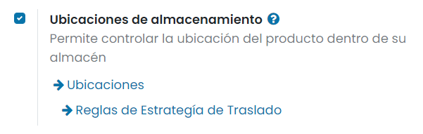

Una vez activada la opción, pulsa el botón *Guardar* de la pantalla de ajustes.

De forma predeterminada, Daeris dispone de una ubicación de desecho de productos. Puedes encontrar dicha ubicación en la
pantalla :menuselection:`Inventario --> Configuración --> Ubicaciones`. Para visualizar dicha ubicación, elimina el filtro
*Interno*:

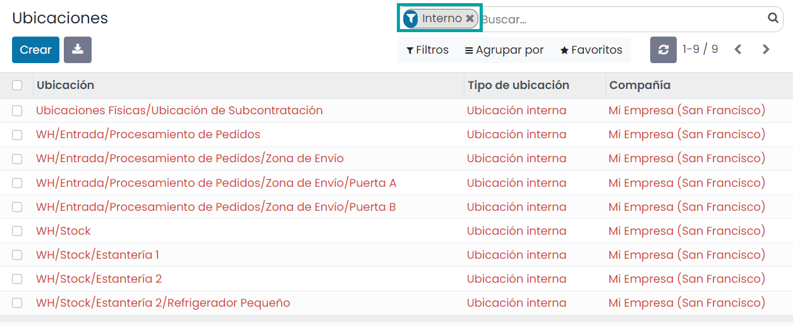

Una vez eliminado el filtro, puedes encontrar la ubicación de desecho de productos con el nombre *Ubicaciones Virtuales/Desecho*:

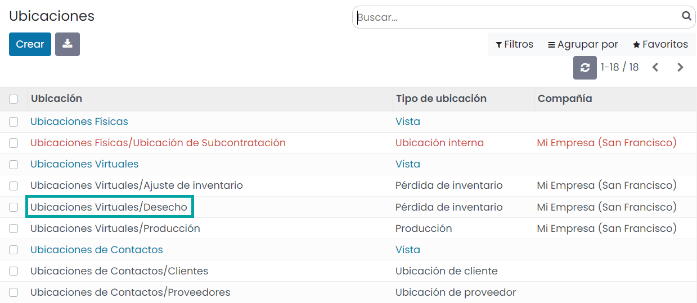

Las ubicaciones de desecho son de tipo *Pérdida de inventario* y disponen de la marca *¿Es una ubicación de desecho?* informada:

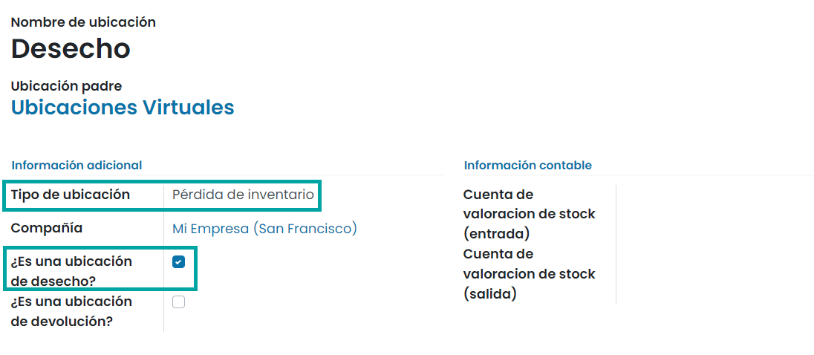

.. note::
   Si es necesario, se pueden generar más ubicaciones de desecho, pero es importante indicar que se debe informar el campo
   *¿Es una ubicación de desecho?* para que el sistema la identifique como tal.

Desechar productos desde su recepción
=====================================

En este ejemplo, partimos de la compra de un producto que se acaba de recibir en el almacén. Al validar la calidad del
producto, se verifica y no pasa el control. Al contactar con el proveedor para reclamar, indica que procederá a realizar
un envío urgente y que no requiere la devolución del producto, por lo que se puede desechar.

A continuación, navega a la pantalla :menuselection:`Inventario --> Información general`, y pulsa sobre el panel de **Recepciones**,
en la opción del menú :menuselection:`Ver --> Todos`:

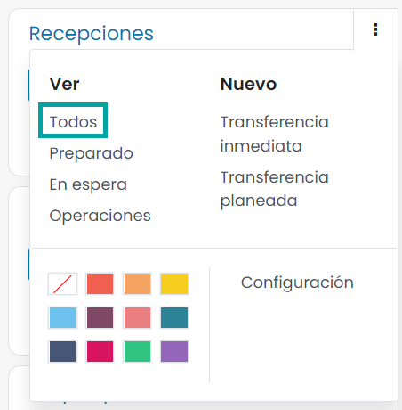

Desde el listado de recepciones, pulsa sobre el registro de entrada del producto a desechar:

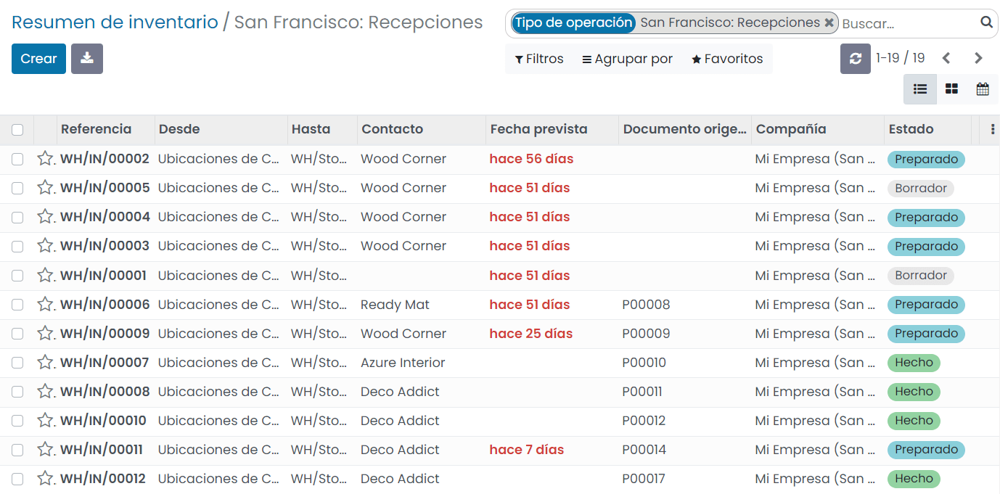

Sobre el detalle de la recepción puedes observar las unidades de producto entregadas:

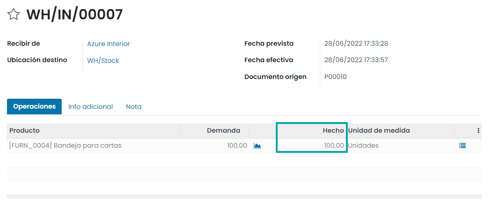

Para desechar la mercancía, pulsa el botón **Desechar**:

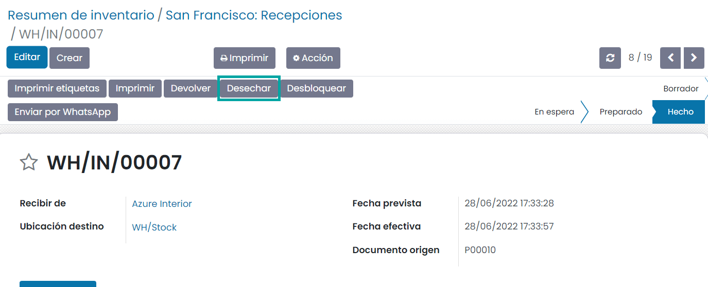

El sistema mostrará un formulario, donde poder seleccionar el producto, la cantidad, así como el lote y paquete (en el
caso de que disponga) que se quiera desechar. Una vez completados los campos, pulsa el botón *Hecho*:

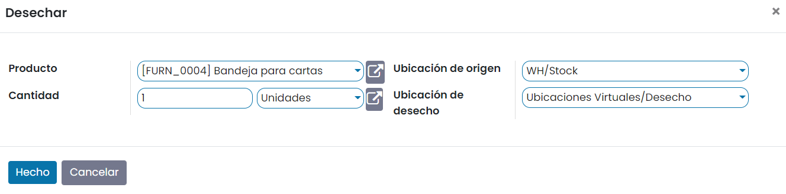

Una vez hecho esto, aparece un nuevo botón de **Desechos**:

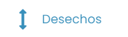

Al pulsar sobre el botón, el sistema navega al movimiento del producto de su ubicación a la ubicación de desecho:

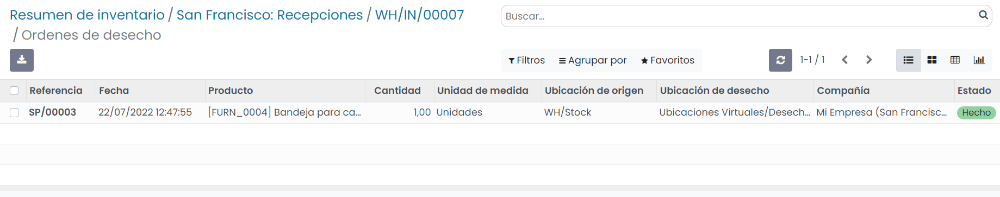

Desechar productos desde su envío
=================================

En este ejemplo, partimos de un producto ya fabricado, que está a punto de salir del almacén. Mientras el operario de
almacén manipula el producto, sufre un percance y el producto se rompe, quedando en un estado defectuoso, siendo inviable
su venta.

Para gestionar esta situación, navega a la pantalla :menuselection:`Inventario --> Información general`, y pulsa sobre el
panel de **Expediciones**, en la opción del menú :menuselection:`Ver --> Todos`:

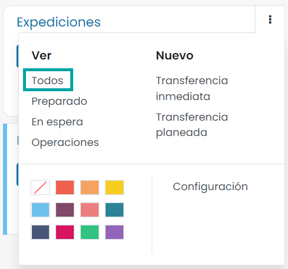

A continuación, selecciona la orden de entrega afectada por el problema con la mercancía:

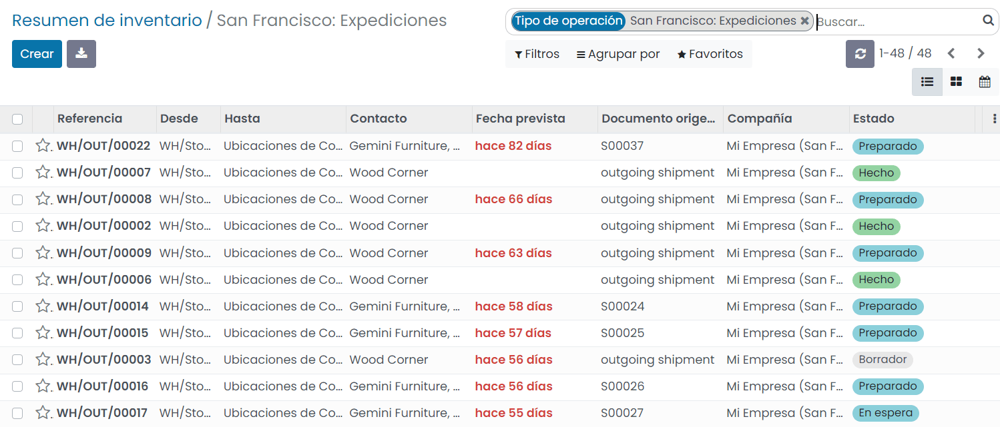

Para desechar la mercancía, pulsa el botón **Desechar**:

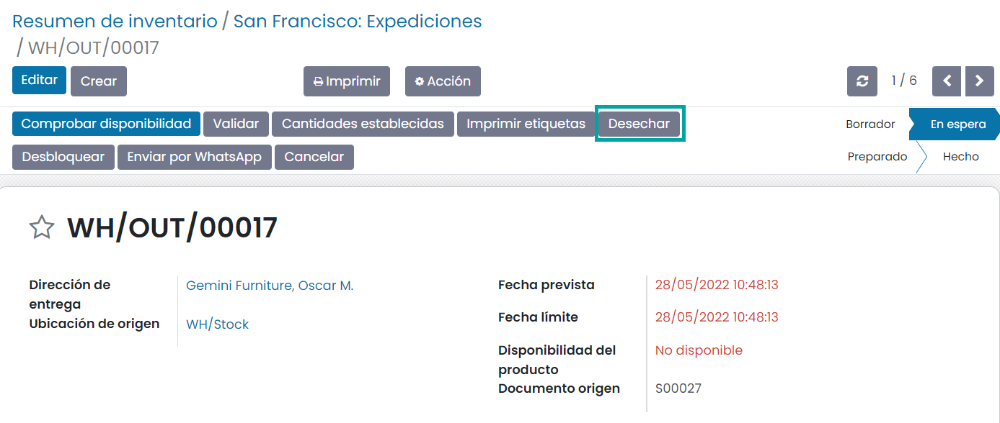

El sistema mostrará un formulario, donde poder seleccionar el producto, la cantidad, así como el lote y paquete (en el
caso de que disponga) que se quiera desechar. Una vez completados los campos, pulsa el botón *Hecho*:

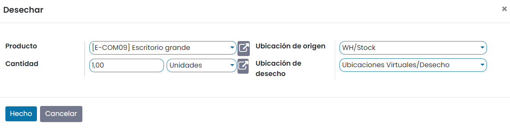

Una vez hecho esto, aparece un nuevo botón de **Desechos**:

Al pulsar sobre el botón, el sistema navega al movimiento del producto de su ubicación a la ubicación de desecho:

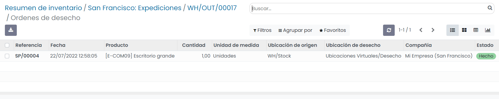

Crear una orden de desecho de productos
=======================================

Para acceder a la pantalla de órdenes de desecho navega a :menuselection:`Inventario --> Operaciones --> Desechar`:

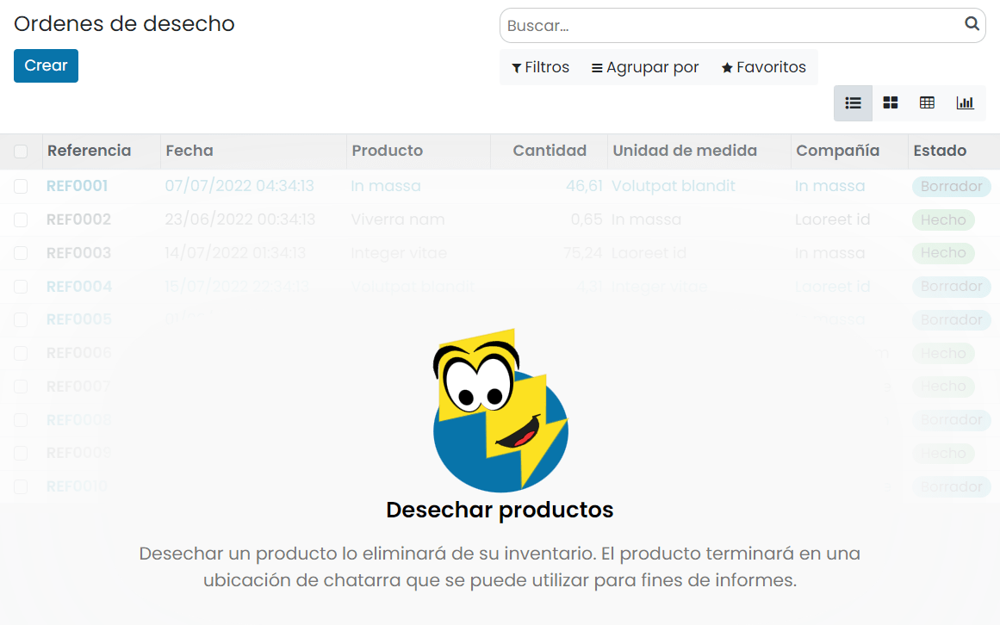

Para crear una nueva orden de desecho pulsa el botón *Crear*. Esto abrirá un formulario con los siguientes campos:

-  **Producto**: Selecciona el producto que has decidido convertir en chatarra en este campo.

-  **Cantidad**: En este campo se debe informar la cantidad del producto que será retirado del stock junto con la unidad
   de medida.

-  **Documento origen**: Los documentos relacionados con la eliminación del producto se pueden insertar en este campo específico.

-  **Compañía**: Nombre de la empresa que presenta el borrador de baja de stock.

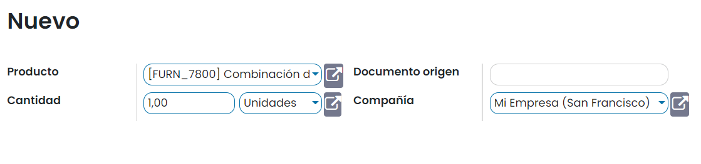

La orden de desecho guardada se puede confirmar seleccionando el botón **Validar**:

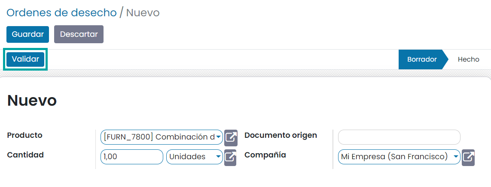

Después de validar la orden, podrás visualizar el movimiento del producto desde el inventario seleccionando el botón de
**Movimientos productos**:

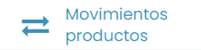