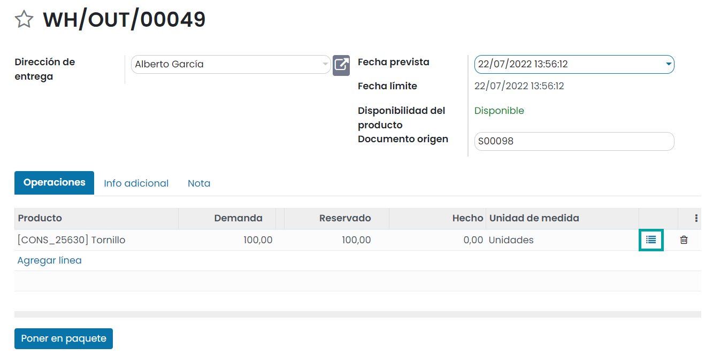

===========================================================
Usar paquetes, unidades de medida o empaquetados especiales
===========================================================

.. _inventario_y_fabricacion/inventario/gestion/productos/paquetes_unidades_empaquetados:

Utilizar diferentes unidades de medida
======================================

Una **unidad de medida** es una cantidad estandarizada de una determinada magnitud física, definida y adoptada por
convención o por ley. Cualquier valor de una cantidad física puede expresarse como un múltiplo de la unidad de medida.

Para configurar productos en diferentes unidades de medida, navega a la pantalla
:menuselection:`Inventario --> Configuración --> Ajustes` y activa la opción de **Unidades de medida**:

Una vez activado, pulsa el botón *Guardar* de la pantalla de ajustes.

Las unidades de medida de los productos se agrupan en categorías. De este modo, puedes disponer de una categoría (por
ejemplo, peso) que engloba varias unidades de medida (por ejemplo, gramos, kilos o toneladas).

Para gestionar las categorías de las unidades de medida, navega a la pantalla :menuselection:`Inventario --> Configuración --> Categorías UdM`.
Por defecto, dispones de las siguientes categorías:

-  Unidad

-  Peso

-  Horario de trabajo

-  Longitud/Distancia

-  Superficie

-  Volumen

Para gestionar las unidades de medida, navega al formulario de detalle de una categoría:

Al editar o crear una nueva unidad de medida, puedes encontrar los siguientes campos:

-  **Unidad de medida**: Nombre de la unidad de medida.

-  **Tipo**: Dispones de las siguientes opciones:

   -  **Unidad de medida de referencia para esta categoría**

   -  **Más pequeña que la unidad de medida de referencia**: Si seleccionas este valor, deberás informar la ratio entre esta
      unidad y la de referencia en el campo *Proporción*.

   -  **Más grande que la unidad de medida de referencia**: Si seleccionas este valor, deberás informar la ratio entre esta
      unidad y la de referencia en el campo *Proporción*.

-  **Precisión de redondeo**: Número máximo de decimales hasta realizar el redondeo.

Una vez hayas configurado las unidades de medida de los productos, al editar un producto desde la pantalla
:menuselection:`Inventario --> Productos --> Productos`, podrás seleccionar las unidades de medida del producto
mediante los campos **Unidad de medida** y **UdM de Compra**:

.. _inventario_y_fabricacion/inventario/gestion/productos/administrar_empaquetados:

Administrar empaquetados de productos
=====================================

El **empaquetado** es el contenedor físico que protege a tu producto. Por ejemplo, si vendes ordenadores, el empaquetado
contiene el ordenador y los cables de energía.

Para activar esta función, navega a la pantalla :menuselection:`Inventario --> Configuración --> Ajustes` y activa
la opción de **Empaquetados del producto**:

A continuación, pulsa el botón *Guardar* de la pantalla de ajustes.

En Daeris, los empaquetados se utilizan en las transferencias de inventario con propósitos informativos. Se pueden configurar
dichos empaquetados en el formulario de detalle de los productos, desde la vista :menuselection:`Inventario --> Productos --> Productos`,
en la pestaña de *Inventario*:

Una vez hecho esto, al crear una transferencia de inventario, será posible informar el empaquetado del producto mediante el
campo **Empaquetado**:

.. note::
   Otro uso útil de los empaquetados es para la recepción de productos. Al escanear el código de barras del empaquetado,
   Daeris agrega el número de unidades contenidas en el empaquetado al inventario.

.. _inventario_y_fabricacion/inventario/gestion/productos/administrar_paquetes:

Administrar paquetes de entrega de productos
============================================

El paquete es el contenedor físico en el que pones uno o varios productos de un pedido. Por ejemplo, cuando entregas un
producto, puedes decidir separar la cantidad en dos paquetes diferentes. Esto te permite tener un informe con la cantidad
de productos en cada paquete.

Configuración
-------------

Para habilitar la función de paquetes de entrega, navega a la pantalla :menuselection:`Inventario --> Configuración --> Ajustes`
y marca la opción de **Paquetes**:

Una vez hecho esto, pulsa el botón *Guardar* de la pantalla de ajustes.

Crear un tipo de paquete de entrega
-----------------------------------

En función de las características de tus productos, puedes disponer de una serie de paquetes de entrega que dispongan de
ciertos atributos (peso máximo, dimensiones, etc.). Para crear los paquetes de entrega navega a la pantalla
:menuselection:`Inventario --> Configuración --> Tipos de paquete` y pulsa el botón *Crear*:

El sistema navega al formulario de detalle del paquete de entrega, donde puedes informar los siguientes campos:

-  **Tipo de paquete**: Nombre descriptivo del paquete de entrega.

-  **Tamaño**: Altura, anchura y longitud en milímetros del paquete.

-  **Peso máximo**: Peso máximo que soporta el paquete en kilogramos.

-  **Código de barras**: Código usado para identificar el paquete de entrega.

-  **Compañía**: Empresa asociada al paquete de entrega.

-  **Transportista**: Por defecto, utilizar el valor *Sin integración de transportista*.

-  **Código del transportista**: Código utilizado por el transportista para identificar el paquete.

.. image:: gestion_basica/paquetes-entrega-3.png
   :align: center
   :alt: Paquetes de entrega de productos (3)

Una vez completados los campos necesarios, pulsa el botón *Guardar*.

Empaquetar los productos de un pedido de venta
----------------------------------------------

Para empaquetar los productos de un pedido de venta, será necesario disponer de una entrega (transferencia) en estado
*Preparado*. Para ello, genera y confirma un presupuesto de venta desde la pantalla :menuselection:`Ventas --> Pedidos --> Presupuestos`:

Al navegar al detalle de la entrega, el estado de la misma debe ser *Preparado*, para lo cuál deberás tener el stock
suficiente de productos para poder realizar la entrega:

A continuación, edita la transferencia y pulsa sobre el icono para registrar paquetes:

Al abrirse el formulario de la operación, tienes dos opciones:

#. Si vas a utilizar un nuevo paquete, deja el campo **Paquete destino** en blanco.

#. Si ya has empezado a incorporar productos sobre un paquete y sobra espacio y peso para incorporar más productos,
   informa en el campo **Paquete destino**, el paquete a reutilizar.

Por otro lado, sobre el campo **Hecho**, informa el número de unidades que procedes a incorporar sobre el paquete, y
pulsa el botón *Confirmar*:

A continuación, pulsa el botón **Poner en paquete**, del formulario de la entrega:

La acción de poner en paquete incorpora los productos indicados en el paquete correspondiente (puede ser un nuevo paquete
o un paquete existente en función de la información introducida en el campo **Paquete destino**). También se habilita el
botón inteligente **Paquetes** en el detalle de la entrega:

Al pulsar el botón de paquetes, el sistema navega a la pantalla de paquetes filtrando por todos los paquetes de la
transferencia actual:

Al acceder al detalle del paquete, puedes informar el tipo de paquete usado y el peso del envío:

Una vez distribuida la carga de la transferencia en los paquetes, puedes proceder a validarla mediante el botón **Validar**:

Al validar la transferencia, esta cambiará al estado *Hecho*:

.. image:: gestion_basica/paquetes-entrega-13.png
   :align: center
   :alt: Paquetes de entrega de productos (13)

Gestionar los paquetes de productos
-----------------------------------

Para gestionar los paquetes de productos generados en la aplicación, navega a la pantalla
:menuselection:`Inventario --> Productos --> Paquetes`. En esta pantalla encontrarás todos los paquetes de productos
generados, independientemente de que su transferencia haya sido validada o no:

Al acceder al detalle de un paquete, aparece un botón llamado **Transferencia de paquete**:

Este botón permite navegar a la pantalla de transferencias, filtrando por la transferencia asociada al paquete en cuestión:

Por otro lado, volviendo al detalle del paquete, existe la posibilidad de imprimir el código de barras del paquete con
contenido mediante la opción correspondiente del menú :menuselection:`Imprimir`:

Esta acción genera un documento en formato PDF con la información del código de barras y del contenido del paquete:

También existe la opción de imprimir solamente el código de barras del paquete mediante la opción correspondiente del
menú :menuselection:`Imprimir`, tanto en formato PDF como ZPL:

En el caso del formato PDF, esta acción genera un documento en formato PDF con la información del código de barras del
paquete:

Mover paquetes completos
------------------------

Para activar esta función, navega a la pantalla :menuselection:`Inventario --> Información general`, y sobre las opciones
del elemento **Expediciones**, accede a la configuración:

En la pantalla de configuración, marca la opción de **Mover paquetes completos**:

Una vez marcada esta opción, pulsa el botón *Guardar*.

A partir de aquí, si creas una nueva transferencia desde la pantalla :menuselection:`Inventario --> Operaciones --> Transferencias`,
y seleccionas el tipo de operación *Nombre del almacén: Expediciones*, se habilitará la opción de selección de paquetes
sobre la pantalla de transferencias:

A continuación, puedes añadir un paquete, y marcarlo como *Hecho*. Por último, valida la transferencia para completar la
transferencia del paquete.