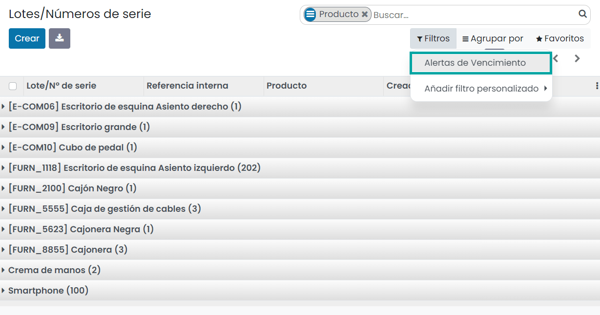

========================
Lotes y números de serie
========================

En Daeris, los números de lote y de serie tiene similitudes en su sistema funcional pero son diferentes en su comportamiento.
Ambos se administran dentro de **Inventario**, **Compras** y la aplicación de **Ventas**.

Los **lotes** corresponden a un cierto número de productos que recibiste y almacenaste juntos en un solo paquete.
Los lotes funcionan para productos que se reciben en gran cantidad y para los cuales un número de lote puede ayudar en
los reportes, controles de calidad, o cualquier otra información. Los lotes te ayudarán a identificar un grupo de piezas
que, por ejemplo, tienen un defecto de producción. También puede ser útil para un lote de producción de ropa o alimentos.
Almacenar productos consumibles como papel de cocina, papel higiénico, lápices y bloques de papel en lotes no tendría
ningún sentido, ya que hay pocas oportunidades que puedan devolverlos por fallos de producción.

Los **números de serie** son números de identificación dados a un producto en particular, para permitir el seguimiento
histórico de un artículo desde la recepción hasta la entrega y posterior a la entrega. Los números de serie son útiles
para artículos que podrían requerir servicio posventa, como teléfonos móviles, ordenadores portátiles, refrigeradores,
y cualquier dispositivo electrónico. Puedes utilizar el número de serie del fabricante o el propio, dependiendo de cómo
administres estos productos. Darle un número de serie a cada producto es una tarea de consumo de tiempo que solo servirá
en caso de artículos que tienen una garantía y/o servicio de posventa. Ponerle un número de serie al pan, por ejemplo,
no tiene sentido.

.. _inventario_y_fabricacion/inventario/gestion/productos/numeros_serie:

Trabajar con números de serie
=============================

Para rastrear productos con números de serie puedes usar el seguimiento de número de serie. De esta manera puedes rastrear
la ubicación actual del producto y, cuando los productos se muevan de una ubicación a otra, el sistema identificará
automáticamente la ubicación actual del producto de acuerdo con el último movimiento.

Configuración
-------------

Configuración de la aplicación
~~~~~~~~~~~~~~~~~~~~~~~~~~~~~~

Primero necesitas activar el seguimiento de números de serie. Para hacerlo, navega a la pantalla
:menuselection:`Inventario --> Configuración --> Ajustes`. Después, activa la función de **Lotes y números de serie**
y haz clic en *Guardar*:

Configuración del producto
~~~~~~~~~~~~~~~~~~~~~~~~~~

Ahora debes configurar los productos que quieres rastrear por número de serie. Para hacerlo navega a la pantalla
:menuselection:`Inventario --> Productos --> Productos` y accede al detalle del producto que quieras configurar. Edítalo
y selecciona seguimiento **Por número de serie único** en la pestaña de *Inventario*. Después haz clic en *Guardar*.

Administrar números de serie
----------------------------

Recepciones
~~~~~~~~~~~

Para recibir un producto al que se le da seguimiento por número de serie, debes especificar el número de serie. Esto se
puede hacer de varias maneras:

-  Asignación manual

-  Asignación múltiple

-  Copiar y pegar desde un archivo Excel

No importa cuál sea tu método favorito para asignar números de serie, primero debes abrir las operaciones detalladas de
tu recepción.

Para **asignar manualmente los diferentes números de serie** puedes hacer clic en *Agregar línea* al abrir las operaciones
detalladas. Después podrás llenar el campo de número de serie. Una vez hecho esto, puedes hacer clic de nuevo en *Agregar línea*
para registrar un nuevo número de serie:

.. image:: lotes_numeros_serie/operaciones-detalladas-recepcion-2.png
   :align: center
   :alt: Operaciones detalladas de una recepción (2)

Al usar la **asignación múltiple de números de serie**, Daeris creará automáticamente las líneas necesarias. Para hacerlo,
primero debes ingresar el número de serie del conjunto y el número de productos a los que les debe asignar un número de serie.
Una vez que esté todo listo, haz clic en *Asignar números de serie* y Daeris hará el resto:

.. image:: lotes_numeros_serie/operaciones-detalladas-recepcion-3.png
   :align: center
   :alt: Operaciones detalladas de una recepción (3)

Para usar la función de **copiar y pegar desde un archivo Excel**, abre la hoja de cálculo que contenga los números de
serie que recibiste y copia la lista.

Después, cópialos en la columna de *Nombre del número de Lote/Serie* del asistente. Al hacerlo, Daeris creará
automáticamente las líneas que necesitas:

Tipos de operaciones
--------------------

También puedes definir cómo gestionarás los números de serie para cada tipo de operación. Para definirlo, navega a la pantalla
:menuselection:`Inventario --> Configuración --> Tipos de Operaciones`. Para cada tipo, puedes decidir si permites la
creación de nuevos números de serie o si quieres usar los números existentes. Por defecto, solo se permite crear nuevos
números de serie al momento de la recepción:

.. image:: lotes_numeros_serie/tipos-operaciones-recepcion.png
   :align: center
   :alt: Tipos de operaciones en la recepción de productos

.. tip::
   Si tienes transferencias entre almacenes y rastreas productos por números de serie, puede ser útil permitir el uso de
   números de serie existentes también en las recepciones.

Trazabilidad de números de serie
--------------------------------

Los números de serie te permiten saber en dónde se recibió, en qué almacén se puso, a quién se le vendió y a dónde se envió.

Es fácil darle seguimiento a un artículo: navega a la pantalla :menuselection:`Inventario --> Productos --> Lotes/Números de serie`
y haz clic en el número de serie que corresponde a tu búsqueda. Después abre la información de trazabilidad:

Verás qué documentos ha usado el número de serie:

Puedes hacer clic en el botón de **Ubicación** para localizar el número de serie. Este botón se encuentra en el formulario
del número de serie:

En este caso, verás donde se encuentra el número de serie en particular:

.. _inventario_y_fabricacion/inventario/gestion/productos/lotes:

Trabajar con lotes
==================

Los lotes son útiles para productos que recibes en grandes cantidades. Para estos productos, un lote puede ayudar al
momento de reportar, realizar los controles de calidad, o cualquier otra información. Los lotes ayudan a identificar el
número de piezas que tienen, por ejemplo, un error de producción. Se puede usar para producción masiva de ropa o comida.

Daeris tiene la capacidad de gestionar lotes. Esto asegura que se cumpla los requisitos de trazabilidad que imponen la
mayoría de las industrias.

Configuración
-------------

Configuración de la aplicación
~~~~~~~~~~~~~~~~~~~~~~~~~~~~~~

Primero necesitas activar el seguimiento de números de lote. Para hacerlo, navega a la pantalla
:menuselection:`Inventario --> Configuración --> Ajustes`. Después, activa la función de **Lotes y números de serie**
y haz clic en *Guardar*:

Configuración del producto
~~~~~~~~~~~~~~~~~~~~~~~~~~

Ahora debes configurar los productos que quieres rastrear por número de lote. Para hacerlo navega a la pantalla
:menuselection:`Inventario --> Productos --> Productos` y accede al detalle del producto que quieras configurar. Edítalo
y selecciona seguimiento **Por lotes** en la pestaña de *Inventario*. Después haz clic en *Guardar*.

.. image:: lotes_numeros_serie/configurar-trazabilidad-producto-lote.png
   :align: center
   :alt: Configurar trazabilidad del producto por número de lote

Administrar lotes
-----------------

Recepciones
~~~~~~~~~~~

Para recibir un producto al que se le dará seguimiento por lote, debes especificar su número de lote. Puedes hacer esto
de varias maneras:

-  Asigna manualmente los diferentes números de lote

-  Copia y pega los números de lote desde un archivo Excel

Primero, debes abrir las operaciones detalladas de tu recepción.

Para **asignar manualmente los diferentes números de lote**, al abrir las operaciones detalladas, puedes hacer clic en
*Agregar línea*. Después, podrás informar el número de lote. Después haz clic de nuevo en *Agregar línea* para registrar
un número de lote nuevo.

Para usar la función de **copiar y pegar desde un archivo Excel**, abre la hoja de cálculo que contenga los números de
lote que recibiste y copia la lista.

Después, cópialos en la columna de *Nombre del número de Lote/Serie* del asistente. Al hacerlo, Daeris creará
automáticamente las líneas que necesitas:

Tipos de operaciones
--------------------

También tienes la posibilidad de definir cómo gestionarás los lotes para cada tipo de operación. Para hacerlo, navega a la pantalla
:menuselection:`Inventario --> Configuración --> Tipos de Operaciones`.

Para cada tipo de operación puedes decidir si quieres permitir la creación de nuevos números de lote o solo usar los que
ya existen. Por defecto, solo se permite crear nuevos números de lote al recibir productos y no se permite usar números
de lote existentes en esta operación.

.. image:: lotes_numeros_serie/tipos-operaciones-recepcion.png
   :align: center
   :alt: Tipos de operaciones en la recepción de productos

.. tip::
   Si tienes transferencias entre almacenes y das seguimiento a los productos por lotes, también puede ser de ayuda
   permitir el uso de números de lote existentes en las recepciones.

Trazabilidad de lotes
---------------------

El número de lote asignado al producto te permite saber en dónde se recibió, en qué almacén se puso, a quién se le vendió
y a dónde se envió.

Para dar seguimiento a un artículo, navega a la pantalla :menuselection:`Inventario --> Productos --> Lotes/Números de serie`
y haz clic en el número de lote que corresponde a tu búsqueda. Después abre la información de trazabilidad:

Verás qué documentos ha usado el número de serie:

Puedes hacer clic en el botón de **Ubicación** para localizar el número de lote. Este botón se encuentra en el formulario
del número de lote:

En este caso, verás donde se encuentra el número de lote en particular:

.. _inventario_y_fabricacion/inventario/fechas_caducidad:

Establecer fechas de caducidad
==============================

En muchas empresas los productos tienen fecha de caducidad y se deben de gestionar de acuerdo a esta fecha. En el sector
alimenticio, por ejemplo, es obligatorio rastrear los productos en el inventario de acuerdo con sus fechas de caducidad
para evitar vender productos caducados a los clientes.

Con Daeris, puedes rastrear y gestionar tus productos de acuerdo a las fechas de caducidad, incluso si ya los estás
rastreando por lotes o números de serie.

Configuración
-------------

Configuración de la aplicación
~~~~~~~~~~~~~~~~~~~~~~~~~~~~~~

Para usar el rastreo por fecha de caducidad navega a la pantalla :menuselection:`Inventario --> Configuración --> Ajustes`
y activa las funciones de **Lotes y números de serie** y **Fechas de caducidad**, y haz clic en *Guardar*:

Configuración del producto
~~~~~~~~~~~~~~~~~~~~~~~~~~

Ahora puedes definir diferentes fechas en la pestaña de *Inventario* del formulario del producto:

-  **Fecha de caducidad**: El número de días antes de que los productos se vuelvan peligrosos y ya no se pueden
   consumir. Esto se usa para calcular la fecha de caducidad de cada lote o número de serie recibido.

-  **Consumir preferentemente antes de**: El número de días antes de que los productos comiencen a deteriorarse, sin ser
   peligroso. Esto se usa para calcular la fecha de consumo preferente en cada lote/número de serie recibido.

-  **Tiempo de remoción**: Muestra el número de días antes de que los productos se deban quitar del inventario.
   Esto se usa para calcular la fecha de remoción de cada lote o número de serie recibido.

-  **Hora de alerta**: Se refiere al número de días antes de recibir una alerta sobre adelantar el lote o número de serie
   del producto. Esto se usa para calcular la fecha de alerta del lote/número de serie recibido. Una vez que sea la
   fecha de alerta, se asigna una actividad en el lote o número de serie relevante para el usuario responsable del producto.

Fecha de caducidad en lotes/números de serie
--------------------------------------------

Al recibir un producto en el inventario, las fechas se actualizarán automáticamente en el lote o número de serie
correspondiente. Estas actualizaciones se basarán en la fecha de recepción del producto y el día indicado en la
plantilla del producto.

Alertas de caducidad
--------------------

Puedes acceder a las alertas de caducidad desde la pantalla :menuselection:`Inventario --> Productos --> Lotes/Números de serie`.
Ahí, puedes usar todos los filtros existentes pera mostrar todos los lotes/números de serie que pasaron sus fechas de caducidad:

.. _inventario_y_fabricacion/inventario/mostrar_lotes:

Mostrar lotes y números de serie en albaranes
=============================================

Es posible mostrar los lotes y números de serie en los albaranes. Para ello, navega a la pantalla
:menuselection:`Inventario --> Configuración --> Ajustes` y activa la función correspondiente:

Una vez hecho esto, pulsa el botón *Guardar* de la pantalla de ajustes.

A partir de ese momento, al imprimir un albarán en una transferencia de inventario, el PDF mostrará información sobre
el lote o número de serie correspondiente al producto:

Mostrar lotes y números de serie en facturas
============================================

Es posible mostrar los lotes y números de serie en las facturas de cliente. Para ello, navega a la pantalla
:menuselection:`Inventario --> Configuración --> Ajustes` y activa la función correspondiente:

Una vez hecho esto, pulsa el botón *Guardar* de la pantalla de ajustes.

A partir de ese momento, al imprimir una factura de cliente desde la vista de formulario de facturas, el PDF mostrará
información sobre el lote o número de serie correspondiente al producto:

