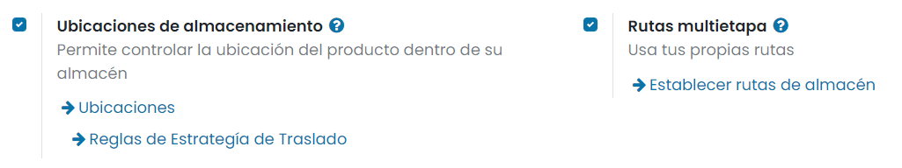

===========
Recepciones
===========

Dependiendo de factores como el tipo de artículos que vendes, el tamaño de tu almacén o el número de pedidos que registras
cada día, la manera como gestionas las entregas a tus clientes puede variar mucho.

Daeris te permite gestionar las recepciones desde tu almacén de 3 maneras diferentes:

-  **Un paso (entrada)**: Recepción los artículos directamente en el almacén.

-  **Dos pasos (entrada + inventario)**: Descargar en la entrada, después pasar al almacén. Mientras no se transfieran
   los bienes a tu almacén, no estarán disponibles para procesarlos.

-  **Tres pasos (entrada + calidad + inventario)**: Descargar en la entrada, llevar al control de calidad antes de ingresar
   el producto al almacén. Esto es necesario en muchas empresas para evaluar los artículos recibidos. El objetivo es verificar
   que los productos correspondan a los requerimientos de calidad que se acordaron con los proveedores. Agregar un paso
   de control de calidad en el proceso de recibir producto puede llegar a ser esencial. Por supuesto, puedes cambiar la
   cantidad y solamente transferir a existencias la cantidad que es válida y puedes decidir si devolverás la cantidad
   que no está en buen estado.

Daeris utiliza rutas para definir exactamente como podrás manejar los diferentes pasos de recepción. La configuración se
realiza a nivel de almacén. En la configuración estándar, la recepción es un proceso de un paso, pero puedes cambiar la
configuración para tener 2 o incluso 3 pasos.

Recibir bienes directamente (1 paso)
====================================

Configuración
-------------

No necesitas configurar nada para trabajar con la recepción de un solo paso. Los envíos entrantes predeterminados están
configurados para que se reciban directamente de los proveedores a las existencias.

Sin embargo, si se activan las **Rutas multietapa** desde la pantalla :menuselection:`Inventario --> Configuración --> Ajustes`
y configuras otra configuración de recepción en tu almacén, puedes volver a la configuración de recepción en un paso. Para
ello, navega a la pantalla :menuselection:`Inventario --> Configuración --> Almacenes` y edita el almacén que necesites.
Después, selecciona *Recibir bienes directamente (1 paso)* como tu estrategia de envíos a recibir:

Crear un pedido de compra
-------------------------

Navega a la aplicación de **Compra** y crea una solicitud de presupuesto con productos almacenables para recibir y confírmalo.
Podrás ver que ahora hay una recepción asociada con este pedido de compra en el botón inteligente que se encuentra en la
parte superior del pedido de compra:

Si haces clic en el botón de recepción, podrás ver la orden de recepción:

Procesar una recepción
----------------------

Desde el detalle de la orden de recepción, podrás hacer clic en **Validar** para completar el movimiento directamente,
ya que los productos procedentes de proveedores se consideran siempre disponibles:

.. note::
   Si tienes activadas las **Ubicaciones de almacenamiento**, puedes hacer clic en el menú de operaciones detalladas junto
   a la unidad de medida para especificar la(s) ubicación(es) donde está guardando el/los producto(s) recibidos.

Cuando validas la orden de recepción, los productos salen de la ubicación del proveedor para ingresar a tu ubicación de
inventario. Puedes ver que la recepción se ha producido gracias a que el estado de la orden ahora es *Hecho*:

Recibir bienes y luego llevar a existencias (2 pasos)
=====================================================

Configuración
-------------

El primer paso es permitir el uso de rutas multietapa. Las rutas te permitirán tener un mecanismo para encadenar acciones.
En este caso, encadenaremos la etapa del desembarque en el área de entrada a la etapa que ingresa los productos al inventario.

Para permitir rutas multietapa navega a la pantalla :menuselection:`Inventario --> Configuración --> Ajustes` y activa la
opción correspondiente. Ten en cuenta que al activar las rutas multietapa también se activarán las ubicaciones de almacén.
Una vez marcada la opción, pulsa el botón *Guardar* de la pantalla de ajustes.

Una vez que actives las rutas multietapa puedes navegar a la pantalla :menuselection:`Inventario --> Configuración --> Almacenes`
y acceder al detalle del almacén que usará la recepción en dos pasos. Puedes seleccionar la opción *Recibir bienes en la ubicación de entrada y luego llevar a existencias (2 pasos)*
para los envíos a recibir:

Si activas esta opción, se creará una nueva ubicación de entrada. Si quieres cambiarle el nombre navega a
:menuselection:`Inventario --> Configuración --> Ubicaciones`. Después, seleccione la ubicación con nombre *Entrada* y
actualiza el nombre:

Crear un pedido de compra
-------------------------

Navega a la aplicación de **Compra** y crea una solicitud de presupuesto con productos almacenables que recibirás del proveedor
y confírmala. Una vez que se confirme la solicitud de presupuesto, se creará la orden de recepción y se vinculará
automáticamente a tu pedido de compra:

Si haces clic en el botón de recepciones, verás la primera orden que permitirá ingresar el producto en la ubicación de entrada:

Luego, se creó otra orden, una transferencia interna, para mover los productos a existencias.

Procesar la recepción y la transferencia interna
------------------------------------------------

La operación de recepción es la primera que se procesa. Las recepciones siempre se consideran listas para procesar
automáticamente. Luego, podrás hacer clic directamente en **Validar** para marcarla como hecha.

Una vez que se valide la recepción, la transferencia interna estará lista para procesarse:

Gracias a que los documentos están encadenados, los productos que se recibieron previamente se reservan de manera
automática en la transferencia interna:

Una vez validada, puedes ver que se ha producido gracias a que el estado de la orden ahora es *Hecho*:

Recibir bienes, transferir a control de calidad, y llevar a existencias (3 pasos)
=================================================================================

Configuración
-------------

El primer paso es permitir el uso de rutas multietapa. Las rutas te permitirán tener un mecanismo para encadenar acciones.

Para permitir rutas multietapa navega a la pantalla :menuselection:`Inventario --> Configuración --> Ajustes` y activa la
opción correspondiente. Ten en cuenta que al activar las rutas multietapa también se activarán las ubicaciones de almacén.
Una vez marcada la opción, pulsa el botón *Guardar* de la pantalla de ajustes.

Una vez que actives las rutas multietapa puedes navegar a la pantalla :menuselection:`Inventario --> Configuración --> Almacenes`
y acceder al detalle del almacén que usará la recepción en tres pasos. Puedes seleccionar la opción
*Recibir bienes en la ubicación de entrada, transferir a ubicación de control de calidad, y luego llevar a existencias (3 pasos)*
para los envíos a recibir:

Si activas esta opción, se crearán dos nuevas ubicaciones de entrada. Si quieres cambiarles el nombre navega a
:menuselection:`Inventario --> Configuración --> Ubicaciones`. Después, selecciona las ubicaciones con nombre *Entrada* y
*Control de Calidad* y actualizales el nombre:

Crear un pedido de compra
-------------------------

Navega a la aplicación de **Compra** y crea una solicitud de presupuesto con productos almacenables que recibirás del proveedor
y confírmala. Una vez que se confirme la solicitud de presupuesto, se creará la orden de recepción y se vinculará
automáticamente a tu pedido de compra:

.. image:: recepciones/flujo-tres-etapas-4.png
   :align: center
   :alt: Flujo de tres etapas (4)

Si haces clic en el botón de recepciones, verás la primera orden que permitirá ingresar el producto en la ubicación de entrada:

Luego, se creó otra orden, para mover los productos a control de calidad, y otra orden más para mover los productos a
existencias. Todas estas órdenes tendrán tu pedido de compra como documento origen.

Procesar la recepción, el control de calidad y el ingreso al inventario
-----------------------------------------------------------------------

La operación de recepción es la primera que se procesa. Las recepciones siempre se consideran listas para procesar
automáticamente. Luego, podrás hacer clic directamente en **Validar** para marcarla como hecha.

.. image:: recepciones/flujo-tres-etapas-6.png
   :align: center
   :alt: Flujo de tres etapas (6)

Una vez que se valide la recepción, la transferencia a calidad estará lista para procesarse. Gracias a que los documentos
están encadenados, los productos que se recibieron previamente se reservan de manera automática en la transferencia a calidad:

Por último, una vez que se valide la transferencia a calidad, la transferencia a existencias estará lista para procesarse.
Gracias a que los documentos están encadenados, los productos que se transfirieron previamente de calidad se reservan de
manera automática en la transferencia a existencias:

Una vez validada, puedes ver que se ha producido gracias a que el estado de la orden ahora es *Hecho*:

