========================
Reglas de abastecimiento
========================

Una de las acciones más comunes en la gestión del inventario es la de abastecerse de productos para disponer siempre de
una cantidad de stock suficiente. Desde Daeris, es posible automatizar las tareas de abastecimiento en base a prioridades,
condiciones y costes. En función de las reglas definidas y los niveles de existencias en stock, se generará una solicitud
de abastecimiento de forma automática.

Regla de existencias mínimas
============================

Las reglas de existencias mínimas se usan para asegurarse de que siempre tengas la cantidad mínima de un producto disponible
para fabricar tus productos o para responder las necesidades de tus clientes. Cuando el nivel de existencias de un producto
llega al mínimo, el sistema automáticamente generará una orden de compra con la cantidad necesaria para alcanzar el nivel
de existencias máximo.

Configuración
-------------

La configuración de la regla de existencias mínimas está disponible a través de la pantalla
:menuselection:`Inventario --> Configuración --> Reglas de abastecimiento`. Ahí, selecciona *Crear* para establecer los
valores de existencias máximas y mínimas para un producto en específico:

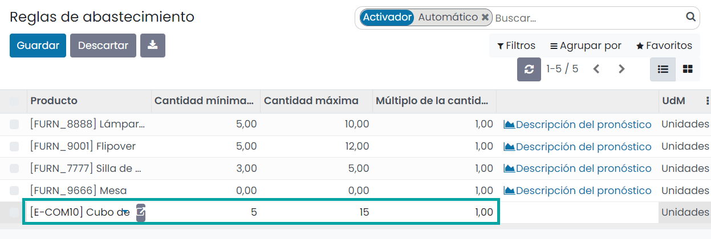

El sistema creará un nuevo registro en donde poder introducir el producto, la cantidad mínima y la cantidad máxima.
Mediante el múltiplo de la cantidad, la cantidad a abastecer se redondeará a este múltiplo. Si se indica 0 o 1, se
utilizará la cantidad exacta.

Una vez informados los campos necesarios, pulsa el botón *Guardar*.

A continuación, haz clic en tu producto para acceder al formulario del producto relacionado y, en la pestaña de *Compra*,
no olvides seleccionar un proveedor:

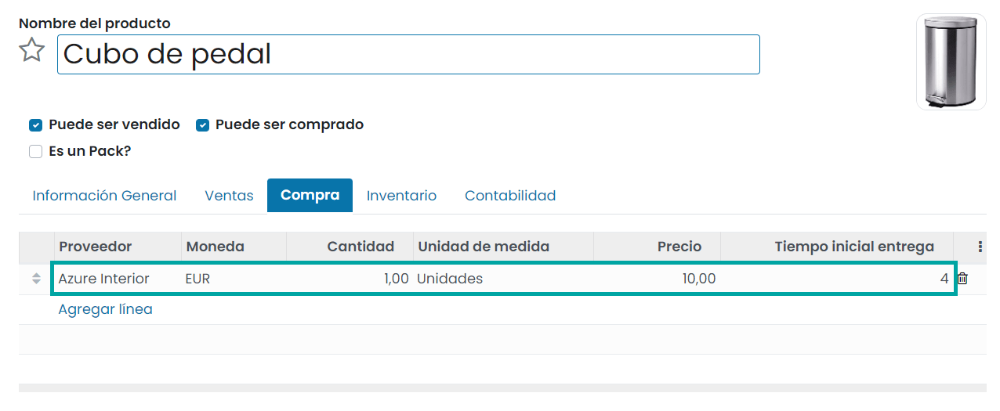

Para que dicho producto se abastezca mediante compras, debe tener marcada la ruta *Comprar* en la pestaña de *Inventario*:

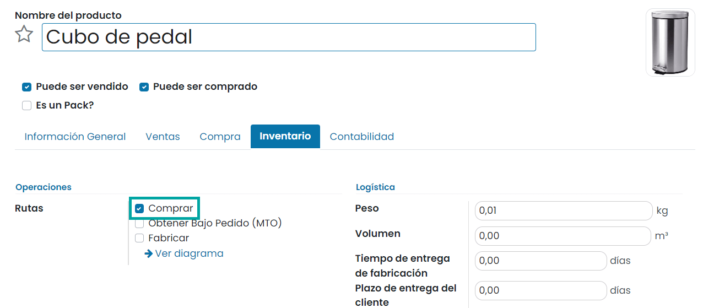

Ejecución
---------

Si dispones de reglas de abastecimiento cargadas en el sistema, puedes ejecutarlas mediante el planificador disponible en
:menuselection:`Inventario --> Operaciones --> Ejecutar Planificador`. Al seleccionar esta opción, el sistema mostrará el
siguiente formulario, donde se deberá pulsar el botón **Ejecutar Planificador**:

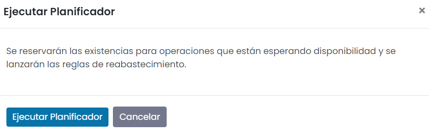

Una vez ejecutado el planificador, si el producto configurado en las reglas de abastecimiento se abastece mediante compras,
se generará una solicitud de presupuesto. Sobre el campo **Documento origen** de la solicitud de presupuesto aparecerá el
nombre de la regla. Esto lo puedes consultar accediendo al detalle de la solicitud de presupuesto desde la pantalla
:menuselection:`Compra --> Pedidos --> Solicitudes de presupuesto`:

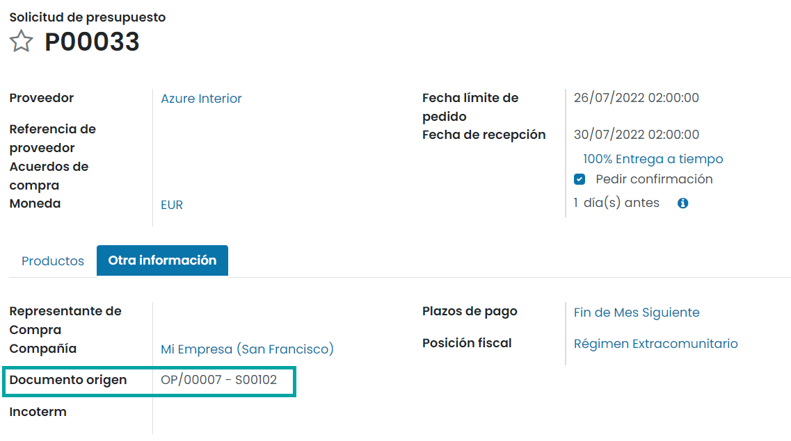

En este caso, al disponer de 0 unidades en stock, la solicitud de presupuesto dispondrá de un total de 15 unidades, ya
que en la regla de abastecimiento se había fijado el máximo en 15 unidades:

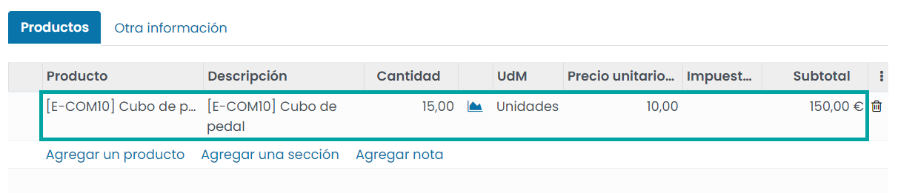

.. note::
   En caso de que se vuelva a ejecutar el planificador sin haber confirmado el pedido, no se generará otra solicitud de
   presupuesto, debido a que ya dispones de una solicitud pendiente de confirmación.

Una vez confirmado el pedido, se podrá comprobar que ha aumentado la cantidad del producto previsto con la cantidad
pendiente de recibir. Esto se puede consultar desde la ficha de detalle del producto:

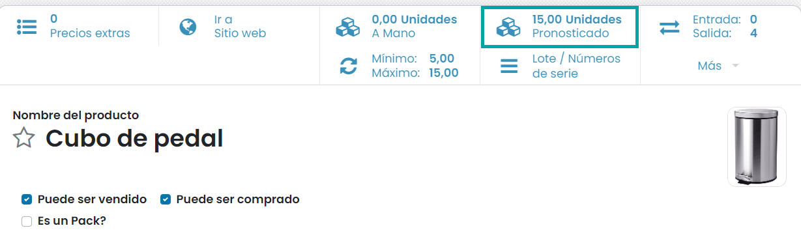

Una vez recibidos los productos y validada la recepción de los mismos, aumenta la cantidad disponible a mano y se iguala
a la cantidad prevista:

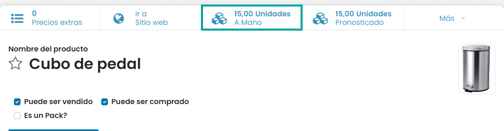

Fabricación bajo pedido
=======================

Con las órdenes de producción bajo pedido, las órdenes de producción son creadas de forma automática por el sistema al
registrar una venta, para que los productos puedan ser enviados al cliente.

Puedes encontrar más información acerca sobre la fabricación bajo pedido en la documentación del módulo de **Fabricación**.

.. seealso::
   * :ref:`inventario_y_fabricacion/fabricacion/orden_produccion_bajo_pedido`

.. _inventario_y_fabricacion/inventario/gestion/reglas_de_abastecimiento/reabastecer_otro_almacen:

Reabastecer de otro almacén
===========================

Configuración
-------------

Con el fin de poder reabastecer de otro almacén, necesitas activar las **Rutas multietapa** desde la pantalla
:menuselection:`Inventario --> Configuración --> Ajustes`:

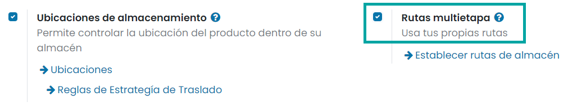

Una vez activado, pulsa el botón *Guardar* de la pantalla de ajustes.

A continuación, accede a tus almacenes a través de la pantalla :menuselection:`Inventario --> Configuración --> Almacenes`.
Introduce el almacén que se debe reabastecer de otro. Tendrás la posibilidad de indicar directamente a través de cuál
almacén se debe reabastecer:

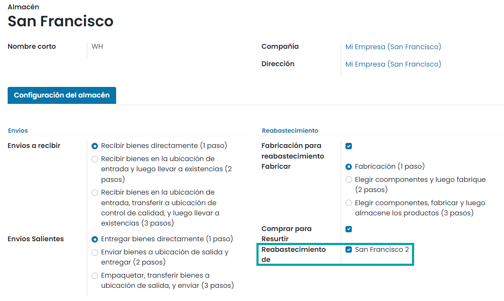

.. important::
   Este campo solamente estará disponible en el caso de disponer de varios almacenes dados de alta en la aplicación.

Al activar esta opción, estará disponible una nueva ruta en tus productos: *Suministrar producto de un segundo almacén*.
Esta regla se puede seleccionar, junto con una regla de abastecimiento o de fabricación bajo pedido:

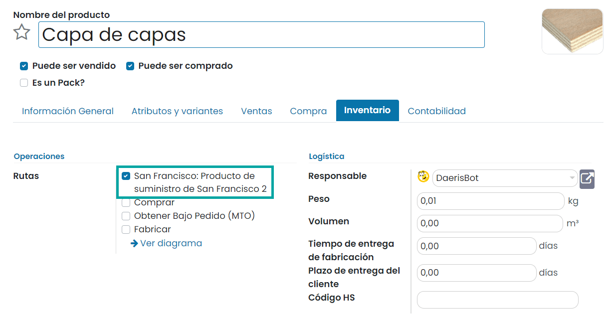

Para este ejemplo, estableceremos una regla de reabastecimiento con un mínimo de 40 unidades y un máximo de 60 unidades
en existencia, teniendo actualmente 20 unidades a mano:

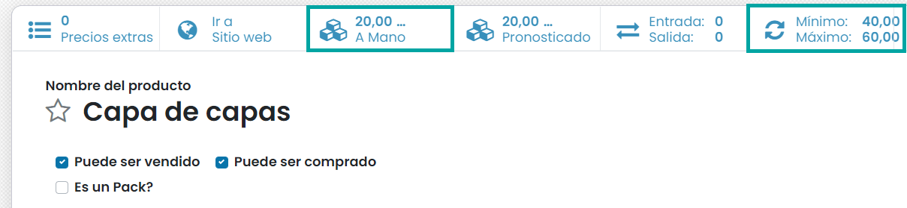

Ejecución
---------

Si dispones de reglas de abastecimiento cargadas en el sistema, puedes ejecutarlas mediante el planificador disponible en
:menuselection:`Inventario --> Operaciones --> Ejecutar Planificador`. Al seleccionar esta opción, el sistema mostrará el
siguiente formulario, donde se deberá pulsar el botón **Ejecutar Planificador**:

Una vez ejecutado el planificador, el sistema crea automáticamente dos recepciones, una del segundo almacén, el cual
contiene los productos necesarios y una en el almacén principal para los mismos productos. El documento de origen es la
regla de reabastecimiento, la cual activó la ruta *Suministrar producto de un segundo almacén*:

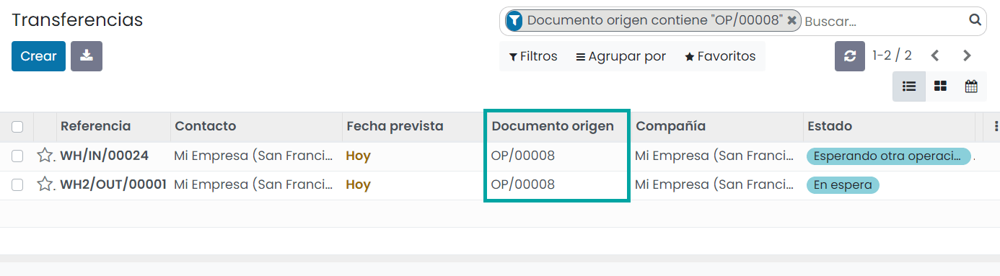