============================
Transferencias de inventario
============================

Gestionar las transferencias de inventario
==========================================

Una **transferencia de inventario** es un movimiento de mercancías entre dos almacenes o ubicaciones y puede ser originada
por diferentes acciones, como, por ejemplo:

-  Compras

-  Ventas

-  Fabricación

-  Movimientos de paquetes entre almacenes

Para gestionar las transferencias de inventario navega a la pantalla :menuselection:`Inventario --> Operaciones --> Transferencias`.
Al navegar a la pantalla de transferencias aparece un listado que mostrará todas las transferencias disponibles en el sistema,
independientemente de su estado y origen:

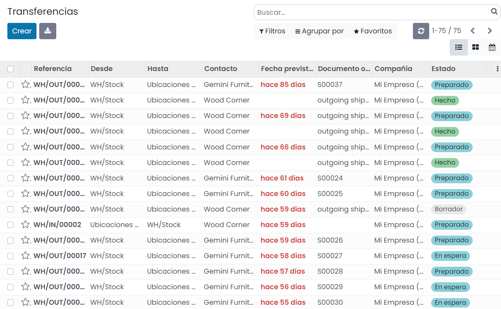

Una transferencia dispone de varios posibles estados:

-  **Borrador**: Transferencia pendiente de validación.

-  **Esperando otra operación**: En espera de que finalice otra acción para poder realizar esta. Por ejemplo, en
   transferencias de productos pendientes de fabricar.

-  **En espera**: Transferencia que no está lista para el envío debido a que los productos no han podido ser reservados.

-  **Preparado**: Los productos están reservados y listos para ser enviados. Si la política de envío es *Lo antes posible*,
   esto ocurre tan pronto como se reserve cualquier producto.

-  **Hecho**: Transferencia que ya ha sido procesada y no puede ser modificada o cancelada.

-  **Cancelado**: Transferencia cancelada.

Al crear una transferencia, el sistema navega al formulario de detalle donde puedes encontrar los siguientes
campos:

-  **Contacto**: Cliente o proveedor relacionado con la mercancía.

-  **Tipo de operación**: Operaciones asociadas al almacén, como, por ejemplo, recepciones, transferencias internas,
   expediciones, fabricación, TPV, dropship, etc.

-  **Ubicación de origen**: Ubicación origen de la mercancía.

-  **Ubicación destino**: Ubicación destino de la mercancía.

-  **Fecha prevista**: Fecha en que se espera que ocurra el movimiento.

-  **Documento origen**: Código de referencia asociado a la acción que ha generado la transferencia.

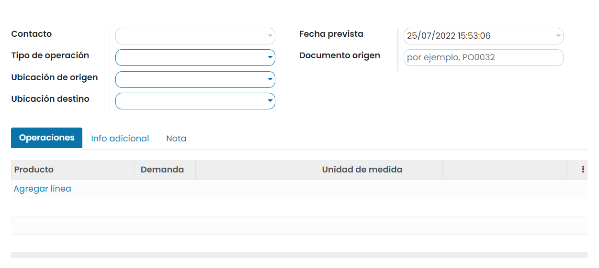

Sobre la pestaña **Operaciones** aparece un listado que puede incluir varios productos asociados a la transferencia. Los
campos disponibles son:

-  **Producto**: Producto asociado a la transferencia.

-  **Demanda**: Cantidad solicitada del producto.

-  **Unidad de medida**: Unidad de medida asociada al producto.

Sobre la pestaña **Info adicional** puedes encontrar más información relacionada con el movimiento de productos, como
el transportista, número de seguimiento, peso, política de entrega, responsable y compañía:

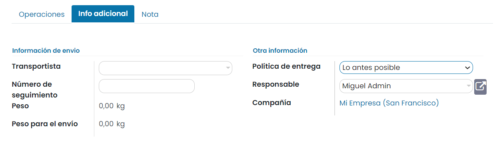

Por último, desde la pestaña **Nota** es posible añadir una nota interna que se imprimirá en la hoja de operaciones de
picking.

Una vez informados todos los campos, pulsa el botón *Guardar*.

Comprobar la disponibilidad de productos en una transferencia de inventario
===========================================================================

Para comprobar la disponibilidad de productos en una transferencia de inventario, accede al detalle de una transferencia en
estado *En espera* desde la pantalla :menuselection:`Inventario --> Operaciones --> Transferencias`. Para verificar si ya
dispones de productos en stock que permitan realizar la transferencia, pulsa el botón **Comprobar disponibilidad**:

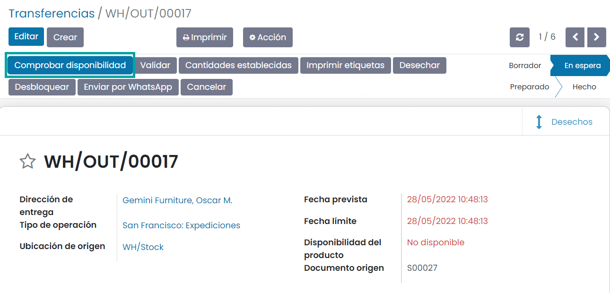

En el caso de que no dispongas del producto en stock, la transferencia seguirá en estado *En espera*, y no se reservará
la cantidad demandada del producto. En este caso, deberás adquirir, fabricar o ajustar el inventario, de forma que se
cumpla la demanda inicial de producto.

Una vez ya dispongas de la cantidad demandada de producto, tras pulsar el botón de comprobar disponibilidad, se procederá
a reservar la cantidad necesaria para cubrir la transferencia y el pedido quedará en estado *Preparado*:

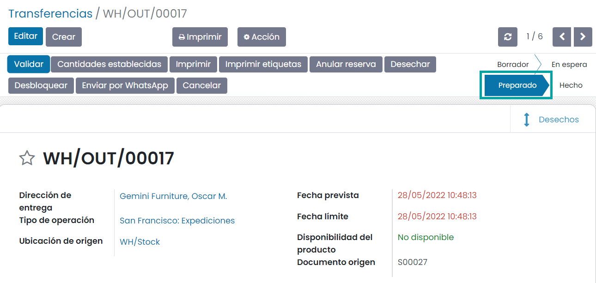

Anular una reserva en una transferencia de inventario
=====================================================

Para anular una reserva en una transferencia de inventario, accede al detalle de una transferencia en estado *Preparado*
desde la pantalla :menuselection:`Inventario --> Operaciones --> Transferencias`:

Mediante el botón **Anular reserva** se procederá a anular la cantidad reservada del producto:

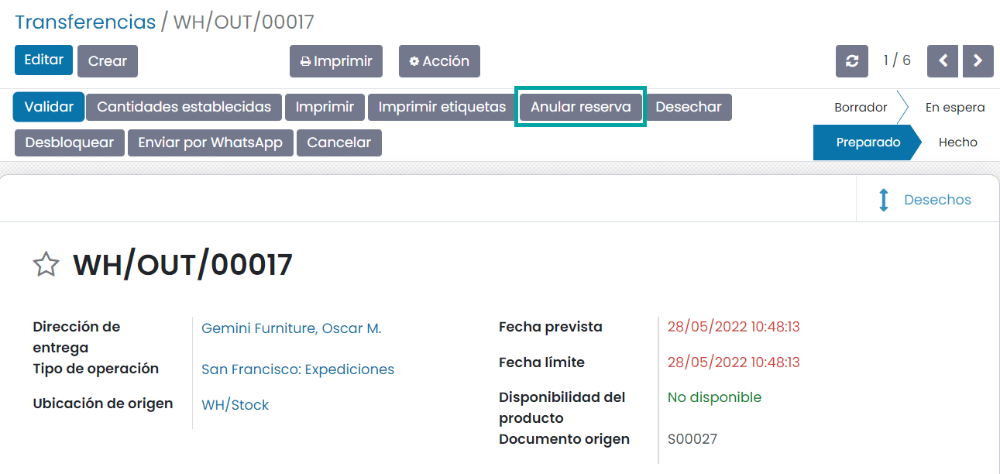

Esta acción eliminará las cantidades reservadas de productos, que volverán a estar disponibles para que puedan ser
usadas en cualquier otra transferencia. El estado de la transferencia cambiará a *En espera*:

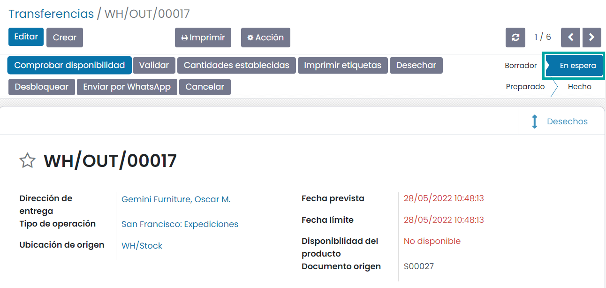

Validar una transferencia de inventario
=======================================

Para validar una transferencia de inventario, accede al detalle de una transferencia en estado *Preparado* desde la
pantalla :menuselection:`Inventario --> Operaciones --> Transferencias`:

Cuando dispones de una transferencia preparada y quieres indicar que ya has enviado o recibido la mercancía, debes
informar el número de unidades recibidas o enviadas en cada línea:

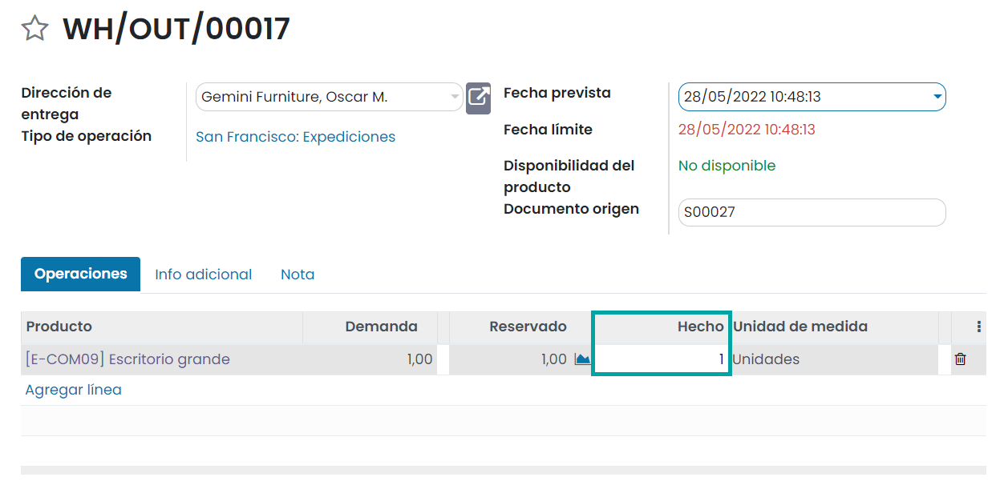

Una vez introducidas las cantidades, será posible validar la transferencia mediante el botón **Validar**:

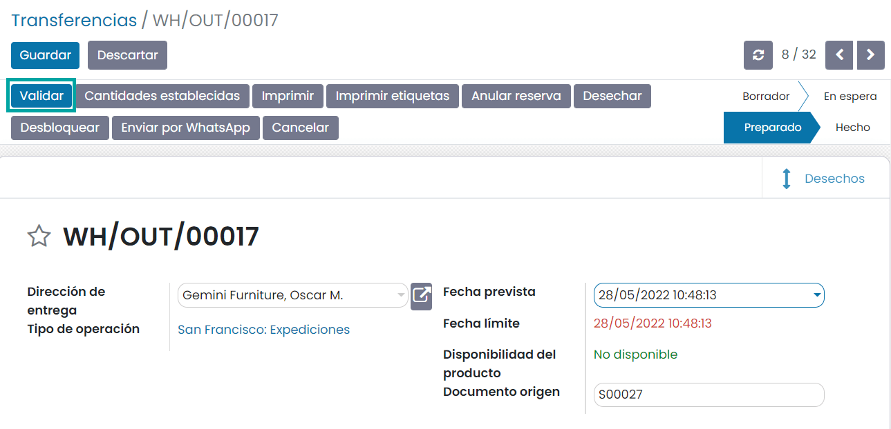

.. note::
   Si pulsas el botón **Validar** sin haber confirmado todos los productos entregados o recibidos, el sistema pedirá
   confirmación para procesar todas las cantidades reservadas.

Una vez validada la transferencia, el estado de la misma cambiará a *Hecho*:

Realizar la devolución de una transferencia de inventario
=========================================================

Para realizar la devolución de una transferencia de inventario, accede al detalle de una transferencia en estado *Hecho*
desde la pantalla :menuselection:`Inventario --> Operaciones --> Transferencias`:

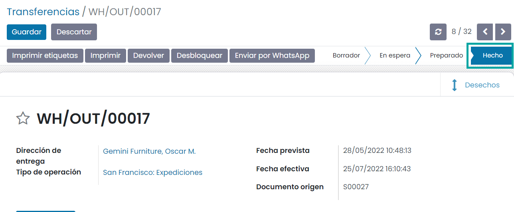

A continuación, pulsa el botón **Devolver**:

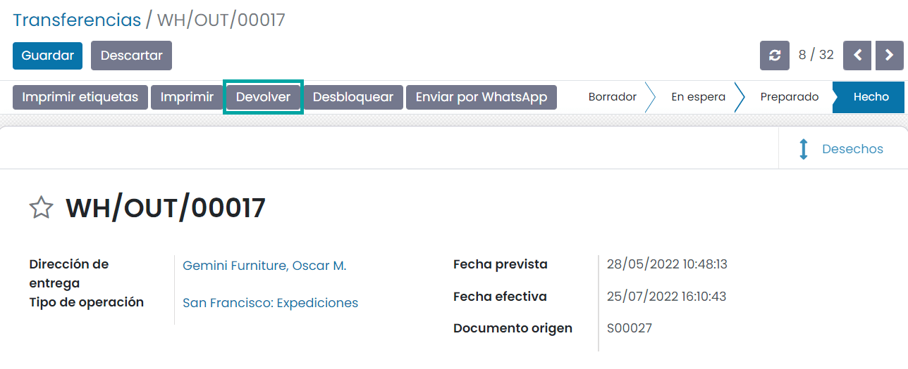

Mediante esta acción, el sistema abrirá un formulario que solicitará confirmación para revertir la transferencia:

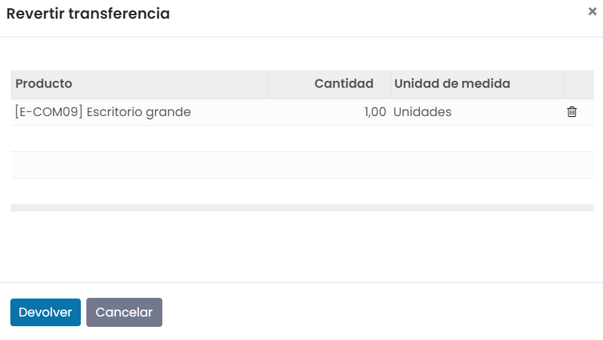

Esta acción generará una nueva transferencia cuyo documento de origen será el retorno de la transferencia origen. El
estado de la transferencia será *Preparado* a la espera de recibir la mercancía, en el caso de una devolución del cliente,
o de enviar la mercancía, en el caso de una devolución al proveedor:

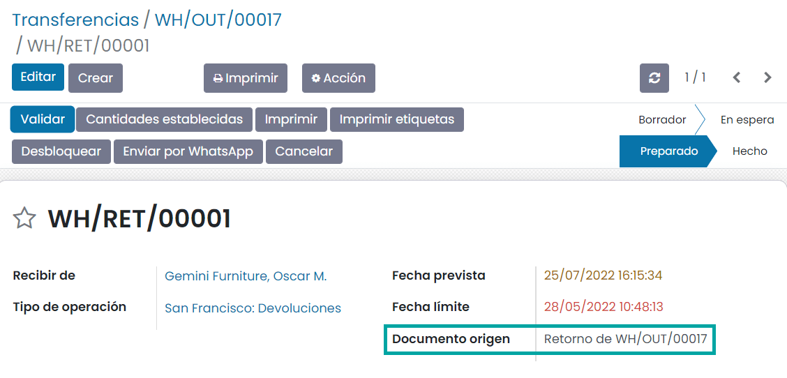

Para completar la devolución, deberás pulsar el botón **Validar**. Una vez validada la devolución, la transferencia quedará
en estado *Hecho*:

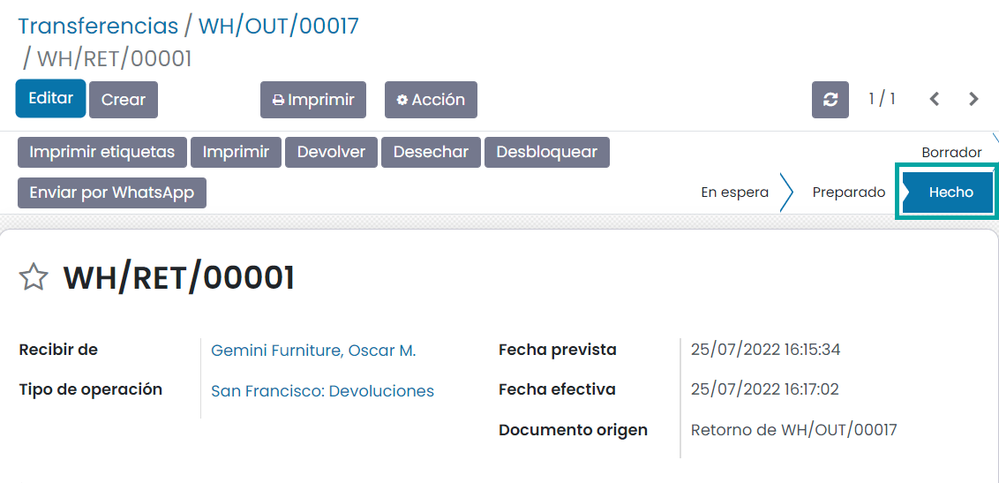

Imprimir las operaciones de un albarán
======================================

Para imprimir las operaciones de un albarán, accede al detalle de una transferencia desde la pantalla
:menuselection:`Inventario --> Operaciones --> Transferencias`, y sobre el menú selecciona la opción
:menuselection:`Imprimir --> Operaciones de albarán`:

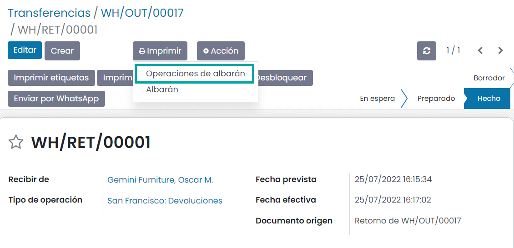

El sistema generará un fichero en formato PDF con información acerca de la transferencia de inventario y los productos
asociados:

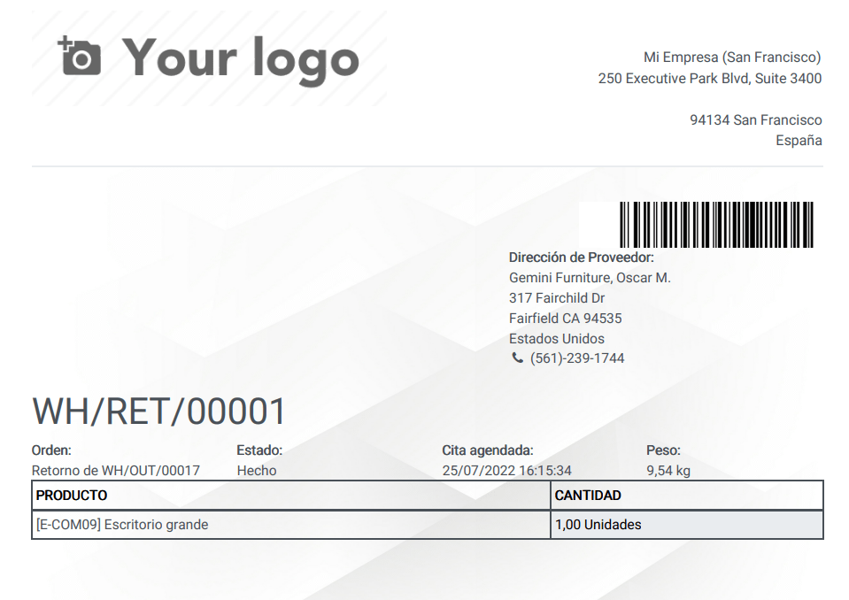

Imprimir un albarán de entrega
==============================

Para imprimir un albarán de entrega, accede al detalle de una transferencia desde la pantalla
:menuselection:`Inventario --> Operaciones --> Transferencias`, y sobre el menú selecciona la opción
:menuselection:`Imprimir --> Albarán`:

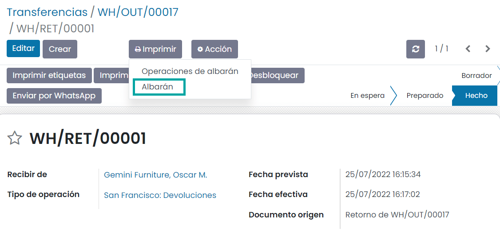

El sistema generará un fichero en formato PDF con información acerca de la transferencia de inventario y los productos
asociados:

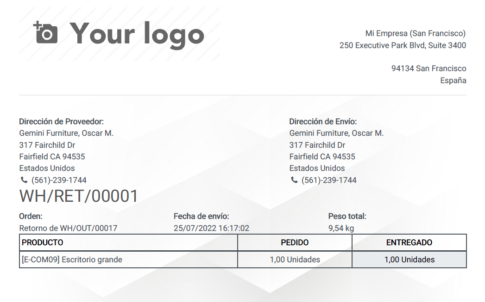

.. _inventario_y_fabricacion/inventario/enviar_whatsapp_transferencia:

Enviar un mensaje de WhatsApp en una transferencia de inventario
================================================================

.. seealso::
   * :doc:`../../../varios/whatsapp`

Es posible enviar un WhatsApp al contacto asociado a una transferencia de inventario desde el formulario de transferencias.
Para ello, debes navegar a la pantalla :menuselection:`Inventario --> Operaciones --> Transferencias`, y acceder al detalle
de una transferencia. Desde esta pantalla, aparecerá un botón que permitirá enviar un mensaje de WhatsApp:

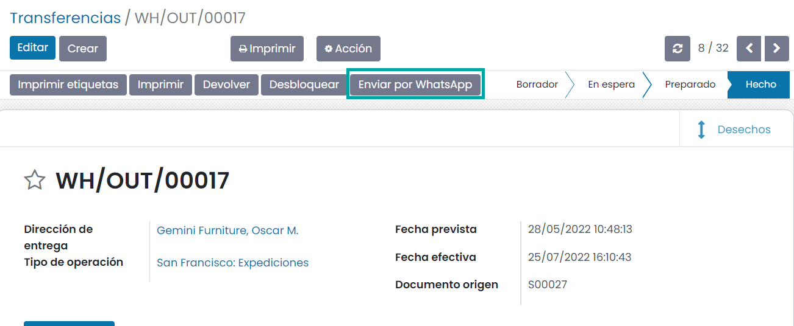

.. note::
   El número de teléfono móvil del contacto debe estar informado con formato internacional (por ejemplo, +33123456789).

El sistema desplegará un formulario desde donde podrás redactar el mensaje de WhatsApp o seleccionar una plantilla que
informe el mensaje de forma automática:

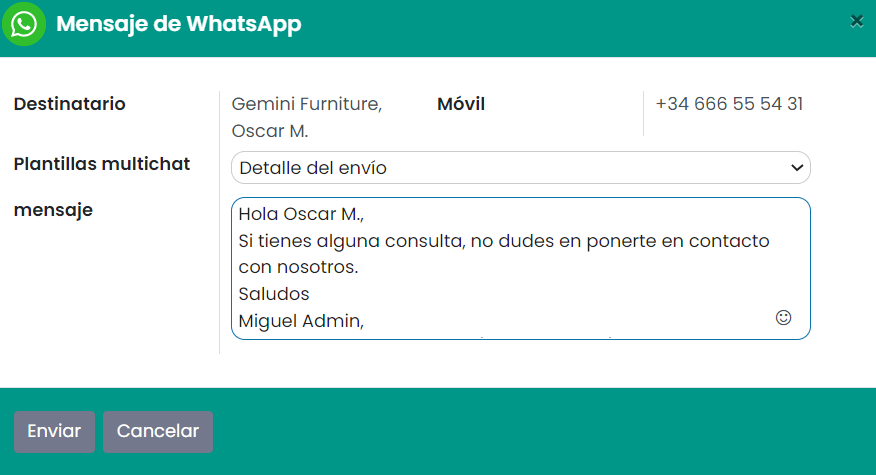

Una vez informado el mensaje, debes pulsar el botón *Enviar*.

En caso de estar conectado a la aplicación mediante un dispositivo de escritorio, el sistema tratará de establecer
conexión mediante la aplicación WhatsApp Web, para lo cual, habrá que escanear el código QR mostrado en pantalla, e
iniciar sesión en tu cuenta de WhatsApp.

Por otro lado, en caso de estar conectado a la aplicación mediante un dispositivo móvil, el sistema tratará de enviar
el mensaje mediante la aplicación WhatsApp instalada en el dispositivo.

Una vez enviado el mensaje desde WhatsApp, cierra la ventana del mensaje mediante la cruz ubicada en la parte superior
derecha del formulario:

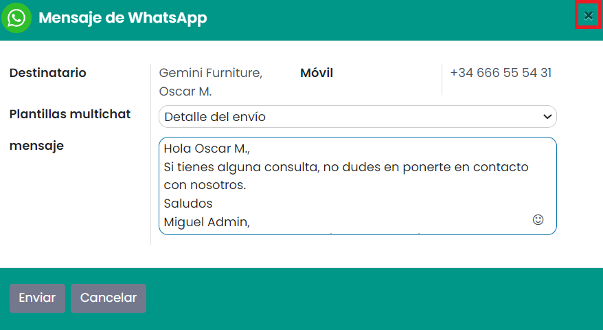

.. _inventario_y_fabricacion/inventario/gestion/transferencias/advertencias:

Recibir advertencias en transferencias de inventario
====================================================

Activar las advertencias
------------------------

Es posible recibir mensajes de advertencia en transferencias de inventario de ciertos contactos de la aplicación. Para ello,
navega a la pantalla :menuselection:`Inventario --> Configuración --> Ajustes` y activa la opción **Avisos**:

Una vez hecho esto, pulsa el botón *Guardar* de la pantalla de ajustes.

Recibir una advertencia sobre un contacto
-----------------------------------------

Para recibir una advertencia sobre un contacto específico, navega al detalle de un contacto desde la pantalla
:menuselection:`Contactos --> Contactos` y desde la pestaña de *Notas internas* informa el campo
**Aviso en los albaranes**:

-  **Sin mensaje**: No se muestra ninguna advertencia para este contacto.

-  **Alerta**: Se muestra una alerta en las transferencias de inventario asociadas a este contacto.

-  **Mensaje de bloqueo**: Se muestra una excepción con el mensaje y se bloquea el flujo.

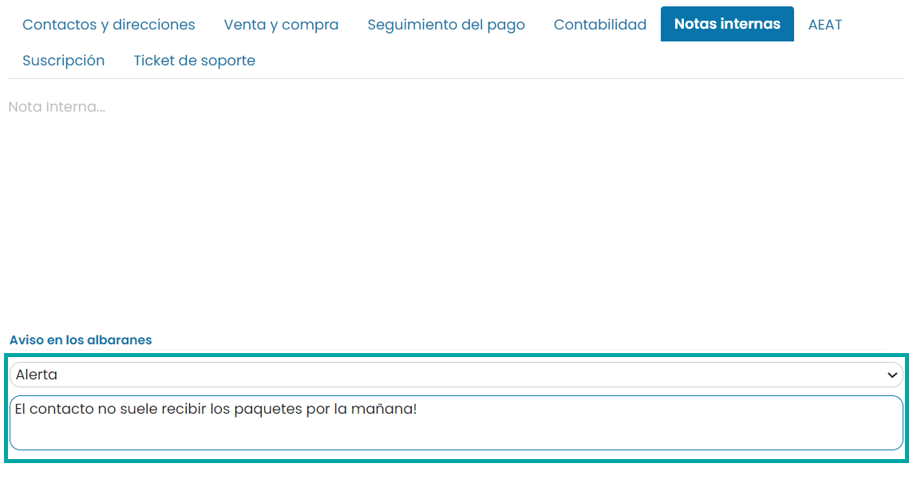

Una vez configurada la advertencia, pulsa el botón *Guardar* del formulario del contacto.

A partir de ese momento, al crear una transferencia de inventario y seleccionar ese contacto, se mostrará la alerta
configurada:

