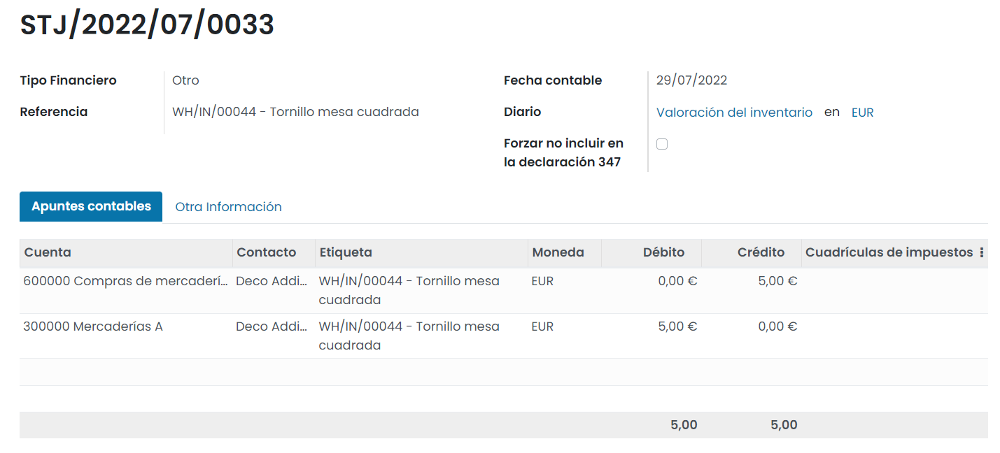
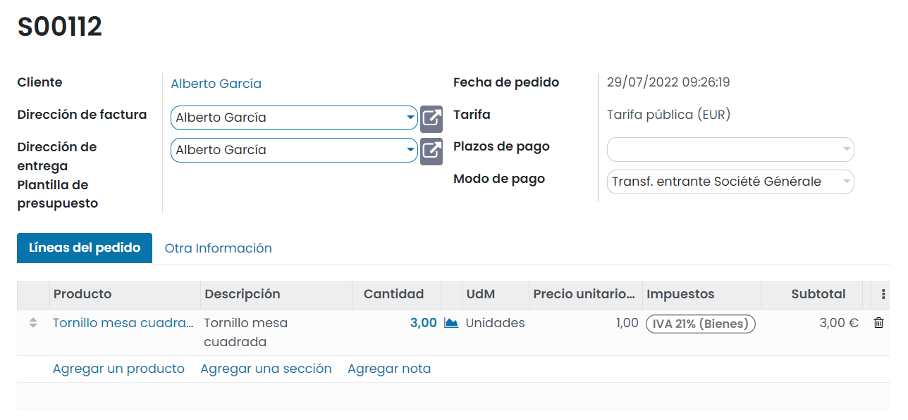

=====================
Métodos de valoración
=====================

Existen dos decisiones iniciales que se deben tomar para valorar el inventario:

#. Cómo calcular el **coste de los productos** en stock:

   #. **Coste estándar**

   #. **Coste promedio**

   #. **Coste real**

#. Cómo registrar el **valor del inventario** dentro de los libros de contabilidad

   #. **Sistema periódico**: Mediante este sistema, se deberá registrar manualmente y de forma periódica (mensual, trimestral,
      anual, etc.) el diario relacionado con el inventario. Este método se recomienda a empresas que no necesitan llevar
      un control exhaustivo de estas entradas, ya que suele ser un sistema fácil de gestionar.

   #. **Sistema perpetuo**: Mediante este sistema, se registran de forma automática las entradas y salidas de inventario
      cuando se realizan las compras y ventas. Este método se recomienda a empresas con un alto control de gestión (usuarios
      muy expertos).

Tanto los métodos para calcular el coste de un producto, como los métodos para registrar el valor del inventario, se definen
sobre las categorías internas de los productos. La gestión de las categorías se puede realizar desde la pantalla
:menuselection:`Inventario --> Configuración --> Categorías de productos`. Sobre el detalle de una categoría dispones del
campo **Método de coste**, donde puedes informar uno de los siguientes valores:

-  Precio estándar

-  Primeras entradas, primeras salidas (FIFO)

-  Coste promedio (AVCO)

.. note::
   Es posible disponer de diferentes categorías con diferentes métodos de coste asociados a los productos, aunque se
   recomienda, por temas de consistencia de datos, el usar un único método para todo el catálogo de productos (siempre
   que las necesidades de negocio no obliguen a usar varios).

Por otro lado, dispones del campo **Valoración del inventario**, donde puedes informar uno de los siguientes valores:

-  Manual (periódico)

-  Automatizado (perpetuo)

A nivel de logística, dispones del campo **Forzar estrategia de retirada**, que permite indicar la manera en que saldrán
los productos del almacén, disponiendo de las siguientes opciones:

-  First In First Out (FIFO): Primero en entrar, primero en salir.

-  Last In First Out (LIFO): Último en entrar, primero en salir.

-  First Expiry First Out (FEFO): Primero en caducar, primero en salir.

   .. note::
      La estretagia *FEFO* solamente aparece disponible cuando la función de **Fechas de caducidad** se encuentra activa
      desde la pantalla :menuselection:`Inventario --> Configuración --> Ajustes`.

-  Ubicación más cercana

Configuración de la valoración de inventario
============================================

Obtener el coste estándar al inventariar un producto
----------------------------------------------------

El coste estándar es el método de valoración más básico y, por su sencillez, es el método de coste que suelen usar las
pequeñas empresas o empresas que están iniciando su actividad. Se basa en incorporar a un producto un valor de coste
determinado. El valor total del stock de este producto será igual a este valor multiplicado por el número de productos.
El precio por el cual se adquieren los productos no tiene ningún efecto sobre su valor.

De este modo, los únicos parámetros que se necesitan para obtener el coste estándar al inventariar un producto son:

-  Coste del producto

-  Cantidad de producto

Para determinar el coste de un producto, se puede utilizar el campo **Coste**, disponible sobre la pestaña *Información general*
de la pantalla de detalle de un producto accesible desde :menuselection:`Inventario --> Productos --> Productos`.
Por ejemplo, dispones de 0 unidades de un producto con un coste de 6,00€ y un precio de venta de 10,00€:

El producto en cuestión está asociado a la categoría *Muebles de Oficina*, que dispone de un método de coste estándar y
valoración del inventario manual (periódico). Esto lo puedes consultar haciendo clic sobre la categoría del producto:

Para obtener el coste estándar del producto inventariado, realiza y confirma una compra de 10 unidades del producto a
un precio de 7,00€ la unidad:

Una vez recibidos los productos y validada la transferencia de inventario, navega a la pantalla
:menuselection:`Inventario --> Informes --> Valoración del inventario` y filtra por el producto en cuestión. Puedes
observar que dispones de 10 unidades del producto, y como el coste del producto es de 6,00€, el valor del inventario
es de 60,00€:

Mediante este método, no importa el precio por el cuál se adquieran los productos, ni el precio por el cuál se vendan. Lo
único que se tiene en cuenta es el coste del producto informado en la ficha de detalle del producto.

Obtener el coste promedio al inventariar un producto
----------------------------------------------------

El coste promedio es el método de valoración más usado y se basa en calcular el coste de cada unidad comprada a partir
del precio pagado por ella, realizando posteriormente un promedio. El valor total del stock de este producto será igual
al promedio del coste de todos los productos. El precio por el cual se venden los productos no tiene ningún efecto sobre
su valor.

De este modo, los únicos parámetros que se necesitan para obtener el coste promedio al inventariar un producto son:

-  Precio de compra del producto

-  Cantidad de producto

Para determinar el coste de un producto no se utilizará el campo **Coste**, disponible sobre la pestaña *Información general*
de la ficha de detalle de un producto, accesible desde :menuselection:`Inventario --> Productos --> Productos`. El valor
de este campo lo actualizará el sistema de forma automática. Por ejemplo, dispones de 0 unidades de un producto con un
precio de venta de 150,00€:

.. image:: valoracion/coste-promedio.png
   :align: center
   :alt: Obtener el coste promedio al inventariar un producto

El producto en cuestión está asociado a la categoría *Muebles de Oficina*, que dispone de un método de coste promedio y
valoración del inventario manual (periódico). Esto lo puedes consultar haciendo clic sobre la categoría del producto:

A continuación, realiza y confirma una compra de 10 unidades del producto a un precio de 79,90€ la unidad:

Una vez recibidos los productos y validada la transferencia de inventario, navega a la pantalla
:menuselection:`Inventario --> Informes --> Valoración del inventario` y filtra por el producto en cuestión. Puedes
observar que dispones de 10 unidades del producto, y como el coste de adquisición es de 79,90€, el valor del inventario
es de 799,00€:

A continuación, realiza y confirma otra compra de 10 unidades del producto a un precio de 69,90€ la unidad.
Una vez recibidos los productos y validada la transferencia de inventario, navega a la pantalla
:menuselection:`Inventario --> Informes --> Valoración del inventario` y filtra por el producto en cuestión. En este caso,
al disponer de 10 unidades a un precio de 79,90€ y 10 unidades a un precio de 69,90€, el valor del inventario es de 1.498,00€:

Desde la ficha de detalle del producto se puede observar que el coste promedio se ha informado automáticamente con
el valor 74,90€:

.. image:: valoracion/coste-promedio-6.png
   :align: center
   :alt: Obtener el coste promedio al inventariar un producto (6)

Obtener el coste real al inventariar un producto
------------------------------------------------

El coste real es un método de valoración poco frecuente por su complejidad. Se basa en calcular el coste de cada unidad
comprada a partir del precio pagado por ella. El valor total del stock de este producto será igual a la suma de los precios
de compra de cada uno de los productos. El precio por el cual se venden los productos, no tiene ningún efecto sobre su valor.

Además, la manera en cómo salen los productos del almacén (FIFO, LIFO, FEFO) impacta sobre el cálculo del coste, debido a
que cada vez que sale un producto del almacén, es necesario calcular de nuevo el precio medio de todos los productos que
quedan.

De este modo, los parámetros que se necesitan para obtener el coste real al inventariar un producto son:

-  Precio de cada compra del producto

-  Cantidad de producto

-  Estrategia de retirada de los productos

-  Identificador del producto que se vende

Para determinar el coste de un producto no se utilizará el campo **Coste**, disponible sobre la pestaña *Información general*
de la ficha de detalle de un producto, accesible desde :menuselection:`Inventario --> Productos --> Productos`. El valor
de este campo lo actualizará el sistema con el valor del coste del producto unitario sobre la última venta.

Por ejemplo, dispones de 0 unidades de un producto con un precio de venta de 94,00€:

El producto en cuestión está asociado a la categoría *Muebles de Oficina*, que dispone de un método de coste real y
valoración del inventario manual (periódico). Esto lo puedes consultar haciendo clic sobre la categoría del producto:

A continuación, realiza y confirma una compra de 10 unidades del producto a un precio de 49,90€ la unidad:

Una vez recibidos los productos y validada la transferencia de inventario, navega a la pantalla
:menuselection:`Inventario --> Informes --> Valoración del inventario` y filtra por el producto en cuestión. Puedes
observar que dispones de 10 unidades del producto, y como el coste de adquisición es de 49,90€, el valor del inventario
es de 499,00€:

A continuación, realiza y confirma otra compra de 10 unidades del producto a un precio de 59,90€ la unidad.
Una vez recibidos los productos y validada la transferencia de inventario, navega a la pantalla
:menuselection:`Inventario --> Informes --> Valoración del inventario` y filtra por el producto en cuestión. En este caso,
al disponer de 10 unidades a un precio de 49,90€ y 10 unidades a un precio de 59,90€, el valor del inventario es de 1.098,00€:

Posteriormente, realizas y confirmas una venta de 5 unidades del producto a 94,00€ la unidad.

Una vez entregados los productos y validada la transferencia de inventario, navega a la pantalla
:menuselection:`Inventario --> Informes --> Valoración del inventario` y filtra por el producto en cuestión. Puedes
observar que dispones de 15 unidades del producto, con un valor de 848,50€. Para obtener este valor, se han sumado los
costes de los productos adquiridos y se ha restado el coste de los productos vendidos.

Al volver al detalle del producto, se puede comprobar que el coste del producto se ha establecido de forma automática
a 49,90€, que es el coste de la primera adquisición de productos, y de los que todavía quedan existencias en el almacén:

.. note::
   En el momento en el que se vendan las 5 unidades que quedan con un coste de 49,90€, el precio de coste de producto se
   actualizará a 59,90€, que es el coste del siguiente lote de productos comprado.

Usar la valoración de inventario
================================

Utilizar valoración periódica para registrar el valor del inventario
--------------------------------------------------------------------

Al utilizar el sistema de valoración periódica para registrar el valor del inventario, los productos comprados y vendidos
no tienen un efecto inmediato en la contabilidad. El gestor contable de la empresa define un periodo (mensual, trimestral,
anual, etc.) y publica una entrada de diario (diario de stock) que representa el valor del inventario.

Al realizar transacciones con el inventario, no se reflejan automáticamente en la contabilidad y todas las transacciones
se acumulan para que queden registradas sobre un asiento contable. Esta acción la realizará un gestor contable periódicamente
de forma manual publicando una entrada o asiento contable en el diario de existencias.

Este sistema de valoración de inventario es un sistema estandarizado que suelen usar la mayoría de las empresas para
gestionar el inventario. Es importante determinar la forma en la que el diario será gestionado. El gestor contable de
la empresa deberá determinar las cuentas de que deberá disponer el diario, aunque habitualmente dispondrá de las siguientes:

-  **Debe**

   -  **Activos**: Valor del inventario (Valor de cierre - Inventario final).

   -  **Costes de ventas**: Coste de productos vendidos.

-  **Haber**

   -  **Gastos**: Productos comprados.

   -  **Activos**: Valor inventario (Valor de inicio - Inventario Inicial).

Para obtener el valor del inventario inicial o final (valor de inventario en una determinada fecha), navega a la
pantalla :menuselection:`Inventario --> Informes --> Valoración del inventario`:

Desde el listado, es posible seleccionar una fecha específica y recuperar el valor del inventario en esa fecha. Para
ello, pulsa el botón **Inventario a fecha**. Después, selecciona una fecha en el formulario y pulsa el botón *Confirmar*:

Al hacer esto, el sistema mostrará un listado de todos los productos en stock en esa fecha, junto con su valoración.

A continuación, desde la pantalla :menuselection:`Facturación / Contabilidad --> Contabilidad --> Asientos contables`,
crea un nuevo asiento mediante el botón *Crear*:

Sobre el campo **Diario**, selecciona *Valoración del inventario* y como **Referencia**, informa un nombre descriptivo:

Como apuntes contables, incorpora los relacionados con el inicio y fin del inventario, así como los relacionados con
los costes de compra y venta:

Una vez informados los campos necesarios, pulsa el botón **Publicar**, para que quede publicado el asiento contable.

Utilizar valoración perpetua para registrar el valor del inventario
-------------------------------------------------------------------

Al utilizar el sistema de valoración perpetua para registrar el valor del inventario, las compras de productos van contra
una cuenta de gastos y posteriormente se traspasa a la cuenta de mercaderías. Por otra parte, las ventas van contra una
cuenta de ingresos (*Ventas de Mercaderías*), y a su vez se registra sobre las cuentas de existencias, las salidas de
éstas a precio de compra, usando como contrapartida una cuenta de gastos (*Coste de Ventas de mercaderías*).

Este sistema solo es viable mediante un sistema de valoración perpetua, ya que sólo de esta forma puede conocerse el coste
de los productos que se venden cada vez que se realiza una venta. Con este procedimiento las cuentas de existencias
muestran el valor tras cada transacción y además se registran las ventas a precio de venta, y el coste de las ventas,
a precio de compra, en cuentas adecuadas.

Por ejemplo, dispones de 0 unidades de un producto con un coste de venta de 1,00€:

El producto en cuestión está asociado a la categoría *Muebles de Oficina*, que dispone de un método de coste promedio y
valoración del inventario automatizado (perpetuo). Al disponer de valoración de inventario automatizada, también se deben
informar las cuentas contables de inventario asociadas. Esto lo puedes consultar haciendo clic sobre la categoría del producto:

A continuación, realiza y confirma una compra de 10 unidades del producto a un precio de 0,50€ la unidad:

Una vez recibido el producto y validada la transferencia de inventario, al volver al detalle del producto, se puede
comprobar que ya se han recibido las 10 unidades compradas. El coste del producto es de 0,50€:

.. image:: valoracion/valoracion-perpetua-4.png
   :align: center
   :alt: Utilizar valoración perpetua para registrar el valor del inventario (4)

Desde la pantalla :menuselection:`Facturación / Contabilidad --> Contabilidad --> Asientos contables`, aparecerá un
asiento contable con un debe a la cuenta seleccionada en la categoría del producto por el importe de la compra y un haber
a la cuenta seleccionada en la categoría del producto por el importe de la compra:

A continuación, crea la factura de la compra realizada desde el detalle del pedido de compra, pulsando el botón *Crear factura*:

Desde el detalle de la factura generada, valida y registra el pago de la misma:

Esta acción genera los apuntes contables típicos de una compra, y se pueden consultar desde la pestaña *Apuntes contables*
de la factura:

Posteriormente, realizas y confirmas una venta de 3 unidades del producto a 1,00€ la unidad.

Una vez enviado el producto y validada la transferencia de inventario, desde la pantalla
:menuselection:`Facturación / Contabilidad --> Contabilidad --> Asientos contables`, aparecerá un asiento contable con
un haber a la cuenta seleccionada en la categoría del producto por el importe de la venta y un debe a la cuenta
seleccionada en la categoría del producto por el importe de la venta:

A continuación, crea la factura de la venta realizada desde el detalle del pedido de venta, pulsando el botón *Crear factura*:

Desde el detalle de la factura generada, valida y registra el pago de la misma:

Esta acción genera los apuntes contables típicos de una venta, y se pueden consultar desde la pestaña *Apuntes contables*
de la factura:

De este modo, es posible conocer en cualquier momento el valor del inventario. Tras cada operación, es posible conocer el
resultado comercial, comparando los saldos que muestran en ese momento las cuentas *Ventas de Mercaderías* y
*Coste de las Ventas de Mercaderías*.

Incluir costes en destino en el coste del producto
==================================================

El **coste en destino** es el precio total de un producto partiendo del precio de compra hasta que llega a los compradores.
Los costes en destino incluyen todos los costes asociados a una transferencia de mercancías realizada correctamente y son
el coste total de un producto en manos del cliente. Estos costes incluyen:

-  Precio de compra

-  Carga (flete)

-  Seguro

-  Otros costes hasta el puerto de destino

-  En envíos internacionales pueden aparecer derechos de aduana, aranceles, etc.

Existen varios métodos para distribuir el coste sobre los productos:

-  **Igual**: El coste se divide a partes iguales por la cantidad de productos.

-  **Por cantidad**: El coste se divide en función de las unidades.

-  **Por coste actual**: El coste se divide en función del coste actual del producto.

-  **Por peso o volumen**: El coste se divide en función del peso o volumen.

Configuración
-------------

Para poder gestionar los costes en destino desde Daeris, navega a la pantalla :menuselection:`Inventario --> Configuración --> Ajustes`,
y activa la opción **Costes en destino**:

Una vez activada la opción, pulsa el botón *Guardar*, de la página de ajustes.

También puedes informar el diario predeterminado en el que se registrarán los asientos contables de costes en destino:

A continuación, para poder gestionar los costes en destino, es requerido usar el método de coste de los productos
*Primeras entradas, primeras salidas (FIFO)* o *Coste promedio (AVCO)* junto con la valoración de inventario *Automatizado*.
También será necesario informar las cuentas contables asociadas. Para ello, navega a la pantalla :menuselection:`Inventario --> Configuración --> Categorías de productos`,
y accede al detalle de la categoría de producto en la que quieras utilizar los costes en destino:

Una vez realizados los cambios en la categoría de productos, pulsa el botón *Guardar*.

Calcular los costes en destino de los productos
-----------------------------------------------

Recibir la factura de proveedor
~~~~~~~~~~~~~~~~~~~~~~~~~~~~~~~

Imaginemos que recibimos una factura de derechos de aduana para un envío. Seleccionaremos la casilla de **Costes en destino**
en la línea de factura de proveedor.

.. note::
   El producto con costes en destino debe ser del tipo servicio.

Si este producto siempre es un coste en destino, también puedes definirlo en el producto y evitar tener que seleccionar
la casilla en cada factura de proveedor. Esto se hace desde la pestaña *Compra* del producto, marcando el campo de
**Es un coste en destino**:

En la parte superior de la factura de proveedor se puede ver el botón **Crear costes en destino**:

Al hacer clic en este botón se crean los costes en destino de forma automática. Ahora puedes decidir en qué recepción se
aplicarán estos costes adicionales:

Ahora puedes hacer clic en **Validar** e ir a la pestaña *Ajustes de valorización* para ver el impacto en los costes de
producto:

Por último, puedes acceder al asiento de diario creado por el coste en destino al hacer clic en el asiento:

.. note::
   No tienes que empezar desde la factura de proveedor, también puedes ir a la pantalla :menuselection:`Inventario --> Operaciones --> Costes en destino`
   y crear directamente ahí el coste en destino.