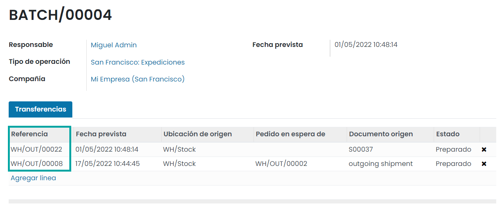

==================
Operaciones varias
==================

Gestionar inventario que no te pertenece
========================================

De vez en cuando, los proveedores te pueden ofrecer almacenar y vender productos sin tener que comprarlos. A esta técnica
se le llama **existencias en consignación**. Las existencias en consignación es una manera excelente en la que los
fabricantes y proveedores pueden lanzar nuevos productos. Ya que los revendedores pueden ser reacios a vender un producto
que no saben si se venderá, las existencias en consignación les permitirán ofrecer un producto para probar el mercado
sin tener que pagar por el producto la primera vez. Daeris puede gestionar estas existencias en consignación a través
de configuraciones avanzadas.

Configuración
-------------

Para usar esta función, navega a la pantalla :menuselection:`Inventario --> Configuración --> Ajustes`. Después, activa
la opción de **Consigna** en la sección de *Trazabilidad*. Una vez hecho esto, haz clic en *Guardar*.

Recepción de existencias en consignación
----------------------------------------

Crea una nueva recepción desde la pantalla :menuselection:`Inventario --> Operaciones --> Transferencias`. Verás que
aparece un nuevo campo llamado **Asignar propietario** en la derecha del formulario. Ahí puedes indicar a qué proveedor
le pertenece el inventario:

.. image:: varios/consigna-2.png
   :align: center
   :alt: Asignar propietario en recepción de inventario

.. note::
   Si tú eres el dueño, puedes dejar el campo en blanco.

Una vez que se valide la recepción, los productos ingresarán al inventario pero le seguirán perteneciendo al propietario.
Esto no afecta la valoración del inventario.

Procesar transferencias en lote
===============================

La **recolección en lotes** permite que un solo recolector gestione un lote de órdenes, lo que reducirá el número de veces
que se debe visitar la misma ubicación. En Daeris, esto significa que puedes agrupar varias transferencias en la misma
transferencia en lote. Después la podrás procesar en la vista de formulario.

Crear una transferencia en lote
-------------------------------

Para usar esta función, navega a la pantalla :menuselection:`Inventario --> Configuración --> Ajustes`. Después, activa
la opción de **Transferencias por lotes** en la sección de *Operaciones*. Una vez hecho esto, haz clic en *Guardar*.

Después, navega a la pantalla :menuselection:`Inventario --> Operaciones --> Transferencias por lotes` y haz clic en el
botón de *Crear*:

En el formulario de detalle, determina el responsable y los tipos de transferencias que quieres incluir en el lote. Para
agregar las transferencias, haz clic en *Agregar línea*:

A continuación, selecciona las transferencias a incluir en el lote, y pulsa el botón *Seleccionar*:

Una vez agregadas las transferencias, confirma la transferencia por lotes mediante el botón *Confirmar*:

En la pestaña de **Operaciones detalladas** se podrán visualizar todos los productos de las diferentes transferencias,
y se podrá informar el campo **Hecho**, una vez se hayan transferido los mismos:

Por último, pulsa el botón *Validar*. Si todo ha ido bien, el estado de la transferencia por lotes cambiará a *Hecho*:

Crear una transferencia por lotes desde el listado de transferencias
--------------------------------------------------------------------

Desde la pantalla :menuselection:`Inventario --> Operaciones --> Transferencias` en modo listado, selecciona las transferencias
que se deben incluir en el lote. Después, selecciona la opción del menú :menuselection:`Acción --> Añadir a lote`:

Después, determina si quieres agregar las transferencias a una transferencia por lotes en borrador o si quieres crear
una nueva transferencia por lotes:

Una vez seleccionada la opción correspondiente, pulsa el botón *Confirmar*. Puedes consultar la transferencia por lotes
desde la pantalla :menuselection:`Inventario --> Operaciones --> Transferencias por lotes`:

Procesar transferencias en olas
-------------------------------

La **transferencia por olas** es comúnmente utilizada por grandes organizaciones para sus transferencias. Una transferencia
de ola es superior a una transferencia por lotes en muchos aspectos. Solo las entradas completas se pueden transferir en
una transferencia por lotes. Sin embargo, con una transferencia de olas, las opciones para transferir operaciones se
pueden llevar a cabo por separado. No es necesario esperar al resto de productos de una entrada si todos están disponibles.

Al crear una transferencia por lotes, está en modo borrador. Al presionar el botón *Agregar línea* debajo de la pestaña
de transferencias, es posible agregar transferencias rápidamente. Una vez que hayas agregado todas las transferencias,
es posible confirmarla. Una vez confirmada, cambia la etapa a *En progreso*. No es posible agregar transferencias a
una transferencia por lotes que se está procesando actualmente. Sin embargo, debido a que una transferencia por olas está
en curso en el momento de la creación, es posible agregar transferencias a lo largo de esa etapa.

Crear una transferencia por olas
~~~~~~~~~~~~~~~~~~~~~~~~~~~~~~~~

Para usar esta función, navega a la pantalla :menuselection:`Inventario --> Configuración --> Ajustes`. Después, activa
la opción de **Transferencias por lotes** en la sección de *Operaciones*. Una vez hecho esto, activa la opción
de **Transferencia por olas**. Por último, haz clic en *Guardar*.

Desde la pantalla :menuselection:`Inventario --> Operaciones --> Transferencias` en modo listado, selecciona las transferencias
que se deben incluir en el lote. Después, selecciona la opción del menú :menuselection:`Acción --> Añadir a la ola`:

Después, determina si quieres agregar las transferencias a una transferencia por olas existente o si quieres crear
una nueva transferencia por olas:

Una vez seleccionada la opción correspondiente, pulsa el botón *Confirmar*. En la siguiente ventana, selecciona las
operaciones que quieres añadir a la transferencia por olas:

Tras seleccionar las operaciones, pulsa el botón **Añadir a la ola**.

Puedes consultar la transferencia por olas desde la pantalla :menuselection:`Inventario --> Operaciones --> Transferencias por olas`:

Como en el caso de las transferencias por lotes, se deberán informar las cantidades en el campo *Hecho*, para después
validar la transferencia.

Mostrar un informe de recepción
===============================

Es posible mostrar un informe de recepción en las órdenes de recepción, una vez hayan sido validadas. Para ello, navega
a la pantalla :menuselection:`Inventario --> Configuración --> Ajustes` y marca la opción **Informe de recepción**.
Al marcar esta opción, será posible activar también la apertura automática del informe de recepción cuando se valida
una orden de recepción:

Una vez hecho esto, pulsa el botón *Guardar* de la pantalla de ajustes.

A partir de ese momento, cuando se valide una orden de recepción, aparecerá un nuevo botón inteligente que permitirá acceder
al informe de recepción:

.. note::
   En caso de haber activado la apertura automática del informe de recepción, no hará falta pulsar el botón, y el informe
   se abrirá automáticamente al valida la orden.

El informe mostrará una serie de transferencias relacionadas, y permitirá asignar la orden actual e imprimir etiquetas:

