:show-content:

============
Introducción
============

Introducción al sistema de control de inventario
================================================

Daeris dispone de un sistema de control de inventario de doble entrada. Cada movimiento que se realiza, conlleva una
contrapartida para poder justificar el origen del movimiento. Para poder controlar los movimientos, el sistema dispone
de ubicaciones físicas y virtuales:

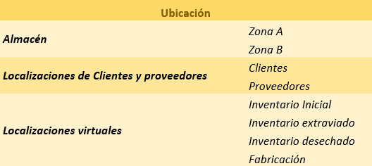

Las **ubicaciones físicas** son aquellas zonas existentes, como, por ejemplo, almacenes, salas, estantes, etc. Por otro
lado, las **ubicaciones de clientes y proveedores** son ubicaciones de las que no tienes control, pero que necesitas para
poder registrar desde donde recibes el producto o hacia donde lo envías. Por último, las **ubicaciones virtuales** son
aquellas ubicaciones que no existen físicamente, pero las necesitas para poder ubicar el lugar donde se encuentra el
producto. Por ejemplo, puedes tener ciertos productos en la ubicación de desechos. Esta ubicación no existe físicamente,
pero mediante esta ubicación sabes que los productos que se encuentran ahí ya no existen porque se han destruido.

Ejemplo del flujo del sistema de control de inventario
------------------------------------------------------

Dispones de 10 productos sobre el inventario inicial con un valor de 1000 euros:

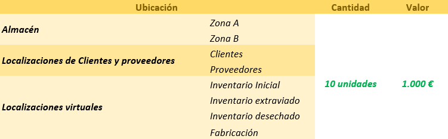

Procedes a colocar las diez unidades del producto sobre la ubicación del almacén *Zona B*. Esta acción descarga las 10
unidades y el valor 1000 euros de la localización *Inventario inicial* y los incorpora sobre la ubicación *Zona B*.

.. note::
   Para garantizar que el inventario está cuadrado, la suma de todas las unidades (positivas y negativas), tanto de las
   cantidades como de los valores de inventario, siempre debe ser 0.

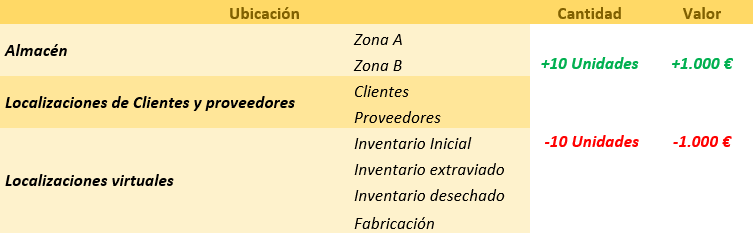

A continuación, compras a tu proveedor 5 unidades más del producto, a un coste total de 500 euros y ubicas la mercancía
en la *Zona B*. En este caso, se asume que la localización del proveedor ha disminuido en 5 unidades y la ubicación *Zona B*
ha aumentado en 5 unidades:

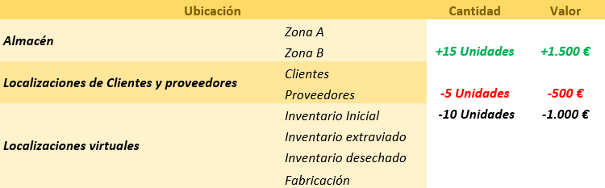

Como siguiente paso, realizas una venta de producto a un cliente, lo que hace aumentar la cantidad de la localización de
*Clientes* en 1 producto y valor 100 euros. La localización de la *Zona B* disminuye en 1 producto y 100 euros de valor:

En el caso de que el cliente realice una devolución del producto, disminuirá la cantidad de la localización de *Clientes*
en 1 producto y valor 100 euros. La localización de la *Zona B* aumentará en 1 producto y valor 100 euros:

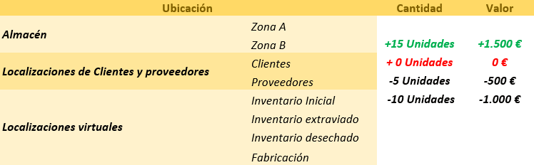

En el caso que detectes que un producto está dañado y procedas a su destrucción, lo deberás ubicar en la localización de
*Inventario desechado*, aumentando la cantidad en 1 y valor en 100 euros y reduciéndose de la *Zona B*:

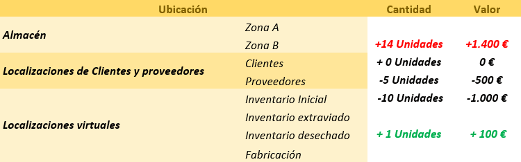

Si, mientras, realizas tareas de contabilización de inventario, detectas que dispones de un producto menos de los que
tienes registrados, lo deberás ubicar en la localización de *Inventario extraviado*, aumentando la cantidad en 1 y valor
en 100 euros y reduciéndose de la *Zona B*:

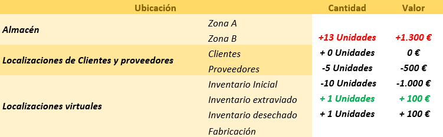

En caso de reubicar cierta cantidad de productos de la *Zona A* a la *Zona B*, por ejemplo, 3 productos, aumentará en
cantidad 3 y valor 300 euros la *Zona A* y se reducirá en la *Zona B*:

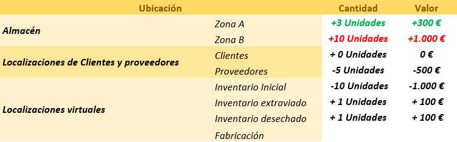

Como se ha comentado anteriormente, si sumas todas las cantidades o valores, en ambos casos el valor debe ser igual a 0:

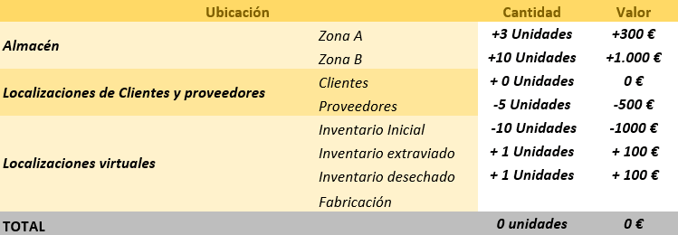

Utilizar el panel de información general de inventario
======================================================

El panel de información general de inventario se encuentra en la pantalla :menuselection:`Inventario --> Información general`.
Esta pantalla muestra las acciones pendientes de realizar por el gestor del almacén en una vista de tipo kanban. La
información está agrupada por secciones (tipos de operación de cada almacén) mediante paneles. Las secciones principales
de esta pantalla son las siguientes:

-  **Recepciones**: Muestra los pedidos pendientes de recibir.

-  **Expediciones**: Muestra pedidos pendientes de envío a los clientes finales.

-  **Devoluciones**: Muestra pedidos devueltos al almacén tras haber sido expedidos.

-  **Transferencias internas**: Muestra los movimientos de mercancías entre almacenes.

   .. note::
      Este tipo de operación solo se muestra al activar la opción **Ubicaciones de almacenamiento** en la pantalla de
      ajustes de inventario.

-  **Fabricación**: Muestra las órdenes de fabricación.

-  **Pedidos TPV**: Muestra los pedidos realizados por el terminal de punto de venta.

-  **Dropship**: Muestra los movimientos de tipo dropship.

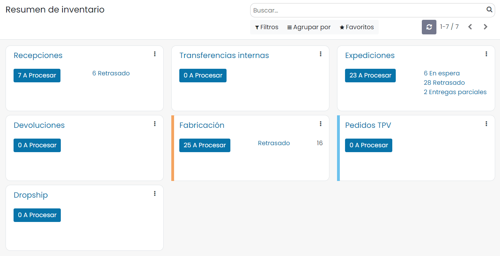

Cada panel dispone de un botón, el cual indica los registros pendientes de procesar. Al pulsar sobre él, se navega a
la pantalla correspondiente (transferencias, órdenes de entrega, órdenes de fabricación, etc.) filtrando por los
registros pendientes de procesar:

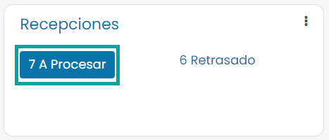

Además, en función del panel, también pueden aparecer enlaces indicando información relevante, como, por ejemplo,
registros retrasados, en espera, etc. Al pulsar sobre ellos, el sistema navega a un listado filtrando por la información
indicada:

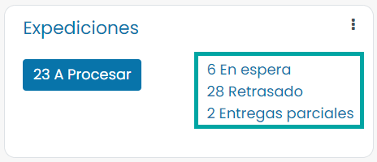

Cada panel permite acceder a los datos filtrados (*Ver*), generar nuevos registros (*Nuevo*) o incorporar un color a la
ficha. También permite el acceso directo a la configuración del tipo de operación mediante el enlace *Configuración*:

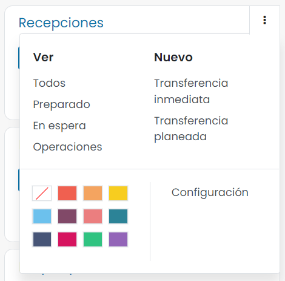