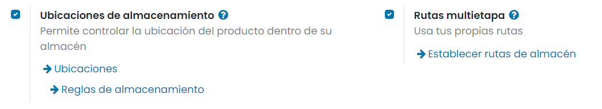
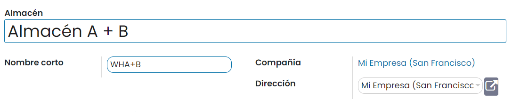
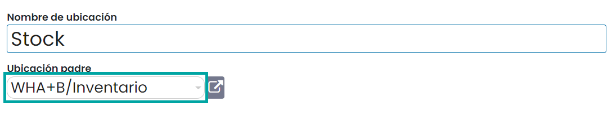
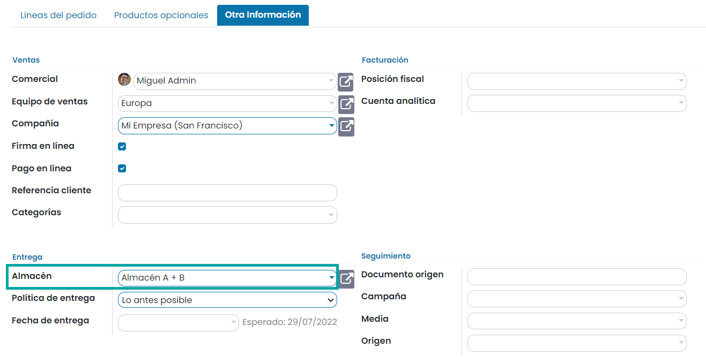

===================
Almacenes virtuales
===================

Cuando planeas realizar una entrega a un cliente, no sabes si los productos vendrán del Almacén A o del Almacén B. En
algunos casos puedes llegar a necesitar tomar existencias de diferentes almacenes. Con Daeris, puedes configurar esto al
usar el concepto de **almacenes virtuales**.

Configurar almacenes virtuales
==============================

Digamos que tienes dos almacenes: Almacén A y Almacén B. Crea un nuevo almacén, este será el virtual. Te permitirá
tomar existencias de A o B. Para hacerlo, navega a la pantalla :menuselection:`Inventario --> Configuración --> Ajustes`
y activa la función de **Rutas multietapa**:

.. note::
   La función de *Ubicaciones de almacenamiento* se activa de forma automática con las *Rutas multietapa*.

Una vez hecho esto, pulsa el botón *Guardar* de la pantalla de ajustes.

A continuación, navega a la pantalla :menuselection:`Inventario --> Configuración --> Almacenes` y haz clic en *Crear*:

Tienes que asegurarte de que las ubicaciones de existencias principales del almacén A y del almacén B son ubicaciones
hijas de la ubicación principal del almacén A + B. Navega a la pantalla :menuselection:`Inventario --> Configuración --> Ubicaciones`
y edita la ubicación principal de tus dos almacenes. Luego, cambia su ubicación principal a la ubicación principal del
almacén A+B:

Vender un producto del almacén virtual
======================================

Digamos que tienes dos productos, uno almacenado en el almacén A y otro en el almacén B. Puedes crear un nuevo presupuesto
para los dos productos. Navega a la pestaña de *Otra información* y selecciona *Almacén A+B* en la información de envío:

Una vez hecho esto, puedes convertirlo en un pedido de venta. Se generará automáticamente una orden de entrega, con un
producto reservado en el almacén A y otro en el almacén B.