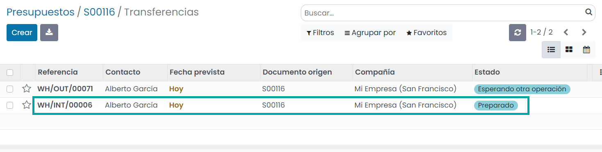

=============
Cross-docking
=============

**Cross-docking** es el proceso de enviar productos que se reciben directamente al cliente, sin hacer que ingresen a las
existencias. Los camiones simplemente se descargan en un área de *Cross-Dock* con el fin de reorganizar productos y cargar
otro camión.

Configuración
=============

Navega a la pantalla :menuselection:`Inventario --> Configuración --> Ajustes` y activa la función de **Rutas multietapa**:

.. note::
   La función de *Ubicaciones de almacenamiento* se activa de forma automática con las *Rutas multietapa*.

Se deben configurar los envíos entrantes y salientes para que funcionen con 2 pasos. Para adaptar la configuración,
navega a la pantalla vaya a :menuselection:`Inventario --> Configuración --> Almacenes` y edita tu almacén:

Esta modificación llevará a cabo la creación de una ruta de Cross-Docking que puedes encontrar en
:menuselection:`Inventario --> Configuración --> Rutas`:

Configurar productos con ruta de cross-dock
===========================================

Crea el producto que utiliza la ruta de cross-dock y en la pestaña de *Inventario* selecciona las rutas **Comprar** y
**Cross-Dock**.

.. image:: cross_dock/cross-docking-4.png
   :align: center
   :alt: Cross-docking (4)

En la pestaña de *Compra* especifica el proveedor de quien compras el producto y establece su precio:

Una vez hecho esto, crea un pedido de venta para el producto y confírmalo. Daeris creará automáticamente dos transferencias,
las cuales se vincularán al pedido de venta. La primera transferencia es de la ubicación de entrada a la ubicación de salida,
la cual corresponde al movimiento del producto en el área de Cross-Dock. La segunda es la orden de entrega de la ubicación
de salida a la ubicación de cliente. Ambas están en el estado *Esperando otra operación* porque aún es necesario solicitar
el producto del proveedor:

Ahora haz clic en el botón de *Compra*, donde encontrarás la solicitud de presupuesto que el sistema activó de forma
automática. Valídala y recibe los productos en la ubicación de entrada:

Cuando se han recibido los productos del proveedor, puedes regresar a tu pedido de venta inicial y validar el traslado
interno de entrada a salida:

Una vez hecho esto, la orden de entrada estará lista para procesarse y se podrá validar también:

.. image:: cross_dock/cross-docking-9.png
   :align: center
   :alt: Cross-docking (9)